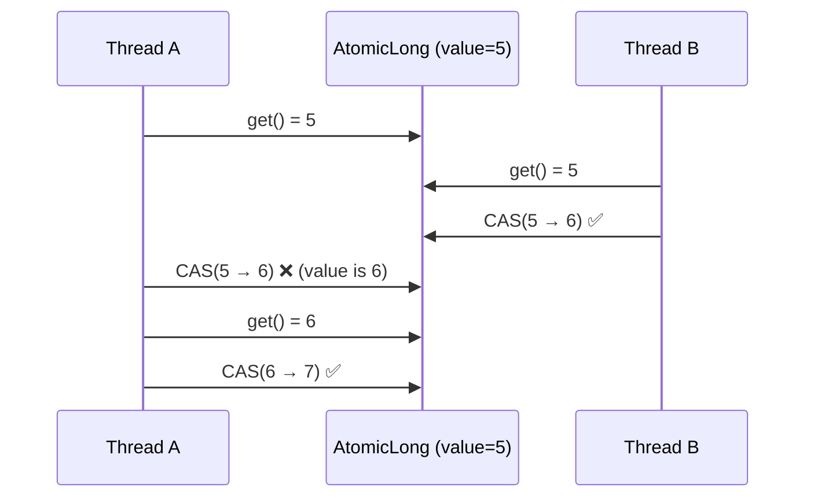

# Atomics and CAS (AtomicLong, AtomicReference, LongAdder)

## 1. One-line summary

The `java.util.concurrent.atomic` classes let you update a single variable thread-safely **without a lock**, using a CPU instruction called **compare-and-set (CAS)**: "set this to X, but only if it's still Y".

## 2. The problem it solves

`count++` looks like one step but is three: read, add one, write back (a **read-modify-write**, see [thread-safety-basics](../../concepts/thread-safety-basics.md)). Two threads can both read 5 and both write 6 — one increment is lost.

You can fix that with `synchronized`, but a lock has costs: threads that lose the race are parked by the OS and woken later (a context switch, microseconds). For a tiny update to one number, that's like opening a change-management ticket to bump a single config value.

CAS lets the thread just **retry** instead of sleeping. With short critical sections and moderate contention, that's faster.

## 3. How it works

CAS is a single hardware instruction (`LOCK CMPXCHG` on x86). In Java:

```java
boolean ok = atomic.compareAndSet(expected, newValue);
```

- If the current value equals `expected`, write `newValue` and return `true`.
- Otherwise change nothing and return `false` — someone else got there first; re-read and try again.



### The CAS loop

Most atomic helpers (`incrementAndGet`, `updateAndGet`, `accumulateAndGet`) are a CAS loop internally. Writing one yourself, e.g. "take a token if any are left":

```java
import java.util.concurrent.atomic.AtomicLong;

final class AtomicPermitCounter {
    private final AtomicLong available;

    AtomicPermitCounter(long permits) { this.available = new AtomicLong(permits); }

    boolean tryAcquire() {
        while (true) {
            long current = available.get();
            if (current <= 0) return false;                     // nothing left
            if (available.compareAndSet(current, current - 1)) {
                return true;                                     // we won
            }
            // lost the race: loop, re-read, try again
        }
    }
}
```

Same thing, shorter (the lambda may run more than once, so it must have no side effects):

```java
long before = available.getAndUpdate(v -> v > 0 ? v - 1 : v);
return before > 0;
```

### Updating several fields together: AtomicReference + immutable state

A token bucket has **two** fields that must change together: `tokens` and `lastRefillNanos`. Two separate `AtomicLong`s can't be updated atomically as a pair. Pack them into one immutable record and CAS the reference:

```java
import java.util.concurrent.atomic.AtomicReference;

final class CasTokenBucket {
    private record State(double tokens, long lastRefillNanos) {}

    private final long capacity;
    private final double refillPerNano;
    private final AtomicReference<State> state;

    CasTokenBucket(long capacity, double refillPerSecond, long nowNanos) {
        this.capacity = capacity;
        this.refillPerNano = refillPerSecond / 1_000_000_000.0;
        this.state = new AtomicReference<>(new State(capacity, nowNanos));
    }

    boolean tryAcquire(long nowNanos) {
        while (true) {
            State old = state.get();
            double refilled = Math.min(capacity,
                    old.tokens() + (nowNanos - old.lastRefillNanos()) * refillPerNano);
            if (refilled < 1.0) return false;
            State next = new State(refilled - 1.0, nowNanos);
            if (state.compareAndSet(old, next)) return true;
        }
    }
}
```

`compareAndSet` on `AtomicReference` compares **references** (`==`), not `equals`. Since every update creates a new `State`, that's exactly what we want.

### LongAdder

`LongAdder` keeps **several internal cells**; under contention each thread increments a different cell, and `sum()` adds them up. Writes almost never collide.

```java
LongAdder rejected = new LongAdder();
rejected.increment();          // hot path, very cheap
long total = rejected.sum();   // occasional read, not an atomic snapshot
```

Prefer `LongAdder` for **write-heavy counters you read rarely**: metrics, "requests rejected" counts. Don't use it when you must make a decision based on the exact current value (like "are tokens > 0?") — `sum()` is not atomic with respect to concurrent increments, and there's no CAS.

### ABA, in plain words

CAS checks "is the value still A?". It cannot tell if the value went A → B → A in between. Thread 1 reads A, gets paused; thread 2 changes it to B then back to A; thread 1's CAS succeeds as if nothing happened.

For counters this is harmless — 5 is 5. It bites in lock-free **data structures** (e.g. a stack where node A was popped, freed and reused). Java's garbage collector removes most of the danger (a node can't be reused while you hold a reference), and the immutable-record pattern above is ABA-safe because each state is a new object. If you truly need it, `AtomicStampedReference` pairs the value with a version number.

## 4. When to use it

- A **single** counter or flag shared by threads: request counts, sequence ids, "is shutting down".
- A small piece of state that can be modeled as one immutable object swapped via `AtomicReference`.
- Hot paths where lock overhead shows up in profiles.
- `LongAdder` for high-frequency metrics.

## 5. When NOT to use it

- **Multiple variables with an invariant** between them, unless you pack them into one immutable object. Two atomics side by side are not atomic together — a classic interview trap.
- **Very high contention on one variable.** Everyone spins and retries; CPU burns with little progress. A lock (which parks losers) or `LongAdder` (which spreads writes) does better.
- **Complex logic in the update.** If the update needs I/O, allocation-heavy work, or several branches, a `ReentrantLock` with a plain `if` is easier to read, review, and get right. Clever lock-free code that nobody on the team can verify is a liability. See [locks-and-synchronized](locks-and-synchronized.md).
- **Distributed state.** Atomics are per-JVM. Across pods, use Redis `INCR` / Lua scripts.

## 6. Commonly confused with

| | `volatile long` | `AtomicLong` | `LongAdder` | `synchronized` / `ReentrantLock` |
|---|---|---|---|---|
| Visibility across threads | yes | yes | yes | yes |
| Atomic `x++` | **no** | yes | yes | yes |
| Conditional update (CAS) | no | yes | no | yes (plain `if`) |
| Exact current value | yes | yes | no (`sum()` is approximate under writes) | yes |
| Multi-field invariants | no | only via `AtomicReference<Immutable>` | no | yes, naturally |
| Behavior under heavy contention | n/a | spinning retries | scales well | threads park, fair-ish |

## 7. Common mistakes / misuse

1. **`if (a.get() > 0) a.decrementAndGet();`** — check-then-act again. Two threads both see 1, both decrement, value goes to −1. Use a CAS loop or `getAndUpdate`.
2. **Two atomics for one logical state** (`AtomicLong tokens` + `AtomicLong lastRefill`). They can be observed half-updated.
3. **Side effects inside `updateAndGet` lambdas** (logging, incrementing metrics). The lambda may run many times.
4. **`LongAdder` for limits.** Fine for counting, wrong for "allow if under limit".
5. **Assuming lock-free means faster.** Benchmark. For a per-key token bucket, contention per key is usually low, so `synchronized` is just as fast and far simpler.
6. **Using `AtomicReference.compareAndSet` with a freshly built "equal" object** as the expected value. It compares identity; it will fail forever.

## 8. Interview cheat-sheet

- "`count++` is read-modify-write, so it's not atomic; `AtomicLong.incrementAndGet` does it with a CAS loop and no lock."
- "CAS means 'write only if the value is still what I read'; if it fails I re-read and retry instead of blocking."
- "For a token bucket with two fields I'd either use a small lock, or wrap both fields in an immutable record inside an `AtomicReference` so I can swap them in one CAS."
- "For pure metrics counters I'd use `LongAdder`, which spreads contention across cells."
- "ABA isn't a problem for counters or for immutable-snapshot CAS; it matters for lock-free linked structures, where `AtomicStampedReference` helps."
- "If the logic gets complicated, a lock is the better engineering choice — correctness and readability beat a few nanoseconds."

## 9. Used in

- [LLD: Design a Rate Limiter](../../interviews/rate-limiter/README.md) — `AtomicLong` / CAS variant of the token bucket and fixed window counter.
- [LLD: Design a Parking Lot](../../interviews/parking-lot/README.md) — atomic spot claim with `AtomicBoolean.compareAndSet(false, true)` so two entry gates never get the same spot; free-spot counters for display boards.
