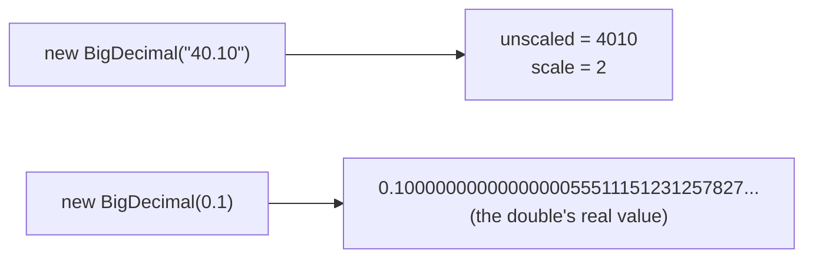

# BigDecimal and Money (double, BigDecimal, long minor units, JSR 354)

## 1. One-line summary

Money must be stored **exactly**: `double` can't represent most decimal amounts, so in Java you use `java.math.BigDecimal` (exact decimal arithmetic with an explicit rounding rule) or a `long` holding **minor units** (paise / cents) — never `float` or `double`.

## 2. The problem it solves

`double` is a **binary** floating-point number. It stores values as fractions with powers of two in the denominator (1/2, 1/4, 1/8 ...). `0.5` fits exactly; `0.1` does not — it becomes the closest binary fraction, which is slightly off. The errors are tiny but they show up the moment you add or compare:

```java
System.out.println(0.1 + 0.2);            // 0.30000000000000004
System.out.println(0.1 + 0.2 == 0.3);     // false
double total = 0;
for (int i = 0; i < 10; i++) total += 0.10;
System.out.println(total);                // 0.9999999999999999
```

In a parking lot that charges ₹40.10 per hour, a day of transactions summed as `double` won't match the bank statement. Finance teams reconcile to the paisa; "off by 0.0000001" becomes a ticket on your on-call rotation.

The fix: represent amounts as **decimal** numbers with a **fixed number of decimal places** and an **explicit rounding rule**.

## 3. How it works

A `BigDecimal` is an **unscaled integer** plus a **scale** (number of digits after the decimal point): `40.10` = unscaled `4010`, scale `2`. Arithmetic on integers is exact, so the only inexactness is where *you* choose to round.



### Creating values — the constructor trap

```java
import java.math.BigDecimal;
import java.math.RoundingMode;

BigDecimal a = new BigDecimal("0.10");   // exact: 0.10, scale 2      GOOD
BigDecimal b = BigDecimal.valueOf(0.1);  // uses Double.toString -> "0.1"  OK
BigDecimal c = new BigDecimal(0.1);      // 0.1000000000000000055511... BAD
BigDecimal d = BigDecimal.valueOf(4010, 2); // unscaled 4010, scale 2 -> 40.10
```

Rule: **string constructor or `valueOf`**, never `new BigDecimal(double)`.

### Arithmetic and rounding

`BigDecimal` is immutable: every operation returns a new object (`a.add(b)` does not change `a`).

```java
BigDecimal rate  = new BigDecimal("40.00");          // per hour
BigDecimal hours = BigDecimal.valueOf(3);
BigDecimal fee   = rate.multiply(hours);             // 120.00 (scale adds: 2+0)

BigDecimal split = new BigDecimal("100.00")
        .divide(BigDecimal.valueOf(3), 2, RoundingMode.HALF_UP);   // 33.33

new BigDecimal("100").divide(BigDecimal.valueOf(3));
// ArithmeticException: Non-terminating decimal expansion — you MUST give scale + rounding

BigDecimal gst = fee.multiply(new BigDecimal("0.18"))
        .setScale(2, RoundingMode.HALF_EVEN);         // 21.60
```

| `RoundingMode` | 2.345 → 2 dp | 2.355 → 2 dp | Typical use |
|---|---|---|---|
| `HALF_UP` | 2.35 | 2.36 | what people learnt at school; most invoices |
| `HALF_EVEN` ("banker's") | 2.34 | 2.36 | accounting/aggregates — ties go to the even digit, so rounding errors don't drift one way over millions of rows |
| `UP` / `CEILING` | 2.35 | 2.36 | "always charge the extra paisa" |
| `DOWN` / `FLOOR` | 2.34 | 2.35 | truncation, discounts in customer's favour |

### The `equals` vs `compareTo` pitfall

`equals` compares value **and scale**; `compareTo` compares only the numeric value.

```java
new BigDecimal("2.0").equals(new BigDecimal("2.00"));      // false!
new BigDecimal("2.0").compareTo(new BigDecimal("2.00"));   // 0 (equal)
fee.compareTo(BigDecimal.ZERO) > 0;                        // "is fee positive?"
```

Consequence: a `HashSet<BigDecimal>` can hold both `2.0` and `2.00`. Either normalise with `setScale(2, ...)` everywhere, or compare with `compareTo`.

### Alternative: `long` minor units

Store `4010L` paise instead of `40.10`. Integer maths is exact and fast, and it's what many payment APIs do (Stripe and Razorpay amounts are integers in the smallest unit).

```java
long ratePaise = 40_00;                   // ₹40.00
long feePaise  = ratePaise * 3;           // 12000 = ₹120.00
long perHead   = Math.floorDiv(10_000, 3);  // 3333 paise; the 1 left over must be assigned somewhere
long safeSum   = Math.addExact(feePaise, 50_00);  // throws on overflow instead of wrapping
```

Division and percentages still need a rounding decision — you just make it with integer maths. The JS version of the parking lot does exactly this (see [money-and-numbers-in-js](../js/money-and-numbers-in-js.md)).

### A tiny Money value object

```java
public record Money(BigDecimal amount, java.util.Currency currency) {
    public Money {
        java.util.Objects.requireNonNull(currency);
        amount = amount.setScale(currency.getDefaultFractionDigits(), RoundingMode.HALF_EVEN);
    }
    public static Money inr(String amount) { return new Money(new BigDecimal(amount), java.util.Currency.getInstance("INR")); }
    public Money plus(Money o) {
        if (!currency.equals(o.currency)) throw new IllegalArgumentException("currency mismatch");
        return new Money(amount.add(o.amount), currency);
    }
}
```

Normalising the scale in the compact constructor means record `equals` works (`2.0` and `2.00` both become `2.00`). See [records-and-immutability](records-and-immutability.md).

### Production: JSR 354 / Joda-Money

- **JSR 354 (`javax.money`, reference implementation "Moneta")** — `MonetaryAmount`, currency conversion, formatting by locale.
- **Joda-Money** — small library with `Money` (fixed currency scale) and `BigMoney` (any scale).

Both are external dependencies, so the interview solution uses a tiny `Money` record or plain `BigDecimal`; mention these as "what I'd use in prod".

## 4. When to use it

- Any fee, price, balance, tax, or discount — e.g. parking fee = hourly rate × billable hours, capped at a daily maximum.
- `BigDecimal` when you need percentages, tax rates, or currency with varying decimals (JPY has 0, INR/USD have 2, KWD has 3).
- `long` minor units when amounts are simple sums/multiplies and performance or storage matters (ledgers, counters, Kafka events).

## 5. When NOT to use it

- **Scientific / metric values** (latency p99, CPU %, sensor readings): `double` is correct and much faster; small error is fine there.
- **`BigDecimal` for hot-path counters** — it allocates on every operation. Use `long`.
- **`long` minor units for currency conversion or interest calculations** with many decimals — you'll end up re-implementing `BigDecimal` badly.

## 6. Commonly confused with

| | `double` | `BigDecimal` | `long` minor units | JSR 354 `MonetaryAmount` |
|---|---|---|---|---|
| Exact for 0.10 | no | yes | yes (10 paise) | yes |
| Rounding | implicit, binary | explicit `RoundingMode` | you do it in integer maths | explicit, configurable |
| Carries currency | no | no | no | yes |
| Speed / allocation | fastest, none | slow, allocates | fast, none | slowest |
| Overflow | Infinity | none (arbitrary size) | wraps silently unless `Math.*Exact` | none |
| Good for | science, metrics | money in Java code | money in storage/APIs | money in big prod systems |

## 7. Common mistakes / misuse

1. `new BigDecimal(0.1)` instead of `new BigDecimal("0.1")` / `BigDecimal.valueOf(0.1)`.
2. `divide` without scale and `RoundingMode` → `ArithmeticException` on 1/3.
3. Using `equals` to compare amounts (`2.0` ≠ `2.00`); use `compareTo` or normalise scale.
4. Forgetting immutability: `total.add(fee);` without assigning the result does nothing.
5. Rounding at every step instead of once at the end (or once per line item, as your business rules say) — repeated rounding drifts.
6. Converting to `double` "just for the calculation" and back.
7. Mixing currencies in one sum — a `Money` type with a currency check prevents it.
8. Storing money as `FLOAT` in the database; use `DECIMAL(12,2)` / `NUMERIC` or `BIGINT` minor units.

## 8. Interview cheat-sheet

- "I never use `double` for money — 0.1 + 0.2 isn't 0.3 in binary floating point."
- "Fees are `BigDecimal` created from strings, with scale 2 and an explicit `RoundingMode`; I round once, at the end of the fee calculation."
- "I compare amounts with `compareTo`, because `equals` also compares scale."
- "An alternative is storing `long` paise — exact and fast — which is what payment gateways do in their APIs."
- "In production I'd consider JSR 354 (Moneta) or Joda-Money so amounts carry their currency."

## 9. Used in

- [LLD: Design a Parking Lot](../../interviews/parking-lot/README.md) — `PricingStrategy` computes fees with `BigDecimal` (hourly rates, grace period, daily cap); JS version uses integer paise.
- Related: [records-and-immutability](records-and-immutability.md), [java-time-api](java-time-api.md).
