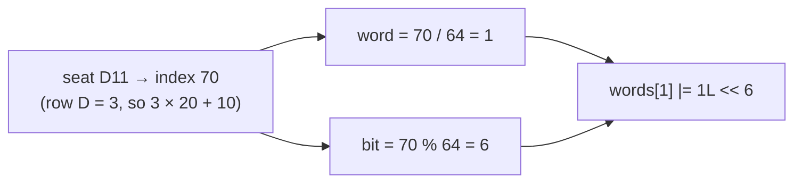

# BitSet and Compact State

## 1. One-line summary

`java.util.BitSet` is a growable array of bits (each one a true/false flag) packed 64 to a `long`, so "is seat 137 taken?" costs **one bit** instead of a byte or a whole object.

## 2. The problem it solves

A seat map is a lot of yes/no answers: for each of ~300 seats in a screen, "is it free?". The obvious Java models are wasteful:

- `Set<String> bookedSeats = new HashSet<>()` stores a `String` object plus a hash-table entry per booked seat.
- `boolean[] booked = new boolean[300]` uses **one byte per seat** (the JVM doesn't pack booleans into bits).

For one show that doesn't matter. For a **cache of every show's availability** (e.g. 1 million upcoming shows across a country, read on every "seat map" page load) it decides whether the cache fits in one pod's heap (the memory the JVM manages for your objects) or needs a cluster.

## 3. How it works

A `BitSet` holds a `long[] words`. Bit `i` lives in `words[i / 64]` at position `i % 64`. Setting or reading a bit is a shift and a mask: a few CPU instructions.



### Seat id → bit index

Bits are numbered, seats are named. Keep the mapping in the immutable `Screen` layout (shared by all shows on that screen), not per show:

```java
import java.util.BitSet;

final class SeatBits {
    static final int SEATS_PER_ROW = 20;

    // "C7" → row C = 2, seat 7 → 2 * 20 + (7 - 1) = 46
    static int index(String seatId) {
        int row = seatId.charAt(0) - 'A';
        int num = Integer.parseInt(seatId.substring(1));
        return row * SEATS_PER_ROW + (num - 1);
    }

    public static void main(String[] args) {
        int capacity = 15 * SEATS_PER_ROW;            // 15 rows × 20 = 300 seats
        BitSet booked = new BitSet(capacity);

        booked.set(index("C7"));                      // book C7
        booked.set(index("A1"), index("A1") + 4);     // book A1..A4 (end exclusive)
        System.out.println(booked.get(index("C7")));  // true
        booked.clear(index("A2"));                    // cancel A2

        System.out.println(booked.cardinality());     // 4 seats booked
        System.out.println(capacity - booked.cardinality() + " left");  // 296 left
        System.out.println(booked.nextClearBit(0));   // 1 → first free seat is A2

        BitSet premium = new BitSet(capacity);
        premium.set(10 * SEATS_PER_ROW, capacity);    // rows K..O are premium
        BitSet freePremium = (BitSet) premium.clone();
        freePremium.andNot(booked);                   // premium AND NOT booked
        System.out.println(freePremium.cardinality() + " premium free"); // 100 premium free
    }
}
```

Key methods: `set(i)`, `clear(i)`, `get(i)`, `set(from, to)`, `cardinality()` (count of 1-bits), `nextClearBit(i)` / `nextSetBit(i)` (scan for the next 0 or 1, a word at a time), and set operations `and`, `or`, `andNot`, `xor` across whole bitsets.

### Memory, with the arithmetic

One show, 300 seats (sizes on a 64-bit JVM with compressed pointers, approximate):

| Model | Per show | Arithmetic |
|---|---|---|
| `BitSet` | ~80 B | 300 bits → 5 longs = 40 B, + ~16 B array header + ~24 B `BitSet` object |
| `boolean[]` | ~316 B | 300 × 1 B + 16 B header |
| `HashSet<String>` (all 300 booked) | ~25 KB | per entry ≈ 32 B node + ~48 B `String` ("C7" + its byte array) + table slot ≈ 85 B; × 300 |

Now 1,000,000 shows in a cache:

- `BitSet`: 1,000,000 × 80 B = **80 MB** → fits easily in one pod.
- `boolean[]`: 1,000,000 × 316 B ≈ **316 MB** → fits, but 4× more.
- `HashSet<String>`: 1,000,000 × 25 KB = **25 GB** → doesn't fit in a normal heap.

### Three states need more than one bit

A bit is yes/no. Seat state is AVAILABLE / HELD / BOOKED, and HELD needs a hold id and expiry. Options: two bitsets (`booked`, `held`) for the **fast availability view** plus a small map for details of the few held seats; or 2 bits per seat. Keep the rich model as the source of truth; use bits as the compact read model.

### Not thread-safe

`BitSet` has no internal locking, and `set` is a read-modify-write on a `long` (read word, OR in the bit, write word). Two threads setting different bits **in the same word** can lose one update. Guard it with the show's lock, or publish an **immutable copy** (`clone()`) for readers: writers change a private copy under a lock, then swap a `volatile` reference, like a config hot-reload. See [thread-safety-basics](../../concepts/thread-safety-basics.md).

### Distributed analogue: Redis bitmaps

[Redis](../../../HLD/technologies/redis.md) strings can be used as bitmaps: `SETBIT show:42 46 1`, `GETBIT show:42 46`, `BITCOUNT show:42` (how many booked), `BITPOS show:42 0` (first free). Each command is atomic on the Redis server, so many app pods can share one availability map. 300 seats is ~38 bytes per show key.

## 4. When to use it

- Huge numbers of small yes/no maps kept in memory: seat availability caches, "which days is this room booked" (365 bits), feature flags per user id, "has this user seen this item".
- Fast set algebra: "free AND premium AND aisle" is three word-wise `andNot`/`and` loops.
- Dense integer sets (ids 0..N with most present). Bloom filters are built on bit arrays too ([HLD: bloom filters](../../../HLD/concepts/bloom-filters.md)).

## 5. When NOT to use it

- **One show, a few hundred seats, in an interview.** A `Map<String, SeatState>` is clearer and carries hold ids and expiry. Compact encoding here is premature optimization; mention it as a scaling idea.
- **Sparse, huge ranges** (bits set at 5 and 2,000,000,000): `BitSet` allocates words up to the highest bit. Use a `HashSet<Integer>` or a compressed bitmap library (RoaringBitmap).
- **Rich per-item data**: bits can't hold who, when, or why.
- **Concurrent writers without a lock**: see above.

## 6. Commonly confused with

| | `BitSet` | `boolean[]` | `Set<String>` / `EnumSet` |
|---|---|---|---|
| Memory per flag | 1 bit | 1 byte | ~85 B per element (`EnumSet` is a bitset internally, ~1 bit) |
| Size | grows on `set` | fixed | grows |
| Count of trues | `cardinality()` (fast popcount, "count the 1-bits", per word) | loop | `size()` |
| Find next free | `nextClearBit` | loop | n/a |
| Set operations | `and`/`or`/`andNot` | loop | `retainAll`/`removeAll` |
| Thread-safe | no | no | no (use `ConcurrentHashMap.newKeySet()`) |

`EnumSet` (see [enums-and-enummap](enums-and-enummap.md)) is the same trick for enum constants; `BitSet` is it for plain integer indexes.

## 7. Common mistakes / misuse

1. **`set(from, to)` thinking `to` is inclusive**: it's exclusive, like `substring`.
2. **`size()` for the seat count**: `size()` is the bits *allocated* (a multiple of 64); use `cardinality()` for set bits, and keep capacity yourself.
3. **`length()` for capacity**: it's the index of the highest set bit + 1, so trailing free seats don't count.
4. **Sharing one `BitSet` across threads unguarded.**
5. **Encoding the seat-id → index mapping in each show** instead of once per screen layout.
6. **Optimizing before measuring**: switching to bits when the real cost is elsewhere (DB queries, JSON).

## 8. Interview cheat-sheet

- "For the source of truth I keep a map of seat id to state; for a read-heavy availability cache I'd encode each show as a `BitSet`, one bit per seat."
- "300 seats is 5 longs, about 80 bytes, so a million shows is about 80 MB instead of gigabytes with string sets."
- "`cardinality()` gives seats left, `nextClearBit` finds the first free seat, and `andNot` combines with a premium-seat mask."
- "`BitSet` isn't thread-safe; I'd update under the show lock and publish an immutable clone to readers."
- "Across pods, Redis bitmaps (`SETBIT`, `BITCOUNT`) give the same thing with atomic commands."

## 9. Used in

- [LLD: Design a Movie Ticket Booking System](../../interviews/movie-booking/README.md) — compact per-show seat availability (one bit per seat) as a scaling idea for a seat-map cache, and Redis bitmaps as the shared version.
- Related: [enums-and-enummap](enums-and-enummap.md), [concurrent-hashmap](concurrent-hashmap.md), [HLD: bloom filters](../../../HLD/concepts/bloom-filters.md).
