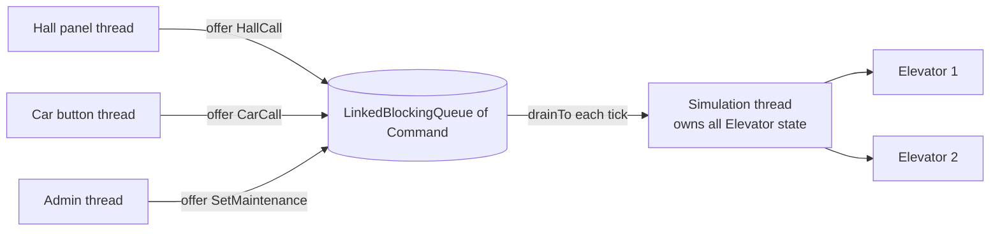

# BlockingQueue and the Producer/Consumer Pattern

## 1. One-line summary

A `BlockingQueue` is a thread-safe queue whose `put` **waits when full** and `take` **waits when empty**, which makes it the standard way to hand work from many **producer** threads to one or more **consumer** threads — and the backbone of "one thread owns the state, everyone else sends it messages".

## 2. The problem it solves

In an elevator system, buttons are pressed from everywhere at once: 20 hall-call panels, the buttons inside 8 cars, an admin console putting a car into maintenance. Each press arrives on some thread (an HTTP handler, a hardware-driver callback).

If every one of those threads directly calls `elevator.addStop(9)` while the simulation thread is in the middle of `elevator.move()`, you get races on the `TreeSet` of stops and on `currentFloor` — the classic shared-mutable-state bug ([thread-safety-basics](../../concepts/thread-safety-basics.md)). Adding locks everywhere works but spreads concurrency logic through every class.

The producer/consumer fix: **producers don't touch the elevators.** They wrap the request in a small command object and drop it into a queue. **One consumer** — the simulation thread — takes commands out and applies them. It's the in-JVM version of services writing to a Kafka topic that one consumer processes ([Kafka](../../../HLD/technologies/kafka.md)), or of `kubectl apply` writing desired state that a single controller reconciles.

## 3. How it works



### The four ways to add and remove

| | Throws exception | Returns special value | **Blocks** | Blocks with **timeout** |
|---|---|---|---|---|
| Insert | `add(e)` (full → `IllegalStateException`) | `offer(e)` → `false` | `put(e)` | `offer(e, 100, MILLISECONDS)` |
| Remove | `remove()` | `poll()` → `null` | `take()` | `poll(100, MILLISECONDS)` |
| Look | `element()` | `peek()` | — | — |

Rule of thumb: producers that must never stall a user-facing thread use `offer` (and handle `false`); consumers that have nothing else to do use `take()`; loops that must also notice shutdown use `poll(timeout)`.

> 💡 **Blocking** here means the calling thread is parked by the JVM (uses no CPU) until another thread changes the queue — not a busy loop.

### LinkedBlockingQueue vs ArrayBlockingQueue

| | `LinkedBlockingQueue` | `ArrayBlockingQueue` |
|---|---|---|
| Capacity | optional; **default `Integer.MAX_VALUE`** (effectively unbounded) | required, fixed |
| Storage | linked nodes, allocated per element | pre-allocated array |
| Locks | two (one for put, one for take) → producers and consumer rarely contend | one lock for both ends |
| Use when | moderate traffic, want high put/take parallelism | want a hard memory bound and predictable behaviour |

**Bounded = backpressure.** A bounded queue that is full makes producers wait or get `false`, which pushes the overload back to the source — the same idea as a load balancer returning 503 instead of queuing forever. An unbounded queue in front of a slow consumer just grows until the heap is gone. For button presses (a few per second) unbounded is acceptable, but say why: `new LinkedBlockingQueue<>(10_000)` costs nothing and turns an OOM into a visible rejection.

### Elevator command loop with drainTo

```java
import java.util.ArrayList;
import java.util.List;
import java.util.concurrent.*;

sealed interface Command permits HallCall, CarCall, SetMaintenance, Shutdown {}
record HallCall(int floor, boolean up) implements Command {}
record CarCall(int elevatorId, int floor) implements Command {}
record SetMaintenance(int elevatorId, boolean on) implements Command {}
record Shutdown() implements Command {}                    // poison pill

public class CommandLoopDemo {
    private final BlockingQueue<Command> inbox = new LinkedBlockingQueue<>(10_000);
    private final List<String> log = new ArrayList<>();    // touched only by the sim thread

    // Called from ANY thread. Never touches elevator state.
    public boolean submit(Command c) { return inbox.offer(c); }

    // Runs on the ONE simulation thread.
    void run() throws InterruptedException {
        List<Command> batch = new ArrayList<>();
        while (true) {
            Command first = inbox.poll(100, TimeUnit.MILLISECONDS); // wait a bit for work
            if (first != null) batch.add(first);
            inbox.drainTo(batch);                           // grab everything else, one lock
            for (Command c : batch) {
                switch (c) {                                // pattern-matching switch (Java 21)
                    case HallCall h       -> log.add("hall " + h.floor() + (h.up() ? " UP" : " DOWN"));
                    case CarCall cc       -> log.add("car " + cc.elevatorId() + " -> " + cc.floor());
                    case SetMaintenance m -> log.add("maint " + m.elevatorId() + " " + m.on());
                    case Shutdown s       -> { System.out.println(log); return; }
                }
            }
            batch.clear();
            // tick(): advance every elevator one floor (omitted)
        }
    }

    public static void main(String[] args) throws Exception {
        CommandLoopDemo sys = new CommandLoopDemo();
        Thread sim = Thread.ofPlatform().name("sim").start(() -> {
            try { sys.run(); } catch (InterruptedException e) { Thread.currentThread().interrupt(); }
        });
        sys.submit(new HallCall(5, true));
        sys.submit(new CarCall(1, 9));
        sys.submit(new SetMaintenance(2, true));
        sys.submit(new Shutdown());
        sim.join();   // prints [hall 5 UP, car 1 -> 9, maint 2 true]
    }
}
```

- A **sealed interface** lists every allowed implementation (`permits ...`), so the Java 21 `switch` over it is **exhaustive**: add a new command type and the compiler flags every switch that doesn't handle it.
- `drainTo(list)` moves **all currently queued** items in one call — fewer lock round-trips than calling `poll()` in a loop, and it gives a clean "apply everything that arrived before this tick" boundary.
- **Poison pill**: a special message (`Shutdown`) that means "stop after processing everything before me". Because the queue is FIFO, earlier commands are never lost. With several consumers, send one pill per consumer. The alternative is interrupting the thread, which can cut work off mid-batch.
- Commands are **records** — immutable, so passing them between threads is safe ([records-and-immutability](records-and-immutability.md)). This is the **Command pattern** ([design-patterns](../../concepts/design-patterns.md)).

### Single-writer / actor style

The design above is the [single-writer principle](../../concepts/single-writer-principle.md): **one thread owns the mutable state; others communicate only by sending messages**. The queue is the only thread-safe object; everything behind it is plain, lock-free, single-threaded Java. Same shape as:

- **Node's event loop** — one JS thread runs callbacks from an event queue ([event-loop-and-concurrency](../js/event-loop-and-concurrency.md)).
- **Redis** — one main thread executes commands one at a time, so `INCR` is atomic without locks ([Redis](../../../HLD/technologies/redis.md)).
- **Actors** (Akka, Erlang) — each actor has a mailbox (queue) and processes one message at a time.

## 4. When to use it

- Many threads produce work, and either the work is slow (logging, sending email) or the state it touches should have a single owner (simulation, game loop, order book).
- You want to decouple rates: bursts of producers vs a steady consumer.
- Inside your own `ThreadPoolExecutor` (it already uses one — see [executors-and-threads](executors-and-threads.md)).

## 5. When NOT to use it

- **A synchronous answer is needed immediately** ("which car was assigned?") — you can still do it (put a `CompletableFuture` in the command and complete it on the sim thread), but if every call needs it, a lock may be simpler.
- **Across processes** — an in-memory queue dies with the JVM; use Kafka/SQS ([message queues](../../../HLD/technologies/message-queues.md)).
- **Unbounded queue in front of a slower consumer** — hidden memory leak.
- **Single consumer that can't keep up** — the single writer is a throughput ceiling; partition the state (one owner per shard) instead.

## 6. Commonly confused with

| | `LinkedBlockingQueue` | `ArrayBlockingQueue` | `ConcurrentLinkedQueue` | `SynchronousQueue` | Kafka topic |
|---|---|---|---|---|---|
| Waits when empty/full | yes | yes | no (returns `null`) | always hands off directly | consumer polls |
| Bounded | optional | yes | no | capacity 0 | by retention |
| Survives restart | no | no | no | no | yes |
| Best for | default producer/consumer | hard memory bound | non-blocking work lists | direct thread hand-off | between services |

## 7. Common mistakes / misuse

1. **Unbounded queue by default** — `new LinkedBlockingQueue<>()` is capacity 2³¹−1.
2. **`put()` on a request thread** — if the queue is full, the HTTP handler hangs. Use `offer` with a timeout and return an error.
3. **Swallowing `InterruptedException`** — restore the flag with `Thread.currentThread().interrupt()` or exit.
4. **Mutable messages** — a producer changes the object after sending; the consumer sees a half-updated value. Send immutable records.
5. **Producers also touching state "just for reads"** — breaks single ownership; publish read-only snapshots instead.
6. **Busy-polling** with `poll()` (no timeout) in a `while(true)` — burns a CPU core.

## 8. Interview cheat-sheet

- "Button presses arrive on many threads; they only enqueue an immutable command into a `LinkedBlockingQueue`."
- "One simulation thread drains the queue at the start of each tick and applies the commands, so elevator state has a single writer and needs no locks."
- "I bound the queue so overload becomes a visible rejection instead of an OOM — that's backpressure."
- "`drainTo` gives me a clean batch boundary per tick; a poison-pill `Shutdown` command stops the loop after everything before it is processed."
- "It's the same model as Node's event loop or Redis: one thread executes commands one at a time."

## 9. Used in

- [LLD: Design an Elevator System](../../interviews/elevator-system/README.md) — `LinkedBlockingQueue<Command>` from caller threads to the single simulation thread; `HallCall` / `CarCall` / `SetMaintenance` commands.
- [Logging Framework](../../interviews/logging-framework/README.md): the async appender's **bounded `ArrayBlockingQueue`** between application threads and one writer thread, with `put` (block), `offer` (drop) and `drainTo` batching.
- [Thread Pool / Connection Pool](../../interviews/thread-pool/README.md): the bounded work queue between `submit()` and worker threads, and why an unbounded queue silently disables max threads.
- [Pub-Sub Broker](../../interviews/pub-sub-broker/README.md): one bounded queue + dispatcher thread per subscription lane.
- Related: [concurrent-collections](concurrent-collections.md), [executors-and-threads](executors-and-threads.md), [single-writer-principle](../../concepts/single-writer-principle.md), [records-and-immutability](records-and-immutability.md).
