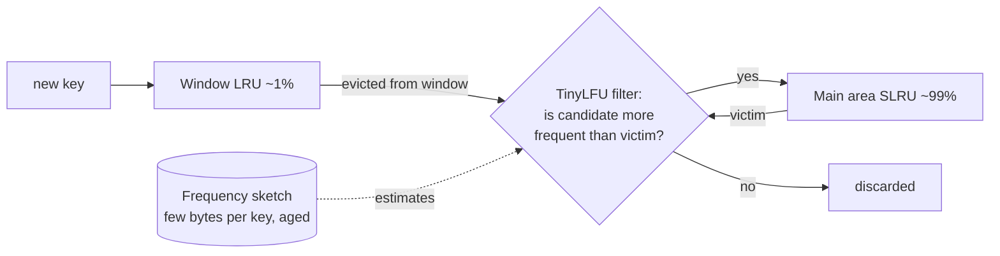

# Caffeine and Guava Cache (production in-process caches)

## 1. One-line summary

**Caffeine** (`com.github.ben-manes.caffeine`) is the standard Java library for an **in-process cache** (a cache living inside your JVM's heap, no network hop) that is thread-safe, bounded, supports expiry and loading, and evicts with a smarter policy than plain LRU; **Guava Cache** is its older predecessor from Google.

## 2. The problem it solves

In an interview you hand-write an LRU cache (see [LLD: Design an LRU Cache](../../interviews/lru-cache/README.md)). In production, a real cache also needs:

- **Concurrency** — hundreds of request threads hitting it without one big lock.
- **Bounds** — by count *or* by memory weight, so it can't eat the heap.
- **Expiry** — TTL (time to live: the entry is dropped after a fixed time) so stale data has an upper age.
- **Loading** — "on a miss, call this function", with only **one** load per key even if 500 threads miss at once (avoids a *cache stampede*: many threads hammering the database for the same missing key).
- **Refresh** — reload popular entries in the background before they go stale.
- **Metrics** — hit rate, eviction count, load time, for your dashboards and alerts.
- **A good eviction policy** — pure LRU gets wrecked by one big scan (explained below).

Writing all of that correctly is weeks of work and a source of on-call pages. Caffeine is that work, done and battle-tested.

## 3. How it works

### The API in one block

```java
import com.github.benmanes.caffeine.cache.*;
import java.time.Duration;

LoadingCache<String, User> users = Caffeine.newBuilder()
    .maximumSize(100_000)                         // bound by entry count
    .expireAfterWrite(Duration.ofMinutes(10))     // TTL from creation/update
    .refreshAfterWrite(Duration.ofMinutes(1))     // after 1 min, reload in background on next read
    .recordStats()                                // hit/miss/eviction counters
    .removalListener((String key, User u, RemovalCause cause) ->
        log.debug("removed {} because {}", key, cause))  // EXPIRED, SIZE, EXPLICIT, ...
    .build(key -> userRepository.findById(key));  // loader, called on miss

User u = users.get("alice");                      // loads once even under concurrency
CacheStats s = users.stats();                     // s.hitRate(), s.evictionCount()
```

| Option | Meaning |
|---|---|
| `maximumSize(n)` | at most ~n entries |
| `maximumWeight(w)` + `weigher((k, v) -> bytes)` | bound by a cost you define, e.g. approximate bytes; use when values vary a lot in size |
| `expireAfterWrite(d)` | drop d after the entry was created or replaced — bounds staleness |
| `expireAfterAccess(d)` | drop d after the last read or write — "idle timeout", like an HTTP session |
| `refreshAfterWrite(d)` | after d, the next read returns the old value **and** triggers an async reload; readers never wait |
| `build(loader)` → `LoadingCache` | `get(k)` loads on miss, with per-key single-flight |
| `buildAsync(loader)` → `AsyncLoadingCache` | values are `CompletableFuture<V>` (see [completablefuture](completablefuture.md)) |
| `recordStats()` | enables `stats()`; export to Micrometer/Prometheus |
| `removalListener` / `evictionListener` | callback when entries leave |

### W-TinyLFU in plain words

Pure LRU has a weakness: a **scan** (one batch job or crawler reading 1 million different keys once each) pushes every genuinely hot key out of the cache, because each scanned key is "most recently used" for a moment. Hit rate collapses until the hot keys are reloaded.

Caffeine's policy, **W-TinyLFU** (Window Tiny Least Frequently Used), adds a bouncer at the door:

1. **Frequency sketch** — a tiny, approximate counter table (a *Count-Min Sketch*: several small hashed counter arrays, using a few bytes per key instead of a full map) that estimates how often each key was requested recently. Counters are periodically halved ("aging") so yesterday's popularity fades.
2. **Window** — new entries first land in a small LRU area (~1% of capacity), so brand-new keys get a short chance to prove themselves.
3. **Admission filter** — when an entry falls out of the window and the main area is full, Caffeine compares the candidate's estimated frequency with the main area's eviction victim. **Only the more frequent one stays.** A one-off scan key (frequency 1) loses to a hot key (frequency 500), so scans pass through without flushing the cache.



The main area is **SLRU** (segmented LRU: a "probation" part and a "protected" part for keys hit at least twice). You don't need those details in an interview — "window + frequency-based admission filter, so scans don't flush hot keys" is enough. More policies in [cache-eviction-policies](../../concepts/cache-eviction-policies.md).

### Concurrency trick

Reads don't take a lock on the eviction structures. Each read is recorded into a small **buffer**, and the buffers are drained later in batches under a lock (like batching metric writes instead of one network call per event). That's why Caffeine scales with cores while a `synchronized` LRU doesn't. The underlying map is a [ConcurrentHashMap](concurrent-hashmap.md).

### Guava Cache — the older one

`com.google.common.cache.CacheBuilder` has nearly the same API (`maximumSize`, `expireAfterWrite`, `refreshAfterWrite`, `LoadingCache`, `recordStats`). Differences: it uses segmented LRU with lock striping (like the `StripedCache` in the interview), has lower hit rates on scan-heavy workloads, and Guava's own docs recommend Caffeine for new code. You'll see it in older codebases.

### Spring `@Cacheable` briefly

Spring's cache abstraction lets you annotate a method; Spring checks the cache before calling it (a proxy wraps your bean — the **Decorator/Proxy** idea from [design-patterns](../../concepts/design-patterns.md)).

```java
@Cacheable(cacheNames = "users", key = "#id")
public User findUser(String id) { return repo.findById(id); }
```

Configure Caffeine as the provider (`spring.cache.type=caffeine`, `spring.cache.caffeine.spec=maximumSize=10000,expireAfterWrite=10m`). Gotchas: calls from **inside the same class** bypass the proxy (no caching), and by default concurrent misses are **not** single-flighted unless you set `@Cacheable(sync = true)`.

## 4. When to use it

- **Almost always in production** when you need an in-process cache: hot config, feature flags, user/permission lookups, compiled templates, small reference data.
- As an **L1 cache in front of Redis** — a tiny per-pod cache absorbs hot keys before the network hop.
- When you need **per-key loading without stampedes**, TTL, refresh, metrics.

When to write your own: **in an interview** (that's the question), **to learn** how eviction works, or a truly trivial single-threaded case where a `LinkedHashMap` is enough.

## 5. When NOT to use it

- **Data that must be consistent across pods.** Each JVM has its own copy; pod A can serve stale data after pod B updated the DB. Use Redis or short TTLs plus invalidation events.
- **Very large datasets** (tens of GB): on-heap caches cause long GC pauses (see [references-and-gc](references-and-gc.md)). Use Redis or an off-heap cache.
- **As a source of truth.** Entries vanish on eviction or restart.
- **Interview where the task is "implement LRU"** — saying "I'd use Caffeine" is a good closing line, not the answer.

## 6. Commonly confused with

| | `LinkedHashMap` LRU | Guava Cache | Caffeine | Redis |
|---|---|---|---|---|
| Where data lives | your heap | your heap | your heap | separate server (network hop) |
| Thread-safe | no | yes (striped locks) | yes (buffers + CHM) | yes (single-threaded server) |
| Eviction | LRU | ~LRU per segment | W-TinyLFU | approximated LRU/LFU |
| TTL / refresh / loader | no | yes | yes (+ async) | TTL yes, loader no |
| Shared across pods | no | no | no | yes |
| Latency | ~ns | ~ns | ~ns | ~0.2–1 ms |

## 7. Common mistakes / misuse

1. **No bound at all** (`Caffeine.newBuilder().build()`). That's an unbounded map — a memory leak with a nicer name.
2. **Confusing `expireAfterWrite` with `refreshAfterWrite`.** Expire = reader blocks to reload after expiry. Refresh = reader gets the old value while a reload happens. Usually combine: refresh at 1 min, expire at 10 min.
3. **`get(key)` with a manual put on miss** (`getIfPresent` → load → `put`). That's check-then-act and stampedes. Use `get(key, loader)` or a `LoadingCache`.
4. **Loader returning `null` and expecting it cached.** Caffeine treats `null` as "absent", so misses for non-existent keys hit the DB every time. Cache an `Optional.empty()` or a sentinel for negative caching.
5. **Slow loaders on the common pool.** Async loads default to `ForkJoinPool.commonPool()`; pass `.executor(yourPool)` for blocking I/O.
6. **Mutating cached objects.** Callers share the same instance; store immutable values ([records](records-and-immutability.md)).
7. **Not exporting stats.** A cache with a 20% hit rate is just extra memory; you only know if you graph it.

## 8. Interview cheat-sheet

- "In production I'd use Caffeine rather than my own class: it's concurrent, bounded by size or weight, supports TTL, refresh and loading."
- "Its policy is W-TinyLFU: a small LRU window, then a frequency sketch decides whether a new key is more popular than the one it would evict, so a one-off scan can't flush the hot set."
- "`LoadingCache.get` loads each key once even if many threads miss together, which prevents a cache stampede on the database."
- "I'd use `refreshAfterWrite` for hot keys so readers never wait, `expireAfterWrite` as the staleness bound, and export `stats()` to watch hit rate."
- "It's per-JVM, so for cross-pod consistency I'd pair it with Redis and short TTLs."

## 9. Used in

- [LLD: Design an LRU Cache](../../interviews/lru-cache/README.md) — "what you'd use in production" comparison for LRU, LFU, TTL, stats, and single-flight loading.
- Related: [linkedhashmap](linkedhashmap.md), [completablefuture](completablefuture.md), [cache-eviction-policies](../../concepts/cache-eviction-policies.md), [HLD caching strategies](../../../HLD/concepts/caching-strategies.md).
