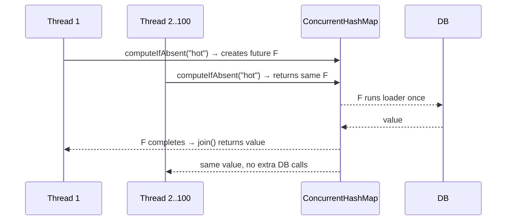

# CompletableFuture

## 1. One-line summary

`java.util.concurrent.CompletableFuture<T>` is a **box for a result that will exist later** (a "future" or "promise"): you can attach "when it's ready, do this" steps to it, wait for it, or complete it from any thread — and several threads can share the **same** box, which is how a cache makes many concurrent misses for one key trigger only **one** load.

## 2. The problem it solves

Two pains:

1. **Asynchronous code without callback hell.** You call a slow service and want to transform the result, handle errors, and combine it with another call, without blocking a thread per step. The old `Future` only has a blocking `get()`; `CompletableFuture` (Java 8+) adds chaining.
2. **Cache stampede.** A hot key expires; 500 request threads miss at the same moment and all 500 query the database for the same row. That's like 500 pods restarting at once and all hitting the config server. If the first thread instead puts a "load in progress" future in the cache and the other 499 wait on **that same future**, the DB sees one query. This is called **single-flight** or **request coalescing**.

## 3. How it works

### Basics

```java
import java.util.concurrent.*;

ExecutorService pool = Executors.newFixedThreadPool(8);

CompletableFuture<String> f = CompletableFuture
    .supplyAsync(() -> fetchUser("alice"), pool)      // run on 'pool', returns a future
    .thenApply(user -> user.toUpperCase())             // transform when ready (like map)
    .exceptionally(ex -> "fallback");                  // on any failure upstream, recover

String s = f.join();                                   // wait for the result
```

| Method | What it does |
|---|---|
| `supplyAsync(supplier, executor)` | run `supplier` on `executor`, complete the future with its result |
| `runAsync(runnable, executor)` | same, no result (`CompletableFuture<Void>`) |
| `thenApply(fn)` | transform the value (sync, like `Stream.map`) |
| `thenCompose(fn)` | `fn` returns another future; flatten it (like `flatMap`) — for chaining async calls |
| `thenCombine(other, fn)` | wait for two futures, merge results |
| `exceptionally(fn)` / `handle((v, ex) -> ...)` | recover from failure / see value-or-error |
| `whenComplete((v, ex) -> ...)` | side effect (logging, cleanup) without changing the result |
| `orTimeout(d, unit)` / `completeOnTimeout(v, d, unit)` | fail / default after a timeout (Java 9+) |
| `complete(v)` / `completeExceptionally(ex)` | finish it manually from any thread; only the first call wins |
| `allOf(...)` / `anyOf(...)` | wait for all / first of several futures |

### `join()` vs `get()`

Both block until the result is ready.

- `get()` throws **checked** exceptions (`InterruptedException`, `ExecutionException`) — you must catch them; it can also take a timeout: `get(2, SECONDS)`.
- `join()` throws an **unchecked** `CompletionException` wrapping the cause — nicer inside lambdas and streams. Unwrap with `ex.getCause()`.

### Single-flight loading cache

The idea: the map stores **futures**, not values. `computeIfAbsent` on a [ConcurrentHashMap](concurrent-hashmap.md) is atomic per key, so exactly one thread creates the future; everyone else gets the same one.

```java
import java.util.concurrent.*;
import java.util.concurrent.atomic.AtomicInteger;
import java.util.function.Function;

public class SingleFlightCache<K, V> {
    private final ConcurrentHashMap<K, CompletableFuture<V>> map = new ConcurrentHashMap<>();
    private final Function<K, V> loader;
    private final Executor executor;

    public SingleFlightCache(Function<K, V> loader, Executor executor) {
        this.loader = loader;
        this.executor = executor;
    }

    public V get(K key) {
        CompletableFuture<V> f = map.computeIfAbsent(key,
            k -> CompletableFuture.supplyAsync(() -> loader.apply(k), executor));
        // If the load failed, remove THIS future so the next caller retries.
        // remove(key, f) only removes if it's still the same future (no race with a newer one).
        f.whenComplete((v, ex) -> { if (ex != null) map.remove(key, f); });
        return f.join(); // all concurrent callers for 'key' wait on the same load
    }

    public static void main(String[] args) throws Exception {
        AtomicInteger dbCalls = new AtomicInteger();
        ExecutorService pool = Executors.newFixedThreadPool(4);
        var cache = new SingleFlightCache<String, String>(k -> {
            dbCalls.incrementAndGet();
            try { Thread.sleep(200); } catch (InterruptedException e) { throw new RuntimeException(e); }
            return "value-of-" + k;
        }, pool);

        try (var callers = Executors.newVirtualThreadPerTaskExecutor()) {
            for (int i = 0; i < 100; i++) callers.submit(() -> cache.get("hot"));
        } // waits for all 100 callers
        System.out.println("DB calls: " + dbCalls.get()); // DB calls: 1
        pool.shutdown();
    }
}
```

Why it's built this way:

- **`computeIfAbsent` only creates the future** (cheap, microseconds). The slow load runs on `executor`, **outside** the map's bin lock — never do I/O inside `computeIfAbsent`.
- **Failed futures are removed**, otherwise one DB timeout would be cached forever and every later caller would get the same exception (a "poisoned" entry).
- **`remove(key, f)`, not `remove(key)`** — if someone already replaced the entry, don't delete theirs.
- In a full cache you'd also add eviction / TTL on top; Caffeine's `AsyncLoadingCache` is exactly this pattern, productionized (see [caffeine-and-guava-cache](caffeine-and-guava-cache.md)).



## 4. When to use it

- **Single-flight / request coalescing** for expensive loads in caches.
- **Fan-out calls in parallel** and combine (`allOf`, `thenCombine`) — e.g. fetch user, orders and recommendations concurrently.
- **Async APIs** that return a result later (HTTP clients like `java.net.http.HttpClient.sendAsync` return one).
- **Timeouts and fallbacks** on remote calls with `orTimeout` + `exceptionally`.

## 5. When NOT to use it

- **Simple sequential blocking code on virtual threads** (Java 21). With virtual threads (very cheap JVM-managed threads), plain blocking calls are often clearer than long `then...` chains.
- **Fire-and-forget without error handling.** An exception in an unobserved future vanishes silently.
- **CPU-bound loops** — use parallel streams or a dedicated pool; futures add overhead without benefit.
- **Streams of many values over time** — that's a queue or reactive stream, not a single future.

## 6. Commonly confused with

| | `Future` (Java 5) | `CompletableFuture` | JS `Promise` | Virtual threads |
|---|---|---|---|---|
| Chaining (`then...`) | no | yes | yes (`.then`) | n/a — just write sequential code |
| Complete manually | no | yes (`complete`) | only via constructor resolver | n/a |
| Blocking wait | `get()` | `get()` / `join()` | `await` (non-blocking) | normal blocking call, cheap |
| Default executor | caller's | `ForkJoinPool.commonPool()` | event loop | JVM scheduler |

## 7. Common mistakes / misuse

1. **Forgetting the executor.** `supplyAsync(supplier)` without an executor runs on `ForkJoinPool.commonPool()` — shared by the whole JVM (parallel streams use it too) and sized to *CPU cores − 1*. Blocking I/O there starves everything else. Always pass a dedicated pool for I/O.
2. **Blocking inside async stages.** Calling `otherFuture.join()` or a JDBC call inside `thenApply` ties up a pool thread waiting; with a small pool this can deadlock (all threads wait for tasks queued behind them). Use `thenCompose` to chain async work.
3. **Swallowed exceptions.** No `exceptionally`/`handle`/`join` → failures are never seen. Log in `whenComplete`.
4. **Caching failed futures** in a single-flight map → every caller gets the same old error forever. Remove on failure.
5. **Doing the load inside `computeIfAbsent`** instead of only creating the future → holds the bin lock during I/O.
6. **No timeout.** One hung downstream call means every waiting caller hangs. Add `orTimeout`.
7. **Expecting `cancel(true)` to interrupt the work.** It doesn't interrupt the running task; it just completes the future with `CancellationException`.

## 8. Interview cheat-sheet

- "To avoid a cache stampede, I store `CompletableFuture<V>` in a `ConcurrentHashMap` and create it with `computeIfAbsent`, so the first miss starts the load and every concurrent miss waits on the same future — one DB call per key."
- "The load runs on a dedicated executor, not inside `computeIfAbsent`, and not on the common pool, because it's blocking I/O."
- "If the load fails I `remove(key, future)` so the error isn't cached and the next request retries."
- "`join` throws unchecked `CompletionException`, `get` throws checked exceptions; I add `orTimeout` so a slow backend can't hang all waiters."
- "In production Caffeine's `AsyncLoadingCache` gives me this pattern plus eviction and refresh."

## 9. Used in

- [LLD: Design an LRU Cache](../../interviews/lru-cache/README.md) — single-flight loading cache (`ConcurrentHashMap<K, CompletableFuture<V>>`) to prevent cache stampedes.
- Related: [concurrent-hashmap](concurrent-hashmap.md), [caffeine-and-guava-cache](caffeine-and-guava-cache.md), [HLD caching strategies](../../../HLD/concepts/caching-strategies.md) (stampede protection at system level).
