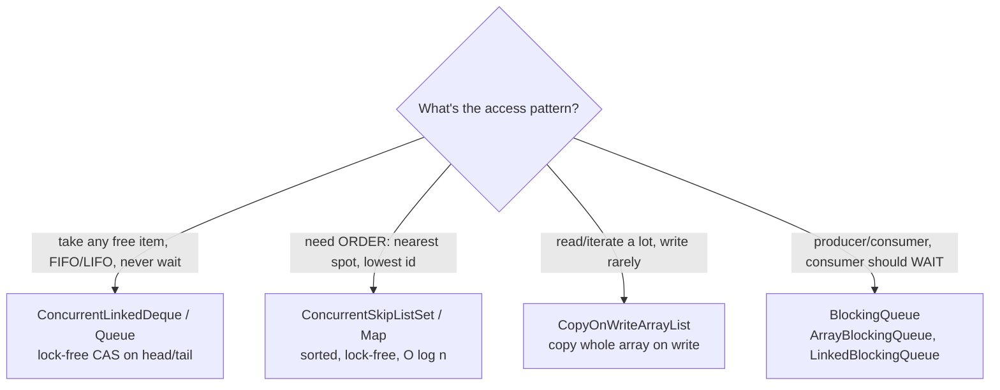

# Concurrent Collections (deques, skip lists, copy-on-write, blocking queues)

## 1. One-line summary

`java.util.concurrent` ships thread-safe lists, sets, queues and sorted maps — `ConcurrentLinkedDeque`, `ConcurrentSkipListSet/Map`, `CopyOnWriteArrayList`, the `BlockingQueue` family — each tuned for a different read/write pattern, so you pick by **access pattern**, not just "it needs to be thread-safe".

## 2. The problem it solves

In a parking lot with four entry gates, each gate runs on its own thread and asks "give me a free MEDIUM spot". If free spots live in a plain `ArrayDeque`, two gates calling `poll()` at the same moment can corrupt the deque or receive **the same spot** — two cars, one space, an angry customer and a support ticket.

Wrapping everything in `Collections.synchronizedXxx` is correct but serialises every gate behind one lock (one backend behind the load balancer). The concurrent collections give correctness **and** let threads proceed in parallel, using CAS (see [atomics-and-cas](atomics-and-cas.md)) or clever copying instead of a global lock.

For hash maps, see the dedicated [concurrent-hashmap](concurrent-hashmap.md) page; this page covers the rest.

## 3. How it works



### ConcurrentLinkedDeque — a free-spot pool

```java
import java.util.*;
import java.util.concurrent.*;

Map<SpotSize, Deque<ParkingSpot>> free = new EnumMap<>(SpotSize.class);   // keys fixed at startup
for (SpotSize s : SpotSize.values()) free.put(s, new ConcurrentLinkedDeque<>());

ParkingSpot spot = free.get(SpotSize.MEDIUM).pollFirst();   // atomic: removes & returns, or null
if (spot != null) { /* only THIS thread got it */ }
// later, on exit:
free.get(exitedSpot.size()).offerFirst(exitedSpot);         // put it back
```

`pollFirst()` is a **single atomic operation**: it both checks and removes. Two gates can never get the same spot from it. Note: `size()` is O(n) and only an estimate under concurrency — keep a separate counter (`AtomicInteger` / `LongAdder`) for display boards.

### ConcurrentSkipListSet — "nearest free spot first"

A skip list is a sorted linked list with extra "express lanes" so search is O(log n) without rebalancing a tree; that makes it easy to do lock-free.

```java
Comparator<ParkingSpot> nearest = Comparator.comparingInt(ParkingSpot::distanceToGate)
                                            .thenComparing(ParkingSpot::id);   // tie-break: must be a total order
NavigableSet<ParkingSpot> freeMedium = new ConcurrentSkipListSet<>(nearest);

ParkingSpot best = freeMedium.pollFirst();   // atomic remove-smallest
```

The comparator **must** distinguish distinct spots (hence `thenComparing(id)`) — a sorted set treats `compare == 0` as "duplicate" and silently drops one. `ConcurrentSkipListMap` is the map version (`floorKey`, `ceilingEntry`, `headMap` — e.g. "all tickets that entered before 6 a.m.").

### CopyOnWriteArrayList — observer lists

Every write (`add`, `remove`) copies the whole backing array; reads and iteration use the old array with no locks and never throw `ConcurrentModificationException`.

```java
private final List<AvailabilityListener> listeners = new CopyOnWriteArrayList<>();

public void subscribe(AvailabilityListener l) { listeners.add(l); }        // rare
void publish(SpotSize size, int freeCount) {
    for (AvailabilityListener l : listeners) l.onAvailabilityChanged(floor, size, freeCount);  // frequent, lock-free
}
```

Perfect for **Observer** subscribers (display boards register once, get notified thousands of times). Terrible for write-heavy data: 10,000 adds to a 10,000-element list copies ~50 million references.

### BlockingQueue — producer / consumer

`put` waits when full, `take` waits when empty; `offer`/`poll` with a timeout return instead of waiting forever.

```java
BlockingQueue<Receipt> toPrint = new ArrayBlockingQueue<>(100);   // bounded = back-pressure
// exit gate thread:     toPrint.put(receipt);
// printer worker thread: Receipt r = toPrint.take();
```

| Implementation | Bounded | Notes |
|---|---|---|
| `ArrayBlockingQueue` | yes (fixed) | one lock, predictable memory |
| `LinkedBlockingQueue` | optional (default `Integer.MAX_VALUE`) | two locks (put/take); unbounded by default = memory leak risk |
| `PriorityBlockingQueue` | no | ordered by comparator |
| `DelayQueue` | no | elements become available after a delay |
| `SynchronousQueue` | capacity 0 | hand-off; used by cached thread pools |

This is what `ThreadPoolExecutor` uses internally for its work queue (see [scheduled-executor-service](scheduled-executor-service.md)) — and the same idea as a Kafka topic between services, inside one JVM.

### Check-then-act is still unsafe

Thread-safe collections make **each call** atomic, not a **sequence** of calls:

```java
// BROKEN: both gates can pass the check before either removes, and both assign the spot
if (freeMedium.contains(spot)) {        // check
    freeMedium.remove(spot);            // act — return value ignored; the other gate may already have removed it
    assign(vehicle, spot);              // both gates assign the same spot
}

// CORRECT: use the return value of one atomic call
if (freeMedium.remove(spot)) assign(vehicle, spot);       // true for exactly one thread
ParkingSpot s = freeMedium.pollFirst();                   // or: take whichever is first
```

Same lesson as get-then-put on [ConcurrentHashMap](concurrent-hashmap.md), and the general rule from [thread-safety-basics](../../concepts/thread-safety-basics.md). When an operation spans **two** structures (remove from the free pool *and* record the ticket), either make one of them the single source of truth (e.g. an `AtomicBoolean` claim on the spot, see [atomics-and-cas](atomics-and-cas.md)) or use a lock ([locks-and-synchronized](locks-and-synchronized.md)).

## 4. When to use it

- `ConcurrentLinkedDeque` / `ConcurrentLinkedQueue`: unordered pools of free resources, work stealing, non-blocking queues.
- `ConcurrentSkipListSet/Map`: sorted concurrent data — nearest-first allocation, leaderboards, time-ordered indexes, range queries.
- `CopyOnWriteArrayList` / `CopyOnWriteArraySet`: listener lists, rarely-changing config lists, read-mostly routing tables.
- `BlockingQueue`: hand-off between threads with back-pressure.

## 5. When NOT to use it

- **Single-threaded or thread-confined data** — use `ArrayDeque`, `TreeSet`, `ArrayList`; they're faster and simpler.
- **`CopyOnWriteArrayList` for frequently-changing data** — every write is O(n) copy plus garbage.
- **`ConcurrentSkipListSet` when you don't need order** — O(log n) and more memory than a deque.
- **Unbounded `LinkedBlockingQueue` in front of a slow consumer** — the queue grows until OOM; bound it and decide what happens when full.
- **Multi-step invariants across structures** — no collection makes two structures change together; use a lock or a single owner thread.
- **State shared across JVMs** — these are in-process; multiple lot servers need a DB / Redis.

## 6. Commonly confused with

| | `ConcurrentLinkedDeque` | `ConcurrentSkipListSet` | `CopyOnWriteArrayList` | `LinkedBlockingQueue` | `Collections.synchronizedList` |
|---|---|---|---|---|---|
| Ordering | insertion (both ends) | sorted by comparator | index/insertion | FIFO | index |
| Blocking ops | no | no | no | yes (`put`/`take`) | no |
| Mechanism | lock-free CAS | lock-free CAS | copy array on write | two locks | one lock |
| Read cost | O(1) ends | O(log n) | O(1), no lock | O(1) | lock |
| Write cost | O(1) | O(log n) | O(n) copy | O(1) | lock |
| `size()` | O(n), estimate | O(n), estimate | O(1) | O(1) | O(1) |
| Iteration | weakly consistent | weakly consistent | snapshot | weakly consistent | must lock manually |

## 7. Common mistakes / misuse

1. **`contains` then `remove`** (or `isEmpty` then `poll`) — check-then-act across two calls. Use the return value of `poll`/`remove`.
2. **Comparator that returns 0 for different spots** in a skip-list set → spots disappear.
3. **Mutating a field used by the comparator** while the element is in the set → set ordering breaks; remove, mutate, re-add.
4. **Using `size()` for decisions** ("if size > 0 then poll") — estimate, and O(n) on linked structures.
5. **`CopyOnWriteArrayList` as a general concurrent list.**
6. **Unbounded blocking queues** hiding an overloaded consumer until the heap dies.
7. **Assuming the collection makes its elements thread-safe** — a `ParkingSpot` inside a concurrent set still needs its own safe state.

## 8. Interview cheat-sheet

- "Free spots per size live in a concurrent structure; a gate claims one with a single atomic `pollFirst`, so two gates can never get the same spot."
- "If I need nearest-first, I use a `ConcurrentSkipListSet` ordered by distance with the spot id as a tie-breaker."
- "Display-board observers are in a `CopyOnWriteArrayList` — subscriptions are rare, notifications are constant."
- "Each method is atomic but a sequence isn't, so I never do contains-then-remove; I act on the return value."
- "For hand-offs like receipt printing I'd use a bounded `BlockingQueue` for back-pressure."

## 9. Used in

- [LLD: Design a Parking Lot](../../interviews/parking-lot/README.md) — per-size free-spot pools, nearest-first allocation, observer list for display boards.
- [LLD: Design an LRU Cache](../../interviews/lru-cache/README.md) — why there is no "concurrent LinkedHashMap" in the JDK, and the options instead: one lock, lock striping, or Caffeine.
- [LLD: Design an Elevator System](../../interviews/elevator-system/README.md) — `LinkedBlockingQueue` of commands into the single simulation thread; why the stop sets can be plain `TreeSet`s instead of `ConcurrentSkipListSet` (see [blocking-queues-and-producer-consumer](blocking-queues-and-producer-consumer.md)).
- [Logging Framework](../../interviews/logging-framework/README.md): each logger's appender list is a `CopyOnWriteArrayList`: read on every log call, changed only at configuration time.
- Related: [concurrent-hashmap](concurrent-hashmap.md), [atomics-and-cas](atomics-and-cas.md), [locks-and-synchronized](locks-and-synchronized.md), [thread-safety-basics](../../concepts/thread-safety-basics.md).
