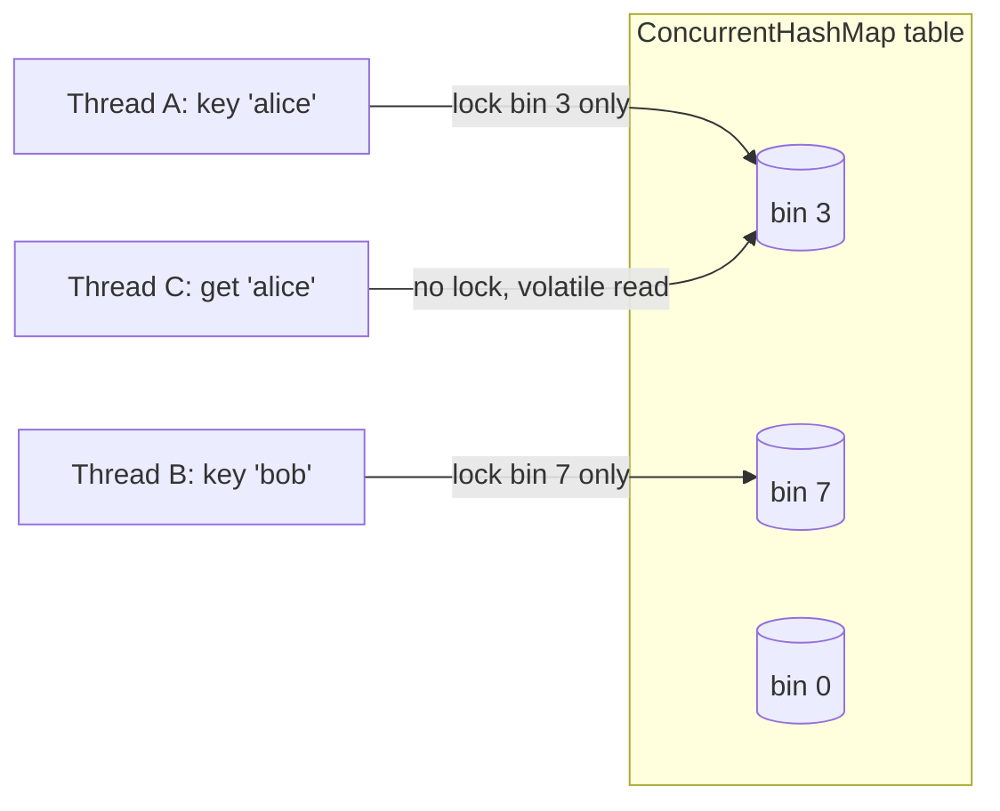

# ConcurrentHashMap

## 1. One-line summary

`java.util.concurrent.ConcurrentHashMap` is a thread-safe hash map that lets many threads read and write at the same time without one big lock around the whole map, and gives you a few **atomic compound operations** (`computeIfAbsent`, `compute`, `merge`, `putIfAbsent`).

## 2. The problem it solves

A plain `HashMap` is not safe when several threads touch it. Two threads calling `put` at once can lose an entry, corrupt the internal bucket array during a resize, or (in old JDKs) produce an infinite loop on `get`. You will not get an exception — you get silently wrong data, which is the worst kind of bug to debug at 3 a.m. on-call.

The first fix people reach for is `Collections.synchronizedMap(new HashMap<>())` or the legacy `Hashtable`. Both put **one lock around the whole map**. That is correct, but every thread queues on that one lock — like a load balancer with a single backend. Under load, throughput collapses.

`ConcurrentHashMap` (CHM) fixes both: it is correct under concurrency, and threads working on different keys almost never block each other.

## 3. How it works

Just enough internals (Java 8+):

- The map is an array of **bins** (buckets). Each bin holds a linked list, or a red-black tree once it gets long.
- **Reads (`get`) take no lock.** They read `volatile` fields, so they always see a fully published entry (see [thread-safety-basics](../../concepts/thread-safety-basics.md) for what `volatile` guarantees).
- **Inserting into an empty bin** uses a single CAS (compare-and-set, see [atomics-and-cas](atomics-and-cas.md)).
- **Updating a non-empty bin** locks only the **first node of that bin** (`synchronized` on that node). Other bins stay free.
- Resizing is done cooperatively: threads that run into a resize help move bins.



### Atomic compound operations

| Method | What happens atomically |
|---|---|
| `putIfAbsent(k, v)` | insert only if missing; returns existing value or `null` |
| `computeIfAbsent(k, fn)` | if missing, call `fn` **once** and store the result; return the stored value |
| `compute(k, (k, old) -> new)` | read-modify-write of a single entry; returning `null` removes it |
| `merge(k, v, (old, v) -> new)` | insert `v` or combine with old value |

"Atomically" means: for **that one key**, no other thread can slip in between the read and the write.

### The classic check-then-act race

```java
// BROKEN: two threads can both see null and both create a bucket
Map<String, TokenBucket> buckets = new ConcurrentHashMap<>();

TokenBucket getBucket(String key) {
    TokenBucket b = buckets.get(key);        // check
    if (b == null) {
        b = new TokenBucket(10, 5);          // thread A and B both get here
        buckets.put(key, b);                 // act — last writer wins
    }
    return b;  // thread A may hold a bucket that is no longer in the map
}
```

Each call (`get`, `put`) is thread-safe on its own; the **sequence** is not. Thread A's bucket gets overwritten by thread B's, and A's tokens are spent on an orphan object — a user effectively gets two limits.

```java
// CORRECT: one atomic operation
TokenBucket getBucket(String key) {
    return buckets.computeIfAbsent(key, k -> new TokenBucket(10, 5));
}
```

This is exactly how the per-key registry in the rate limiter is built.

## 4. When to use it

- A **shared registry** keyed by something (user id, API key, IP) that many request threads hit: rate-limiter buckets, session caches, connection pools per host.
- Lazy creation of per-key objects: `computeIfAbsent`.
- Counters per key: `map.merge(key, 1L, Long::sum)` or `map.computeIfAbsent(key, k -> new LongAdder()).increment()`.

## 5. When NOT to use it

- **Single-threaded code** (or data confined to one thread): plain `HashMap` is simpler and slightly faster. Using CHM there signals "I don't know who touches this".
- **You need several keys updated together** (move money from key A to key B). CHM's atomicity is per key; two `compute` calls are two separate atomic steps. Use a lock around both, or redesign.
- **You need `null` keys or values.** CHM forbids them (`NullPointerException`) — because `get` returning `null` must unambiguously mean "absent".
- **You need a bounded cache with eviction (LRU / TTL).** CHM never evicts. Use Caffeine in production, or a scheduled sweeper (see [scheduled-executor-service](scheduled-executor-service.md)). Using a raw CHM as a cache is a memory leak with extra steps.
- **Data shared across JVMs / pods.** CHM lives in one process. For a fleet you need Redis or similar (see [production-rate-limit-libraries](production-rate-limit-libraries.md)).

## 6. Commonly confused with

| | `HashMap` | `Collections.synchronizedMap` | `Hashtable` | `ConcurrentHashMap` |
|---|---|---|---|---|
| Thread-safe | No | Yes | Yes | Yes |
| Locking | none | one lock for whole map | one lock (every method `synchronized`) | per-bin lock + CAS, lock-free reads |
| Throughput under contention | n/a | poor | poor | high |
| `null` keys/values | allowed | allowed (if backing map allows) | not allowed | not allowed |
| Iteration while others modify | `ConcurrentModificationException` | must manually `synchronized(map)` | fail-fast/enum | weakly consistent, never throws |
| Atomic `computeIfAbsent` | no | yes (whole-map lock) | yes (whole-map lock) | yes (per-bin) |
| Status | normal | fine for low contention | legacy, don't use | default choice |

"Weakly consistent" iteration means: the iterator will not throw, and it may or may not see changes made after it started. Good enough for a background sweeper, not for an exact snapshot.

## 7. Common mistakes / misuse

1. **get-then-put** instead of `computeIfAbsent` (shown above). The most common interview bug.
2. **Slow work inside `computeIfAbsent` / `compute`.** The mapping function runs while that bin is locked. A DB call or HTTP call inside it blocks every other thread whose key hashes to the same bin. Keep the function tiny — just construct an object.
   ```java
   // BAD: network call while holding the bin lock
   map.computeIfAbsent(userId, id -> userService.fetchLimitsOverHttp(id));
   ```
   Fetch outside, then `putIfAbsent`; or use a cache library designed for async loading.
3. **Modifying the same map inside the mapping function.** `map.computeIfAbsent(a, k -> map.computeIfAbsent(b, ...))` is forbidden — it can throw `IllegalStateException("Recursive update")` or deadlock. Don't recurse into the map.
4. **Thinking the values are thread-safe too.** CHM protects the map structure, not the object you store. A `TokenBucket` inside it still needs its own lock or atomics (see [locks-and-synchronized](locks-and-synchronized.md)).
5. **Compound ops across calls.** `if (map.containsKey(k)) map.remove(k);` or `map.put(k, map.get(k) + 1)` are races. Use `remove(k, expectedValue)`, `merge`, or `compute`.
6. **Evicting while in use.** A sweeper does `map.remove(key)` while a request thread holds the bucket it just got from `computeIfAbsent`. That request's update lands on an orphan. Usually acceptable for a rate limiter (worst case, one extra request), but say it out loud. Use `map.remove(key, bucket)` plus an idle check inside `computeIfPresent` to make it tighter:
   ```java
   buckets.computeIfPresent(key, (k, b) -> b.isIdle(now) ? null : b); // null = remove
   ```
7. **Using `size()` for decisions.** It is an estimate under concurrency. Use it for metrics only.

## 8. Interview cheat-sheet

- "I keep one limiter per key in a `ConcurrentHashMap<String, RateLimiter>` and create them with `computeIfAbsent`, so two concurrent first requests for the same user can't create two buckets."
- "CHM makes the map safe and gives per-key atomic ops, but the bucket object itself still needs its own synchronization."
- "I avoid `get` followed by `put` — that's check-then-act, and each call being thread-safe doesn't make the pair atomic."
- "The mapping function in `computeIfAbsent` runs under a bin lock, so I only construct a small object there, never do I/O."
- "CHM doesn't evict, so I add a scheduled sweeper for idle keys; and it's per-JVM, so for multiple pods I'd move state to Redis."

## 9. Used in

- [LLD: Design a Rate Limiter](../../interviews/rate-limiter/README.md) — per-key limiter registry, idle-key eviction.
- [LLD: Design a Parking Lot](../../interviews/parking-lot/README.md) — ticket registry keyed by ticket id, active-vehicle index (one active ticket per plate via `putIfAbsent`).
- [LLD: Design an LRU Cache](../../interviews/lru-cache/README.md) — `ConcurrentHashMap<K, CompletableFuture<V>>` for the single-flight loading cache (one load per key, no stampede); why a raw CHM is not a cache (no eviction).
