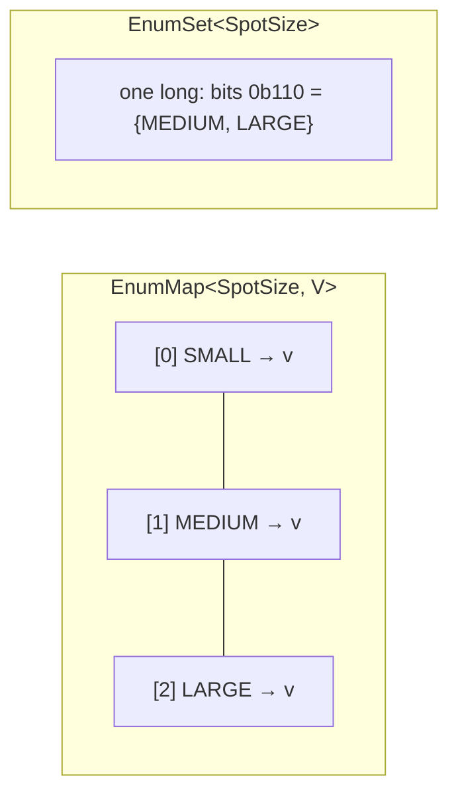

# Enums, EnumMap and EnumSet

## 1. One-line summary

A Java `enum` is a **class with a fixed, compile-time list of instances** that can carry fields and behaviour; `EnumMap` and `EnumSet` are collections specialised for enum keys that are backed by a plain array / bit mask, so they're faster and smaller than `HashMap` / `HashSet`.

## 2. The problem it solves

Without enums people model categories as `String` or `int` constants:

```java
static final int CAR = 1, TRUCK = 2;
park(vehicle, 7);            // compiles. What is 7?
if (type.equals("Car")) ...  // "car" vs "Car" vs "CAR" — a bug waiting for a typo
```

Nothing stops an invalid value, and adding a new category means grepping for every `if`. An enum makes the set **closed and type-checked**: `VehicleType.TRUCK` is the only way to say "truck", and the compiler can tell you when a `switch` forgot a case — like a k8s CRD schema rejecting an unknown field instead of silently ignoring it.

## 3. How it works

Each constant is a `public static final` singleton instance of the enum class, created once when the class loads. `==` is safe for comparison. Every enum gets `name()`, `ordinal()` (its position, 0-based), `values()` and `valueOf(String)`.

### Fields and behaviour

```java
public enum SpotSize { SMALL, MEDIUM, LARGE }

public enum VehicleType {
    MOTORCYCLE(java.util.EnumSet.of(SpotSize.SMALL, SpotSize.MEDIUM, SpotSize.LARGE)),
    CAR(java.util.EnumSet.of(SpotSize.MEDIUM, SpotSize.LARGE)),
    TRUCK(java.util.EnumSet.of(SpotSize.LARGE));

    private final java.util.Set<SpotSize> fitsIn;      // final: enums should be immutable

    VehicleType(java.util.Set<SpotSize> fitsIn) {       // constructor is implicitly private
        this.fitsIn = java.util.Collections.unmodifiableSet(fitsIn);
    }
    public boolean fitsIn(SpotSize size) { return fitsIn.contains(size); }
}
```

"Which spot sizes fit which vehicle" now lives in **one place**, next to the type — not scattered across `if` statements in the allocator.

### Constant-specific behaviour (abstract methods)

Each constant can have its own body, like a tiny anonymous subclass:

```java
public enum TicketStatus {
    ACTIVE { @Override public TicketStatus next() { return PAID; } },
    PAID   { @Override public TicketStatus next() { return EXITED; } },
    EXITED { @Override public TicketStatus next() { throw new IllegalStateException("already exited"); } };

    public abstract TicketStatus next();
}
```

This is a lightweight **State** pattern (see [design-patterns](../../concepts/design-patterns.md)).

### Switch expressions (Java 21)

```java
static int displayPriority(VehicleType t) {
    return switch (t) {               // no default: compiler checks every constant is covered
        case MOTORCYCLE -> 1;
        case CAR        -> 2;
        case TRUCK      -> 3;
    };
}
```

Add `BUS` to `VehicleType` and every exhaustive switch expression **fails to compile** until handled. Adding a `default ->` branch throws away that safety net.

### EnumMap / EnumSet

```java
var freeCount = new java.util.EnumMap<SpotSize, Integer>(SpotSize.class);
for (SpotSize s : SpotSize.values()) freeCount.put(s, 0);

java.util.Set<SpotSize> big = java.util.EnumSet.of(SpotSize.MEDIUM, SpotSize.LARGE);
java.util.Set<SpotSize> all = java.util.EnumSet.allOf(SpotSize.class);
java.util.Set<SpotSize> none = java.util.EnumSet.noneOf(SpotSize.class);
```



- `EnumMap` is an array indexed by `ordinal()` — no hashing, no collisions, no boxing of entries, iteration in declaration order.
- `EnumSet` is a bit vector (one `long` for ≤ 64 constants); `contains` is a bit test, `addAll` is a bitwise OR.

Neither is thread-safe. For a concurrent per-size map, either build an `EnumMap` once at construction **and never change its keys** (values can be thread-safe objects like a `ConcurrentLinkedDeque` — safe as long as the map is published safely, e.g. via a `final` field), or use `ConcurrentHashMap`.

### Enum as Strategy and Singleton

```java
public enum Rounding implements java.util.function.LongUnaryOperator {
    CEIL_HOUR  { public long applyAsLong(long mins) { return (mins + 59) / 60; } },
    FLOOR_HOUR { public long applyAsLong(long mins) { return mins / 60; } };
}

public enum IdGenerator {                // the "enum singleton" (Effective Java item 3)
    INSTANCE;
    private final java.util.concurrent.atomic.AtomicLong next = new java.util.concurrent.atomic.AtomicLong();
    public long nextId() { return next.incrementAndGet(); }
}
```

Enum strategies are great when the set of algorithms is **fixed and stateless**. If strategies need constructor-injected config (rates, a clock), use an interface + classes instead. The enum singleton has the usual Singleton drawbacks (global state, hard to fake in tests).

## 4. When to use it

- A closed set of categories known at compile time: `VehicleType`, `SpotSize`, `TicketStatus`, `PaymentMethod`, HTTP methods.
- Attaching fixed rules to each category (which spots fit which vehicle).
- `EnumMap` for "one thing per category": free-spot pool per `SpotSize`, counters per `VehicleType`.
- `EnumSet` for flags / capabilities instead of bit-twiddled `int`s.

## 5. When NOT to use it

- **Values that change at runtime or per deployment** — hourly prices, tax rates, lot capacity. Hard-coding `CAR(40.00)` in the enum means a price change needs a redeploy. Keep the **category** in the enum and the **price** in config / DB: `Map<VehicleType, BigDecimal>` loaded at startup (see [bigdecimal-and-money](bigdecimal-and-money.md)).
- **Open-ended sets** that grow without code changes (cities, customer tiers created by ops). Use a DB table.
- **Persisting `ordinal()`** — see mistakes below.
- **Huge behaviour per constant** — 200-line constant bodies are a class hierarchy in disguise; make real classes.

## 6. Commonly confused with

| | `enum` | `static final` String/int constants | `sealed interface` + records |
|---|---|---|---|
| Type-safe | yes | no | yes |
| Fixed set | yes | no | yes (permitted subtypes) |
| Per-instance data | same fields for all | n/a | each subtype can have different fields |
| Exhaustive `switch` | yes | no | yes (pattern matching) |
| Many instances per kind | no (one instance each) | n/a | yes |

| | `EnumMap` | `HashMap` | `EnumSet` | `HashSet` |
|---|---|---|---|---|
| Backing | array by ordinal | hash table | bit vector | hash table |
| Iteration order | declaration order | unspecified | declaration order | unspecified |
| `null` key | not allowed | allowed | not allowed | allowed |

## 7. Common mistakes / misuse

1. **Persisting `ordinal()`** (or using `@Enumerated(EnumType.ORDINAL)` in JPA). Someone inserts `SCOOTER` between `MOTORCYCLE` and `CAR`, and every stored `1` now means `SCOOTER`. Persist `name()` or an explicit `code` field.
2. **Mutable fields in an enum** — it's a global singleton; mutable state there is shared across every thread and test.
3. **`default` in a switch over your own enum** — hides missing cases when the enum grows.
4. **`valueOf(userInput)` without handling `IllegalArgumentException`** — a bad query param becomes a 500.
5. **Prices/config in enum constructors** (see section 5).
6. Using `HashMap<VehicleType, ...>` where `EnumMap` fits — not wrong, just a missed signal of fluency.

## 8. Interview cheat-sheet

- "`VehicleType` and `SpotSize` are enums; the vehicle type knows which spot sizes it fits, via an `EnumSet`, so that rule lives in one place."
- "I switch on enums with exhaustive switch expressions and no default, so adding a new vehicle type breaks the build where I need to handle it."
- "Free spots are kept per size in an `EnumMap` built once at startup — array-backed, ordered, cheaper than a `HashMap`."
- "Prices are not in the enum: they change, so they come from config keyed by the enum."
- "I persist `name()`, never `ordinal()`, so reordering constants can't corrupt stored data."

## 9. Used in

- [LLD: Design a Parking Lot](../../interviews/parking-lot/README.md) — `VehicleType` / `SpotSize` with fit rules, per-size availability, ticket status lifecycle.
- [LLD: Design an Elevator System](../../interviews/elevator-system/README.md) — `Direction` (UP / DOWN / IDLE) and `ElevatorStatus` (IDLE / MOVING / DOORS_OPEN / MAINTENANCE) with exhaustive switches (see [state-machines](../../concepts/state-machines.md)).
- [LLD: Design Splitwise](../../interviews/splitwise/README.md) — why split types are a sealed interface of records rather than an enum (each variant carries different per-expense data); see [sealed-interfaces-and-pattern-matching](sealed-interfaces-and-pattern-matching.md).
- [LLD: Design a Movie Ticket Booking System](../../interviews/movie-booking/README.md) — `SeatType` (REGULAR / PREMIUM / RECLINER) used as the key of each show's price table (`Map<SeatType, Long>` in paise).
- [Logging Framework](../../interviews/logging-framework/README.md): `Level` as an ordered enum (TRACE < DEBUG < INFO < WARN < ERROR < OFF), compared by severity for thresholds.
- [Vending Machine](../../interviews/vending-machine/README.md): `Denomination` enum with paise values, and `EnumMap` coin counts in the cash box and change results.
- Related: [records-and-immutability](records-and-immutability.md), [design-patterns](../../concepts/design-patterns.md).
