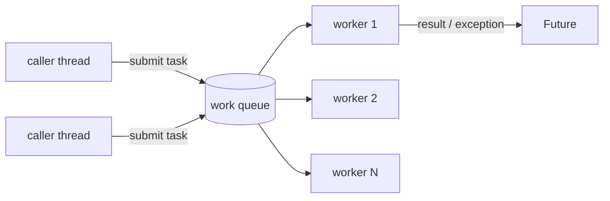

# Threads, ExecutorService and Virtual Threads

## 1. One-line summary

A `Thread` is one independent line of execution; an `ExecutorService` is a **managed pool** of threads you hand tasks to, and Java 21 **virtual threads** make threads so cheap that you can use one per blocking task — but none of this changes the rule that shared mutable state needs an owner or a lock.

> 💡 **Thread**: the unit the OS (or JVM) schedules onto a CPU core. Each classic Java thread is a real OS thread with its own stack (~1 MB reserved by default), so you can have thousands, not millions.

## 2. The problem it solves

Say an elevator system has 8 cars. The first idea is often "one thread per elevator":

```java
for (Elevator e : elevators) new Thread(e::runForever).start();   // 8 raw threads
```

Problems arrive quickly, like running pods without a Deployment:

- **No lifecycle**: how do you stop them cleanly at shutdown or between tests?
- **No error handling**: an exception kills the thread silently; that car just stops moving.
- **No limit**: code that creates a thread per request will eventually create 10,000 and run out of memory.
- **Shared state**: the dispatcher reads every car's floor while each car thread writes it → races.

`ExecutorService` fixes the first three (pool, lifecycle, `Future` for results and errors). The fourth is a design question — see the trade-off at the end and [single-writer-principle](../../concepts/single-writer-principle.md).

## 3. How it works



An executor is a **work queue plus worker threads** (a [BlockingQueue](blocking-queues-and-producer-consumer.md) inside). `submit` puts a task in the queue and returns a `Future`; idle workers `take()` tasks and run them. Think of it as a k8s Job queue with a fixed number of worker pods.

### The factory methods

| Factory | What you get | Typical use |
|---|---|---|
| `Executors.newFixedThreadPool(n)` | n threads, **unbounded** queue | CPU-bound work, n ≈ number of cores |
| `Executors.newSingleThreadExecutor()` | 1 thread, tasks run **in order** | serialising access to one piece of state |
| `Executors.newScheduledThreadPool(n)` | runs tasks after a delay / periodically | ticks, sweepers — see [scheduled-executor-service](scheduled-executor-service.md) |
| `Executors.newVirtualThreadPerTaskExecutor()` | a new virtual thread per task (Java 21) | many blocking I/O tasks |
| `new ThreadPoolExecutor(...)` | everything configurable (bounded queue, rejection policy) | production services |

> 💡 **CPU-bound** = the task spends its time computing (parsing, hashing). **I/O-bound** = it spends its time waiting for disk, network or a database.

### Submitting, getting results, shutting down

```java
import java.util.concurrent.*;

public class ExecutorDemo {
    public static void main(String[] args) throws Exception {
        ExecutorService pool = Executors.newFixedThreadPool(4);
        try {
            Future<Integer> f = pool.submit(() -> 6 * 7);      // Callable<Integer>
            System.out.println(f.get(1, TimeUnit.SECONDS));     // 42 — waits up to 1 s
            pool.submit(() -> { throw new IllegalStateException("boom"); });  // stored in its Future
        } finally {
            pool.shutdown();                                    // stop accepting; finish queued work
            if (!pool.awaitTermination(5, TimeUnit.SECONDS)) {  // wait for running tasks
                pool.shutdownNow();                             // interrupt the stragglers
            }
        }
    }
}
```

- `shutdown()` — no new tasks; already-queued ones still run.
- `shutdownNow()` — interrupts running tasks and returns the queued ones that never started.
- `awaitTermination(t)` — blocks until all tasks finish or the timeout passes.
- Forgetting shutdown leaves non-daemon threads alive, so the JVM never exits (like a pod stuck in `Terminating`).
- An exception thrown inside `submit(...)` is **captured in the `Future`** — if nobody calls `get()`, it vanishes. With `execute(...)` it goes to the thread's uncaught-exception handler instead.

### try-with-resources (Java 19+)

Since Java 19, `ExecutorService` implements `AutoCloseable`. `close()` calls `shutdown()` and waits for all tasks to finish:

```java
try (ExecutorService exec = Executors.newVirtualThreadPerTaskExecutor()) {
    for (int i = 0; i < 10_000; i++) {
        int id = i;
        exec.submit(() -> { Thread.sleep(100); return id; });   // 10,000 sleeping tasks: fine
    }
}   // close(): waits for all 10,000 to finish — takes ~100 ms, not 1,000 s
```

### Virtual threads (Java 21) in plain words

A **virtual thread** is a thread managed by the JVM instead of the OS. Thousands of them share a small pool of real OS threads called **carriers**. When a virtual thread blocks (socket read, `Thread.sleep`, `BlockingQueue.take`), the JVM **unmounts** it — parks its tiny stack on the heap — and runs another virtual thread on that carrier. A blocked virtual thread costs a few KB of memory instead of a whole OS thread.

```java
Thread vt = Thread.ofVirtual().name("call-", 0).start(() -> System.out.println("hi"));
vt.join();
```

**Helps:** many tasks that mostly **wait** — HTTP calls, DB queries, reading queues. You write simple blocking code and get the scalability of async code ([CompletableFuture](completablefuture.md)).

**Doesn't help:**
- **CPU-bound work** — there are still only as many cores as there are; 10,000 virtual threads hashing passwords are no faster than 8 platform threads.
- **Pinning** — in Java 21, blocking inside a `synchronized` block keeps the virtual thread stuck on its carrier ("pinned"); enough of them and all carriers are stuck. Use `ReentrantLock` there (details in [locks-and-synchronized](locks-and-synchronized.md); fixed in Java 24).
- **Pooling them** — don't put virtual threads in a fixed pool; create one per task. To limit concurrency (e.g. max 50 DB calls) use a `Semaphore`.

### Thread-per-elevator vs one simulation thread

| | Thread per elevator | One simulation thread + command queue |
|---|---|---|
| Model | each car loops: move, sleep, repeat | one loop calls `tick()` on every car |
| Shared state | dispatcher reads car state while car threads write → locks needed | only one thread touches state → no locks |
| Determinism | thread timing varies run to run → flaky tests | same commands + same ticks = same result |
| Testing | `Thread.sleep` and hope | call `tick()` 10 times, assert |
| Scale | fine for 8 cars; one OS thread each | one thread easily handles hundreds of cars (≈ microseconds per tick) |
| When it wins | each car does slow blocking I/O to real hardware | logic is pure computation (our case) |

The elevator design picks the second: requests from many threads go into a `LinkedBlockingQueue`, and a single scheduled task drains it and advances every car one tick. See [blocking-queues-and-producer-consumer](blocking-queues-and-producer-consumer.md).

## 4. When to use it

- `newSingleThreadExecutor` / single scheduled thread: one owner of state, in-order processing (simulation loop, event logger).
- Fixed pool: CPU work in parallel, sized to cores.
- Virtual-thread-per-task: request handlers, fan-out of blocking calls, anything "thread per connection".
- Always prefer an executor over `new Thread()` in production code.

## 5. When NOT to use it

- **A thread per object** (per elevator, per user, per spot) by reflex — more threads means more shared-state coordination, not more speed.
- **`Executors.newFixedThreadPool` / `newCachedThreadPool` in servers under load** — unbounded queue or unbounded threads; use `ThreadPoolExecutor` with a bounded queue and a rejection policy.
- **Virtual threads for CPU-heavy work** or around `synchronized` blocks that do I/O (Java 21).
- **Threads in unit tests of logic** — drive the logic directly (call `tick()`), keep threads for one integration test.

## 6. Commonly confused with

| | `Thread` | `ExecutorService` (platform) | Virtual thread | `CompletableFuture` |
|---|---|---|---|---|
| What it is | one OS thread | pool + queue of tasks | JVM-managed cheap thread | a value that will arrive later |
| Cost | ~1 MB stack, OS scheduling | reuses N threads | few KB, millions possible | object; runs on some executor |
| Lifecycle | manual `start`/`join` | `shutdown` / `close` | per task | completes once |
| Good for | demos | CPU work, ordered work | blocking I/O | composing async steps |

## 7. Common mistakes / misuse

1. **Never calling `shutdown()`** → JVM doesn't exit, tests hang.
2. **Ignoring the `Future`** → exceptions silently disappear; the elevator "just stops".
3. **`Thread.sleep` for coordination in tests** → slow and flaky; use ticks or latches.
4. **Unbounded queues** hiding overload until OOM.
5. **Pooling virtual threads** or using them for CPU-bound loops.
6. **Thinking a single-thread executor makes state thread-safe** if *other* threads still read/write that state directly. Only the executor's thread may touch it.

## 8. Interview cheat-sheet

- "I don't start raw threads; an `ExecutorService` gives me lifecycle, error propagation through `Future`, and a bounded number of threads."
- "For the elevator I use a single simulation thread — callers enqueue commands, one thread applies them in `tick()`, so there are no locks on elevator state and tests are deterministic."
- "Thread-per-elevator works but forces locks between the dispatcher and the cars and makes tests timing-dependent."
- "Virtual threads help when tasks block on I/O; they don't speed up CPU work, and on Java 21 I'd avoid blocking inside `synchronized` because it pins the carrier."
- "On shutdown: `shutdown()`, `awaitTermination` with a timeout, then `shutdownNow()` — or try-with-resources since Java 19."

## 9. Used in

- [LLD: Design an Elevator System](../../interviews/elevator-system/README.md) — single simulation thread vs thread-per-elevator; scheduled tick; clean shutdown.
- Related: [scheduled-executor-service](scheduled-executor-service.md), [blocking-queues-and-producer-consumer](blocking-queues-and-producer-consumer.md), [locks-and-synchronized](locks-and-synchronized.md), [completablefuture](completablefuture.md), [thread-safety-basics](../../concepts/thread-safety-basics.md).
