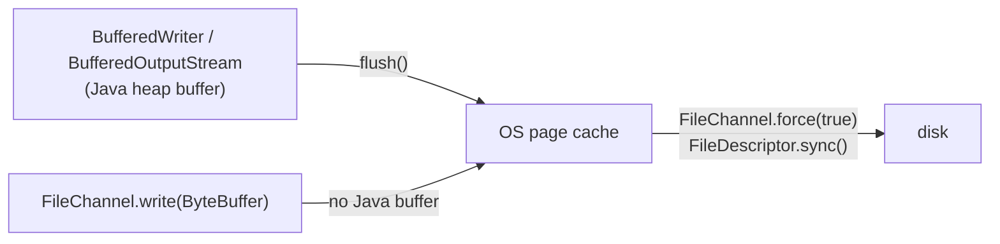

# File I/O and fsync in Java (Files, FileChannel, atomic replace)

## 1. One-line summary

`java.nio.file.Files` gives you one-liners for reading and writing files, `FileChannel` gives you low-level control including **`force(true)`** (Java's fsync), and `Files.move(..., ATOMIC_MOVE)` lets you replace a file so readers see either the old or the new version, never half of one.

## 2. The problem it solves

You add an append-only log to the kv-store:

```java
var w = new BufferedWriter(new FileWriter("data.aof", true));
w.write("SET a 1\n");     // returns instantly... where is the data?
```

It's in the `BufferedWriter`'s **internal buffer** (8 KB of Java heap). A crash now loses it. Call `flush()` and it moves to the **OS page cache** (💡 RAM where the kernel keeps file data before writing it to disk) — survives a process crash, not a power cut. Only an **fsync** (💡 a system call that blocks until data is physically on the storage device) makes it durable. Java's API hides fsync under different names, and getting this wrong is invisible until the day a node loses power. Background: [durability-wal-and-snapshots](../../concepts/durability-wal-and-snapshots.md).

## 3. How it works

### The layers and which call moves data down



| API | Buffers in Java? | How to fsync |
|---|---|---|
| `Files.newBufferedWriter(path, UTF_8, CREATE, APPEND)` | yes | can't directly; open a channel instead |
| `new FileOutputStream(file, true)` | no (each `write` is a syscall) | `out.getFD().sync()` or `out.getChannel().force(true)` |
| `FileChannel.open(path, CREATE, WRITE, APPEND)` | no | `ch.force(true)` |
| `FileChannel.open(..., DSYNC)` | no | automatic: every `write` waits for the data to hit disk |

💡 **syscall**: a call from your program into the operating system kernel. Each one costs ~0.1–1 µs, so unbuffered tiny writes are slow — batch bytes yourself.

- `force(true)` = data **and** metadata (file size, modification time) — like `fsync`. `force(false)` = data plus only the metadata needed to read it back — like `fdatasync`, sometimes faster.
- `StandardOpenOption.DSYNC` = every write is synchronous for data (`O_DSYNC`); `SYNC` = data + metadata. Convenient for "always", but you lose the chance to batch several writes into one fsync.
- `APPEND` = every write goes to the current end of file, even if something else appended meanwhile.

### An append-only log with an fsync policy

```java
import java.io.IOException;
import java.nio.ByteBuffer;
import java.nio.channels.FileChannel;
import java.nio.charset.StandardCharsets;
import java.nio.file.*;
import static java.nio.file.StandardOpenOption.*;

enum FsyncPolicy { ALWAYS, EVERY_SECOND, NEVER }

final class AppendLog implements AutoCloseable {
    private final FileChannel ch;
    private final FsyncPolicy policy;
    private long lastSyncMillis = 0;

    AppendLog(Path path, FsyncPolicy policy) throws IOException {
        this.ch = FileChannel.open(path, CREATE, WRITE, APPEND);
        this.policy = policy;
    }

    void appendBatch(String batch, long nowMillis) throws IOException {
        ByteBuffer buf = ByteBuffer.wrap(batch.getBytes(StandardCharsets.UTF_8));
        while (buf.hasRemaining()) ch.write(buf);          // write() may write fewer bytes than asked
        switch (policy) {
            case ALWAYS -> ch.force(false);
            case EVERY_SECOND -> { if (nowMillis - lastSyncMillis >= 1000) { ch.force(false); lastSyncMillis = nowMillis; } }
            case NEVER -> { }                              // OS decides
        }
    }

    @Override public void close() throws IOException { ch.force(true); ch.close(); }
}
```

(Real Redis does the every-second fsync on a background thread so the command thread never waits; the version above piggybacks on writes to stay simple. An idle log would then not be synced — a background `ScheduledExecutorService` fixes that, see [scheduled-executor-service](scheduled-executor-service.md).)

### Atomic snapshot replace: temp → fsync → rename → fsync dir

```java
static void writeSnapshotAtomically(Path target, String contents) throws IOException {
    Path dir = target.toAbsolutePath().getParent();
    Path tmp = dir.resolve(target.getFileName() + ".tmp");
    try (FileChannel ch = FileChannel.open(tmp, CREATE, WRITE, TRUNCATE_EXISTING)) {
        ByteBuffer buf = ByteBuffer.wrap(contents.getBytes(StandardCharsets.UTF_8));
        while (buf.hasRemaining()) ch.write(buf);
        ch.force(true);                                    // 1. temp file's bytes are on disk
    }
    Files.move(tmp, target, StandardCopyOption.ATOMIC_MOVE); // 2. rename: readers see old OR new
    try (FileChannel d = FileChannel.open(dir, READ)) {     // 3. make the rename itself durable
        d.force(true);                                      //    (works on Linux/macOS, not Windows)
    }
}
```

- The temp file must be in the **same directory** (same file system); otherwise `ATOMIC_MOVE` throws `AtomicMoveNotSupportedException`.
- On Linux, `ATOMIC_MOVE` maps to `rename()`, which atomically replaces an existing target. The Javadoc says replacing is implementation-specific, so on other platforms check.
- 💡 A **directory** is itself a small file listing names → inodes (file records). The rename changes the directory, so the directory needs its own fsync.

### Reading line by line (recovery)

```java
try (var reader = Files.newBufferedReader(path, StandardCharsets.UTF_8)) {
    String line;
    while ((line = reader.readLine()) != null) {
        // parse one command; a torn last line may be partial: validate before applying
    }
}
```

- `Files.readAllLines(path, UTF_8)` — loads everything into a `List`; fine for small files.
- `Files.lines(path)` — a lazy `Stream<String>`; **must** be closed (`try (var s = Files.lines(p)) { ... }`) or the file handle leaks.
- `readLine()` returns the final line even if it has no trailing `\n` — so you can't tell a torn last line from a complete one by `readLine` alone. Use an end marker, a length prefix, or a checksum.

💡 **Charset**: the mapping from characters to bytes. Always pass `StandardCharsets.UTF_8`. Java 18+ defaults to UTF-8 anyway, but being explicit protects you from older JVMs and makes intent clear.

💡 **try-with-resources** (`try (var x = ...) { }`) closes `x` automatically, even on an exception — the Java version of "always release the file handle".

## 4. When to use it

- `Files.writeString` / `readString` / `readAllLines`: small config files, tests, one-shot scripts.
- `FileChannel` + `force`: anything that claims durability (logs, snapshots, offsets).
- `DSYNC`: simplest "every write durable" when writes are already batched per transaction.
- Temp + `ATOMIC_MOVE`: any whole-file replacement other processes might read (snapshots, generated configs — like how k8s ConfigMap volumes swap a symlink atomically).

## 5. When NOT to use it

- **`force` on every tiny write at high throughput** — each call can take milliseconds; batch (group commit).
- **`Files.readAllLines` on a multi-GB log** — out-of-memory; stream it.
- **Memory-mapped files (`MappedByteBuffer`) as an easy durability path** — `force()` exists there too, but error handling and unmapping are tricky; prefer `FileChannel` in an interview.
- **Hand-rolled storage for production data** — use an embedded store (RocksDB, SQLite, H2) or a real database; these APIs are for learning and for simple logs.

## 6. Commonly confused with

| Call | Moves data to | Durable on power loss? |
|---|---|---|
| `BufferedWriter.flush()` | OS page cache | no |
| `close()` | flushes Java buffer, releases handle | **no** (does not fsync) |
| `FileChannel.force(false)` | disk (data) | yes |
| `FileChannel.force(true)` / `FileDescriptor.sync()` | disk (data + metadata) | yes |
| `Files.move(ATOMIC_MOVE)` | renames; not durable until the directory is fsync'd | after dir fsync |

| | `Writer` / `Reader` | `OutputStream` / `InputStream` / `FileChannel` |
|---|---|---|
| Unit | characters (needs a charset) | bytes |
| Good for | text commands | binary frames (length + CRC32) |

## 7. Common mistakes / misuse

1. Forgetting `flush()` on a `BufferedWriter` → data lost even on a normal crash.
2. Assuming `close()` fsyncs — it doesn't.
3. Using `PrintWriter` for a log: it **swallows `IOException`s** (check `checkError()`), so a full disk goes unnoticed.
4. Ignoring the return value of `FileChannel.write` — it can write only part of the buffer; loop until `!hasRemaining()`.
5. Snapshot written directly over the old file → a crash mid-write leaves neither version.
6. Forgetting the directory fsync after a rename, or the temp file on a different mount.
7. Not passing a charset in older code (`new FileWriter(f)`) → platform-dependent bytes.

## 8. Interview cheat-sheet

- "flush moves bytes to the OS page cache; only FileChannel.force or FileDescriptor.sync makes them survive power loss — and close doesn't fsync."
- "My AOF is a FileChannel opened with APPEND; after each committed batch I force according to the policy: always, every second, or never."
- "Snapshots are written to a temp file in the same directory, forced, then Files.move with ATOMIC_MOVE, then I fsync the directory."
- "I loop on channel.write because it may be partial, and I always use try-with-resources and UTF-8 explicitly."
- "In production I'd use an embedded store like RocksDB rather than hand-rolled files."

## 9. Used in

- [LLD: Design an In-Memory Key-Value Store with Transactions](../../interviews/kv-store/README.md) — append-only file with fsync policy, atomic snapshot rewrite, line-by-line replay on startup.
- Related: [durability-wal-and-snapshots](../../concepts/durability-wal-and-snapshots.md), [undo-logs-and-redo-logs](../../concepts/undo-logs-and-redo-logs.md), [time-and-clock](time-and-clock.md), [scheduled-executor-service](scheduled-executor-service.md).
