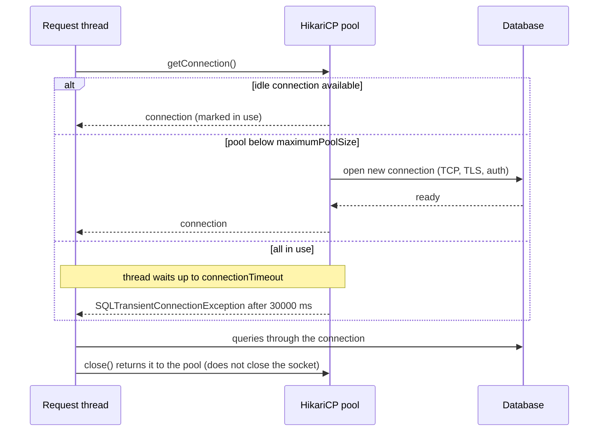

# HikariCP and JDBC Connection Pools

## 1. One-line summary

**HikariCP** is the standard JDBC connection pool for Java (and Spring Boot's default since 2.0): it keeps a small set of open database connections, lends one to each `dataSource.getConnection()` call, takes it back on `close()`, and retires/replaces connections on a schedule so the database or the network never finds a stale one.

💡 **JDBC** (Java Database Connectivity) is the standard Java API for talking to SQL databases (`Connection`, `PreparedStatement`, `ResultSet`); a **driver** (e.g. the PostgreSQL JDBC driver) implements it for one database. A **DataSource** is the factory your code asks for connections; with a pool, it's the pool.

> You already run HikariCP at work and probably see its `hikaricp_connections_*` metrics in Grafana. This file explains what each setting and metric means, and how they connect to sizing. The sizing theory is in [resource pools and sizing](../../concepts/resource-pools-and-sizing.md).

---

## 2. The problem it solves

**The pain:** opening a database connection costs a TCP handshake, TLS (encryption) setup, authentication and, in Postgres, a new server process: often 5–20 ms, versus a 1–2 ms query. Opening one per request wastes most of the time and can overwhelm the database at spikes. But keeping connections open forever brings new problems:

- A firewall, NAT gateway or cloud load balancer silently drops connections idle longer than its timeout (AWS NAT gateways: 350 s). The pool hands out a **dead** connection and the query fails or hangs.
- The DB fails over to a replica: old connections point at the old primary.
- A buggy code path never calls `close()`: the pool drains.

**The fix:** a pool that reuses connections, **bounds** how many exist, **validates** and **refreshes** them on a schedule, and **times out** callers that wait too long.

---

## 3. How it works

### 3.1 Borrow and return



`close()` on a pooled connection is a **return**, not a disconnect. Use try-with-resources so it always happens:

```java
try (Connection c = dataSource.getConnection();
     PreparedStatement ps = c.prepareStatement("SELECT balance FROM accounts WHERE id = ?")) {
    ps.setLong(1, accountId);
    try (ResultSet rs = ps.executeQuery()) { /* ... */ }
}   // connection goes back to the pool here, even on exceptions
```

### 3.2 Key settings and defaults

From the HikariCP README (times in milliseconds in config):

| Setting | Default | What it does |
|---|---|---|
| `maximumPoolSize` | **10** | Max connections, idle + in use. The real concurrency limit to the DB. |
| `minimumIdle` | **same as `maximumPoolSize`** | Idle connections to keep ready. The README recommends leaving it unset: a **fixed-size pool** responds best to spikes. |
| `connectionTimeout` | **30,000 (30 s)** | How long `getConnection()` waits before throwing. Minimum 250 ms. |
| `idleTimeout` | **600,000 (10 min)** | Retire connections idle this long. Only applies when `minimumIdle < maximumPoolSize`. |
| `maxLifetime` | **1,800,000 (30 min)** | Retire every connection after this age (when it's next returned, never mid-use). |
| `keepaliveTime` | **120,000 (2 min)** | How often idle connections are pinged to keep firewalls/DB from timing them out. Must be less than `maxLifetime`. |
| `leakDetectionThreshold` | **0 (off)** | If a connection is out of the pool longer than this, log a warning with the borrower's stack trace. Lowest enabled value 2,000. |

In Spring Boot these are `spring.datasource.hikari.*`:

```yaml
spring:
  datasource:
    hikari:
      maximum-pool-size: 15
      connection-timeout: 2000      # fail fast: our API's own timeout is 3 s
      max-lifetime: 1740000         # 29 min: DB/proxy cuts connections at 30 min
      leak-detection-threshold: 10000
```

### 3.3 Why `maxLifetime` must be shorter than every external cutoff

The README's advice: `maxLifetime` "should be several seconds shorter than any database or infrastructure imposed connection time limit."

If a proxy kills connections at exactly 30 min and Hikari also retires them at 30 min, there's a window where Hikari hands out a connection the proxy has just killed: `Connection reset` or `I/O error` on a random request. With `maxLifetime` at 29 min, Hikari always retires first. Same for idle cutoffs: if a NAT drops idle connections after 350 s, `keepaliveTime` (2 min) keeps idle connections active well inside that. HikariCP also applies a small random variance to each connection's lifetime so they don't all expire and reconnect in the same second (a mini [thundering herd](../../../HLD/concepts/retries-backoff-and-dlq.md): many clients doing the same thing at the same instant).

Infra analogy: like setting your load balancer's idle timeout shorter than the backend's keep-alive timeout, so the side that closes is always the one that knows about it.

### 3.4 Metrics to watch

With Micrometer (Spring Boot Actuator), Hikari exports (Prometheus names):

| Metric | Meaning | Healthy | Trouble |
|---|---|---|---|
| `hikaricp_connections_active` | borrowed right now | well under max | pinned at max |
| `hikaricp_connections_idle` | open and free | > 0 | 0 for long periods |
| `hikaricp_connections_pending` | **threads waiting** for a connection | ~0 | sustained > 0: pool is the bottleneck (or DB is slow) |
| `hikaricp_connections_acquire_seconds` | time to get a connection | sub-ms | climbing toward `connectionTimeout` |
| `hikaricp_connections_usage_seconds` | how long each borrow lasted (Little's `W`) | ~query time | long: slow queries, or holding connections during HTTP calls |
| `hikaricp_connections_creation_seconds` | time to open a new connection | ms | high: network/DB/auth trouble |
| `hikaricp_connections_timeout_total` | callers that gave up | 0 | any increase = user-facing errors |

Little's law check: `active ≈ request rate × usage time`. At 300 queries/s × 30 ms = 9 active, a pool of 10 has no headroom.

### 3.5 The error everyone meets

```
java.sql.SQLTransientConnectionException: HikariPool-1 - Connection is not available,
request timed out after 30000ms.
```

It means "no connection was free for 30 s". It is usually **not** fixed by raising `maximumPoolSize`. Check, in order:

1. **Leaks**: `active` at max while traffic is low → enable `leakDetectionThreshold` and read the stack traces.
2. **Slow queries / locks**: `usage_seconds` high → the DB is slow; a bigger pool adds more contention.
3. **Holding connections during non-DB work**: `@Transactional` around an HTTP call keeps the connection for the whole call.
4. **Genuinely undersized**: `usage` short, DB idle, `pending` high → size by Little's law and fleet budget.
5. **Nested borrowing**: a thread holding one connection asks for a second; with all threads doing that, the pool deadlocks. The wiki's minimum for that case is `threads × (connections_per_thread − 1) + 1`.

And lower `connectionTimeout` to just below your request timeout: waiting 30 s for a connection on a 2 s API only makes the outage longer ([back-pressure](../../concepts/back-pressure.md)).

### 3.6 Proxies in front of the database: pgBouncer, RDS Proxy

When `pods × maximumPoolSize` exceeds what the DB can hold (Postgres default `max_connections` = 100), put a **connection proxy** between apps and DB:

- **pgBouncer** (open source): in **transaction pooling** mode, a server connection is assigned to a client only for the duration of one transaction, so 1,000 client connections can share 50 server ones. Caveat: session state (session `SET` commands, advisory locks, and server-side prepared statements on older pgBouncer versions) doesn't survive across transactions.
- **AWS RDS Proxy**: managed equivalent, also smooths failovers.

You still keep HikariCP in each app (connecting to the proxy is cheap but not free); the proxy fixes the **fleet** limit. See [PostgreSQL](../../../HLD/technologies/postgresql.md).

### 3.7 Thread pool vs connection pool

| | **`ThreadPoolExecutor`** ([executors](executors-and-threads.md)) | **HikariCP** |
|---|---|---|
| Pools | threads that **run** your tasks | connections your threads **borrow** |
| You give it | a task (`submit`) | nothing; you ask for a resource |
| When full | queue the task, then reject policy | caller **blocks** up to `connectionTimeout`, then exception |
| Sized by | cores and wait/compute ratio | DB cores, Little's law, fleet budget |
| Leaks? | rare (thread returns when task ends) | common (forgot `close()`) |

### 3.8 Virtual threads and JDBC

With [virtual threads](../../concepts/virtual-threads.md) (Java 21) you can have 10,000 concurrent requests cheaply, but **the pool still limits DB concurrency to `maximumPoolSize`**, which is exactly what you want; 10,000 virtual threads simply wait in Hikari's queue. Two cautions:

- **Pinning (Java 21–23):** if a virtual thread blocks on IO **inside a `synchronized` block** (common in older JDBC drivers and pools), it can't unmount and keeps its carrier OS thread busy. With few carriers (one per core by default), that throttles the whole app. Check that your driver/pool versions replaced `synchronized` with `ReentrantLock` on hot paths.
- **Java 24+:** JEP 491 ("Synchronize Virtual Threads without Pinning", delivered in JDK 24) lets virtual threads unmount inside `synchronized`, removing nearly all of that pinning. Native-code frames can still pin.

---

## 4. When to use it

- Every JVM service talking to a SQL database. In Spring Boot, it's already there.
- With a fixed pool (`minimumIdle` unset) for steady services; a smaller `minimumIdle` only to save DB connections for very bursty or rarely used services.

## 5. When NOT to use it (and why it's a mistake)

| Situation | Why it's a mistake |
|---|---|
| Serverless functions with thousands of short-lived instances | Each instance keeps its own pool, the fleet explodes the DB; use RDS Proxy / a data API. |
| Huge `maximumPoolSize` "to be safe" | Moves the queue into the database, where it's slower and contended. |
| Two pools for the same DB in one app (by accident) | Double the connections, half the visibility. |

---

## 6. Commonly confused with

| | **HikariCP** | **Apache DBCP2 / c3p0** | **pgBouncer / RDS Proxy** | **R2DBC pool** |
|---|---|---|---|---|
| Where | in your JVM | in your JVM | separate process/service | in your JVM |
| For | blocking JDBC | blocking JDBC (older, slower, more knobs) | all clients of one DB | reactive, non-blocking drivers |
| Fixes | per-app connection reuse | same | fleet-wide connection count | same as Hikari, for reactive stacks |

---

## 7. Common mistakes / misuse

1. **`maxLifetime` ≥ the DB/proxy/firewall cutoff**: random "connection reset" errors.
2. **30 s `connectionTimeout`** on latency-sensitive APIs.
3. **Raising the pool size to fix timeouts** caused by leaks or slow queries.
4. **Not closing** connections/statements on all paths.
5. **Ignoring `pending`**: the earliest sign the pool is the bottleneck.
6. **Forgetting fleet math** when autoscaling.

---

## 8. Interview cheat-sheet

> "HikariCP keeps a fixed set of connections, ten by default, and callers wait up to connectionTimeout, 30 seconds by default, which I'd cut to just below the API's own timeout. I size the pool from Little's law and the database's cores, not from thread count, and check that pods times pool size stays under max_connections, adding pgBouncer if not. maxLifetime, 30 minutes by default, must be a few seconds shorter than any database or network cutoff, and keepaliveTime keeps idle connections alive through NAT timeouts. I'd alert on pending threads and timeouts, and turn on leak detection, because 'connection is not available, request timed out after 30000ms' is usually a leak or a slow database, not a small pool. With virtual threads the pool remains the DB concurrency limit; on Java 21 I'd watch for synchronized pinning in drivers, which JEP 491 fixed in Java 24."

---

## 9. Used in

- [Thread Pool / Connection Pool](../../interviews/thread-pool/README.md): the production reference for a connection pool's settings (sizes, timeouts, lifetimes, leak detection), its metrics, and the classic "pool exhausted" incident.
- Related: [resource pools and sizing](../../concepts/resource-pools-and-sizing.md), [virtual threads](../../concepts/virtual-threads.md), [executors and threads](executors-and-threads.md), [locks and synchronized](locks-and-synchronized.md), [Node worker threads and libuv pool](../js/worker-threads-and-libuv-pool.md) (node-postgres `Pool`), [PostgreSQL](../../../HLD/technologies/postgresql.md).
