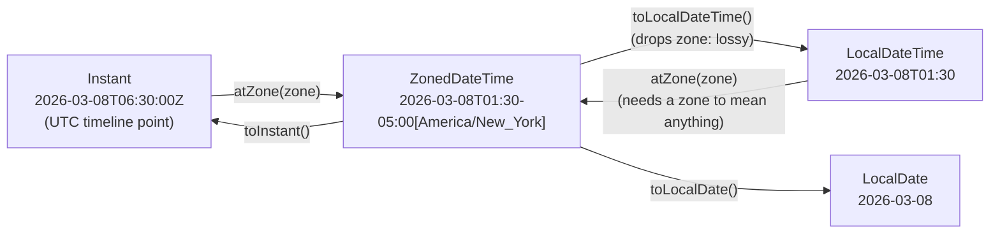

# java.time API (Instant, LocalDateTime, ZonedDateTime, Duration, Period)

## 1. One-line summary

`java.time` (Java 8+) gives separate, immutable types for **a point on the global timeline** (`Instant`), **a calendar date/time with no time zone** (`LocalDateTime`), **a date/time in a specific zone** (`ZonedDateTime`), and **amounts of time** in machine units (`Duration`) or calendar units (`Period`) — choosing the right one is what keeps billing correct across midnight and daylight-saving changes.

## 2. The problem it solves

The old `java.util.Date` / `Calendar` were mutable (changeable after creation), not thread-safe (unsafe to share between threads) (`SimpleDateFormat` shared between threads corrupts output), 0-based months, and mixed "instant" with "calendar date" in one confusing class.

The more interesting pain is conceptual. "The car entered at 01:30 and left at 03:30" — how long did it park? In India, 2 hours. In New York on 8 March 2026, clocks jump from 02:00 straight to 03:00 (DST, daylight-saving time: clocks move an hour twice a year), so it parked **1 hour**. If you subtract two `LocalDateTime`s you bill 2 hours, overcharging every car in the lot that night. In November the opposite happens and you undercharge. That's a real incident class: "billing bug only on DST weekends", same family as "cron job ran twice when clocks fell back". (A *time zone* is a region's rule for converting UTC, the global reference time, to local clock time, including DST changes.)

`java.time` makes you say which kind of time you mean.

This page is about calendar/wall-clock types and amounts. For **measuring elapsed time with `System.nanoTime`** (a monotonic timer: it only moves forward and ignores clock adjustments) and injecting a time source into code for tests, see [time-and-clock](time-and-clock.md) — not repeated here.

## 3. How it works



| Type | What it is | Parking lot use |
|---|---|---|
| `Instant` | nanoseconds since 1970-01-01T00:00Z (the "Unix epoch", the agreed zero point for timestamps); no zone, no calendar | `Ticket.entryTime`, exit time, stored in DB |
| `ZonedDateTime` | date + time + zone rules (`Asia/Kolkata`) | printing the receipt, "which calendar day?" for daily caps |
| `LocalDateTime` | date + time, **no zone** — "01:30 somewhere" | user input before you know the zone; almost never for stored events |
| `LocalDate` / `LocalTime` | date only / time only | "night rate after 22:00", "daily cap per calendar day" |
| `Duration` | exact seconds + nanos | how long a car parked |
| `Period` | years, months, days (calendar units) | monthly passes ("valid for 1 month") |

All are **immutable** (never change after creation) **and thread-safe** — `plus`, `minus`, `with` return new objects (same rule as [BigDecimal](bigdecimal-and-money.md)).

### The DST bug, shown

```java
import java.time.*;

ZoneId ny = ZoneId.of("America/New_York");
LocalDateTime in  = LocalDateTime.of(2026, 3, 8, 1, 30);
LocalDateTime out = LocalDateTime.of(2026, 3, 8, 3, 30);

Duration.between(in, out);                                  // PT2H  — wrong, clocks skipped an hour
Duration.between(in.atZone(ny), out.atZone(ny));            // PT1H  — correct
Duration.between(in.atZone(ny).toInstant(), out.atZone(ny).toInstant());  // PT1H
```

(`PT2H` is ISO-8601 notation for "a period of time: 2 hours".) Rule: **record events as `Instant`** and compute durations between `Instant`s. Convert to a zone only to *display* or to apply calendar rules.

### Duration vs Period

```java
ZonedDateTime start = ZonedDateTime.of(2026, 3, 7, 12, 0, 0, 0, ny);
start.plus(Duration.ofDays(1));   // 2026-03-08T13:00-04:00 — exactly 24 hours later
start.plus(Period.ofDays(1));     // 2026-03-08T12:00-04:00 — "same time tomorrow" (only 23 h later)
```

"Daily cap per 24 hours parked" → `Duration`. "Daily cap per calendar day" → `Period`/`LocalDate`. Ask which one the business means — it's a great clarifying question.

### Rounding a duration up to whole billable hours

```java
static long billableHours(Duration parked) {
    if (parked.isNegative()) throw new IllegalArgumentException("exit before entry");
    return Math.ceilDiv(parked.toSeconds(), 3600);    // Java 18+: 61 min -> 2, 60 min -> 1, 0 -> 0
}
// pre-18 equivalent: (seconds + 3599) / 3600
// toHours() TRUNCATES: Duration.ofMinutes(119).toHours() == 1  -> undercharge
```

Combine with a grace period and the daily cap as **separate, named steps** inside the `PricingStrategy` (a pluggable pricing rule behind an interface) — easy to test one at a time. (*Ceiling division* rounds up instead of down.)

### Crossing midnight: which day does a fee belong to?

```java
ZoneId lotZone = ZoneId.of("Asia/Kolkata");
Instant entry = Instant.parse("2026-10-07T18:00:00Z");     // 23:30 IST
Instant exit  = Instant.parse("2026-10-07T20:30:00Z");     // 02:00 IST next day
LocalDate entryDay = entry.atZone(lotZone).toLocalDate();  // 2026-10-07
LocalDate exitDay  = exit.atZone(lotZone).toLocalDate();   // 2026-10-08
long calendarDays = java.time.temporal.ChronoUnit.DAYS.between(entryDay, exitDay) + 1;  // touches 2 days
```

The zone is a property of the **lot** (configuration), not of the server — pods in a k8s cluster usually run in UTC. (`IST` = India Standard Time, UTC+5:30.)

### Getting "now": inject a Clock

💡 **`Clock` / injection:** `Clock` is Java's object for "what time is it". *Injecting* means passing it in via the constructor rather than calling the system clock directly, so tests can freeze or advance time (like mocking a dependency).

```java
public final class ParkingLot {
    private final Clock clock;
    public ParkingLot(Clock clock) { this.clock = clock; }
    Instant now() { return Instant.now(clock); }          // never Instant.now() with no argument
}
// test: new ParkingLot(Clock.fixed(Instant.parse("2026-10-07T10:00:00Z"), ZoneOffset.UTC))
```

Why and how to fake clocks is covered in [time-and-clock](time-and-clock.md).

### Formatting and parsing

```java
var fmt = java.time.format.DateTimeFormatter.ofPattern("dd MMM yyyy, hh:mm a", java.util.Locale.ENGLISH);
entry.atZone(lotZone).format(fmt);                         // "07 Oct 2026, 11:30 PM"
Instant.parse("2026-10-07T18:00:00Z");                     // ISO-8601 for APIs and logs
```

`DateTimeFormatter` is immutable and thread-safe — share it as a constant (unlike `SimpleDateFormat`).

## 4. When to use it

- `Instant` for every event timestamp you store or send (ticket entry/exit, audit logs, Kafka events, i.e. messages on a Kafka log).
- `ZonedDateTime` with the lot's `ZoneId` for receipts, night/weekend rates, per-calendar-day caps.
- `Duration` for parked time and grace periods; `Period` for passes and subscriptions.
- `Clock` injected for anything that asks "what time is it now?".

## 5. When NOT to use it

- **`LocalDateTime` for stored events** — it's ambiguous without a zone; two servers in different zones will disagree, and DST makes some values occur twice or never.
- **`java.time` for measuring latency or timeouts** — wall clocks can jump (NTP, the protocol that syncs a machine's clock with time servers, can step it backwards); use monotonic `nanoTime` ([time-and-clock](time-and-clock.md)).
- **`ZoneOffset` (fixed `+05:30`) where you mean a region** — offsets don't know DST rules; use `ZoneId.of("Europe/London")`.
- **`Period` for "N hours"** — Period has no hours; that's `Duration`.

## 6. Commonly confused with

| | `Instant` | `LocalDateTime` | `ZonedDateTime` | `OffsetDateTime` |
|---|---|---|---|---|
| Knows zone/offset | UTC only | no | full zone rules (DST) | fixed offset only |
| A point on the timeline | yes | **no** | yes | yes |
| Good for storage | yes | no | ok (store as Instant + zone id) | yes (DB `timestamptz`, Postgres's timezone-aware timestamp type) |
| Good for display | no | yes, if zone known | yes | yes |

| | `Duration` | `Period` |
|---|---|---|
| Units | seconds + nanos | years, months, days |
| Across DST | exact elapsed time | keeps wall-clock time |
| Example | `PT2H30M` | `P1M` |

## 7. Common mistakes / misuse

1. `Duration.between(localIn, localOut)` → wrong across DST changes.
2. `toHours()` to bill → truncation undercharges; use ceiling division.
3. `Instant.now()` / `LocalDateTime.now()` with no `Clock` → untestable time logic.
4. Using the server's default zone (`ZoneId.systemDefault()`) for business rules — your container is UTC, your lot isn't.
5. Treating `Duration.ofDays(1)` and `Period.ofDays(1)` as the same.
6. Forgetting immutability: `entry.plusHours(1);` without assigning.
7. Sharing a `SimpleDateFormat` across threads (legacy code) — use `DateTimeFormatter`.

## 8. Interview cheat-sheet

- "Entry and exit are stored as `Instant`s from an injected `Clock`, so the parked duration is exact and testable."
- "I compute `Duration.between` on instants, not `LocalDateTime`, so DST nights don't over- or under-charge."
- "Billable hours round **up** with `Math.ceilDiv` on seconds — `toHours()` would truncate."
- "Calendar rules like night rates or a per-day cap use the lot's `ZoneId`, not the server's default zone."
- "I'd clarify: is the daily cap per 24 hours or per calendar day? That's `Duration` vs `LocalDate`."

## 9. Used in

- [LLD: Design a Parking Lot](../../interviews/parking-lot/README.md) — ticket entry time, parked duration, hourly rounding, daily cap, injected `Clock` for tests.
- [Task Scheduler](../../interviews/task-scheduler/README.md): **cron next-fire times in a `ZoneId`** across DST: the skipped 02:30 on 2025-03-09 and the repeated 01:30 on 2025-11-02 in America/New_York, with tests pinning the exact instants.
- Related: [time-and-clock](time-and-clock.md), [bigdecimal-and-money](bigdecimal-and-money.md).
