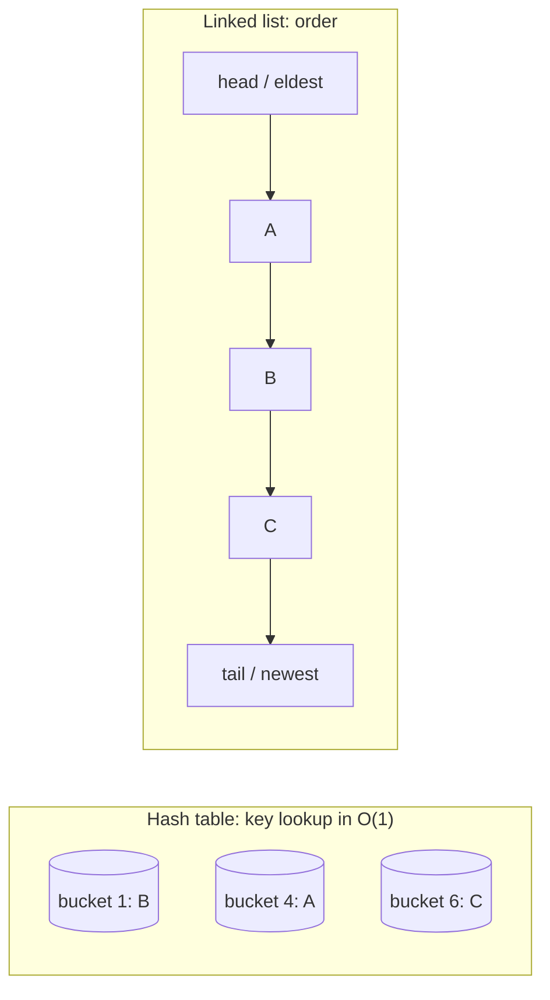

# LinkedHashMap

## 1. One-line summary

`java.util.LinkedHashMap` is a normal `HashMap` that **also remembers an order** for its entries (either the order they were inserted, or the order they were last used), and with two small settings it becomes a ready-made **LRU cache** (Least Recently Used: when full, throw away the entry nobody has touched for the longest time).

## 2. The problem it solves

A plain `HashMap` gives O(1) lookups (constant time, no matter how big the map is; see [Big-O](../../concepts/big-o-complexity.md)) but its iteration order is effectively random — it depends on hash codes and the size of the internal array. Two pains follow:

- **You want predictable output.** Config keys printed in the order they were read, JSON fields in a stable order, a test that compares output strings. `HashMap` scrambles them.
- **You want a bounded cache.** "Keep the 10,000 most recently used items, drop the stalest when full." With a `HashMap` alone you'd need to scan every entry to find the oldest — O(n) per eviction.

`LinkedHashMap` fixes both by threading a **doubly linked list** (each entry points to the one before and after it) through the hash map's entries. The hash map answers "where is key X?" in O(1); the list answers "who is oldest?" in O(1). How the two structures combine is explained in [hashmap-and-linked-list](../../concepts/hashmap-and-linked-list.md).

## 3. How it works

Every entry lives in the hash table as usual, **and** in a doubly linked list with `head` (oldest) and `tail` (newest).



### Insertion order vs access order

The 3-argument constructor picks the order:

```java
new LinkedHashMap<K, V>(initialCapacity, loadFactor, accessOrder);
```

| `accessOrder` | Order kept | What moves an entry to the tail |
|---|---|---|
| `false` (default) | **insertion order** | only inserting a *new* key; re-`put` of an existing key does **not** move it |
| `true` | **access order** (least recently used first) | `get`, `getOrDefault`, `put`, `putIfAbsent`, `compute*`, `merge` on that key |

`loadFactor` is how full the table may get before it doubles (0.75 is the normal default).

### `removeEldestEntry`: the eviction hook

After every insert, `LinkedHashMap` calls a protected method `removeEldestEntry(eldest)`. By default it returns `false` (never evict). Override it, and the map evicts the head of the list for you. This is the **Template Method** idea: the class runs the algorithm and gives you one hook to customize (see [design-patterns](../../concepts/design-patterns.md)).

### A complete LRU cache in ~15 lines

```java
import java.util.LinkedHashMap;
import java.util.Map;

public class LinkedHashMapLruCache<K, V> extends LinkedHashMap<K, V> {
    private final int capacity;

    public LinkedHashMapLruCache(int capacity) {
        super(16, 0.75f, true);          // true = access order -> LRU
        this.capacity = capacity;
    }

    @Override
    protected boolean removeEldestEntry(Map.Entry<K, V> eldest) {
        return size() > capacity;        // evict head when over capacity
    }

    public static void main(String[] args) {
        var cache = new LinkedHashMapLruCache<String, Integer>(2);
        cache.put("a", 1);
        cache.put("b", 2);
        cache.get("a");                  // "a" becomes most recent
        cache.put("c", 3);               // evicts "b" (least recently used)
        System.out.println(cache.keySet()); // [a, c]
    }
}
```

In an interview you'd usually **compose** instead of extend (hold a private `LinkedHashMap` inside your own `Cache<K,V>` class), so callers can't call `entrySet().clear()` or other `Map` methods that bypass your rules. Extending is fine for the "short version".

### Why it's not thread-safe — and why `synchronizedMap` only half-helps

`LinkedHashMap` has no locking at all. In **access-order mode, `get()` is a write**: it unlinks the entry and relinks it at the tail. So two threads doing only reads can corrupt the list (lost links, cycles, entries that vanish from iteration). Most people assume "reads are safe" — here they aren't.

`Collections.synchronizedMap(map)` wraps every method in one lock. That fixes single calls, but:

1. **Iteration is not covered.** Looping over `keySet()` calls `iterator.next()` many times; another thread's `get` in between moves entries and you get `ConcurrentModificationException`. You must hold the lock yourself: `synchronized (syncMap) { for (...) ... }`.
2. **Compound actions are not atomic.** `if (!m.containsKey(k)) m.put(k, load(k));` is two locked calls with a gap between them (check-then-act; see [thread-safety-basics](../../concepts/thread-safety-basics.md)).
3. **Every read takes the same lock.** Because even `get` mutates, there's no read/write lock trick — all threads queue on one mutex. Fine for low traffic, a bottleneck under load (like a load balancer with one backend).

Options: a single lock around your own cache class (the `SynchronizedCache` decorator), lock striping (N small caches, each with its own lock; see [locks-and-synchronized](locks-and-synchronized.md)), or in production, [Caffeine](caffeine-and-guava-cache.md).

## 4. When to use it

- **Interview "short version" of LRU**: shows you know the JDK, then you can offer to hand-write the HashMap + doubly linked list version.
- **Small, single-threaded bounded caches**: per-request memoization, a CLI tool, a batch job.
- **Predictable iteration order**: insertion-ordered maps for config, reports, deterministic tests.
- **Dedup windows**: "remember the last N message ids" with insertion order + `removeEldestEntry`.

## 5. When NOT to use it

- **Shared across request threads in a server.** Unsynchronized it corrupts; synchronized it serializes every read. Use Caffeine.
- **You need TTL (time-based expiry), stats, async loading, size by weight.** You'd be re-writing Caffeine badly.
- **The interviewer explicitly says "don't use built-ins".** Then the point of the question is the hand-written DLL; using `LinkedHashMap` dodges it.
- **Huge maps where memory matters.** Each entry carries two extra references (`before`, `after`) on top of a `HashMap` node — roughly 8 extra bytes per entry with compressed pointers. Usually fine, but not free.

## 6. Commonly confused with

| | `HashMap` | `LinkedHashMap` | `TreeMap` | `Caffeine` cache |
|---|---|---|---|---|
| Order | none (unpredictable) | insertion or access | sorted by key | none exposed |
| `get` / `put` | O(1) | O(1) | O(log n) | O(1) amortized |
| Built-in eviction | no | yes, via `removeEldestEntry` | no | yes (size, weight, time) |
| `get` mutates structure | no | **yes, in access mode** | no | internally, but thread-safe |
| Thread-safe | no | no | no | yes |

Also confused: **`LinkedHashMap` vs `LinkedList`** — `LinkedList` is a list (O(n) to find an element), `LinkedHashMap` is a map with a list threaded through it.

## 7. Common mistakes / misuse

1. **Forgetting `accessOrder = true`.** With the default constructor you get **FIFO** (first in, first out), not LRU: reading a hot key doesn't save it from eviction.
2. **Expecting `put` on an existing key to refresh position in insertion mode.** It doesn't. Only access mode moves it.
3. **Treating `get` as a read under concurrency.** It relinks nodes. Wrap the whole cache in a lock, or use a concurrent cache.
4. **Iterating a `synchronizedMap` without holding its lock.** Throws `ConcurrentModificationException` — or worse, silently misbehaves.
5. **Calling `get` while iterating in access mode, even single-threaded.** `for (K k : map.keySet()) map.get(k);` modifies the structure mid-iteration → `ConcurrentModificationException`.
6. **`removeEldestEntry` doing slow work** (I/O to write the evicted entry somewhere) inside the put path. Keep it fast, or hand off to a queue.
7. **Evicting more than one entry.** The hook can only drop the eldest one per insert. To shrink by more, remove manually via the iterator.

## 8. Interview cheat-sheet

- "The quickest correct LRU in Java is a `LinkedHashMap` with `accessOrder = true` and `removeEldestEntry` returning `size() > capacity` — O(1) get and put."
- "Internally it's a hash map plus a doubly linked list through the entries, which is exactly what I'd hand-write if you want to see it."
- "It isn't thread-safe, and in access mode even `get` mutates the list, so all reads need the lock too — `synchronizedMap` works but serializes everything and doesn't cover iteration."
- "For a real service I'd use Caffeine, which is concurrent and has a smarter eviction policy than pure LRU."

## 9. Used in

- [LLD: Design an LRU Cache](../../interviews/lru-cache/README.md) — `LinkedHashMapLruCache` as the short version, compared with the hand-written HashMap + doubly linked list.
- Related: [hashmap-and-linked-list](../../concepts/hashmap-and-linked-list.md), [cache-eviction-policies](../../concepts/cache-eviction-policies.md), [caffeine-and-guava-cache](caffeine-and-guava-cache.md).
