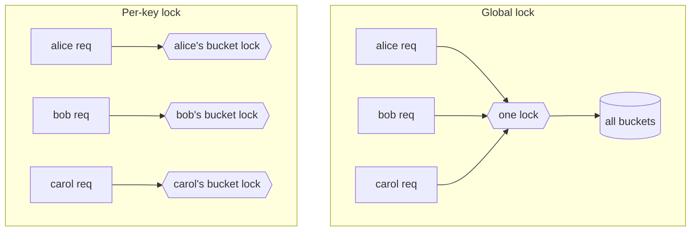

# Locks and synchronized

## 1. One-line summary

`synchronized`, `ReentrantLock`, `ReadWriteLock` and `StampedLock` are Java's ways to make a block of code run **one thread at a time** (or many readers / one writer), so that multi-step updates to shared state can't interleave.

## 2. The problem it solves

A token bucket's `tryAcquire` reads `tokens` and `lastRefill`, computes a refill, compares, and writes both fields back. If two threads run that sequence at the same time, they can both see "1 token left" and both let a request through. That's a **race condition** (explained in [thread-safety-basics](../../concepts/thread-safety-basics.md)).

A lock turns the sequence into a **critical section**: only one thread inside at a time, and whatever the previous thread wrote is visible to the next one. Think of it like a deploy lock in CI — only one pipeline may touch prod at once.

## 3. How it works

### synchronized

```java
final class TokenBucket {
    private final long capacity;
    private final double refillPerNano;
    private double tokens;
    private long lastRefillNanos;

    TokenBucket(long capacity, double refillPerSecond, long nowNanos) {
        this.capacity = capacity;
        this.refillPerNano = refillPerSecond / 1e9;
        this.tokens = capacity;
        this.lastRefillNanos = nowNanos;
    }

    synchronized boolean tryAcquire(long nowNanos) {   // lock = this object
        tokens = Math.min(capacity, tokens + (nowNanos - lastRefillNanos) * refillPerNano);
        lastRefillNanos = nowNanos;
        if (tokens < 1) return false;
        tokens -= 1;
        return true;
    }
}
```

- Every Java object has a built-in **monitor**. `synchronized` methods lock `this`; `synchronized (obj) { }` locks `obj`.
- Released automatically when the block exits, even on exception.
- **Reentrant**: the same thread can enter again without deadlocking itself.
- Entering/leaving creates a **happens-before** edge: writes before unlock are visible after the next lock.

### ReentrantLock

Same guarantees, but an explicit object with extra features:

```java
import java.util.concurrent.TimeUnit;
import java.util.concurrent.locks.ReentrantLock;

private final ReentrantLock lock = new ReentrantLock();        // new ReentrantLock(true) = fair

boolean tryAcquire(long nowNanos) throws InterruptedException {
    if (!lock.tryLock(5, TimeUnit.MILLISECONDS)) {
        return false;                // couldn't get the lock quickly: fail fast, reject
    }
    try {
        // ... same body as above ...
        return true;
    } finally {
        lock.unlock();               // ALWAYS in finally
    }
}
```

- `tryLock()` / `tryLock(timeout)` — give up instead of waiting forever.
- `lockInterruptibly()` — waiting can be cancelled by interrupt.
- **Fairness** (`new ReentrantLock(true)`) — longest waiter goes next. Prevents starvation but is noticeably slower; default is unfair.
- `Condition` objects (`lock.newCondition()`) for wait/notify-style coordination.

### ReadWriteLock and StampedLock

- `ReentrantReadWriteLock`: many readers at once **or** one writer. Helps only when reads are much more frequent than writes and reads are not trivial.
- `StampedLock` (Java 8): adds **optimistic reads** — read without locking, then `validate(stamp)` to check no writer intervened; retry with a real read lock if one did. Fast, but **not reentrant** and easy to misuse.

A rate limiter's `tryAcquire` **always writes** (it consumes a token or updates the window), so read/write locks give no benefit there. They fit "config that's read on every request but changed rarely" — e.g. the rule table mapping endpoint → limit.

### Lock granularity: global vs per-key



```java
// BAD: one lock for every user
public synchronized boolean tryAcquire(String key) {
    TokenBucket b = buckets.computeIfAbsent(key, k -> newBucket());
    return b.tryAcquire(clock.nanoTime());
}
```

With a global lock, 64 request threads on a 16-core box run **one at a time**. Alice's request waits behind Bob's even though they share no state. Throughput is capped at 1 / (time inside the lock), no matter how many cores you add — just like pointing every service at one database connection.

```java
// GOOD: map is concurrent, each bucket locks itself
public boolean tryAcquire(String key) {
    TokenBucket b = buckets.computeIfAbsent(key, k -> newBucket()); // CHM, per-bin
    return b.tryAcquire(clock.nanoTime());                           // synchronized on b
}
```

Now only requests for the **same key** contend, which is rare and exactly the contention you need. See [concurrent-hashmap](concurrent-hashmap.md).

### Virtual threads (Java 21) and pinning

Virtual threads are cheap JVM-managed threads mounted on a small pool of OS **carrier** threads. When a virtual thread blocks (I/O, `lock.lock()`), it unmounts and frees the carrier.

In **Java 21**, a virtual thread that blocks **while inside a `synchronized` block** cannot unmount — it is **pinned** to its carrier. Enough pinned threads and the carrier pool is exhausted; everything stalls. `ReentrantLock` does not pin. Detect pinning with `-Djdk.tracePinnedThreads=full` (Java 21).

**JDK 24 (JEP 491)** removed this limitation for `synchronized` in most cases. For a short, CPU-only critical section like a token bucket, pinning doesn't matter either way (nothing blocks inside). It matters when you hold a monitor during I/O.

## 4. When to use it

- `synchronized`: default for short critical sections guarding a few fields. Least code, least to get wrong.
- `ReentrantLock`: need `tryLock`/timeouts, interruptible waits, fairness, multiple conditions, or you're on Java 21 virtual threads and might block while holding the lock.
- `ReadWriteLock`: read-mostly data with non-trivial reads.
- `StampedLock`: measured hot read path, and you're comfortable with optimistic validation.

## 5. When NOT to use it

- **A single counter** — use an [atomic](atomics-and-cas.md); a lock is heavier than needed.
- **Around I/O or remote calls** — holding a lock while waiting on the network turns one slow dependency into a whole-service stall.
- **One lock for unrelated data** (global lock above) — kills throughput.
- **Across processes/pods** — a JVM lock means nothing to another pod. Use Redis atomic ops, not a distributed lock, for rate limiting.
- **Fair locks "just to be safe"** — fairness costs throughput; use it only for a real starvation problem.

## 6. Commonly confused with

| | `synchronized` | `ReentrantLock` | `ReentrantReadWriteLock` | `StampedLock` |
|---|---|---|---|---|
| Syntax | keyword, auto-release | explicit `lock()`/`unlock()` in `finally` | read lock + write lock | stamps (`long`) |
| Reentrant | yes | yes | yes | **no** |
| `tryLock` / timeout | no | yes | yes | yes |
| Fairness option | no | yes | yes | no |
| Concurrent readers | no | no | yes | yes (+ optimistic) |
| Virtual-thread pinning (Java 21) | yes, if blocking inside | no | no | no |
| Typical use | small critical sections | needs timeouts/fairness | read-mostly config | hot read-mostly paths |

## 7. Common mistakes / misuse

1. **Forgetting `unlock()` in `finally`.** One exception and the lock is held forever.
2. **Locking on different objects.** `synchronized` in one method, `lock.lock()` in another, guarding the same fields — they don't exclude each other.
3. **Locking on a shared/public object** (`synchronized ("key")`, `synchronized (Integer.valueOf(1))`, a boxed value or interned string). Unrelated code may lock the same object.
4. **Lock ordering deadlocks.** Thread 1 locks A then B; thread 2 locks B then A. Always acquire multiple locks in a fixed order.
5. **Synchronizing only the writer.** Readers without the lock may see stale or half-written values.
6. **Global lock in an interview answer** for a per-user limiter. Interviewers specifically look for per-key granularity.
7. **Using `StampedLock` reentrantly** — it deadlocks.

## 8. Interview cheat-sheet

- "Each bucket guards its own state with `synchronized`; the registry is a `ConcurrentHashMap`, so only requests for the same key contend."
- "A global lock would serialize all users and cap throughput regardless of core count — I'd avoid that."
- "I'd switch to `ReentrantLock` if I needed `tryLock` with a timeout or fairness, or to avoid virtual-thread pinning on Java 21 if anything inside could block."
- "Read-write locks don't help here because every `tryAcquire` writes; they fit the rarely-changing rules config."
- "Locks are per-JVM; for multiple instances I'd keep the counters in Redis with atomic scripts."

## 9. Used in

- [LLD: Design a Rate Limiter](../../interviews/rate-limiter/README.md) — per-bucket `synchronized` / `ReentrantLock`, lock granularity discussion.
- [LLD: Design a Parking Lot](../../interviews/parking-lot/README.md) — per-floor locks as an alternative to lock-free spot claims; lock granularity (whole lot vs per floor vs per spot).
- [LLD: Design an LRU Cache](../../interviews/lru-cache/README.md) — `SynchronizedCache` (one lock; even `get` must lock because it reorders the list) vs `StripedCache` (N segments, each with its own lock) for lock striping.
- [LLD: Design an Elevator System](../../interviews/elevator-system/README.md) — the design that avoids locks on elevator state: a single simulation thread owns it (see [single-writer-principle](../../concepts/single-writer-principle.md)); locks only as the thread-per-elevator alternative.
- [LLD: Design Splitwise](../../interviews/splitwise/README.md) — per-group locking: appends to one group's ledger are serialised, different groups proceed in parallel (lock granularity again).
- [LLD: Design a Movie Ticket Booking System](../../interviews/movie-booking/README.md) — `LockingSeatInventory`: one lock per show around all-or-nothing `holdSeats`/`confirmBooking`; why per-seat locks need a global lock order ([deadlocks-and-lock-ordering](../../concepts/deadlocks-and-lock-ordering.md)).
- [Task Scheduler](../../interviews/task-scheduler/README.md): `ReentrantLock` + `Condition.awaitNanos` so the dispatcher sleeps until the earliest task, and `signal()` when a new earlier task arrives (the classic oversleeping bug).
- [Thread Pool / Connection Pool](../../interviews/thread-pool/README.md): a **fair** lock + condition so connection-pool waiters are served first-come-first-served, with a borrow timeout.
