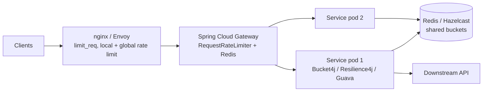

# Production Rate-Limit Libraries (Guava, Bucket4j, Resilience4j, gateways)

## 1. One-line summary

In production you almost never hand-write a rate limiter: you pick a **library** (Guava `RateLimiter`, Bucket4j, Resilience4j) inside the service, or enforce limits at the **infrastructure layer** (Spring Cloud Gateway, Envoy, nginx `limit_req`) before traffic reaches it.

## 2. The problem it solves

The interview version of a rate limiter is ~150 lines. A production one also needs: correct behavior across many pods, persistence of state, metrics, configuration per route/tenant, burst handling, warm-up, fail-open/fail-closed policy when the backing store is down, and years of edge-case fixes. Writing that yourself is undifferentiated work with a lot of ways to go subtly wrong.

Libraries and proxies give you a battle-tested implementation; your job becomes picking **where** to enforce and **what** limits to set.

## 3. How it works

### Where each option sits



Edge limits protect the fleet from floods; in-service limits protect specific resources (a DB, a paid third-party API) and implement per-tenant business rules.

### Guava `RateLimiter` (single JVM)

```java
// com.google.common.util.concurrent.RateLimiter
RateLimiter limiter = RateLimiter.create(100.0);                 // 100 permits/s, "SmoothBursty"
if (limiter.tryAcquire()) { handle(); } else { reject(); }

RateLimiter warm = RateLimiter.create(100.0, Duration.ofSeconds(10)); // "SmoothWarmingUp"
```

- **SmoothBursty**: a token bucket that can save up about one second's worth of unused permits.
- **SmoothWarmingUp**: after idling, the rate ramps up over the warm-up period — good when the protected thing (a cold cache, a JIT-cold service) needs time.
- `acquire()` **blocks** until a permit is available (client-side throttling); `tryAcquire()` doesn't.
- One instance = one limit. **No per-key support, no distributed mode.** Still marked `@Beta`. Best for "don't call this downstream more than N/s from this process".

### Bucket4j (token bucket, local or distributed)

```java
// io.github.bucket4j (8.x API)
Bucket bucket = Bucket.builder()
        .addLimit(limit -> limit.capacity(50).refillGreedy(10, Duration.ofSeconds(1)))
        .build();

ConsumptionProbe probe = bucket.tryConsumeAndReturnRemaining(1);
if (probe.isConsumed()) {
    // allowed; probe.getRemainingTokens() → RateLimit-Remaining header
} else {
    long retryAfterNanos = probe.getNanosToWaitForRefill();  // → Retry-After header
}
```

- Pure token bucket with multiple bandwidths (e.g. 10/s **and** 1000/hour on one bucket).
- **Distributed backends**: Redis (Lettuce, Redisson, Jedis), Hazelcast, Infinispan, Apache Ignite, any JCache (JSR-107) provider, and JDBC databases. Buckets are keyed, so per-user limits across pods work out of the box; updates use compare-and-swap or server-side scripts on the store.
- Integrations for Spring Boot, Quarkus and others.

### Resilience4j `RateLimiter`

```java
RateLimiterConfig config = RateLimiterConfig.custom()
        .limitForPeriod(10)
        .limitRefreshPeriod(Duration.ofSeconds(1))
        .timeoutDuration(Duration.ofMillis(0))     // don't wait, fail immediately
        .build();
RateLimiter rl = RateLimiter.of("paymentsApi", config);
Supplier<String> guarded = RateLimiter.decorateSupplier(rl, () -> callPayments());
```

- Fixed-period permits (per-cycle refresh), in-process only.
- Part of a resilience toolkit with **CircuitBreaker, Retry, Bulkhead, TimeLimiter** — the same decorator style (see [design-patterns](../../concepts/design-patterns.md)) and Micrometer metrics. Best for protecting outbound calls.

### Infra layer

- **nginx `limit_req`**: leaky-bucket per key (often `$binary_remote_addr`), configured in `limit_req_zone`, with `burst` and `nodelay`. Per nginx instance; returns 503 by default — set `limit_req_status 429;`.
- **Envoy**: *local* rate limit filter (token bucket per instance) and *global* rate limit via an external gRPC rate-limit service (backed by Redis). Common in Istio meshes.
- **Spring Cloud Gateway**: `RequestRateLimiter` filter with `RedisRateLimiter` (token bucket in a Redis Lua script), key chosen by a `KeyResolver` bean (user, API key, IP).
- Also: cloud API gateways (AWS API Gateway usage plans, Kong, Cloudflare).

## 4. When to use it

- **Almost always in production.** Pick by scope:
  - Throttle my own outbound calls from one process → Guava or Resilience4j.
  - Per-user/tenant limits across a fleet → Bucket4j + Redis, or gateway + Redis.
  - Coarse flood protection by IP → nginx/Envoy/cloud edge.
- **Write your own** only for: interviews, learning, or a genuinely unusual algorithm/requirement no library supports (and even then, build on Redis primitives).

## 5. When NOT to use it

- **Guava/Resilience4j for per-user limits across pods** — each pod enforces its own copy; with 10 pods a "100/min" limit becomes ~1000/min. That's a correctness bug, not a tuning issue.
- **A distributed backend when one instance suffices** — every request now does a network round-trip to Redis; you've added latency and a new failure mode for nothing.
- **Only edge limits for business rules** — nginx doesn't know tenant plans; pricing-tier limits belong in the app or gateway with auth context.
- **Only in-app limits for floods** — by the time a request reaches your JVM, it has already cost TLS, parsing and a thread.
- **Pulling in a library in an LLD interview** — the interviewer wants to see you design it. Mention the library as "what I'd use in prod".

## 6. Commonly confused with

| | Guava RateLimiter | Bucket4j | Resilience4j RateLimiter | nginx / Envoy / SCG |
|---|---|---|---|---|
| Algorithm | smooth token bucket (+ warm-up) | token bucket, multiple bandwidths | fixed period permits | leaky bucket (nginx), token bucket (Envoy, SCG) |
| Per-key | no (one per instance) | yes | per named instance | yes (configured key) |
| Distributed | no | yes (Redis, Hazelcast, JCache, JDBC) | no | Envoy global / SCG via Redis; nginx per instance |
| Blocking wait | `acquire()` | optional | `timeoutDuration` | nginx `burst` queueing |
| Best for | client-side throttling | API per-user limits | protecting outbound calls | edge protection |

## 7. Common mistakes / misuse

1. **Per-pod limits mistaken for global limits** — divide the limit by pod count only as a rough hack; autoscaling breaks it.
2. **Using `acquire()` (blocking) on request threads** — under load every thread waits and the server stops accepting work. Use `tryAcquire` and return 429.
3. **No fail-open/fail-closed decision** when Redis is down. Usually fail **open** for user-facing traffic (allow, alert) and **closed** for protecting a fragile paid dependency.
4. **Keying by IP behind a load balancer** without trusting `X-Forwarded-For` correctly — every user shares the LB's IP (see [express-middleware](../js/express-middleware.md)).
5. **Forgetting the response contract** — no `Retry-After`, clients retry immediately and amplify load.
6. **Stacking limits without documenting them** (nginx + gateway + app), then nobody knows which one returned 429.

## 8. Interview cheat-sheet

- "In an interview I'll build it from scratch; in production I'd use Bucket4j with a Redis backend for per-user limits across pods."
- "Guava's `RateLimiter` is a smooth token bucket with an optional warm-up, but it's single-instance and not per-key — good for throttling my own calls to a downstream."
- "Resilience4j fits outbound protection alongside circuit breakers and retries."
- "Coarse IP-based flood protection belongs at the edge — nginx `limit_req` or Envoy — so bad traffic never reaches the JVM."
- "Whatever the layer, the response is 429 with `Retry-After`, and I decide explicitly whether to fail open or closed when the shared store is down."

## 9. Used in

- [LLD: Design a Rate Limiter](../../interviews/rate-limiter/README.md) — "what would you use in production?" follow-up.
