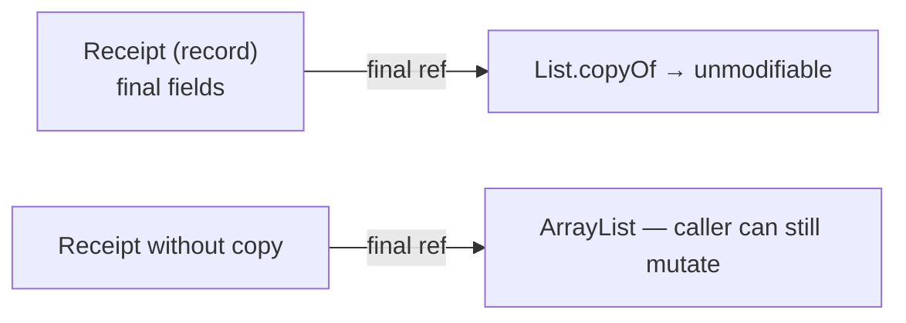

# Records and Immutability

## 1. One-line summary

A Java `record` (Java 16+) is a compact way to declare a **transparent, shallowly immutable data carrier**: you list the fields, and the compiler generates the constructor, accessors, `equals`, `hashCode` and `toString` from them.

## 2. The problem it solves

A simple value class like "a vehicle with a plate and a type" used to take ~50 lines: private final fields, constructor, getters, `equals`, `hashCode`, `toString`. People forgot to update `equals` when adding a field, or skipped `hashCode`, and `HashSet` lookups quietly broke. Lombok papered over it with annotations.

Records make the intent explicit — "this is just data, compared by value" — in one line:

```java
public record Vehicle(String licensePlate, VehicleType type) {}
```

Immutability matters beyond boilerplate. An immutable `Ticket` can be handed to the display board thread, the payment thread and the audit log **without any locking**, because nobody can change it. It's the same reason infra prefers immutable container images over SSH-ing in to patch a box: what you deployed is what is running.

## 3. How it works

For `record Ticket(String id, Vehicle vehicle, ParkingSpot spot, Instant entryTime)` the compiler generates:

- `private final` fields for each component; the class is implicitly `final` (no subclassing).
- A **canonical constructor** taking all components in order.
- Accessors named after the component: `ticket.id()`, not `getId()`.
- `equals`/`hashCode` comparing **all components** (using each component's own `equals`); `toString` like `Ticket[id=T1, ...]`.

Records can have static methods, instance methods, static fields, and implement interfaces. They **cannot** declare extra instance fields or extend a class.

### Compact constructor — validate and normalise

```java
import java.time.Instant;
import java.util.List;
import java.util.Objects;

public record Vehicle(String licensePlate, VehicleType type) {
    public Vehicle {                                   // compact: no parameter list
        Objects.requireNonNull(type, "type");
        if (licensePlate == null || licensePlate.isBlank())
            throw new IllegalArgumentException("plate required");
        licensePlate = licensePlate.replace(" ", "").toUpperCase();  // reassign the parameter
    }                                                  // fields are assigned after this body
}
```

Normalising in the constructor means `new Vehicle("ka 01 ab 1234", CAR).equals(new Vehicle("KA01AB1234", CAR))` is `true`.

### Shallow immutability and defensive copies

A record's fields are `final`, but `final` only freezes the **reference**, not the object it points to:

```java
public record Receipt(String ticketId, List<String> lineItems) {}

var items = new java.util.ArrayList<String>(List.of("3h CAR"));
var r = new Receipt("T1", items);
items.add("free car wash");      // r.lineItems() now has 2 items — the "immutable" receipt changed
r.lineItems().clear();           // also allowed
```

Fix with a defensive copy:

```java
public record Receipt(String ticketId, List<String> lineItems, java.math.BigDecimal amount) {
    public Receipt {
        lineItems = List.copyOf(lineItems);    // unmodifiable copy; also rejects nulls
    }
}
```

`List.copyOf` returns the same instance if it's already an unmodifiable list, so it's cheap to call. Components that are already immutable (`String`, `Instant`, `BigDecimal`, enums, other records) need no copy.



### Record vs class: entity vs value

```java
// Value: identity = its data. Two equal tickets ARE the same ticket.
public record Ticket(String id, Vehicle vehicle, ParkingSpot spot, Instant entryTime) {}

// Entity: has identity and changing state. NOT a record.
public final class ParkingSpot {
    private final String id;
    private final SpotSize size;
    private final java.util.concurrent.atomic.AtomicBoolean occupied = new java.util.concurrent.atomic.AtomicBoolean();

    public ParkingSpot(String id, SpotSize size) { this.id = id; this.size = size; }
    public boolean tryOccupy() { return occupied.compareAndSet(false, true); }
    public void release()      { occupied.set(false); }
    public String id()         { return id; }
    public SpotSize size()     { return size; }
}
```

`ParkingSpot` changes over time (free → occupied → free) but is still "spot F2-17". If it were a record with an `occupied` component, freeing it would mean creating a *new* spot object, and every map/set holding the old one would be stale. Entities like this should usually base `equals` on their `id` only, or keep the default identity `equals` (see [oop-modeling](../../concepts/oop-modeling.md)).

Note `Ticket` holds a reference to a mutable `ParkingSpot`; the ticket is still a fine value ("which spot") — just don't rely on the spot's *state* being frozen. And because a record can't change, the ticket's lifecycle status (ACTIVE → PAID → EXITED) is tracked *next to* it (e.g. a `Map<String, TicketStatus>` in the lot, or by replacing the record with a copy that has the new status) — or, if the ticket accumulates a lot of changing state, it graduates to being a class.

## 4. When to use it

- Values: `Vehicle`, `Ticket`, `Receipt`, `Money`, config snapshots (`LimiterConfig`), DTOs/API responses, events published to observers.
- Map keys and set elements — correct `equals`/`hashCode` for free.
- Returning multiple values from a method (`record FeeBreakdown(BigDecimal base, BigDecimal discount)`).
- Immutable snapshots swapped atomically via `AtomicReference` (see [atomics-and-cas](atomics-and-cas.md)).

## 5. When NOT to use it

- **Entities with identity and mutable state** — `ParkingSpot`, `ParkingFloor`, `ParkingLot`, a bank `Account`. A record would make you either expose mutation (breaking the "data carrier" contract) or recreate objects on each change.
- **JPA/Hibernate entities** — they need a no-arg constructor, mutable fields and proxies; records don't fit.
- **When you need to hide representation** — record accessors expose every component publicly; that's the point ("transparent").
- **Inheritance hierarchies** — records are final; use a `sealed interface` with record implementations instead.

## 6. Commonly confused with

| | `record` | regular `final` class | Lombok `@Value` | `enum` |
|---|---|---|---|---|
| Boilerplate | none | all by hand | none (annotation processor) | none |
| Immutable | shallow | if you make it so | shallow | should be |
| `equals` | all components | identity unless overridden | all fields | identity (one instance each) |
| Extra instance fields | no | yes | yes | yes |
| Can extend a class | no | yes | yes | no |
| Number of instances | unlimited | unlimited | unlimited | fixed |

## 7. Common mistakes / misuse

1. **Assuming deep immutability** — storing a caller's `ArrayList` or array directly. Use `List.copyOf` / `array.clone()` (and clone again in the accessor for arrays).
2. **Arrays as components** — `equals` compares array *references*, so two records with equal byte arrays aren't equal. Prefer `List`.
3. **Validation in a non-compact canonical constructor that forgets to assign a field** — use the compact form.
4. **Making mutable entities records** and then "updating" by `new Spot(id, size, true)` scattered around.
5. **Putting a record with a mutable component in a `HashSet`** and then mutating the component — its `hashCode` changes and the set can't find it.
6. Overriding accessors to return something different from the component — legal but surprising; keep accessors honest.

## 8. Interview cheat-sheet

- "`Vehicle`, `Ticket` and `Receipt` are records — they're values, compared by their data, and safe to share across threads."
- "`ParkingSpot` is a class: it has identity and its occupied state changes, which a record shouldn't model."
- "I validate and normalise in the compact constructor — e.g. the plate is uppercased so equality works."
- "Records are only shallowly immutable, so list components get `List.copyOf`."
- "Immutable values mean the display board or audit thread can read a ticket with no locks."

## 9. Used in

- [LLD: Design a Parking Lot](../../interviews/parking-lot/README.md) — `Vehicle`, `Ticket`, `Receipt` as records; `ParkingSpot` / `ParkingFloor` / `ParkingLot` as classes.
- Related: [enums-and-enummap](enums-and-enummap.md), [bigdecimal-and-money](bigdecimal-and-money.md), [oop-modeling](../../concepts/oop-modeling.md).
