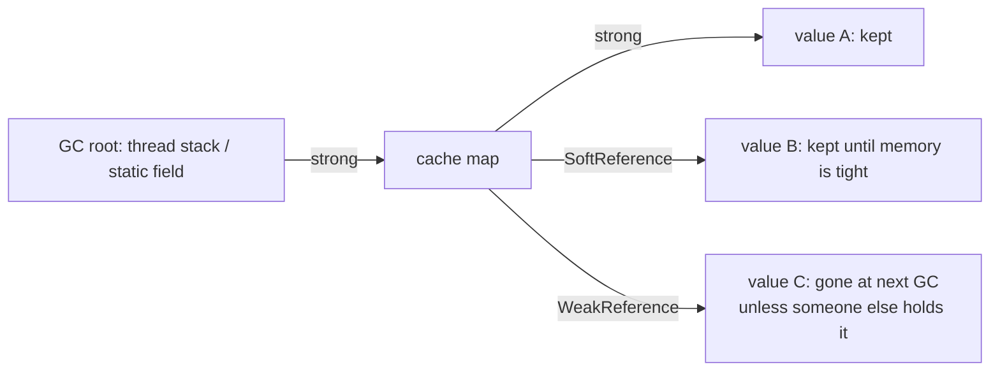

# References and GC (strong, soft, weak, phantom; WeakHashMap; caches on the heap)

## 1. One-line summary

`java.lang.ref` lets you hold an object **without forcing the garbage collector (GC — the JVM component that frees memory no live code can reach) to keep it alive**; it explains `WeakHashMap`, why "let the GC manage my cache" sounds clever but fails in practice, and why big in-process caches hurt GC.

## 2. The problem it solves

Normally, if any variable or collection points at an object, the GC must keep it. That's a **strong reference**. For caches this creates a tension:

- A cache that holds everything strongly grows until `OutOfMemoryError` (OOM) — the pod gets OOM-killed, k8s restarts it, you get paged.
- A cache that drops entries too eagerly gives a low hit rate.

Java offers weaker kinds of references so that *something* (the GC) can drop entries for you. Knowing what each kind does — and why the "obvious" use for caches is a trap — is a common senior-level follow-up after you design an [LRU cache](../../interviews/lru-cache/README.md).

## 3. How it works

| Kind | Class | When the GC may clear it | Typical use |
|---|---|---|---|
| **Strong** | normal variable | never, while reachable | everything |
| **Soft** | `SoftReference<T>` | only when the JVM is **low on memory** (exact rule is GC-specific) | "memory-sensitive caches" — but see section 5 |
| **Weak** | `WeakReference<T>` | at the **next GC** once no strong refs remain | metadata attached to objects someone else owns (`WeakHashMap`, listeners) |
| **Phantom** | `PhantomReference<T>` | after the object is finalized; `get()` always returns `null` | cleanup actions after death — use `java.lang.ref.Cleaner` instead |

"Reachable" means: you can get from a GC root (a thread's stack variables, static fields) to the object by following strong references.



### A weak/soft reference in code

```java
import java.lang.ref.WeakReference;

public class WeakDemo {
    public static void main(String[] args) {
        Object big = new byte[10_000_000];
        WeakReference<Object> ref = new WeakReference<>(big);
        System.out.println(ref.get() != null); // true: 'big' still strongly reachable
        big = null;                            // drop the only strong reference
        System.gc();                           // a hint, not a guarantee
        System.out.println(ref.get());         // usually null now
    }
}
```

Always copy `ref.get()` into a local variable and null-check it once; the GC can clear it between two calls.

### `WeakHashMap`

`WeakHashMap<K, V>` holds its **keys** weakly. When nobody else references a key object, the GC clears it and the entry disappears on the next map operation. It's for "attach extra data to an object I don't own, without keeping that object alive" — e.g. per-`ClassLoader` or per-`Thread` metadata.

Traps:

- **Values are strong.** If the value references its own key (`map.put(conn, new Info(conn))`), the key is never collectible → leak.
- **Keys use `equals`/`hashCode`, but liveness is by identity.** `String` literals and boxed small `Integer`s are interned/cached and never die, so those entries never go.
- **It is not an LRU or size-bounded cache.** Eviction depends on *who else* references the key, not on recency or size.
- **Not thread-safe.** Wrap it or use Caffeine's `weakKeys()`.

### Why soft-reference caches are a bad idea in practice

"Cache values in `SoftReference`s and the JVM will free them only if memory runs out" sounds perfect. In production:

1. **GC decides, not you.** HotSpot clears soft refs based on how long since each was last used and how much free heap there is (`-XX:SoftRefLRUPolicyMSPerMB`). You can't reason about hit rate, and it varies by GC (G1, ZGC, Parallel).
2. **They're cleared in bulk.** When the heap gets tight, the GC may drop *most* soft refs at once → hit rate falls off a cliff → every request hits the DB at the worst moment (a self-made stampede).
3. **Heap always looks full.** The cache grows to fill the heap, so your heap-usage alerts and autoscaling signals become useless, and full GCs get longer.
4. **Extra GC work.** Each reference object is something the GC must track and process.

Better: an explicit bound (`maximumSize` / `maximumWeight` in [Caffeine](caffeine-and-guava-cache.md)) that you size from metrics.

### Heap sizing and GC pressure

Rough per-entry cost for a `Map<String, String>` cache with ~20-char keys/values (64-bit JVM, compressed pointers):

- `HashMap.Node` ~32 B + key `String` ~64 B + value `String` ~64 B + table slot ~4–8 B ≈ **~165 B**, plus two list pointers for an LRU (~8 B), so call it **~170 B per entry**.
- 1,000,000 entries × 170 B = 170,000,000 B ≈ **170 MB** — for data whose raw text is only 1,000,000 × 40 chars ≈ 40 MB.

Consequences:

- **Size the heap for the cache plus normal working memory**, and set the container memory limit above `-Xmx` (metaspace, threads, direct buffers live outside the heap).
- **Millions of small long-lived objects** are expensive for the GC: they get promoted to the old generation and every marking cycle must traverse them. More entries → longer or more frequent pauses → p99 latency spikes.
- Prefer **bounding by weight**, compact values (primitive arrays, `byte[]` instead of object graphs), and measure with heap dumps / `jcmd GC.class_histogram`.

### Off-heap caches, briefly

Off-heap means storing bytes in memory **outside** the Java heap (`ByteBuffer.allocateDirect`, or `MemorySegment` in the Java 22+ Foreign Memory API). The GC doesn't scan it, so huge caches don't cause pauses. The price: you must **serialize** every value in and out (CPU cost, no shared objects), manage memory yourself, and debugging is harder. Libraries: Ehcache off-heap tier, Chronicle Map, or OHC. Often the simpler answer is "put it in Redis" (see [HLD: Redis](../../../HLD/technologies/redis.md)).

## 4. When to use it

- `WeakReference` / `WeakHashMap` for **metadata tied to an object's lifetime** that you don't own.
- `Cleaner` (phantom-based) to release native resources as a safety net — in addition to `close()`.
- Caffeine's `weakKeys()` for identity-keyed caches (keys compared by `==`).
- Heap-sizing math whenever you propose an in-process cache in a design.

## 5. When NOT to use it

- **Soft references as your cache eviction policy** — unpredictable hit rate, bulk clearing, full-looking heap (above).
- **`WeakHashMap` as a general cache** — keys like `String` ids are held elsewhere or interned, so nothing is evicted; or nothing holds them and everything is evicted immediately.
- **Phantom references / `finalize()` for normal cleanup** — use try-with-resources. `finalize` is deprecated for removal.
- **Off-heap for small caches** — the serialization cost outweighs the GC savings below a few GB.

## 6. Commonly confused with

| | Strong-ref bounded cache (Caffeine) | `SoftReference` values | `WeakHashMap` | Off-heap cache |
|---|---|---|---|---|
| Who evicts | your policy (size/TTL) | GC under memory pressure | GC when key unreachable | your policy |
| Predictable hit rate | yes | no | no | yes |
| GC cost | proportional to entries | higher (ref processing) | moderate | very low |
| Serialization needed | no | no | no | yes |
| Good for | most caches | rarely anything | object-lifetime metadata | multi-GB caches |

## 7. Common mistakes / misuse

1. **Unbounded `static Map` as a cache** — the classic memory leak; strong refs from a static field live forever.
2. **Calling `ref.get()` twice** and assuming the second call returns the same thing.
3. **`WeakHashMap` whose values reference keys** → never collected.
4. **Relying on `System.gc()`** — it's a hint, may be disabled (`-XX:+DisableExplicitGC`), and triggers a full GC in some collectors.
5. **Sizing the cache by entry count when values vary 100×** — one count limit can mean 10 MB or 1 GB. Use a weigher.
6. **Setting the container memory limit equal to `-Xmx`** → the kernel OOM-kills the pod because non-heap memory pushes it over.

## 8. Interview cheat-sheet

- "Java has strong, soft, weak and phantom references; only strong ones keep an object alive unconditionally."
- "`WeakHashMap` holds keys weakly — it's for attaching data to objects whose lifetime someone else controls, not for an LRU cache."
- "I wouldn't build a cache on soft references: the GC clears them unpredictably and in bulk, so the hit rate collapses exactly when the system is under memory pressure. I'd rather set an explicit size or weight bound."
- "A million small entries is roughly 150–200 MB of heap and a lot of GC marking work, so I'd size the heap for it and bound by weight; for multi-GB data I'd go off-heap or to Redis."

## 9. Used in

- [LLD: Design an LRU Cache](../../interviews/lru-cache/README.md) — follow-ups on memory: why the cache needs an explicit bound, heap cost per entry, and why soft references aren't a substitute for an eviction policy.
- Related: [caffeine-and-guava-cache](caffeine-and-guava-cache.md), [linkedhashmap](linkedhashmap.md), [cache-eviction-policies](../../concepts/cache-eviction-policies.md).
