# ScheduledExecutorService

## 1. One-line summary

`ScheduledExecutorService` runs tasks **after a delay** or **periodically** on a managed pool of threads — the JDK's in-process cron.

## 2. The problem it solves

Rate limiters create one bucket per key. Users come and go; without cleanup the map grows forever (a slow memory leak that shows up as an OOM-kill weeks later). You need a background job: "every minute, remove buckets idle for 10 minutes".

The naive options are bad:

- **`new Thread(() -> { while (true) { work(); Thread.sleep(60_000); } })`** — no clean shutdown, no error handling, one exception and the thread dies silently, and you've hand-rolled a scheduler.
- **`java.util.Timer`** — a single thread; if one task throws, the **whole Timer dies** and all its tasks stop. It also schedules on wall-clock time, so system clock changes affect it.

`ScheduledExecutorService` gives a thread pool, proper lifecycle (`shutdown`), and monotonic-time scheduling.

## 3. How it works

```java
import java.util.concurrent.*;

ScheduledExecutorService scheduler = Executors.newSingleThreadScheduledExecutor(r -> {
    Thread t = new Thread(r, "rate-limiter-evictor");
    t.setDaemon(true);                // don't keep the JVM alive just for cleanup
    return t;
});

ScheduledFuture<?> handle = scheduler.scheduleWithFixedDelay(
        this::evictIdleKeys,          // task
        1, 1, TimeUnit.MINUTES);      // initial delay, delay between runs
```

Internally a `ScheduledThreadPoolExecutor` keeps tasks in a **delay queue** ordered by next run time (measured with `System.nanoTime`, see [time-and-clock](time-and-clock.md)). Worker threads sleep until the head task is due, run it, and, for periodic tasks, put it back with the next time.

### scheduleAtFixedRate vs scheduleWithFixedDelay

```mermaid
gantt
    dateFormat  s
    axisFormat  %S
    section FixedRate (period 10s)
    run 1 (4s)   :a1, 0, 4s
    run 2 (4s)   :a2, 10, 4s
    run 3 (4s)   :a3, 20, 4s
    section FixedDelay (delay 10s)
    run 1 (4s)   :b1, 0, 4s
    run 2 (4s)   :b2, 14, 4s
    run 3 (4s)   :b3, 28, 4s
```



| | `scheduleAtFixedRate(task, init, period, unit)` | `scheduleWithFixedDelay(task, init, delay, unit)` |
|---|---|---|
| Next start | `start + n * period` | previous **end** + delay |
| If a run is slow | next run starts late, then runs **back-to-back** to catch up | always a full gap after each run |
| Overlap | never (same task doesn't run concurrently) | never |
| Good for | metrics flush every 10 s exactly, heartbeats | cleanup / sweeping, anything where a breather matters |

For an eviction sweeper use **fixed delay**: if a sweep is slow (huge map), you don't want sweeps stacking up.

### Swallowed exceptions kill the schedule

If a periodic task **throws**, the executor stores the exception in the `ScheduledFuture` and **silently cancels all future runs**. No log line, nothing — your evictor just stops, and memory grows until the pod is OOM-killed.

```java
private void evictIdleKeysSafely() {
    try {
        evictIdleKeys();
    } catch (Throwable t) {             // catch everything; this task must survive
        System.err.println("evictor failed: " + t);   // use your logger + a metric
    }
}
scheduler.scheduleWithFixedDelay(this::evictIdleKeysSafely, 1, 1, TimeUnit.MINUTES);
```

### The sweeper for the rate limiter

```java
private void evictIdleKeys() {
    long now = clock.nanoTime();
    for (String key : buckets.keySet()) {
        // atomic per key: remove only if still idle at this moment
        buckets.computeIfPresent(key, (k, b) -> b.idleNanos(now) > idleTimeoutNanos ? null : b);
    }
}
```

Iterating a [ConcurrentHashMap](concurrent-hashmap.md) while other threads modify it is safe (weakly consistent iterator).

### Shutdown

```java
public void close() throws InterruptedException {
    scheduler.shutdown();                                  // no new runs; periodic tasks cancelled
    if (!scheduler.awaitTermination(5, TimeUnit.SECONDS)) {
        scheduler.shutdownNow();                           // interrupt a stuck run
    }
}
```

Make the limiter `AutoCloseable` so tests and the app can stop the thread. A non-daemon thread that's never shut down keeps the JVM from exiting — the "why does my app hang on Ctrl-C" bug. Daemon threads don't block exit, but they're killed mid-task, so only use them for work that's safe to abandon (like eviction).

### Why lazy refill beats a background refill thread

A tempting token-bucket design: a scheduled task adds tokens to every bucket every 100 ms. Don't.

| Background refill | Lazy refill on access |
|---|---|
| Work = (number of keys) × (ticks per second), even for idle keys | Work only when a request arrives |
| 1M keys × 10 ticks/s = 10M updates/s doing nothing useful | zero cost for idle keys |
| Refill granularity = tick size (100 ms jumps) | exact, computed from elapsed time |
| Refill thread contends with request threads for every bucket lock | no extra contention |
| If the scheduler stalls or dies, nobody gets tokens | nothing to stall |

Lazy refill: on each `tryAcquire`, compute `tokens = min(capacity, tokens + elapsed * rate)`. The only background job left is the cheap, infrequent **eviction** sweep.

## 4. When to use it

- Periodic housekeeping: evicting idle keys, flushing metrics, refreshing config from a file or service.
- Delayed one-shot actions: retries with backoff, timeouts.
- Anywhere you'd write a `while(true) sleep` loop.

## 5. When NOT to use it

- **Per-key or per-request timers at scale** (one scheduled task per bucket). A million tasks in a delay queue is a million objects and lots of queue churn. Do one sweep over the map instead.
- **Work that could be done lazily** — refilling tokens (above), expiring a cache entry on read.
- **Distributed / durable scheduling** — tasks live in memory and vanish on restart, and every pod runs its own copy. For "run once per cluster" use a k8s CronJob, Quartz with a DB, or a leader-elected worker.
- **Long blocking work on a tiny pool** — one stuck task delays every other task on that thread.

## 6. Commonly confused with

| | `Thread.sleep` loop | `java.util.Timer` | `ScheduledExecutorService` |
|---|---|---|---|
| Threads | the one you made | exactly one | configurable pool |
| Task throws | thread dies unless you catch | **Timer dies, all tasks stop** | that task's future runs are cancelled, others continue |
| Time base | whatever you code | wall clock (`currentTimeMillis`) | monotonic (`nanoTime`) |
| Shutdown | DIY interrupt flag | `cancel()` | `shutdown()` / `awaitTermination` / `shutdownNow()` |
| Verdict | avoid | legacy, avoid | use this |

## 7. Common mistakes / misuse

1. **Not catching exceptions in periodic tasks** — the schedule silently stops.
2. **Never calling `shutdown`** — thread leak in tests, JVM won't exit with non-daemon threads.
3. **`scheduleAtFixedRate` for slow tasks** — catch-up runs fire back-to-back after a pause (e.g. a long GC).
4. **A background thread to refill tokens** — O(keys) work forever; use lazy refill.
5. **Creating a new executor per limiter / per request** — each one is a thread. Share one.
6. **Assuming the schedule is exact** — runs can be late (GC, CPU starvation in a throttled container). Code must use real elapsed time, not "it's been one tick".

## 8. Interview cheat-sheet

- "Tokens are refilled lazily on each request from elapsed `nanoTime`, so idle keys cost nothing; the only background work is eviction."
- "A single-thread `ScheduledExecutorService` runs the evictor with `scheduleWithFixedDelay`, so slow sweeps never pile up."
- "I wrap the task body in try/catch, because an exception would silently cancel all future runs."
- "The limiter is `AutoCloseable` and shuts the scheduler down; the thread is a named daemon so it doesn't block JVM exit."
- "I'd never use `java.util.Timer` — one exception kills every task on it."

## 9. Used in

- [LLD: Design a Rate Limiter](../../interviews/rate-limiter/README.md) — idle-key eviction; lazy refill vs background refill.
- [LLD: Design a Movie Ticket Booking System](../../interviews/movie-booking/README.md) — optional sweeper that releases expired seat holds; correctness relies on lazy expiry, the sweeper is only cleanup (see [holds-reservations-and-ttl](../../concepts/holds-reservations-and-ttl.md)).
