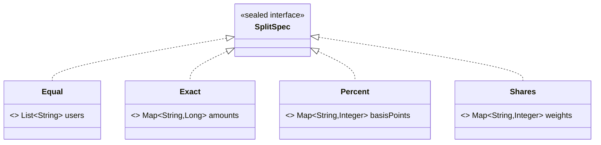

# Sealed Interfaces and Pattern Matching (Java 17–21)

## 1. One-line summary

A **sealed interface** lists exactly which types may implement it; combined with **records** and Java 21's **pattern-matching `switch`**, you get a closed set of variants ("a split is *either* Equal, Exact, Percent *or* Shares") that the compiler checks you handle completely.

## 2. The problem it solves

Splitwise lets you split an expense four ways: equally, exact amounts, percentages, or shares (weights like 2:1:1). Each variant carries *different data*. The classic options all hurt:

- **One class with nullable fields** (`type`, `amounts`, `percents`, `weights`): most fields are `null` for any given split; nothing stops `type=EQUAL` with `percents` filled in.
- **An enum** `SplitType { EQUAL, EXACT, ... }`: enum constants are singletons, so they can't carry per-expense data.
- **A plain interface** with `instanceof` chains: add a fifth split type and every `if/else instanceof` chain silently falls through to the `else`.

What you want is "one of these four shapes, each with its own fields, and a compile error if I forget one". That's what sealed interfaces + records give you.

## 3. How it works

💡 A **record** is a compact immutable data class: `record Exact(Map<String, Long> amounts)` gives you a constructor, accessor `amounts()`, `equals`, `hashCode`, `toString`. See [records-and-immutability](records-and-immutability.md).

💡 An **algebraic data type (ADT)** is just a fancy name for "a value that is exactly one of a fixed list of shapes" (a *sum* of variants), where each shape is a bundle of fields (a *product*). `SplitSpec` = `Equal` OR `Exact` OR `Percent` OR `Shares`.

```java
import java.util.*;
import java.util.stream.*;

sealed interface SplitSpec permits Equal, Exact, Percent, Shares {}

record Equal(List<String> users)               implements SplitSpec {}
record Exact(Map<String, Long> amounts)        implements SplitSpec {}   // paise per user
record Percent(Map<String, Integer> basisPoints) implements SplitSpec {} // 1 bp = 0.01%, 10000 = 100%
record Shares(Map<String, Integer> weights)    implements SplitSpec {}   // e.g. 2:1:1
```

- `sealed ... permits A, B` — only the listed types may implement it. Anyone else gets a compile error.
- Each permitted subtype must be `final`, `sealed`, or `non-sealed`. Records are implicitly `final`, so they fit perfectly.
- If all types live in the same file, you can omit `permits` and the compiler infers it.



### Exhaustive switch with pattern matching (Java 21)

Because the compiler knows the full list, a `switch` over a `SplitSpec` needs **no `default`** — and if someone adds a fifth record to `permits`, every switch that doesn't handle it **stops compiling**. That is the whole point: the compiler finds every place you need to update.

```java
// Turn any spec into weights for the largest-remainder splitter.
static Map<String, Long> weightsOf(SplitSpec spec) {
    return switch (spec) {
        case Equal(var users)   -> users.stream().collect(Collectors.toMap(u -> u, u -> 1L));
        case Exact(var amounts) -> amounts;   // weights = the amounts (validated to sum to the total)
        case Percent(var bp)    -> bp.entrySet().stream()
                .collect(Collectors.toMap(Map.Entry::getKey, e -> (long) e.getValue()));
        case Shares(var w)      -> w.entrySet().stream()
                .collect(Collectors.toMap(Map.Entry::getKey, e -> (long) e.getValue()));
    };
}
```

`case Equal(var users)` is a **record pattern** (deconstruction): it checks the type *and* pulls the fields out into variables in one step — no cast, no `e.users()` call.

### Type patterns and guards

```java
static String describe(SplitSpec spec) {
    return switch (spec) {
        case Equal e when e.users().isEmpty() -> "invalid: nobody to split with";  // guard
        case Equal(var users)  -> "equally among " + users.size();
        case Exact(var amounts) -> "exact amounts for " + amounts.keySet();
        case Percent p -> "by percent";                                          // type pattern
        case Shares s  -> "by shares";
    };
}
```

- `case Percent p` is a **type pattern**: matches the type and binds it to `p`.
- `when ...` is a **guard**: an extra condition. Put guarded cases *before* the unguarded case of the same type, or the compiler reports the guarded one as unreachable ("dominated").
- `switch` on `null` throws `NullPointerException` unless you add `case null ->`.
- Outside `switch`, `if (spec instanceof Exact(var amounts)) { ... }` works the same way.

### Why not the Visitor pattern?

💡 The **Visitor pattern** is the pre-Java-17 trick for "do a different thing per subtype without `instanceof`": each type gets `accept(Visitor v)` that calls `v.visitEqual(this)`, and every operation is a new `Visitor` class (see [design-patterns](../../concepts/design-patterns.md)). It is exhaustive too (the interface forces all `visitX` methods), but costs a lot of boilerplate. A sealed hierarchy + switch gives the same compile-time safety in a few lines.

## 4. When to use it

- A **closed set of variants you own** that rarely changes, where different code paths need different data: split types, ledger entries (`ExpenseAdded`, `SettlementRecorded`, `ExpenseReversed`), commands, API results (`Ok` / `NotFound` / `Conflict`), parser tokens.
- When you want adding a variant to be a **compile-time to-do list** of every place that must change.
- Event types in an event-sourced design (see [ledgers-and-event-sourcing](../../concepts/ledgers-and-event-sourcing.md)): the fold over events is one exhaustive switch.

## 5. When NOT to use it

- **Open extension points** — strategies or plugins other teams add without touching your code (a new pricing rule, a new notification channel). Sealing forces every new variant into your `permits` list. Use a plain interface + polymorphism (the Strategy pattern) instead.
- **Behaviour-heavy variants**: if each type mostly has *methods* rather than data, put the method on the interface and let each class implement it; a big switch elsewhere is the wrong home for that logic.
- **Variants with no data**: just use an `enum` (see [enums-and-enummap](enums-and-enummap.md)).

## 6. Commonly confused with

| | `enum` | sealed interface + records | open interface (Strategy) | Visitor |
|---|---|---|---|---|
| Set of variants | closed | closed | open | closed |
| Per-instance data | no (singletons) | yes, different per variant | yes | yes |
| Exhaustive `switch` | yes | yes | no (needs `default`) | yes, via interface methods |
| Adding a variant | edit enum | edit `permits`; compiler flags switches | just add a class | edit Visitor + every visitor |
| Adding an operation | new switch | new switch | edit every class | new Visitor class |
| Good for | status, direction | split types, events, commands | pricing rules, plugins | pre-Java-17 codebases |

Rule of thumb: **new variants often → open interface; new operations often → sealed + switch.**

## 7. Common mistakes / misuse

1. Adding `default ->` to a switch over a sealed type — it silences the compiler warning you *wanted* when a new variant arrives.
2. Putting a guarded case after the unguarded one for the same type → "this case label is dominated" compile error.
3. Forgetting that `switch (spec)` throws `NullPointerException` on `null` — validate at the boundary or add `case null`.
4. Sealing an interface that other modules are meant to implement (a plugin SPI) — you've blocked extension.
5. Leaving validation out of the records: put it in the compact constructor (e.g. `Percent` basis points must sum to 10000), so an invalid spec can't exist.
6. Mutable fields in records (`List` passed in and changed later) — copy with `List.copyOf` in the compact constructor.

## 8. Interview cheat-sheet

- "Split types are a closed set with different data, so I model `SplitSpec` as a sealed interface with four records."
- "The splitter uses an exhaustive pattern-matching switch with no `default`, so adding a fifth split type is a compile error until every switch handles it."
- "Record patterns let me deconstruct `Exact(var amounts)` without casts."
- "If other teams needed to add split types without my code changing, I'd use an open Strategy interface instead — sealing is for variants I own."
- "Before Java 17 I'd have needed the Visitor pattern for the same compile-time safety."

## 9. Used in

- [LLD: Design Splitwise](../../interviews/splitwise/README.md) — `SplitSpec` (Equal / Exact / Percent / Shares) as a sealed interface of records; the `Splitter` switches exhaustively over it. Ledger entry kinds (expense / settlement / reversal) are a natural second sealed hierarchy.
- [LLD: Design an In-Memory Key-Value Store with Transactions](../../interviews/kv-store/README.md) — the `CommandProcessor` dispatches text commands with a `switch` on the command name; a natural refactor is to parse them into a sealed interface of records (`Set`, `Get`, `Begin`, …) so a new command can't be added without the compiler forcing every `switch` to handle it.
- [Task Scheduler](../../interviews/task-scheduler/README.md): `Schedule` is a sealed interface with `Once`, `FixedRate`, `FixedDelay` and `Cron` variants, each computing its own next run time.
- [Vending Machine](../../interviews/vending-machine/README.md): `Payment` as a sealed type (Cash, UPI), handled with an exhaustive switch.
- Related: [records-and-immutability](records-and-immutability.md), [enums-and-enummap](enums-and-enummap.md), [design-patterns](../../concepts/design-patterns.md), [solid-principles](../../concepts/solid-principles.md).
