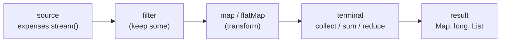

# Streams and Collectors (map / filter / reduce, groupingBy, toMap, partitioningBy)

## 1. One-line summary

A **Stream** (`java.util.stream`) is a one-shot pipeline that pulls items from a source (a list, a map's entries), passes them through steps like `filter` and `map`, and ends in a **terminal operation** (`sum`, `collect`, ...) that produces a result; **Collectors** are ready-made "how to gather the results" recipes such as "group by user and sum the amounts".

## 2. The problem it solves

In Splitwise you constantly answer questions like "how much has each person paid?" and "how much does each person owe?". The loop version works, but the *what* is buried in the *how*:

```java
Map<String, Long> paid = new HashMap<>();
for (Expense e : expenses) {
    paid.put(e.payer(), paid.getOrDefault(e.payer(), 0L) + e.total());   // easy to get subtly wrong
}
```

The stream version reads like the sentence you'd say out loud — "group expenses by payer, summing totals":

```java
Map<String, Long> paid = expenses.stream()
        .collect(Collectors.groupingBy(Expense::payer, Collectors.summingLong(Expense::total)));
```

Fewer mutable variables, fewer off-by-one or "forgot to initialise" bugs, and the intent is visible in code review.

## 3. How it works

💡 A **lambda** (`e -> e.total()`) is a short anonymous function; a **method reference** (`Expense::total`) is shorthand for a lambda that just calls one method.

A pipeline has three parts. **Intermediate operations** (`filter`, `map`, `flatMap`, `sorted`) are **lazy**: they only describe work. Nothing runs until a **terminal operation** (`collect`, `sum`, `forEach`, `count`) pulls items through. A stream can be consumed **once**; calling a second terminal operation throws `IllegalStateException`.



The examples below use these records (amounts are `long` paise — see [bigdecimal-and-money](bigdecimal-and-money.md) and [records-and-immutability](records-and-immutability.md)):

```java
record Share(String user, long paise) {}
record Expense(String id, String payer, long total, List<Share> shares) {}
```

### map / filter / reduce

```java
long groupSpend = expenses.stream().mapToLong(Expense::total).sum();          // primitive stream, no boxing
long same       = expenses.stream().map(Expense::total).reduce(0L, Long::sum); // reduce = fold with a start value
List<Expense> big = expenses.stream().filter(e -> e.total() > 1_000_00).toList(); // > ₹1000; toList() is Java 16+
```

💡 **Boxing** means wrapping a primitive `long` in a `Long` object. `mapToLong` gives a `LongStream` that avoids those allocations — prefer it for sums.

### groupingBy + summingLong: paid and owed per user

```java
import java.util.*;
import java.util.stream.*;

Map<String, Long> paid = expenses.stream()
        .collect(Collectors.groupingBy(Expense::payer, TreeMap::new, Collectors.summingLong(Expense::total)));

Map<String, Long> owed = expenses.stream()
        .flatMap(e -> e.shares().stream())          // one Expense -> many Shares
        .collect(Collectors.groupingBy(Share::user, TreeMap::new, Collectors.summingLong(Share::paise)));
```

`groupingBy(key, mapFactory, downstream)`: the **classifier** picks the bucket, the optional map factory picks the map type (`TreeMap` for sorted, deterministic output), and the **downstream collector** decides what to do with each bucket (`summingLong`, `counting()`, `toList()`, `mapping(...)`).

### toMap with a merge function: net balance per user

`toMap` throws on duplicate keys **unless you pass a merge function** that says how to combine two values for the same key:

```java
Map<String, Long> net = Stream.concat(
            paid.entrySet().stream(),
            owed.entrySet().stream().map(e -> Map.entry(e.getKey(), -e.getValue())))
        .collect(Collectors.toMap(Map.Entry::getKey, Map.Entry::getValue, Long::sum, TreeMap::new));
// paid {asha=90000, bala=30000}, owed {asha=45000, bala=45000, chen=30000}
// net  {asha=45000, bala=-15000, chen=-30000}  -> sums to 0, always

Stream.of(new Share("a", 1), new Share("a", 2))
        .collect(Collectors.toMap(Share::user, Share::paise));
// IllegalStateException: Duplicate key a (attempted merging values 1 and 2)
```

### partitioningBy: creditors vs debtors

`partitioningBy` is `groupingBy` with a yes/no question; the result always has both `true` and `false` keys.

```java
Map<Boolean, List<String>> sides = net.entrySet().stream()
        .filter(e -> e.getValue() != 0)                      // settled people are neither
        .collect(Collectors.partitioningBy(e -> e.getValue() > 0,
                 Collectors.mapping(Map.Entry::getKey, Collectors.toList())));
// {false=[bala, chen], true=[asha]}   true = is owed money (creditor)
```

### Parallel streams — a warning

`.parallelStream()` splits work across the shared **ForkJoinPool.commonPool** (one JVM-wide pool of worker threads, sized to CPU cores). It only helps for large, CPU-heavy, side-effect-free work. For a group's few hundred expenses it is slower (splitting overhead), and any blocking call inside it starves *every other* parallel stream in the JVM — like one noisy pod eating a node's CPU.

## 4. When to use it

- Aggregations over in-memory collections: totals, per-user balances, counts, grouping for reports.
- Transform-and-collect pipelines where each step is a pure function (no side effects).
- Building lookup maps (`toMap(Expense::id, e -> e)`) and splitting lists (`partitioningBy`).

## 5. When NOT to use it

- **Side effects inside lambdas** (`forEach(e -> balances.put(...))` on a shared map): you've written a loop in disguise, and with `parallel()` it becomes a race condition.
- **Logic that needs `break`, early return, or index-based access to neighbours** — a plain loop is clearer.
- **Checked exceptions** (e.g. `IOException` from a file read): lambdas in `map` can't throw them, so you end up wrapping in try/catch inside the lambda — ugly. Use a loop.
- **Hot loops in latency-critical code** (a matching engine, a per-request path hit millions of times/sec): streams allocate pipeline objects and lambdas; a `for` loop over an array is usually faster. Measure first.
- **Debugging-heavy code**: stack traces through stream internals are long, and you can't easily breakpoint "between" steps (`peek` exists, but only for debugging).

## 6. Commonly confused with

| | `for` loop | Stream + Collectors | `parallelStream()` |
|---|---|---|---|
| Style | how (step by step) | what (declarative) | what, on many threads |
| Early exit | `break` / `return` | `anyMatch`, `findFirst`, `takeWhile` only | same, but ordering costs extra |
| Checked exceptions | fine | awkward | awkward |
| Side effects | fine | avoid | dangerous (races) |
| Speed for small data | fastest | close | slower (overhead) |

| Collector | Result | Use it for |
|---|---|---|
| `groupingBy(k)` | `Map<K, List<T>>` | buckets by key |
| `groupingBy(k, summingLong(v))` | `Map<K, Long>` | totals per key |
| `toMap(k, v)` | `Map<K, V>`, throws on duplicate key | unique keys (ids) |
| `toMap(k, v, merge)` | `Map<K, V>`, merges duplicates | combining two sources |
| `partitioningBy(pred)` | `Map<Boolean, List<T>>` | two sides (creditors / debtors) |

## 7. Common mistakes / misuse

1. `toMap` without a merge function on data that *can* have duplicate keys → `IllegalStateException` in production.
2. Assuming `groupingBy` / `toMap` return a sorted or ordered map — they return a `HashMap`. Pass `TreeMap::new` when output order matters (tests, deterministic tie-breaks).
3. Reusing a stream after a terminal operation (`IllegalStateException: stream has already been operated upon or closed`).
4. Mutating external state from `map`/`forEach` instead of collecting.
5. Summing with `map(...).reduce(0L, Long::sum)` in a hot path — boxes every value; `mapToLong(...).sum()` doesn't.
6. Reaching for `parallelStream()` "for speed" on small collections or with blocking I/O inside.
7. Summing `long` paise that could overflow: streams don't check — use `Math.addExact` in a `reduce` if totals can get huge.

## 8. Interview cheat-sheet

- "Balances are derived: I group expenses by payer with `summingLong`, flatMap the shares and group by user, then merge the two maps with `toMap(..., Long::sum)`."
- "I always pass a merge function to `toMap` when keys can repeat, and `TreeMap::new` when I need deterministic order."
- "Lambdas stay pure — no side effects — so the pipeline is easy to test and would be safe to parallelise."
- "I don't use parallel streams by default: they share one common pool, and for small data the overhead beats the gain."
- "In a hot loop or with checked exceptions I just write a `for` loop."

## 9. Used in

- [LLD: Design Splitwise](../../interviews/splitwise/README.md) — paid/owed/net balances per user with `groupingBy` + `summingLong` and `toMap` merge; `partitioningBy` to split creditors and debtors before simplifying debts.
- Related: [records-and-immutability](records-and-immutability.md), [bigdecimal-and-money](bigdecimal-and-money.md), [treeset-and-priorityqueue](treeset-and-priorityqueue.md), [big-o-complexity](../../concepts/big-o-complexity.md).
