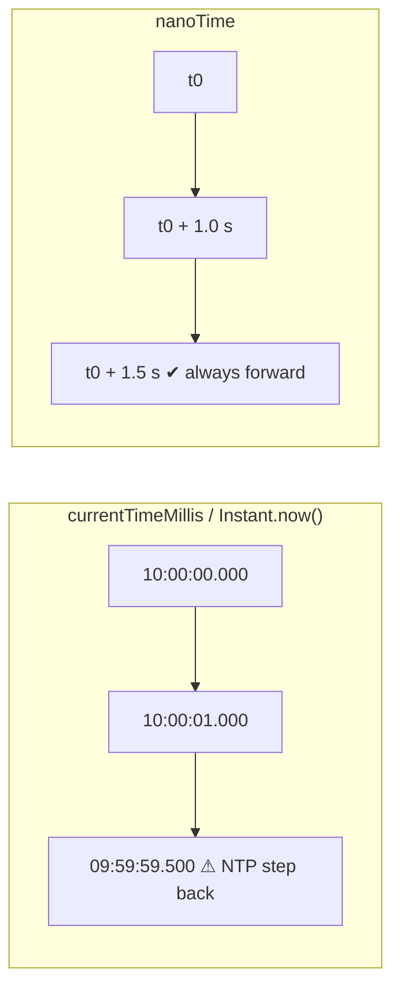

# Time and Clock (currentTimeMillis, nanoTime, java.time.Clock)

## 1. One-line summary

Java has two kinds of time: **wall-clock time** ("what time is it?" — `System.currentTimeMillis`, `Instant.now()`) and **monotonic time** ("how much time passed?" — `System.nanoTime`); rate limiters need the second, and good code takes time from an **injected clock** so tests can control it.

## 2. The problem it solves

Two separate pains:

1. **Wall clocks jump.** NTP (the daemon that syncs server clocks) can step the clock backwards or forwards; a VM resumed from pause, a leap second, or an operator running `date -s` does the same. If your limiter computes `elapsed = now - lastRefill` with wall time, a backward jump gives a **negative** elapsed (tokens disappear or the math breaks) and a forward jump hands out a burst of free tokens. Anyone who has debugged skewed timestamps in logs across hosts has seen this.

2. **Tests that depend on real time are slow and flaky.** "Allow 5 per second" tested with `Thread.sleep(1000)` makes the suite slow, and on a busy CI runner sleeps overshoot and the test fails randomly.

Fix: measure intervals with a monotonic clock, and get "now" from an interface you can replace with a fake in tests.

## 3. How it works

### Wall clock vs monotonic



| | `System.currentTimeMillis()` | `System.nanoTime()` |
|---|---|---|
| Meaning | ms since 1970-01-01 UTC | ns since an **arbitrary** origin (often boot) |
| Can go backwards | yes (NTP step, manual change, VM restore) | no (monotonic within one JVM) |
| Comparable across JVMs/hosts | roughly, if clocks are synced | **no** — the origin is per-process |
| Use for | timestamps, logs, "expires at 2026-10-07T12:00Z" | durations, timeouts, rate limiting, benchmarks |
| Resolution | ~1 ms (sometimes coarser) | ns units, actual precision typically tens of ns |

Rules for `nanoTime`:

- Only **differences** mean anything: `long elapsed = t1 - t0;`
- Compare with subtraction, not `<`: `if (t1 - t0 > timeout)`, never `if (t1 > t0 + timeout)` — the raw values may overflow (wrap around) and subtraction handles that correctly.
- Never store it in a DB or send it to another service.

### java.time.Clock and InstantSource

`java.time.Clock` (Java 8) is an abstract class that provides `instant()`, `millis()`, and a zone. `InstantSource` (Java 17) is the smaller interface with just `instant()` and `millis()` — prefer it when you don't need a time zone.

```java
import java.time.*;

Clock prod = Clock.systemUTC();
Clock fixed = Clock.fixed(Instant.parse("2026-10-07T10:00:00Z"), ZoneOffset.UTC);
Clock later = Clock.offset(fixed, Duration.ofSeconds(30));
InstantSource source = Clock.systemUTC();   // Clock implements InstantSource
```

Both are **wall clocks**. Good for "this API key expires at midnight UTC" or fixed-window boundaries aligned to the minute, but they don't expose `nanoTime`. So for interval math, define a tiny interface of your own.

### An injectable monotonic time source

```java
@FunctionalInterface
public interface TimeSource {
    long nanoTime();

    TimeSource SYSTEM = System::nanoTime;
}
```

Production code takes it in the constructor (dependency injection by hand, no framework needed):

```java
public final class TokenBucketLimiter {
    private final TimeSource time;
    public TokenBucketLimiter(long capacity, double refillPerSecond, TimeSource time) {
        this.time = time;
        // ...
    }
    public synchronized boolean tryAcquire() {
        long now = time.nanoTime();
        // refill using (now - lastRefillNanos)
        // ...
        return true;
    }
}
```

### A fake clock for tests

```java
import java.time.Duration;
import java.util.concurrent.atomic.AtomicLong;

public final class FakeTimeSource implements TimeSource {
    private final AtomicLong now = new AtomicLong(0);

    @Override public long nanoTime() { return now.get(); }

    public void advance(Duration d) { now.addAndGet(d.toNanos()); }
}
```

```java
// Test: capacity 5, refill 5 tokens/second
FakeTimeSource clock = new FakeTimeSource();
TokenBucketLimiter limiter = new TokenBucketLimiter(5, 5.0, clock);

for (int i = 0; i < 5; i++) assert limiter.tryAcquire();
assert !limiter.tryAcquire();               // bucket empty

clock.advance(Duration.ofMillis(200));      // 200 ms * 5/s = 1 token
assert limiter.tryAcquire();
assert !limiter.tryAcquire();
```

The test runs in microseconds, never flakes, and can check edge cases (exactly on a window boundary, 0 ns elapsed, an hour idle) that are impossible to hit reliably with sleeps. Run with `java -ea` so `assert` is enabled.

`AtomicLong` makes the fake safe if a concurrency test advances time from one thread while workers read it (see [atomics-and-cas](atomics-and-cas.md)).

## 4. When to use it

- `nanoTime` (via an injected `TimeSource`): token-bucket refill, sliding-window logs, idle-key detection, timeouts, latency metrics.
- `Clock` / `InstantSource`: anything tied to calendar time — expiry timestamps, audit logs, fixed windows aligned to wall-clock minutes, "reset at midnight".
- Injection in both cases whenever the logic depends on time and you want tests.

## 5. When NOT to use it

- **`currentTimeMillis` for elapsed time** — breaks on clock steps; a mistake interviewers notice.
- **`nanoTime` across processes** — the origin differs per JVM; values from two pods can't be compared. Distributed limiters use the shared store's clock (e.g. Redis `TIME` inside a Lua script) or wall time with skew tolerance.
- **`nanoTime` as a timestamp** — it is not a date.
- **Injecting a clock into code with no time logic** — needless indirection.
- **`Clock.systemUTC()` called statically deep inside a class** — you've taken the dependency but lost the testability; pass it in.

## 6. Commonly confused with

| | `currentTimeMillis` | `nanoTime` | `Instant.now()` / `Clock` | custom `TimeSource` |
|---|---|---|---|---|
| Kind | wall | monotonic | wall | whatever you plug in (usually monotonic) |
| Mockable | no (static) | no (static) | yes if injected (`Clock.fixed`, `Clock.offset`) | yes (fake) |
| Good for rate limiting | no | yes | only for calendar-aligned windows | yes |
| Cross-host comparable | roughly | no | roughly | no (if backed by nanoTime) |

## 7. Common mistakes / misuse

1. **Wall clock for durations** → negative elapsed after an NTP step; tokens vanish or burst.
2. **`if (now > deadline)` with nanoTime** → overflow bug; use `now - deadline > 0`.
3. **Calling the clock many times in one operation** → inconsistent "now" between the refill math and the window check. Read it once at the top.
4. **`Thread.sleep` in unit tests** → slow, flaky. Use a fake clock.
5. **Converting with integer division too early** (`elapsedNanos / 1_000_000_000 * rate`) → truncates to whole seconds, so a 900 ms gap refills nothing. Multiply first or use `double`.
6. **Assuming `nanoTime` has nanosecond precision** — units are ns, precision is platform-dependent.

## 8. Interview cheat-sheet

- "I measure elapsed time with `System.nanoTime`, which is monotonic; `currentTimeMillis` can jump with NTP and give negative or huge intervals."
- "Time comes from an injected `TimeSource` interface — production uses `System::nanoTime`, tests use a fake I can `advance()`."
- "That makes the tests deterministic and instant: no sleeps, and I can test exact window edges."
- "`java.time.Clock` is the standard injectable wall clock — I'd use it for calendar-aligned windows or expiry timestamps."
- "In a distributed limiter, `nanoTime` isn't comparable across pods, so I'd use the store's clock, like Redis `TIME` inside a Lua script."

## 9. Used in

- [LLD: Design a Rate Limiter](../../interviews/rate-limiter/README.md) — injectable clock, deterministic tests for every algorithm.
- [LLD: Design a Parking Lot](../../interviews/parking-lot/README.md) — injected `java.time.Clock` for entry/exit timestamps and deterministic fee tests (see also [java-time-api](java-time-api.md)).
