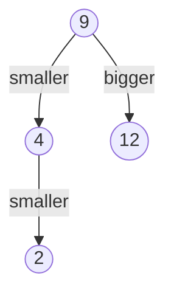

# TreeSet / TreeMap vs PriorityQueue

## 1. One-line summary

`TreeSet` and `TreeMap` keep elements **fully sorted** and can answer "what is the next value above / below X?" in O(log n); `PriorityQueue` only knows **which element is smallest (or largest) right now** — cheaper, but that is all it can tell you.

> 💡 **O(log n)** means the work grows with the number of times you can halve n: for 1,000,000 elements that is about 20 steps (2^20 ≈ 1,000,000). See [big-o-complexity](../../concepts/big-o-complexity.md).

## 2. The problem it solves

An elevator is at floor 7 going up. People have pressed buttons for floors 2, 9, 12 and 4. The elevator must answer, every time it moves:

- "What is the **next stop above me**?" → 9
- "Are there **any stops above me** at all, or should I reverse?" → yes
- After reversing: "What is the **next stop below me**?" → 4

With an `ArrayList` you'd scan every stop each time (O(n)) or keep it sorted by hand (O(n) inserts, easy to get wrong). With a `HashSet` there is no order at all. A `PriorityQueue` gives you the *minimum*, but "smallest stop **greater than 7**" is not something a heap can answer.

`TreeSet` answers all of these directly with `ceiling`, `floor`, `higher`, `lower` — like asking a sorted routing table "which rule is the closest match for this key?".

## 3. How it works

### TreeSet / TreeMap — a red-black tree

`TreeSet<E>` is a thin wrapper around `TreeMap<E, Object>`. Internally it is a **red-black tree**: a binary search tree (left child smaller, right child bigger) that **re-balances itself** on every insert/remove so it never degenerates into a long chain. In plain words: every element is at most ~2·log₂(n) steps from the root, so add / remove / search / "next above X" are all O(log n).

> 💡 **Binary search tree**: each node has up to two children; everything in the left subtree is smaller, everything in the right is bigger, so a search goes left/right one level per step. "Red-black" is just the colouring rule it uses to stay balanced; you never touch the colours.



`ceiling(7)` walks 9 (≥ 7, remember it, go left) → 4 (< 7, go right) → nothing there, and returns the smallest value ≥ 7 it remembered on the way: **9**. Iteration (`for (int f : set)`) is in sorted order.

### The NavigableSet methods you'll actually use

| Method | Returns | Elevator meaning (current floor = 7) |
|---|---|---|
| `ceiling(x)` | smallest element **≥ x**, or `null` | next up-stop including this floor |
| `higher(x)` | smallest element **> x**, or `null` | next up-stop strictly above |
| `floor(x)` | largest element **≤ x**, or `null` | next down-stop including this floor |
| `lower(x)` | largest element **< x**, or `null` | next down-stop strictly below |
| `first()` / `last()` | min / max (throws if empty) | lowest / highest pending stop |
| `pollFirst()` / `pollLast()` | remove and return min / max (`null` if empty) | serve the lowest / highest stop |
| `descendingSet()` | a **view** in reverse order | iterate down-stops from the top |
| `headSet(x)` / `tailSet(x, true)` | views below / at-or-above x | "all stops above me" |

```java
import java.util.NavigableSet;
import java.util.TreeSet;

public class ElevatorStopsDemo {
    public static void main(String[] args) {
        NavigableSet<Integer> upStops = new TreeSet<>();
        NavigableSet<Integer> downStops = new TreeSet<>();
        int current = 7;

        for (int f : new int[] {2, 9, 12, 4}) {
            if (f > current) upStops.add(f); else downStops.add(f);
        }

        Integer next = upStops.ceiling(current);              // 9
        System.out.println("next up stop: " + next);
        System.out.println("any stops above? " + (upStops.higher(current) != null)); // true
        upStops.remove(next);                                 // arrived at 9, O(log n)

        System.out.println("down stops, top first: " + downStops.descendingSet()); // [4, 2]
        System.out.println("next down stop from 7: " + downStops.floor(current));   // 4
    }
}
```

This is exactly the LOOK algorithm (see [scheduling-algorithms](../../concepts/scheduling-algorithms.md)): keep taking `ceiling(current)` from the up set while it is non-null, then switch to `floor(current)` on the down set.

**Watch out:** these methods return `Integer`, so `null` means "nothing there". Assigning to `int` auto-unboxes and throws `NullPointerException`.

### PriorityQueue — a binary heap

`PriorityQueue<E>` is a **binary heap** stored in an array: a tree where each parent is ≤ its children (min-heap), but siblings are in **no particular order**. That's enough to keep the smallest element at index 0.

| Operation | `PriorityQueue` | `TreeSet` |
|---|---|---|
| peek min | O(1) | O(log n) (`first()`) |
| add | O(log n) | O(log n) |
| remove min | O(log n) | O(log n) |
| remove arbitrary element | **O(n)** (linear search, then O(log n) fix-up) | O(log n) |
| "next above x" | **not supported** | O(log n) |
| peek max | O(n) (or keep a second heap) | O(log n) |
| iteration order | **array order, not sorted** | sorted |
| duplicates | allowed | not allowed (`compare == 0` = same element) |

```java
import java.util.Comparator;
import java.util.PriorityQueue;

PriorityQueue<Integer> minHeap = new PriorityQueue<>();
PriorityQueue<Integer> maxHeap = new PriorityQueue<>(Comparator.reverseOrder());
minHeap.addAll(java.util.List.of(9, 2, 12, 4));
System.out.println(minHeap);        // e.g. [2, 4, 12, 9] — NOT sorted, just heap order
System.out.println(minHeap.poll()); // 2 — only poll()/peek() respect the ordering
```

### Thread-safe sorted set

`TreeSet` is **not thread-safe**. If several threads must touch a sorted set, use `ConcurrentSkipListSet` (same `NavigableSet` methods, lock-free, O(log n)) — see [concurrent-collections](concurrent-collections.md). In the elevator design you don't need it: the stop sets are owned by a single simulation thread ([single-writer-principle](../../concepts/single-writer-principle.md)), so a plain `TreeSet` is correct and faster.

## 4. When to use it

- **TreeSet / TreeMap:** you need "next above / below X", range queries (`subSet`, `headMap`), sorted iteration, or min **and** max — elevator stops, booking slots ("first free slot after 10:00"), price levels in an order book, time-ordered indexes (`TreeMap<Instant, Event>`).
- **PriorityQueue:** you only ever ask "what's the most urgent item?" — task schedulers, Dijkstra, top-K, merging sorted streams, "next timer to fire".

## 5. When NOT to use it

- **TreeSet when only min matters** — a heap is simpler and has O(1) peek with less memory per element (array slot vs tree node with 3 pointers + colour).
- **PriorityQueue when you need to cancel / remove items** — O(n) removal; e.g. a pending elevator request that gets cancelled. Use a `TreeSet` or lazy deletion (mark cancelled, skip on poll).
- **PriorityQueue when you print or iterate expecting sorted order** — it isn't.
- **Either one shared across threads** — use `ConcurrentSkipListSet` / `PriorityBlockingQueue`, or confine to one thread.
- **Tiny fixed ranges** — for 10 floors a `boolean[11]` array is O(1) and trivially correct; say so if the interviewer pushes.

## 6. Commonly confused with

| | `TreeSet` | `PriorityQueue` | `ConcurrentSkipListSet` | `HashSet` |
|---|---|---|---|---|
| Structure | red-black tree | binary heap (array) | skip list | hash table |
| Ordering | fully sorted | only head is ordered | fully sorted | none |
| Next above/below X | yes | no | yes | no |
| Duplicates | no | yes | no | no |
| Thread-safe | no | no | yes (lock-free) | no |
| contains | O(log n) | O(n) | O(log n) | O(1) avg |

## 7. Common mistakes / misuse

1. **Comparator that returns 0 for different objects** — `TreeSet` treats them as duplicates and silently drops one. Always add a tie-breaker (`thenComparing(Request::id)`).
2. **Mutating a field the comparator uses** while the element is inside — the tree is now wrongly ordered; `remove` and `contains` may fail. Remove, change, re-add.
3. **Unboxing `null`**: `int next = set.ceiling(f);` throws when no stop exists.
4. **Printing a `PriorityQueue`** and assuming it's sorted; or iterating it to "process in order".
5. **`pq.remove(obj)` in a hot loop** — O(n) each time.
6. **Using `first()` on an empty set** — throws `NoSuchElementException`; use `pollFirst()` or check `isEmpty()`.

## 8. Interview cheat-sheet

- "Each elevator keeps up-stops and down-stops in two `TreeSet<Integer>`s, so 'next stop above me' is `ceiling(currentFloor)` in O(log n)."
- "A `PriorityQueue` would only tell me the lowest floor overall, not the next one above me, and it can't remove a cancelled stop cheaply."
- "When the up set has nothing at or above me, I reverse and use `floor()` on the down set — that's the LOOK algorithm."
- "`TreeSet` isn't thread-safe, but only the simulation thread touches it; if many threads did, I'd use `ConcurrentSkipListSet`."
- "With ≤ 100 floors the constant factors barely matter — I pick `TreeSet` for clarity of the API, not raw speed."

## 9. Used in

- [LLD: Design an Elevator System](../../interviews/elevator-system/README.md) — up/down stop sets per elevator, `ceiling`/`floor` to implement LOOK.
- [LLD: Design Splitwise](../../interviews/splitwise/README.md) — "simplify debts" with two max-heap `PriorityQueue`s (largest creditor ↔ largest debtor), ties broken by user id (see [greedy-algorithms](../../concepts/greedy-algorithms.md)).
- Related: [concurrent-collections](concurrent-collections.md), [scheduling-algorithms](../../concepts/scheduling-algorithms.md), [sorted-collections-in-js](../js/sorted-collections-in-js.md), [big-o-complexity](../../concepts/big-o-complexity.md).
