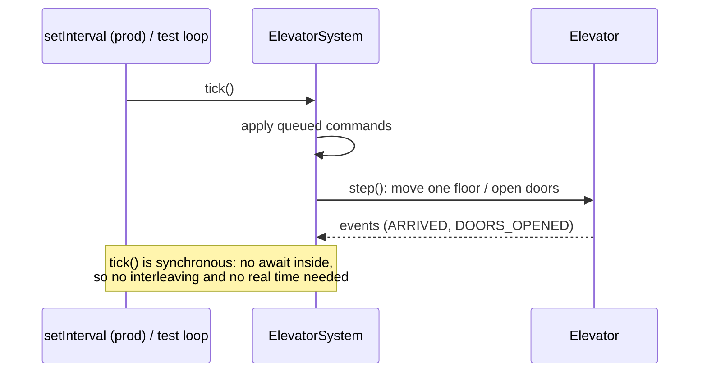

# Promises, async/await and Timers

## 1. One-line summary

A **Promise** is a placeholder for a value that arrives later, `async`/`await` lets you write promise code as if it were sequential, and `setTimeout`/`setInterval` schedule callbacks on the [event loop](event-loop-and-concurrency.md) — but simulation logic should be a plain synchronous `tick()` that timers merely *call*, so tests can run it without waiting for real time.

## 2. The problem it solves

A first-draft JS elevator often looks like this:

```js
async function moveTo(elevator, target) {
  while (elevator.floor !== target) {
    await new Promise((r) => setTimeout(r, 1000));   // "one floor per second"
    elevator.floor += Math.sign(target - elevator.floor);
  }
}
```

It reads nicely, but:

- A test for "goes from 0 to 10" takes **10 real seconds**. Ten such tests: nearly two minutes in CI.
- Two `moveTo` calls for the same elevator run **interleaved** at each `await` — both change `floor`, and it drifts in two directions at once.
- Behaviour depends on wall-clock timing, so tests are flaky (like a readiness probe that passes only when the node is idle).

The fix is to separate **what happens per step** (pure, synchronous `tick()`) from **when steps happen** (a timer in production, a loop in tests).

## 3. How it works

### Promises and async/await in plain words

- A `Promise` is in one of three states: **pending**, **fulfilled** (has a value) or **rejected** (has an error). It settles once and never changes again.
- `.then(fn)` registers what to do when it settles; the callback runs later as a **microtask** (a high-priority queue the event loop empties right after the current code finishes, before timers).
- `async function` always returns a Promise. `await p` pauses *this function* until `p` settles, letting the event loop run other work meanwhile. It does **not** block the thread.

```js
const sleep = (ms) => new Promise((resolve) => setTimeout(resolve, ms));

async function demo() {
  console.log('A');
  await sleep(10);          // demo() pauses; event loop is free
  console.log('C');
}
demo();
console.log('B');           // prints A, B, C
```

Errors: a rejected promise inside `await` throws, so use `try/catch`. A rejected promise nobody handles crashes Node (since v15, "unhandled rejection" terminates the process by default).

### Timers

| API | Does | Notes |
|---|---|---|
| `setTimeout(fn, ms)` | run `fn` once, **at least** `ms` later | late if the event loop is busy |
| `setInterval(fn, ms)` | run `fn` every `ms` | doesn't wait for slow `fn`; can overlap with async work |
| `clearTimeout(id)` / `clearInterval(id)` | cancel | keep the id |
| `timer.unref()` | don't keep the process alive just for this timer | good for background sweepers |
| `await setTimeout(ms)` from `node:timers/promises` | promise-based sleep | built in |

Timers are a **minimum delay, not a guarantee**: if a callback runs 200 ms of synchronous code, every timer waiting behind it fires late.



### Tick-driven design

```js
class Elevator {
  floor = 0;
  #stops = [];                                   // sorted, see sorted-collections-in-js
  addStop(f) { if (!this.#stops.includes(f)) { this.#stops.push(f); this.#stops.sort((a, b) => a - b); } }
  tick() {                                       // one floor per tick, synchronous
    if (this.#stops.length === 0) return;
    const target = this.#stops[0];
    if (this.floor === target) { this.#stops.shift(); return; }   // "doors open" step
    this.floor += Math.sign(target - this.floor);
  }
}

// production: a timer drives the ticks
function start(elevator, msPerTick = 1000) {
  const id = setInterval(() => elevator.tick(), msPerTick);
  return () => clearInterval(id);                // caller can stop it
}
```

Tests just call `tick()`:

```js
import { test } from 'node:test';
import assert from 'node:assert/strict';

test('reaches floor 3 in 3 ticks', () => {
  const e = new Elevator();
  e.addStop(3);
  for (let i = 0; i < 3; i++) e.tick();
  assert.equal(e.floor, 3);                      // runs in microseconds
});
```

Same idea as injecting a [clock](../java/time-and-clock.md) in Java: time is an input, not something the logic reads from the wall.

### Fake timers (when you must test the timer wiring)

Node 22's built-in test runner can replace timers with fake ones you advance by hand:

```js
test('start() ticks once per second', (t) => {
  t.mock.timers.enable({ apis: ['setInterval'] });
  const e = new Elevator();
  e.addStop(2);
  const stop = start(e, 1000);
  t.mock.timers.tick(2000);                      // "2 seconds pass" instantly
  assert.equal(e.floor, 2);
  stop();
});
```

Use this for one or two tests of the wiring; test the logic through `tick()`.

### Don't block the event loop

Everything in Node shares one thread. A synchronous loop that computes for 2 seconds freezes **all** requests, timers and I/O for 2 seconds — like a stop-the-world GC pause. Keep each `tick()` small (it is: a few comparisons per elevator). For heavy CPU work, use `worker_threads` or chunk the work across `setImmediate` calls.

## 4. When to use it

- `async`/`await`: any I/O — HTTP, DB, files — so other requests proceed while you wait.
- `setInterval`/`setTimeout`: to **drive** a simulation or a periodic job (metrics flush, cache sweep), calling a synchronous step function.
- `t.mock.timers`: verifying timer wiring (interval length, cancellation).

## 5. When NOT to use it

- **`await sleep()` inside domain logic** — couples logic to real time; untestable and interleavable.
- **`setInterval` with an `async` callback that may take longer than the interval** — runs pile up and overlap; use a `setTimeout` that re-schedules itself after the work finishes.
- **`async` on functions that don't await anything** — makes callers deal with a Promise for no reason.
- **Fake timers to test every piece of logic** — brittle; prefer ticks.

## 6. Commonly confused with

| | `setTimeout` | `setInterval` | `setImmediate` | `queueMicrotask` / `.then` | `process.nextTick` |
|---|---|---|---|---|---|
| Runs | after ≥ ms, once | every ms | next loop iteration, after I/O | right after current code | before other microtasks |
| Typical use | delays, retries | periodic ticks | yield to I/O in long work | promise continuations | Node internals |
| Can starve I/O | no | no | no | yes, if chained endlessly | yes |

## 7. Common mistakes / misuse

1. **Forgetting `await`** — the function continues before the work is done; errors become unhandled rejections.
2. **`forEach(async ...)`** — doesn't wait for anything; use `for...of` with `await` or `Promise.all`.
3. **Never clearing an interval** — the process won't exit; tests hang.
4. **Expecting exact timer precision** — timers fire late under load.
5. **Shared state mutated across `await` points** — check-then-act races still exist in single-threaded JS ([event-loop-and-concurrency](event-loop-and-concurrency.md)).
6. **Long synchronous loops** blocking the event loop.

## 8. Interview cheat-sheet

- "The elevator logic is a synchronous `tick()` — one floor per tick — so there's no `await` inside and no interleaving."
- "In production a `setInterval` calls `tick()`; in tests I call it in a loop, so a 10-floor trip tests in microseconds, not 10 seconds."
- "If I need to test the timer itself, Node's test runner has `mock.timers` to advance time instantly."
- "I keep each tick small so I never block the event loop."

## 9. Used in

- [LLD: Design an Elevator System](../../interviews/elevator-system/README.md) — JS version: tick-driven simulation, `setInterval` only in the runner, deterministic tests.
- [Task Scheduler](../../interviews/task-scheduler/README.md): **one `setTimeout` re-armed to the earliest due task**, with delays capped below 2³¹ − 1 ms because larger ones fire immediately.
- Related: [event-loop-and-concurrency](event-loop-and-concurrency.md), [time-and-clock](../java/time-and-clock.md), [single-writer-principle](../../concepts/single-writer-principle.md).
