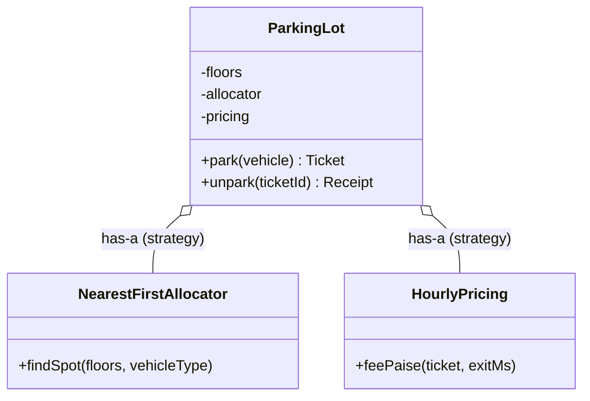

# JS Classes, #private Fields, Object.freeze and Enum Patterns

## 1. One-line summary

Modern JavaScript (ES2022+, all of it supported in Node 22) has `class` syntax with **truly private `#fields`**, `static` members, getters, and `Object.freeze` for immutable value objects — enough to write the same entity / value / strategy design you'd write in Java, minus interfaces and compile-time types.

## 2. The problem it solves

Pre-2015 JS modelled objects with constructor functions and prototypes, and "private" meant a naming convention (`this._occupied`) that anybody could ignore:

```js
spot._occupied = false;   // any code can free a spot behind the allocator's back
```

In a parking lot, that's two cars assigned to one spot because some module "helpfully" reset a flag. Java developers rely on `private` and `final` to make such bugs impossible; in JS you need to know the equivalent tools — `#private` fields for encapsulation, `Object.freeze` for immutability, frozen objects for enums — or the design you describe in the interview isn't the design your code enforces.

## 3. How it works

### Classes, #private fields, getters, static

```js
class ParkingSpot {
  #occupied = false;                 // private: a syntax error to touch from outside
  static #created = 0;               // private static

  constructor(id, size) {
    this.id = id;                    // public field
    this.size = size;
    ParkingSpot.#created++;
  }

  tryOccupy() {                      // single-threaded JS: check-then-set is safe here
    if (this.#occupied) return false;
    this.#occupied = true;
    return true;
  }
  release() { this.#occupied = false; }

  get isFree() { return !this.#occupied; }        // read like a property: spot.isFree
  static get created() { return ParkingSpot.#created; }
  static isSpot(obj) { return #occupied in obj; } // brand check (ES2022)
}

const s = new ParkingSpot('F1-07', 'MEDIUM');
s.tryOccupy();      // true
s.tryOccupy();      // false
// s.#occupied      // SyntaxError: Private field '#occupied' must be declared in an enclosing class
Object.keys(s);     // ['id', 'size']  — private fields are invisible to keys / JSON.stringify
```

`tryOccupy` needs no lock because Node runs your JS on **one thread**; nothing can interleave between the `if` and the assignment unless there's an `await` in between (see [event-loop-and-concurrency](event-loop-and-concurrency.md)). The Java version needs `AtomicBoolean.compareAndSet` for the same method.

| Java | JavaScript |
|---|---|
| `private boolean occupied` | `#occupied` |
| `public static int count` | `static count` |
| `getFoo()` | `get foo()` |
| `final` field | no direct equivalent; use `Object.freeze(this)` or don't expose a setter |
| `interface PricingStrategy` | a documented method shape (duck typing), or JSDoc `@typedef` |
| `abstract` method | method that `throw new Error('not implemented')` |

### Value objects: Object.freeze

```js
class Ticket {
  constructor(id, vehicle, spotId, entryMs) {
    this.id = id;
    this.vehicle = vehicle;            // itself a frozen value object
    this.spotId = spotId;
    this.entryMs = entryMs;
    Object.freeze(this);               // like a Java record: no field can change
  }
}

const vehicle = Object.freeze({ plate: 'KA01AB1234', type: 'CAR' });
```

`Object.freeze` is **shallow**, exactly like a Java record's `final` fields: `Object.freeze({ items: [] }).items.push(1)` still works. Freeze nested arrays too, or copy them (`Object.freeze([...items])`). Writes to a frozen object silently do nothing in sloppy mode and throw `TypeError` in strict mode — ES modules and class bodies are always strict, so you'll get the error.

Note: freezing `this` in a base-class constructor stops subclasses from adding fields — another reason value objects shouldn't be subclassed.

### Enums: frozen objects or Symbols

JS has no `enum` keyword. Two common patterns:

```js
// 1. Frozen object of strings — readable in logs and JSON
const VehicleType = Object.freeze({ MOTORCYCLE: 'MOTORCYCLE', CAR: 'CAR', TRUCK: 'TRUCK' });
const SpotSize    = Object.freeze({ SMALL: 'SMALL', MEDIUM: 'MEDIUM', LARGE: 'LARGE' });

const FITS = Object.freeze({
  [VehicleType.MOTORCYCLE]: Object.freeze([SpotSize.SMALL, SpotSize.MEDIUM, SpotSize.LARGE]),
  [VehicleType.CAR]:        Object.freeze([SpotSize.MEDIUM, SpotSize.LARGE]),
  [VehicleType.TRUCK]:      Object.freeze([SpotSize.LARGE]),
});

// 2. Symbols — every value is unique, can't be faked with a string
const TicketStatus = Object.freeze({
  ACTIVE: Symbol('ACTIVE'), PAID: Symbol('PAID'), EXITED: Symbol('EXITED'),
});
```

| | Frozen strings | Symbols | Java `enum` |
|---|---|---|---|
| Typo protection | only via the constant (`VehicleType.CAAR` → `undefined`) | yes | compile error |
| Serialises to JSON | yes | no (dropped) | via `name()` |
| Can carry behaviour | via lookup tables like `FITS` | via lookup tables | methods on constants |
| Exhaustive switch check | no | no | yes |

Use strings when values cross a boundary (API, DB, logs); Symbols for purely in-process states. Either way, validate input: `if (!Object.values(VehicleType).includes(t)) throw ...`. In Java, the same idea is covered in [enums-and-enummap](../java/enums-and-enummap.md).

### Composition over inheritance



```js
class ParkingLot {
  #floors; #allocator; #pricing;
  constructor(floors, allocator, pricing) {      // inject behaviour, don't inherit it
    this.#floors = floors; this.#allocator = allocator; this.#pricing = pricing;
  }
}
const lot = new ParkingLot(floors, new NearestFirstAllocator(), new HourlyPricing(rates));
```

`class Car extends Vehicle` / `class LargeSpot extends Spot` hierarchies explode as soon as a second dimension appears (electric + large + covered...). In JS this is even more tempting because `extends` is cheap — prefer a `type` field plus lookup tables, and pass strategies in. See [oop-modeling](../../concepts/oop-modeling.md).

## 4. When to use it

- `class` with `#private` fields for **entities** with changing state and invariants: `ParkingSpot`, `ParkingFloor`, `ParkingLot`.
- Frozen objects / frozen classes for **values**: `Vehicle`, `Ticket`, `Receipt`.
- Frozen string maps for categories that appear in JSON; Symbols for internal states.
- `static` for factory methods (`Ticket.create(...)`) and per-class counters.

## 5. When NOT to use it

- **Deep `extends` hierarchies** — same fragility as in Java; compose instead.
- **`#private` when you need to inspect state in tests or logs** — it's invisible to `console.log` field listings and `JSON.stringify`; add an explicit `toJSON()` or getter.
- **`Object.freeze` in hot loops on huge objects** — it's cheap but not free; freeze at construction, not on every read.
- **Symbols for anything you persist or send** — they don't serialise.
- **Classes for pure functions** — a pricing rule with no state can be a plain function; JS doesn't force everything into a class.

## 6. Commonly confused with

| | `#field` | `_field` convention | closure variable | `WeakMap` private data |
|---|---|---|---|---|
| Really private | yes | no | yes | yes |
| Per-instance memory | normal | normal | one closure per instance | external map |
| Works with methods on prototype | yes | yes | no (methods must be in constructor) | yes |
| Era | ES2022 | forever | ES5 | ES2015 |

| | `Object.freeze` | `Object.seal` | `const` |
|---|---|---|---|
| Add properties | no | no | yes |
| Change values | no | yes | yes |
| Rebind the variable | n/a | n/a | no |

`const` only stops reassigning the **variable**; the object it points to stays mutable — the same trap as Java's `final List`.

## 7. Common mistakes / misuse

1. Thinking `const obj = {...}` makes `obj` immutable.
2. Shallow `Object.freeze` with nested arrays/objects left mutable.
3. `_private` fields that other modules then depend on.
4. Inheritance per vehicle/spot type instead of a type field + rules table.
5. Forgetting that an `await` between check and set breaks the "single-thread" guarantee.
6. Using enum strings without validating external input.
7. Arrow-function class fields (`handle = () => {}`) everywhere — each instance gets its own copy; fine for callbacks, wasteful for ordinary methods.

## 8. Interview cheat-sheet

- "Entities like `ParkingSpot` are classes with `#private` state, so only the spot's own methods can occupy or release it."
- "Values like `Ticket` and `Vehicle` are frozen at construction — the JS equivalent of Java records, and equally shallow."
- "JS has no enums, so vehicle types and spot sizes are frozen string maps, with a frozen table for which sizes fit which vehicle."
- "Behaviour like pricing and allocation is injected into `ParkingLot` — composition, not inheritance."
- "Node runs my code on one thread, so `tryOccupy` is safe without locks as long as there's no `await` inside it."

## 9. Used in

- [LLD: Design a Parking Lot](../../interviews/parking-lot/README.md) — JS version: `#private` spot state, frozen value objects, frozen enums, injected strategies.
- [LLD: Design an Elevator System](../../interviews/elevator-system/README.md) — JS version: `#private` stop arrays and status, so callers can only change an elevator through its methods.
- [LLD: Design Splitwise](../../interviews/splitwise/README.md) — JS version: `#private` ledger entries and idempotency map inside the group/service classes, frozen expense objects.
- [LLD: Design a Movie Ticket Booking System](../../interviews/movie-booking/README.md) — JS version: `#private` per-show seat state and hold map, so seats can only change through `holdSeats` / `confirmBooking` / `releaseHold`; tests with [node-test-runner](node-test-runner.md).
- Related: [money-and-numbers-in-js](money-and-numbers-in-js.md), [map-vs-object](map-vs-object.md), [event-loop-and-concurrency](event-loop-and-concurrency.md).
