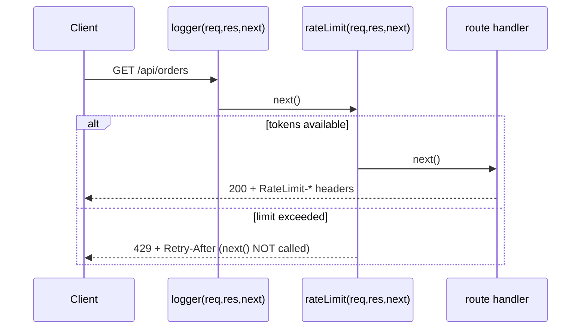

# Express-style Middleware (and rate limiting HTTP requests)

## 1. One-line summary

Middleware is a function `(req, res, next)` that runs before your route handler and either **ends the response** (e.g. `429 Too Many Requests`) or **calls `next()`** to pass the request along — the standard place to plug a rate limiter into a Node web server.

💡 **Express / rate limiter / 429:** Express is the most popular web framework for Node.js (server-side JavaScript). A *rate limiter* caps how many requests a caller may send per time window. *429* is the HTTP status code meaning "Too Many Requests".

## 2. The problem it solves

Without middleware, every route handler would repeat the same preamble: parse auth, log, check the rate limit, set CORS headers (CORS = Cross-Origin Resource Sharing: headers telling browsers which other websites may call your API). That's copy-paste, and the one route someone forgets becomes the unprotected one.

Middleware turns these cross-cutting concerns into a **pipeline**, like filters on an nginx location or an Envoy filter chain: each stage looks at the request, maybe rejects it, maybe decorates it, and hands it on. In Java this is a Servlet `Filter` or Spring `HandlerInterceptor`; structurally it's the Chain of Responsibility (each handler either handles a request or passes it to the next) / [Decorator](../../concepts/design-patterns.md) (wrapping a function with extra behaviour) idea.

## 3. How it works



### The contract

- `req` — incoming request (`IncomingMessage`): method, url, headers, socket (the network connection to the client).
- `res` — response (`ServerResponse`): `statusCode`, `setHeader`, `end`.
- `next(err?)` — call to continue; call with an error to jump to error handling.
- A middleware must do **exactly one** of: end the response, or call `next()`. Doing neither hangs the request; doing both causes "headers already sent" (you can't change the status or headers after the response has started).

### A rate-limit middleware with only `node:http`

💡 **Token bucket / `Map`:** a *token bucket* is a counter that refills at a steady rate; each request spends one token and an empty bucket means reject. A JS `Map` is a built-in key-to-value dictionary.

```js
// rate-limit-server.mjs — run with: node rate-limit-server.mjs
import http from 'node:http';

class TokenBucket {
  constructor(capacity, refillPerSec, now) {
    this.capacity = capacity;
    this.refillPerMs = refillPerSec / 1000;
    this.now = now;
    this.tokens = capacity;
    this.last = now();
  }
  tryAcquire() {
    const t = this.now();
    this.tokens = Math.min(this.capacity, this.tokens + (t - this.last) * this.refillPerMs);
    this.last = t;
    if (this.tokens < 1) return false;
    this.tokens -= 1;
    return true;
  }
  msUntilNextToken() {
    return Math.max(0, Math.ceil((1 - this.tokens) / this.refillPerMs));
  }
}

function rateLimit({ capacity, refillPerSec, keyFn, now = () => performance.now() }) {
  const buckets = new Map();
  return function rateLimitMiddleware(req, res, next) {
    const key = keyFn(req);
    let bucket = buckets.get(key);
    if (bucket === undefined) {
      bucket = new TokenBucket(capacity, refillPerSec, now);
      buckets.set(key, bucket);
    }
    const allowed = bucket.tryAcquire();
    res.setHeader('RateLimit-Limit', String(capacity));
    res.setHeader('RateLimit-Remaining', String(Math.floor(bucket.tokens)));
    if (allowed) return next();

    const retryAfterSec = Math.ceil(bucket.msUntilNextToken() / 1000);
    res.statusCode = 429;
    res.setHeader('Retry-After', String(retryAfterSec));
    res.setHeader('Content-Type', 'application/json');
    res.end(JSON.stringify({ error: 'rate_limited', retryAfterSec }));
  };
}

// Tiny express-like runner: apply middlewares in order, then the handler.
function compose(middlewares, handler) {
  return (req, res) => {
    let i = 0;
    const next = (err) => {
      if (err) { res.statusCode = 500; return res.end('internal error'); }
      const mw = middlewares[i++];
      return mw ? mw(req, res, next) : handler(req, res);
    };
    next();
  };
}

const byClientIp = (req) => req.socket.remoteAddress ?? 'unknown';

const app = compose(
  [rateLimit({ capacity: 5, refillPerSec: 1, keyFn: byClientIp })],
  (req, res) => res.end('ok\n'),
);

http.createServer(app).listen(3000, () => console.log('listening on :3000'));
```

Try: `for i in $(seq 1 7); do curl -si localhost:3000 | head -1; done` — five `200`s, then `429`s. In real Express the same function plugs in with `app.use(rateLimitMiddleware)`.

### Status and headers

- **429 Too Many Requests** (RFC 6585, an internet standards document) — the correct status. Not 503 (that says *the server* is unhealthy, and some load balancers will mark it down) and not 403 (that says "never allowed").
- **`Retry-After`** — seconds (or an HTTP date) until retrying makes sense. Well-behaved clients and SDKs honor it; without it they retry instantly and make the overload worse.
- **`RateLimit-Limit`, `RateLimit-Remaining`, `RateLimit-Reset`** — from the IETF (the internet standards body) draft *RateLimit header fields for HTTP* (newer revisions combine them into `RateLimit` and `RateLimit-Policy`). Many APIs still use the older `X-RateLimit-*` names. Pick one and document it.

### Choosing the key

| Key | Good for | Weakness |
|---|---|---|
| Client IP | anonymous traffic, login/signup endpoints, flood protection | NAT (many devices sharing one public IP) / corporate proxies put many users on one IP; attackers rotate IPs; IPv6 gives one user a whole /64 (about 18 quintillion addresses) |
| User id (from session/JWT, a signed login token) | fair per-user limits after auth | must run **after** auth middleware; doesn't protect the auth endpoint itself |
| API key | B2B APIs, per-plan quotas | keys leak / get shared |
| Composite (`apiKey:route`) | different limits per endpoint | more keys → more memory |

Middleware **order** matters: put an IP limiter before auth (to protect login from brute force), and a per-user limiter after auth.

### X-Forwarded-For behind a load balancer

Behind an ALB (AWS Application Load Balancer) / nginx / k8s ingress (the entry-point proxy of a cluster), `req.socket.remoteAddress` is the **proxy's** IP — every user shares one bucket and the whole site gets throttled together.

The proxy adds `X-Forwarded-For: client, proxy1, proxy2`. But any client can send that header themselves, so:

- Only trust it when the request came from a proxy you control. (*Spoofable* = a client can forge it.)
- Take the address added by **your** outermost trusted proxy — count from the **right** by the number of trusted hops — not the leftmost value, which the client controls.

```js
// Exactly one trusted proxy (e.g. the cloud LB) in front of the app:
function clientIp(req) {
  const xff = req.headers['x-forwarded-for'];
  if (typeof xff !== 'string') return req.socket.remoteAddress ?? 'unknown';
  const hops = xff.split(',').map((s) => s.trim());
  return hops[hops.length - 1];   // the address our LB saw; leftmost entries are spoofable
}
```

In Express this is the `trust proxy` setting; get it wrong one way and everyone shares a bucket, the other way and attackers pick their own key by forging the header.

## 4. When to use it

- Any cross-cutting HTTP concern: rate limiting, auth, logging, request ids, CORS, body parsing.
- Per-route limits: attach a stricter limiter only to `/login` or `/export`.

## 5. When NOT to use it

- **Business logic specific to one route** — keep it in the handler; middleware is for shared behavior.
- **Limits that must be global across instances** with an in-memory `Map` — each pod has its own; use a Redis-backed store (see [event-loop-and-concurrency](event-loop-and-concurrency.md)).
- **Volumetric attacks** (floods of sheer request volume) — by the time Node parses the request, you've spent the resources. Use the edge (nginx `limit_req`, cloud WAF (web application firewall), Envoy, a proxy used as load balancer) for that; see [production-rate-limit-libraries](../java/production-rate-limit-libraries.md).
- **Heavy async work in every middleware** — each adds latency to every request.

## 6. Commonly confused with

| | Express middleware | Route handler | Java Servlet Filter | Gateway / proxy rate limit |
|---|---|---|---|---|
| Runs for | all matching routes, in order | one route | all matching URLs, in a chain | all traffic before the app |
| Can short-circuit | yes (don't call `next`) | it is the end | yes (don't call `chain.doFilter`) | yes |
| Knows user identity | if placed after auth | yes | if placed after auth | only if it validates tokens |
| Scope of state | one process | one process | one JVM | proxy instance or shared store |

## 7. Common mistakes / misuse

1. **Neither calling `next()` nor ending the response** → request hangs until client timeout.
2. **Calling `next()` after sending 429** → `ERR_HTTP_HEADERS_SENT` (Node's error for writing headers after the response started).
3. **Keying by `remoteAddress` behind a load balancer** → one global bucket.
4. **Trusting the leftmost `X-Forwarded-For`** → attackers bypass limits by sending random IPs.
5. **Returning 503 or 403 instead of 429**, or omitting `Retry-After`.
6. **In-memory limiter in PM2 cluster mode** (PM2 runs several copies of your Node app as separate processes) → limit multiplied by worker count.
7. **No eviction on the key map** → memory grows with every unique IP (see [map-vs-object](map-vs-object.md)).

Production libraries: **`express-rate-limit`** (simple Express middleware, pluggable stores such as Redis (an in-memory key-value server shared between instances) via `rate-limit-redis`) and **`rate-limiter-flexible`** (many algorithms and backends: memory, Redis, Memcached, Mongo, Postgres; works with any framework).

## 8. Interview cheat-sheet

- "The limiter is a middleware `(req, res, next)`: if a token is available it calls `next()`, otherwise it ends the response with 429."
- "I always send `Retry-After` and `RateLimit-*` headers so clients back off instead of hammering us."
- "The key function is pluggable — IP before auth to protect login, user id or API key after auth for fair quotas."
- "Behind a load balancer I only trust `X-Forwarded-For` from our own proxy and take the right-most trusted hop; otherwise everyone shares the LB's IP or attackers forge their key."
- "In production I'd use `express-rate-limit` or `rate-limiter-flexible` with a Redis store so the limit holds across pods."

## 9. Used in

- [LLD: Design a Rate Limiter](../../interviews/rate-limiter/README.md) — JavaScript middleware integration.
- [HLD: Design an API Gateway](../../../HLD/interviews/api-gateway/README.md): the same middleware/filter-chain idea at gateway scale (auth → rate limit → transform → route), as in Express Gateway, Kong plugins or Envoy filters.
