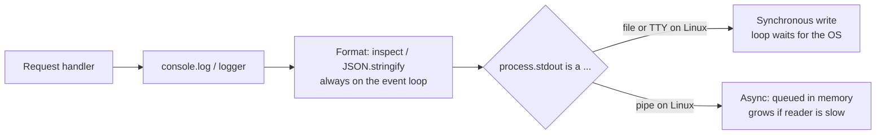

# Logging in Node.js

## 1. One-line summary

In Node, every log call runs on the **same single thread** that serves all requests, and `console.log` writes to `process.stdout`, which is **synchronous** for files and terminals but **asynchronous** for pipes on Linux/macOS; so heavy logging either **blocks the event loop** or **piles up in memory**, which is why production services use a fast JSON logger (pino, winston), log levels from an env var, and `AsyncLocalStorage` for request context.

💡 The **event loop** is Node's single thread that runs your JavaScript and all callbacks one at a time; while it's busy with one thing (like formatting a million log lines), every other request waits ([event loop and concurrency](event-loop-and-concurrency.md)).

---

## 2. The problem it solves

**The pain:** a Node API handles 2,000 requests/s and logs 5 lines per request with `console.log(JSON.stringify(...))`:

```
2,000 req/s × 5 lines = 10,000 lines/s
at ~5 µs each to format and write = 50 ms of every second spent on logging (5% of the only thread)
(the file demo in 3.1 measured 935 ms / 200,000 lines ≈ 4.7 µs per line)
```

That's survivable. Then someone adds `console.log(req.body)` for a 200 KB payload, or the log collector slows down, and the p99 latency of *every* endpoint jumps, because the one thread is busy writing logs or the process's memory climbs with unsent log data. 💡 **p99 latency** is the response time that 99% of requests beat; it's where logging stalls show up first.

**The fix:** know what `console.log` actually does, keep the work per log line small (levels, cheap serialisation), move heavy work off the main thread, and respect the stream's back-pressure.

> Infra analogy: in Kubernetes your container's stdout is collected by the container runtime and a node agent (Fluent Bit, Vector, Promtail). If that pipeline stalls, your app is the one that pays, exactly like an app blocking on a full disk.

---

## 3. How it works

### 3.1 What `console.log` really does

`console.log(x)` formats its arguments (objects go through `util.inspect`) and writes the string plus `\n` to `process.stdout`. From the Node 22 docs ("A note on process I/O"), writes to `process.stdout` / `process.stderr` are:

| stdout is connected to | Windows | POSIX (Linux, macOS) |
|---|---|---|
| **File** (`node app.js > out.log`) | synchronous | synchronous |
| **TTY** (a terminal) | asynchronous | synchronous |
| **Pipe or socket** (`node app.js \| cat`, most containers) | synchronous | asynchronous |

💡 **Synchronous** = the call returns only after the OS accepted the bytes, so the thread waits. **Asynchronous** = the bytes go into an in-memory buffer and are written later; the call returns immediately.



Both rows hurt, in different ways. Runnable demo (`node block.mjs`):

```js
// A timer due in 10 ms, then a burst of logging on the same (only) thread.
const start = Date.now();
setTimeout(() => {
  console.error(`timer due at 10 ms fired at ${Date.now() - start} ms`);
  console.error(`stdout still buffered in memory: ${process.stdout.writableLength} bytes`);
}, 10);

for (let i = 0; i < 200_000; i++) {
  console.log(`{"level":"info","msg":"request handled","i":${i}}`);
}
console.error(`logging loop finished at ${Date.now() - start} ms`);
```

Output on Linux, Node 22:

```
$ node block.mjs > out.log          # stdout is a file: synchronous
logging loop finished at 935 ms
timer due at 10 ms fired at 939 ms
stdout still buffered in memory: 0 bytes

$ node block.mjs | cat > /dev/null  # stdout is a pipe: asynchronous
logging loop finished at 518 ms
timer due at 10 ms fired at 520 ms
stdout still buffered in memory: 9870500 bytes
```

- **File**: every line waits for the OS. A 10 ms timer fired after **939 ms**: any request arriving meanwhile waited almost a second.
- **Pipe**: faster, but the loop was still blocked for 520 ms (formatting is always on the main thread), and **9.9 MB** of log data sat in memory waiting for the reader. `console.log` ignores the stream's back-pressure signal ([back-pressure](../../concepts/back-pressure.md)), so a slow log collector means unbounded memory growth.
- One more pipe trap: `process.exit()` ends the process **immediately**, and asynchronously queued output can be lost. Set `process.exitCode = 1` and let the process end naturally instead.

### 3.2 Why heavy logging blocks the event loop

Everything a logger does before the bytes reach the OS is JavaScript on the main thread:

| Work | Why it's expensive |
|---|---|
| `console.log(obj)` | `util.inspect` walks the object graph, adds colours, handles cycles |
| `JSON.stringify(bigObject)` | proportional to the object's size; a 200 KB body is a lot of work per request |
| String templates for disabled levels | built even if nobody reads them, unless you check the level first |
| Synchronous file write | waits for the OS (3.1) |

Rules: log **small, flat objects** (IDs, durations, status codes, not whole request bodies), check the level **before** building the message, and move formatting/shipping off the main thread when volume is high.

### 3.3 Log levels from an environment variable

The 12-factor convention: configuration comes from the environment, so you can raise the level per deployment (`LOG_LEVEL=debug` in a k8s `env:` entry) without a code change. A dependency-free logger (`node levels.mjs`):

```js
const LEVELS = { debug: 10, info: 20, warn: 30, error: 40 };
const threshold = LEVELS[process.env.LOG_LEVEL ?? 'info'] ?? LEVELS.info;

function makeLogger(name) {
  const logger = {};
  for (const [level, value] of Object.entries(LEVELS)) {
    logger[level] = (msg, fields = {}) => {
      if (value < threshold) return;                       // cheap early exit, like isDebugEnabled()
      const line = { time: new Date().toISOString(), level, logger: name, msg, ...fields };
      (value >= LEVELS.warn ? process.stderr : process.stdout).write(JSON.stringify(line) + '\n');
    };
  }
  return logger;
}

const log = makeLogger('orders');
log.debug('validating order', { orderId: 'o-1001' });
log.info('placed order', { orderId: 'o-1001', items: 3 });
log.warn('inventory slow', { ms: 950 });
```

```
$ node levels.mjs
{"time":"2026-10-08T12:30:02.587Z","level":"info","logger":"orders","msg":"placed order","orderId":"o-1001","items":3}
{"time":"2026-10-08T12:30:02.594Z","level":"warn","logger":"orders","msg":"inventory slow","ms":950}

$ LOG_LEVEL=debug node levels.mjs
{"time":"2026-10-08T12:30:02.639Z","level":"debug","logger":"orders","msg":"validating order","orderId":"o-1001"}
{"time":"2026-10-08T12:30:02.647Z","level":"info","logger":"orders","msg":"placed order","orderId":"o-1001","items":3}
{"time":"2026-10-08T12:30:02.647Z","level":"warn","logger":"orders","msg":"inventory slow","ms":950}
```

One JSON object per line ("NDJSON") is what log collectors parse best: every field becomes searchable without regexes ([observability](../../../HLD/concepts/observability.md)). Unknown `LOG_LEVEL` values fall back to `info` rather than crashing or silently logging nothing.

### 3.4 Request context with `AsyncLocalStorage`

You want every line to carry the request ID without passing it to every function. Node has no per-request thread, so `ThreadLocal` doesn't apply; **`AsyncLocalStorage`** (from `node:async_hooks`) keeps a value for one async call chain, across `await`s and timers. Wrap each request in `als.run({ requestId }, handler)` (in an Express middleware, for example), and have the logger merge `als.getStore()` into each line. A runnable demo and the Java comparison are in [ThreadLocal and context propagation](../../concepts/thread-local-and-context-propagation.md); middleware ordering is in [Express middleware](express-middleware.md).

### 3.5 Respecting back-pressure when you write your own sink

If your logger writes to its own stream (`fs.createWriteStream('app.log')`, a socket to a collector), `stream.write()` returns `false` when the internal buffer is above its `highWaterMark` (64 KiB by default in Node 22). You then have the same choices as any bounded queue: **wait for `'drain'`** (and buffer up to a limit meanwhile), **drop** low-priority lines and count them, or **fail**. Never keep writing as if `false` meant nothing. Durability (when bytes actually reach disk, `fsync`) is a separate question covered in [fs and durability in Node](fs-and-durability-in-node.md).

### 3.6 Production libraries (not used in this repo's solution code)

Solution code here stays dependency-free, but in production you'd reach for a library:

- **pino**: JSON by default, designed for low overhead on the main thread. Its **transports** (formatting for humans, shipping to files or services) run in a **worker thread** (a separate JavaScript thread with its own event loop), so that work leaves the request thread. Levels: `trace` 10, `debug` 20, `info` 30, `warn` 40, `error` 50, `fatal` 60. Child loggers (`logger.child({ requestId })`) attach fields to every line. Use `pino-pretty` only in development.
- **winston**: older and very flexible: multiple transports (console, file, HTTP), composable formats, npm-style levels (`error` 0 up to `silly` 6). Slower than pino in benchmarks, popular in existing codebases.
- **Plain `console.*`**: fine for scripts, CLIs and small services; know the table in 3.1.

---

## 4. When to use it

- **Structured JSON logs to stdout** in containers, collected by the platform's agent: the default for services.
- **Levels via `LOG_LEVEL`** so on-call can turn on debug per deployment.
- **`AsyncLocalStorage`** for request IDs and trace IDs in every line.
- **A worker-thread transport** (pino) when log volume is high enough to show up in latency.

## 5. When NOT to use it (and why it's a mistake)

| Situation | Why |
|---|---|
| `console.log(req.body)` or whole objects on hot paths | `util.inspect` / `JSON.stringify` of big objects blocks the loop and can leak PII. |
| Synchronous file logging from a busy server | each write waits for the disk on the only thread. |
| Writing log files inside the container | they vanish with the pod and fill its ephemeral disk; write to stdout and let the platform collect. |
| Logging as a metrics or audit store | log pipelines can drop or delay lines; use metrics for counts and a durable store for audit. |

---

## 6. Commonly confused with

| | **`console.log`** | **pino** | **winston** | **Java SLF4J + Logback** |
|---|---|---|---|---|
| Output | text via `util.inspect` | NDJSON | configurable formats | configurable (pattern / JSON) |
| Levels | `log/info/warn/error/debug` all always on | numeric, filtered early | npm levels | `TRACE`..`ERROR`, per-logger hierarchy |
| Heavy work off main thread | no | transports in a worker thread | no (by default) | async appender on its own thread |
| Request context | none built in | child loggers / mixin + `AsyncLocalStorage` | defaultMeta / child + `AsyncLocalStorage` | MDC (`ThreadLocal`) |

See [SLF4J, Logback and Log4j2](../java/slf4j-logback-and-log4j2.md) for the Java side.

---

## 7. Common mistakes / misuse

1. **Assuming `console.log` is always async** (it's synchronous to files and to terminals on Linux) or always sync (it's async to pipes, with unbounded buffering).
2. **Building expensive messages for disabled levels**: check the level first, or pass fields and let the logger skip them.
3. **`process.exit()` right after logging**: queued pipe output can be lost; set `process.exitCode` and let the process end.
4. **Ignoring `write()` returning `false`** in a custom sink: memory grows until the process is OOM-killed.
5. **Losing the request ID across `await`**: global variables are shared by all concurrent requests; use `AsyncLocalStorage`.
6. **Pretty-printing in production**: colours and multi-line output break log parsing and cost CPU.

---

## 8. Interview cheat-sheet

> "In Node every log call runs on the event loop, so logging cost is request latency. console.log writes to process.stdout, which is synchronous for files and terminals on Linux and asynchronous for pipes, so you either block the loop or buffer unboundedly in memory if the collector is slow; I measured a 10 ms timer firing after almost a second during a burst of 200,000 lines to a file. In production I'd log one small JSON object per line to stdout, filter by a LOG_LEVEL env var before building messages, carry the request ID with AsyncLocalStorage, and use pino, whose transports run in a worker thread. If I write my own sink I respect write() returning false and wait for 'drain', drop low-priority lines, or fail."

---

## 9. Used in

- [LLD: Logging Framework](../../interviews/logging-framework/README.md): the Node version of the design: levels from configuration, JSON formatting, an async sink that respects stream back-pressure, and request context via `AsyncLocalStorage`.
- Related: [back-pressure](../../concepts/back-pressure.md), [ThreadLocal and context propagation](../../concepts/thread-local-and-context-propagation.md), [event loop and concurrency](event-loop-and-concurrency.md), [async/await and timers](async-await-and-timers.md), [fs and durability in Node](fs-and-durability-in-node.md), [SLF4J, Logback and Log4j2](../java/slf4j-logback-and-log4j2.md).
