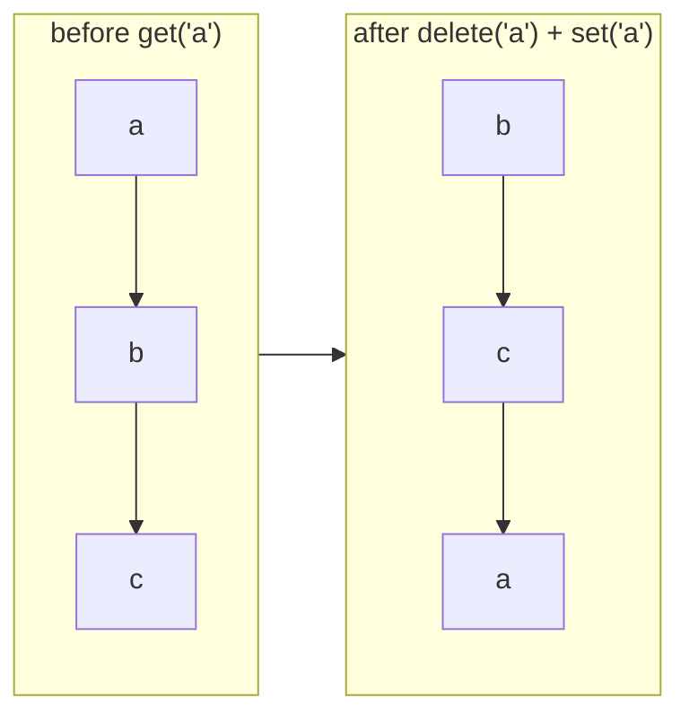

# LRU with `Map` (JavaScript)

## 1. One-line summary

A JavaScript `Map` remembers the **order keys were inserted**, so you can build an LRU cache (Least Recently Used: when full, drop the entry untouched the longest) in about 20 lines by **deleting and re-inserting** a key whenever it's used, and evicting the **first** key when full.

## 2. The problem it solves

In Java you'd reach for `LinkedHashMap` (see [linkedhashmap](../java/linkedhashmap.md)) or hand-write a hash map plus a doubly linked list (see [hashmap-and-linked-list](../../concepts/hashmap-and-linked-list.md)). JavaScript has no `LinkedHashMap`, and a plain object (`{}`) has odd ordering rules (integer-like keys are sorted numerically first — see [map-vs-object](map-vs-object.md)).

But the spec guarantees that **`Map` iterates in insertion order**, and that's half of an LRU already: the first key is the oldest. The other half — "using a key makes it newest" — is a two-line trick.

## 3. How it works

### The trick

- **Oldest key**: `map.keys().next().value` — take the first item from the keys iterator.
- **Mark as most recently used**: `map.delete(key); map.set(key, value);` — deleting and re-inserting moves it to the **end**. (Just calling `set` on an existing key updates the value but **keeps its old position**.)



### Full implementation (Node 22, no dependencies)

```js
class LruCache {
  #map = new Map();   // # = private field (see classes-and-private-fields.md)
  #capacity;

  constructor(capacity) {
    if (!Number.isInteger(capacity) || capacity <= 0) throw new RangeError('capacity must be > 0');
    this.#capacity = capacity;
  }

  get(key) {
    if (!this.#map.has(key)) return undefined;
    const value = this.#map.get(key);
    this.#map.delete(key);        // move to newest
    this.#map.set(key, value);
    return value;
  }

  put(key, value) {
    if (this.#map.has(key)) this.#map.delete(key);   // refresh position
    this.#map.set(key, value);
    if (this.#map.size > this.#capacity) {
      const oldest = this.#map.keys().next().value;  // first = least recently used
      this.#map.delete(oldest);
    }
  }

  get size() { return this.#map.size; }
  keys() { return [...this.#map.keys()]; }          // oldest → newest
}

const cache = new LruCache(2);
cache.put('a', 1);
cache.put('b', 2);
cache.get('a');            // 'a' is now newest
cache.put('c', 3);         // evicts 'b'
console.log(cache.keys()); // [ 'a', 'c' ]
```

We use `has` before `get` so a stored `undefined` value isn't confused with a miss. Private fields are covered in [classes-and-private-fields](classes-and-private-fields.md).

### Complexity

| Operation | Cost | Why |
|---|---|---|
| `get` | O(1) average | hash lookup + delete + set, all O(1) on average |
| `put` | O(1) average | same, plus reading the first key |
| eviction | O(1) amortized | `keys().next()` is O(1) in practice: V8 compacts deleted slots during rehash, so the cost is amortized (averaged over many operations; see [big-o-complexity](../../concepts/big-o-complexity.md)) |
| space | O(capacity) | one entry per key |

### Why concurrency is simpler than in Java

Node runs your JavaScript on **one thread** (the event loop; see [event-loop-and-concurrency](event-loop-and-concurrency.md)). A synchronous `get` or `put` can't be interrupted halfway, so no locks are needed. The danger appears only around `await`: if you `await db.load(key)` on a miss, other requests run meanwhile and may also miss — the JS version of a cache stampede. Fix: store the **Promise** in the map so concurrent callers share one load (the same idea as Java's [CompletableFuture single-flight](../java/completablefuture.md)), and delete it if it rejects.

```js
const inflight = new Map();
async function getUser(id) {
  if (!inflight.has(id)) {
    const p = db.loadUser(id).catch((err) => { inflight.delete(id); throw err; });
    inflight.set(id, p);
  }
  return inflight.get(id);
}
```

### The hand-written DLL version

Interviewers may say "don't rely on Map ordering". Then write the same thing as Java: a `Map<key, Node>` plus a doubly linked list with sentinel `head`/`tail` nodes. The [LRU interview](../../interviews/lru-cache/README.md) has both versions in `js/`.

### Production: npm `lru-cache`

The [`lru-cache`](https://www.npmjs.com/package/lru-cache) package (by isaacs, used inside npm itself) is the standard choice:

```js
import { LRUCache } from 'lru-cache';

const cache = new LRUCache({
  max: 10_000,                                  // max entries
  ttl: 60_000,                                  // TTL in ms (time to live: auto-expire)
  maxSize: 50_000_000,                          // total "size" budget...
  sizeCalculation: (value) => JSON.stringify(value).length, // ...measured by this
  fetchMethod: async (key) => loadFromDb(key),  // cache.fetch(key) loads on miss, coalesced
});
```

It uses preallocated typed arrays instead of a `Map` of objects to reduce garbage. Other options: `quick-lru`, or an external cache (Redis) when several Node processes must share data.

### Memory in V8, briefly

V8 (Node's JavaScript engine) keeps every cached object on its **heap**, which is limited (often ~2–4 GB by default depending on version and system memory; tune with `--max-old-space-size=<MB>`). Each `Map` entry costs tens of bytes plus the key and value objects. Millions of long-lived entries make **garbage collection** (freeing unreachable memory) slower, and exceeding the limit crashes the process with "JavaScript heap out of memory" — in k8s, a restart loop. So: always bound the cache, prefer bounding by size not just count, and watch `process.memoryUsage().heapUsed` in your metrics.

## 4. When to use it

- **Interviews in JavaScript**: the `Map` version is the expected "clean" answer; offer the DLL version as the deeper one.
- **Small in-process caches** in Node services: memoized config, compiled templates, DNS-like lookups.
- **Dedup windows**: remember the last N request ids.

## 5. When NOT to use it

- **Shared state across Node processes/pods** (cluster mode, multiple replicas): each process has its own `Map`. Use Redis.
- **Production code needing TTL, size budgets, stale-while-revalidate** — use `lru-cache` instead of growing your own.
- **Plain objects (`{}`) as the store** — key coercion to strings and numeric-key reordering break LRU order.
- **`WeakMap`** — keys must be objects, isn't iterable, and has no size or order, so you can't find the oldest.

## 6. Commonly confused with

| | `Map` LRU | Plain object `{}` | `WeakMap` | npm `lru-cache` |
|---|---|---|---|---|
| Iteration order | insertion order (guaranteed) | integer keys first, then insertion | not iterable | LRU order |
| Find oldest in O(1) | yes (`keys().next()`) | no reliable way | no | yes |
| Key types | any | strings/symbols only | objects only | any |
| TTL / size budget | DIY | DIY | no | built in |

## 7. Common mistakes / misuse

1. **`set` on an existing key without `delete` first** — value updates but position doesn't; your "LRU" becomes FIFO for updates.
2. **Forgetting to move on `get`** — then it's FIFO (first in, first out), not LRU.
3. **Using `if (map.get(k))` as the hit check** — fails for `0`, `''`, `false`, `undefined` values. Use `has`.
4. **Spreading all keys to find the oldest** (`[...map.keys()][0]`) — O(n) per eviction instead of O(1).
5. **Caching rejected promises** in the in-flight map — every later caller gets the old error. Delete on rejection.
6. **No bound** — a `Map` used as a cache without eviction is a memory leak that ends in "heap out of memory".

## 8. Interview cheat-sheet

- "JS `Map` keeps insertion order, so the first key is the least recently used one."
- "On every hit I `delete` and `set` the key to move it to the end; on insert, if size exceeds capacity, I delete `map.keys().next().value`. Both are O(1) on average."
- "Node is single-threaded so no locks, but around `await` I'd store the in-flight Promise to avoid duplicate loads."
- "In production I'd use the `lru-cache` package for TTL and size limits, and Redis if multiple processes need the same data."

## 9. Used in

- [LLD: Design an LRU Cache](../../interviews/lru-cache/README.md) — JavaScript `Map`-based LRU and the hand-written doubly-linked-list version.
- Related: [map-vs-object](map-vs-object.md), [event-loop-and-concurrency](event-loop-and-concurrency.md), [cache-eviction-policies](../../concepts/cache-eviction-policies.md).
