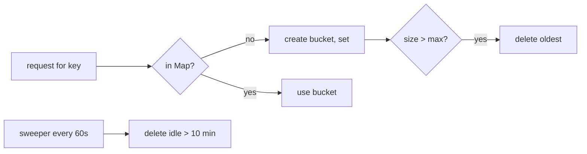

# Map vs Object (and WeakMap)

## 1. One-line summary

`Map` is JavaScript's real hash map — any key type, a `size`, insertion-ordered iteration, no inherited keys — and it's the right container for a registry like "key → rate-limit bucket"; a plain object `{}` is for records with known field names.

## 2. The problem it solves

Before ES2015, people used plain objects as dictionaries:

```js
const buckets = {};
buckets[userKey] = new TokenBucket(10, 5);
```

That works until it doesn't:

- Keys are coerced to **strings**: `obj[1]` and `obj["1"]` are the same; an object key becomes `"[object Object]"`.
- Objects inherit from `Object.prototype`, so `"toString" in buckets` is `true` before you insert anything, and a key like `__proto__` can modify the prototype (**prototype pollution** — a real class of security bugs when keys come from user input such as a header or API key).
- No cheap size: `Object.keys(obj).length` builds an array every time.
- Engines optimize objects for fixed shapes ("hidden classes"); frequent add/delete of arbitrary keys pushes them into slow dictionary mode.

`Map` was added to be a proper dictionary.

## 3. How it works

```js
const buckets = new Map();             // Map<string, TokenBucket>

function getBucket(key) {
  let b = buckets.get(key);
  if (b === undefined) {
    b = new TokenBucket(10, 5);
    buckets.set(key, b);               // safe in Node: no await between get and set
  }
  return b;
}

buckets.size;                          // O(1)
buckets.delete(key);
for (const [key, bucket] of buckets) { /* insertion order */ }
```

In Java this get-then-put would be a race and you'd use [`computeIfAbsent`](../java/concurrent-hashmap.md). In Node it's fine because the function is synchronous and the [event loop](event-loop-and-concurrency.md) runs it to completion.

Map keys use **SameValueZero** equality: strings and numbers by value, objects by identity, `NaN` equals `NaN`. So `map.get(1)` and `map.get("1")` are different entries.

### Insertion order enables cheap LRU-ish eviction

A `Map` iterates in insertion order. Delete-then-set moves a key to the end, so the first entries are the least recently touched:

```js
function touch(key, bucket) {
  buckets.delete(key);
  buckets.set(key, bucket);            // now the "newest"
}

function evictOldest(maxSize) {
  for (const key of buckets.keys()) {
    if (buckets.size <= maxSize) break;
    buckets.delete(key);               // deleting during iteration is allowed for Map
  }
}
```

### Memory growth and eviction

A registry keyed by user/IP grows with every new key and never shrinks on its own. A bot rotating IPs can create millions of entries and the process gets OOM-killed by Kubernetes. Options:

1. **Idle sweep** — a `setInterval(...).unref()` that deletes buckets idle longer than N minutes (see [event-loop-and-concurrency](event-loop-and-concurrency.md)).
2. **Size cap** — evict oldest when `size` exceeds a limit (above). Bounded memory even under attack.
3. Both. Also export `buckets.size` as a metric — it's your leak detector.



### WeakMap — and why it doesn't fit here

`WeakMap` holds its keys **weakly**: when nothing else references the key object, the garbage collector can drop the entry. Perfect for attaching data to objects you don't own:

```js
const meta = new WeakMap();
meta.set(req, { start: performance.now() });  // freed when req is garbage
```

But:

- WeakMap keys must be **objects** (or non-registered symbols). Strings like `"user:42"` or `"10.0.0.7"` are **not allowed** — `set` throws `TypeError`.
- Even if you wrapped strings in objects, each request creates a new wrapper, so lookups would never hit, and entries vanish as soon as the request ends — the opposite of a limiter that must remember a user across requests.
- No `size`, no iteration — you can't sweep or observe it.

Rate-limit state needs to outlive the request and be keyed by a value, so it's a `Map` with explicit eviction.

## 4. When to use it

- `Map`: dynamic keys from runtime data (user ids, IPs, API keys), frequent add/remove, need `size` or ordered iteration, non-string keys.
- Plain object: fixed, known fields (`{ capacity: 10, refillPerSec: 5 }`), JSON payloads, config.
- `WeakMap`: per-object metadata whose lifetime should follow the object (request, socket, DOM node).

## 5. When NOT to use it

- **Plain object as a registry keyed by user input** — prototype pollution risk and key coercion bugs. If you must, use `Object.create(null)` and still prefer `Map`.
- **`Map` for a fixed-shape record** — `config.get("capacity")` is noisier than `config.capacity`, and `JSON.stringify(map)` gives `{}`.
- **`WeakMap` for string-keyed caches** — not allowed, and semantics are wrong.
- **An unbounded `Map` in a long-running server** — that's a memory leak; always pair with eviction.

## 6. Commonly confused with

| | Plain object `{}` | `Object.create(null)` | `Map` | `WeakMap` |
|---|---|---|---|---|
| Key types | strings, symbols (others coerced) | strings, symbols | anything | objects / non-registered symbols only |
| Inherited keys | yes (`toString`, `__proto__`) | no | no | no |
| Size | `Object.keys(o).length` (O(n)) | same | `size` (O(1)) | not available |
| Iteration order | integer-like keys first, then insertion | same | insertion | not iterable |
| Frequent add/delete | can degrade | can degrade | designed for it | designed for it |
| GC of entries | never automatic | never | never | when key object is unreachable |
| JSON | native | native | needs conversion | no |

## 7. Common mistakes / misuse

1. `buckets[key]` with a user-controlled key → `__proto__`/`constructor` surprises.
2. `if (buckets[key])` → false for a stored `0` or `""`; use `map.has(key)` or compare with `undefined`.
3. Using an object as a Map key and expecting lookup by content: `map.get({ id: 1 })` never hits — identity, not equality.
4. `JSON.stringify(map)` → `"{}"`. Use `Object.fromEntries(map)` or `[...map]`.
5. No eviction → unbounded growth.
6. Reaching for `WeakMap` to "fix" the memory leak of a string-keyed registry.

## 8. Interview cheat-sheet

- "I store buckets in a `Map<string, Bucket>` — any key type, O(1) `size`, insertion order, and no prototype keys, so user-supplied keys can't collide with `__proto__`."
- "Get-then-set is safe in Node because it's synchronous; in Java I'd need `computeIfAbsent`."
- "The map grows with every key, so I add an `unref()`'d sweeper for idle buckets and a size cap that evicts the oldest using Map's insertion order."
- "`WeakMap` doesn't fit: keys must be objects, and state should outlive the request, not be collected with it."

## 9. Used in

- [LLD: Design a Rate Limiter](../../interviews/rate-limiter/README.md) — JavaScript per-key registry and eviction.
- [LLD: Design an LRU Cache](../../interviews/lru-cache/README.md) — LRU on top of `Map` insertion order (`delete` + `set` to mark as newest, `map.keys().next().value` for the oldest); see [lru-with-map](lru-with-map.md).
- [LLD: Design an In-Memory Key-Value Store with Transactions](../../interviews/kv-store/README.md) — JS store as `Map<string, {value, expiresAt}>` plus a value → count `Map` for O(1) `COUNT`; user-supplied keys like `__proto__` are safe in a `Map`.
