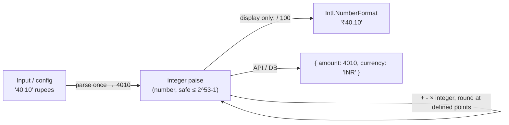

# Money and Numbers in JavaScript (minor units, BigInt, Intl.NumberFormat)

## 1. One-line summary

Every ordinary JavaScript `number` is a 64-bit binary floating-point value (the same as Java's `double`), so money is stored as an **integer count of minor units** (paise / cents), with `BigInt` for amounts beyond 2^53, `Intl.NumberFormat` to display it, and explicit `Math.ceil` / `Math.round` where the business rule rounds.

## 2. The problem it solves

JavaScript has no `int`, `long` or `BigDecimal` — just `number`. So the classic float problem is everywhere, not just when you choose `double`:

```js
0.1 + 0.2;               // 0.30000000000000004
0.1 + 0.2 === 0.3;       // false
1.005 * 100;             // 100.49999999999999
(1.005).toFixed(2);      // "1.00"  — you expected "1.01"
```

A parking fee computed as `40.1 * 3` and summed over a day's tickets drifts away from what the payment gateway recorded. Reconciliation fails, finance raises a ticket, and you're debugging floating point at 2 a.m.

The fix is the same idea as Java's `long` minor units (see [bigdecimal-and-money](../java/bigdecimal-and-money.md)): keep money as **whole numbers of the smallest unit**. Integers up to 2^53 are represented exactly in a `number`, so `4010 + 1990` is always exactly `6000`.

## 3. How it works



### Integer minor units

```js
const RATE_PAISE = { MOTORCYCLE: 20_00, CAR: 40_00, TRUCK: 100_00 };   // ₹20, ₹40, ₹100 per hour
const DAILY_CAP_PAISE = 300_00;

function feePaise(vehicleType, billableHours) {
  const raw = RATE_PAISE[vehicleType] * billableHours;   // integer × integer = exact integer
  return Math.min(raw, DAILY_CAP_PAISE);
}
feePaise('CAR', 3);   // 12000  → ₹120.00
```

Percentages produce fractions, so round **once, deliberately**:

```js
const gst = Math.round(12000 * 0.18);  // 2160 paise — exact enough: one rounding to the nearest paisa
```

`Math.round` rounds .5 **up toward +∞** (`Math.round(2.5) === 3`, `Math.round(-2.5) === -2`). That's fine for positive fees; for refunds (negatives) decide the rule explicitly. There is no built-in banker's rounding.

### Parsing user/config strings into paise

```js
function toPaise(str) {                       // "40.1" -> 4010, "40" -> 4000
  const m = /^(\d+)(?:\.(\d{1,2}))?$/.exec(str.trim());
  if (!m) throw new Error(`bad amount: ${str}`);
  return Number(m[1]) * 100 + Number((m[2] ?? '').padEnd(2, '0'));
}
```

Avoid `Math.round(parseFloat(str) * 100)` — it works for most inputs but hides the float step you were trying to avoid.

### Safe integer range and BigInt

```js
Number.MAX_SAFE_INTEGER;            // 9007199254740991  (2^53 - 1)
2 ** 53 + 1;                        // 9007199254740992 — silently wrong
Number.isSafeInteger(12000);        // true — assert this in money code
```

2^53 paise is ~₹90 trillion, so a parking lot never gets near it. For ledgers, aggregates across years, or crypto amounts with 18 decimals, use `BigInt`:

```js
const total = 9007199254740991n + 10n;  // 9007199254741001n, exact
7n / 2n;                                // 3n — BigInt division truncates
// 1n + 1 -> TypeError: cannot mix BigInt and other types
// JSON.stringify({ a: 1n }) -> TypeError; send as a string: total.toString()
```

`BigInt` is slower than `number` and can't be mixed with it without explicit conversion, so use it only when values can exceed 2^53.

### Billing hours: Math.ceil

```js
const MS_PER_HOUR = 60 * 60 * 1000;
function billableHours(entryMs, exitMs) {
  const parkedMs = exitMs - entryMs;              // Date.now() values are UTC ms: no DST issue
  if (parkedMs < 0) throw new RangeError('exit before entry');
  return Math.ceil(parkedMs / MS_PER_HOUR);       // 61 min -> 2, 60 min -> 1
}
```

`Math.floor` here would let a car park 1h59m for the price of 1h. Subtracting epoch milliseconds is exact elapsed time — the JS equivalent of Java's `Duration.between` on `Instant`s (see [java-time-api](../java/java-time-api.md)).

### Display with Intl.NumberFormat

```js
const inr = new Intl.NumberFormat('en-IN', { style: 'currency', currency: 'INR' });
inr.format(12345650 / 100);   // "₹1,23,456.50"  (Indian lakh grouping)
const usd = new Intl.NumberFormat('en-US', { style: 'currency', currency: 'USD' });
usd.format(1234.5);           // "$1,234.50"
```

Dividing by 100 **only at the display edge** is fine: the result is formatted, never fed back into arithmetic. Create the formatter once and reuse it — construction is relatively expensive.

## 4. When to use it

- Any fee, price, refund, or balance in JS: store and compute as integer paise/cents.
- `Number.isSafeInteger` checks at boundaries (API input, DB reads).
- `BigInt` for values that can exceed 2^53 (ledgers, large IDs — Twitter/Snowflake IDs are why JSON APIs send IDs as strings).
- `Intl.NumberFormat` for every user-facing amount, with locale and currency.

## 5. When NOT to use it

- **Floats for money**, including `toFixed` for rounding (`toFixed` returns a string and inherits float errors).
- **`BigInt` for ordinary amounts** — slower, can't mix with `number`, doesn't serialise to JSON.
- **Hand-written formatting** (`'₹' + (p / 100).toFixed(2)`) — wrong grouping for `en-IN`, wrong symbol placement in other locales.
- **Integer minor units for multi-currency conversion with many decimals** — use a decimal library in production (e.g. `decimal.js`, `dinero.js`); the interview solution stays dependency-free.

## 6. Commonly confused with

| | `number` (float) | `number` as integer paise | `BigInt` | decimal library (`decimal.js`) |
|---|---|---|---|---|
| Exact for ₹0.10 | no | yes (10) | yes (10n) | yes |
| Max exact integer | 2^53 − 1 | 2^53 − 1 | unlimited | unlimited |
| Fractional values | yes (inexact) | no | no (truncates) | yes |
| JSON-friendly | yes | yes | no (needs string) | as string |
| Java equivalent | `double` | `long` minor units | `BigInteger` | `BigDecimal` |

| | `Math.round` | `Math.ceil` | `Math.floor` | `Math.trunc` |
|---|---|---|---|---|
| 2.5 | 3 | 3 | 2 | 2 |
| -2.5 | -2 | -2 | -3 | -2 |
| Billing use | tax to nearest paisa | billable hours | discounts | — |

## 7. Common mistakes / misuse

1. Storing `40.1` rupees instead of `4010` paise.
2. `toFixed(2)` as a rounding function — float error leaks in (`1.005 → "1.00"`), and you get a string.
3. Rounding at every step instead of at defined points (per line item or final total).
4. `Math.floor` for billable hours → undercharging.
5. Mixing `BigInt` and `number` (`TypeError`) or `JSON.stringify` on a BigInt.
6. Using `Date` local getters (`getHours()`) for durations instead of subtracting epoch ms.
7. Not validating `Number.isSafeInteger` on amounts from requests.

## 8. Interview cheat-sheet

- "JS numbers are binary floats, so I keep money as integer paise — exact for anything under 2^53."
- "Billable hours are `Math.ceil` of parked milliseconds over an hour; I round tax once with `Math.round`."
- "I convert to rupees only for display, via `Intl.NumberFormat('en-IN', { style: 'currency', currency: 'INR' })`."
- "If totals could exceed 2^53 I'd switch to `BigInt` and send amounts as strings in JSON."
- "In production I'd use a decimal/money library; the interview code stays dependency-free."

## 9. Used in

- [LLD: Design a Parking Lot](../../interviews/parking-lot/README.md) — JS pricing in integer paise, `Math.ceil` billable hours, formatted receipts.
- [LLD: Design Splitwise](../../interviews/splitwise/README.md) — JS version: all amounts as integer paise, largest remainder split so parts sum exactly to the total (see [splitting-money-and-rounding](../../concepts/splitting-money-and-rounding.md)).
- Related: [bigdecimal-and-money](../java/bigdecimal-and-money.md), [classes-and-private-fields](classes-and-private-fields.md).
