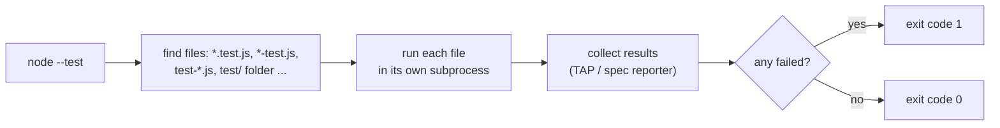

# Node's Built-in Test Runner (node:test and node:assert)

## 1. One-line summary

Node 18+ ships a test framework in the standard library: `node:test` gives you `test` / `describe` / `it` and mocks (including **fake timers**), `node:assert` gives you assertions, and `node --test` finds and runs your test files, with **no npm install**.

## 2. The problem it solves

You wrote a small seat-booking module in plain Node and want to prove it works: holds expire after 10 minutes, a second hold on the same seat fails, confirm is idempotent. Options used to be:

- `console.log` and eyeballing output: no pass/fail, nothing for CI (the pipeline that builds and tests every commit) to check.
- Install Jest or Mocha: a `package.json`, a `node_modules` folder with hundreds of transitive packages (dependencies of dependencies), config files, version upgrades. For a 200-line module that's like standing up a full Prometheus stack to watch one cron job.

`node:test` gives proper tests with zero dependencies. That also matches this repo's rule: JS solutions run with plain `node`.

## 3. How it works



The **exit code** is what CI looks at: 0 = green, non-zero = red. **TAP** (Test Anything Protocol) is a plain-text test-result format; the default reporter in a terminal is a readable "spec" tree.

### A complete test file

`seat-hold.test.js` (runs as-is with `node --test`):

```js
import { test, describe } from 'node:test';
import assert from 'node:assert/strict';

const TTL_MS = 10 * 60 * 1000;

// Tiny module under test: a hold with lazy expiry, using an injected clock.
class SeatHolds {
  #holds = new Map();               // seatId -> { holdId, expiresAt }
  #now;
  #seq = 0;
  constructor(now = () => Date.now()) { this.#now = now; }

  hold(seatIds) {
    const t = this.#now();
    const busy = seatIds.filter((id) => (this.#holds.get(id)?.expiresAt ?? 0) > t);
    if (busy.length) throw new Error(`seats unavailable: ${busy.join(',')}`);
    const holdId = `h${++this.#seq}`;
    for (const id of seatIds) this.#holds.set(id, { holdId, expiresAt: t + TTL_MS });
    return holdId;
  }
}

describe('SeatHolds', () => {
  test('second hold on the same seat fails', () => {
    const s = new SeatHolds(() => 0);
    assert.equal(s.hold(['C7', 'C8']), 'h1');
    assert.throws(() => s.hold(['C8']), /seats unavailable: C8/);
  });

  test('hold ids are returned in order', () => {
    const s = new SeatHolds(() => 0);
    const ids = [s.hold(['A1']), s.hold(['A2'])];
    assert.deepEqual(ids, ['h1', 'h2']);          // compares contents, not identity
  });

  test('expired hold frees the seat (injected clock)', () => {
    let now = 0;
    const s = new SeatHolds(() => now);
    s.hold(['C7']);
    now += TTL_MS;                                // jump 10 minutes, no waiting
    assert.equal(s.hold(['C7']), 'h2');
  });

  test('expired hold frees the seat (mock.timers faking Date)', (t) => {
    t.mock.timers.enable({ apis: ['Date'], now: 0 });
    const s = new SeatHolds();                    // uses real Date.now(), which is now fake
    s.hold(['C7']);
    t.mock.timers.tick(TTL_MS - 1);
    assert.throws(() => s.hold(['C7']));          // 1 ms before expiry: still held
    t.mock.timers.tick(1);
    assert.equal(s.hold(['C7']), 'h2');
  });                                             // mocks are reset automatically after t
});
```

```bash
node --test                       # finds *.test.js etc. under the current folder
node --test seat-hold.test.js     # one file
node --test --test-name-pattern="expired"   # only matching test names
node --test --watch               # rerun on file change
node --test --experimental-test-coverage    # line/branch coverage report
```

### The pieces

| API | What it does |
|---|---|
| `test(name, fn)` / `it` | one test; `fn` may be `async` (the runner awaits it) |
| `describe(name, fn)` | groups tests (like a nested class in JUnit 5) |
| `before`, `after`, `beforeEach`, `afterEach` | setup/teardown hooks |
| `test.skip`, `test.only`, `test.todo` | skip / focus / placeholder (`only` needs `--test-only`) |
| `assert.equal(a, b)` | `===` with `node:assert/strict` |
| `assert.deepEqual(a, b)` | recursive comparison of arrays/objects/Maps |
| `assert.throws(fn, /regex/ or ErrorClass)` | `fn` must throw; `assert.rejects` for promises |
| `t.mock.fn()`, `t.mock.method(obj, 'name')` | spies/stubs: record calls, replace behaviour |
| `t.mock.timers.enable({ apis, now })` + `tick(ms)` | fake `setTimeout` / `setInterval` / `Date`; `tick` jumps time instantly |

Always import from **`node:assert/strict`**: plain `node:assert`'s legacy `equal` uses `==`, so `assert.equal(1, '1')` would pass.

### Two ways to control time

1. **Inject a clock** (`now` function) into your class, like Java's `Clock` ([time-and-clock](../java/time-and-clock.md)). Best for business logic like hold expiry: simple, explicit, works in any test runner.
2. **`mock.timers`** fakes the global `Date` and timers. Use it when the code under test *schedules* something (a sweeper `setInterval`, a retry `setTimeout`) and you want to check that wiring without waiting. See [async-await-and-timers](async-await-and-timers.md).

### Running in CI

Any CI system just needs Node and one command, since there's nothing to install:

```yaml
# GitHub Actions step (sketch)
- uses: actions/setup-node@v4
  with: { node-version: 22 }
- run: node --test LLD/interviews/movie-booking/js/
```

The non-zero exit code on failure fails the job. Add `--test-reporter=junit --test-reporter-destination=report.xml` if your CI renders JUnit XML (the same format Maven's Surefire produces for Java tests).

## 4. When to use it

- Small libraries, interview solutions, scripts, internal tools: anywhere a dependency-free setup matters.
- Testing time-based logic with `mock.timers` or an injected clock.
- Projects already on Node 20/22 that want fewer `node_modules` to audit and upgrade.

## 5. When NOT to use it

- **A big frontend app already on Jest/Vitest** with snapshot tests, JSDOM (a fake browser DOM) and module mocking: switching gains little.
- **You need mature module mocking** (replacing an imported ES module): `node:test` has `mock.module` only behind a flag in Node 22; Vitest/Jest do it today.
- **Old Node versions** (< 18), where it doesn't exist; `mock.timers` needs 20.4+, and Date mocking 20.11+.

## 6. Commonly confused with

| | `node:test` | Jest | Mocha + Chai |
|---|---|---|---|
| Install | none (built in) | npm package + config | two npm packages |
| Assertions | `node:assert` | `expect(...)` built in | Chai |
| Fake timers | `t.mock.timers` | `jest.useFakeTimers()` | Sinon (another package) |
| Module mocking | experimental | yes | via other packages |
| Snapshots | `t.assert.snapshot` (newer Node) | yes | plugin |
| Feels like (Java) | plain JUnit 5, nothing else | JUnit + Mockito + AssertJ | JUnit + Hamcrest |

## 7. Common mistakes / misuse

1. **Importing `node:assert` (loose) instead of `node:assert/strict`.** Loose `equal` coerces types.
2. **Forgetting `await` on async assertions** (`assert.rejects` returns a promise): the test passes before the check runs.
3. **Real `setTimeout` waits in tests** ("sleep 10 minutes"): use an injected clock or `mock.timers`.
4. **Using `deepEqual` on class instances with `#private` fields**: private fields aren't compared; compare the public view instead.
5. **Naming files so the runner doesn't find them** (`seatHoldSpec.js`): use `*.test.js` or pass paths explicitly.
6. **Leaving `test.only` in code**: harmless without `--test-only`, but confusing; remove it.

## 8. Interview cheat-sheet

- "I'd test this with Node's built-in runner, `node --test`, so the solution has zero dependencies."
- "Assertions come from `node:assert/strict`: `equal`, `deepEqual`, `throws`."
- "Hold expiry is tested by injecting a clock function and moving it forward 10 minutes, no sleeping."
- "If I need to test a sweeper's `setInterval`, `t.mock.timers.tick` advances fake time instantly."
- "In CI it's one command; a non-zero exit code fails the build."

## 9. Used in

- [LLD: Design a Movie Ticket Booking System](../../interviews/movie-booking/README.md) — JS version: tests for all-or-nothing holds, lazy expiry with an injected clock, idempotent confirm.
- [LLD: Design an In-Memory Key-Value Store with Transactions](../../interviews/kv-store/README.md) — JS version: tests for nested `BEGIN/ROLLBACK/COMMIT`, TTL with an injected clock, AOF replay ignoring a torn trailing batch, and a property test against a copy-the-whole-map model.
- Related: [async-await-and-timers](async-await-and-timers.md), [classes-and-private-fields](classes-and-private-fields.md), [event-loop-and-concurrency](event-loop-and-concurrency.md).
