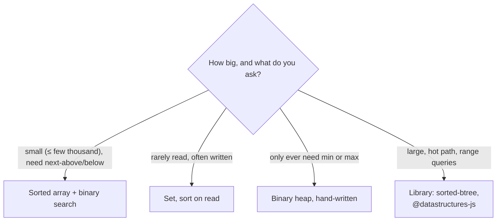

# Sorted Collections in JavaScript (no TreeSet)

## 1. One-line summary

JavaScript has no built-in sorted set, sorted map or priority queue — you choose between a **sorted array with binary search** (simple, O(n) insert), a **`Set` sorted on read**, a **hand-written heap**, or a **library** (B-tree / red-black tree) in production; for small data like elevator floors, the sorted array wins.

> 💡 **O(n)** means the work grows in proportion to the number of elements; **O(log n)** grows with "how many times can I halve n" (~7 steps for 100 items). See [big-o-complexity](../../concepts/big-o-complexity.md).

## 2. The problem it solves

The Java elevator keeps its stops in a `TreeSet<Integer>` and asks `ceiling(currentFloor)` — "smallest stop ≥ my floor" ([treeset-and-priorityqueue](../java/treeset-and-priorityqueue.md)). Porting to Node, you look for the equivalent and find:

- `Array` — ordered by insertion, not by value.
- `Set` — no duplicates, but iterates in **insertion** order.
- `Map` — same, keyed by insertion order ([map-vs-object](map-vs-object.md)).

None of them can answer "next stop above floor 7" without you doing the work. So the question becomes: which hand-rolled structure, and when is it worth pulling in a library?

## 3. How it works



### Option 1 — sorted array + binary search (the default)

**Binary search** finds a position in a sorted array by repeatedly checking the middle and throwing away the half that can't contain the answer: O(log n) to *find*. Inserting still costs O(n) because `splice` shifts every later element one slot — but for 100 floors that's at most 100 moves, a few hundred nanoseconds.

```js
// lowerBound: first index i such that arr[i] >= x (arr.length if none)
function lowerBound(arr, x) {
  let lo = 0, hi = arr.length;
  while (lo < hi) {
    const mid = (lo + hi) >>> 1;          // unsigned shift = floor((lo+hi)/2)
    if (arr[mid] < x) lo = mid + 1; else hi = mid;
  }
  return lo;
}

class SortedIntSet {
  #a = [];
  add(x) {
    const i = lowerBound(this.#a, x);
    if (this.#a[i] !== x) this.#a.splice(i, 0, x);   // O(n) shift, no duplicates
  }
  delete(x) {
    const i = lowerBound(this.#a, x);
    if (this.#a[i] === x) { this.#a.splice(i, 1); return true; }
    return false;
  }
  ceiling(x) { const i = lowerBound(this.#a, x); return i < this.#a.length ? this.#a[i] : undefined; }
  floor(x) {                               // largest <= x
    const i = lowerBound(this.#a, x + 1);  // integers only: first index > x
    return i > 0 ? this.#a[i - 1] : undefined;
  }
  get size() { return this.#a.length; }
  toArray() { return [...this.#a]; }       // copy: callers can't break ordering
}

const up = new SortedIntSet();
[12, 9, 4, 9].forEach((f) => up.add(f));
console.log(up.toArray(), up.ceiling(7), up.floor(7));  // [ 4, 9, 12 ] 9 4
```

`#a` is a private field ([classes-and-private-fields](classes-and-private-fields.md)) so nobody can `push` into the array and break the sort order.

Note the trap avoided: `arr.sort()` with no comparator sorts **as strings** — `[9, 12, 4].sort()` gives `[12, 4, 9]`. Always pass `(a, b) => a - b`.

### Option 2 — `Set` + sort on read

```js
const stops = new Set([12, 4, 9]);
stops.add(7);                                     // O(1)
const next = [...stops].sort((a, b) => a - b).find((f) => f >= 7);   // O(n log n) per read
```

Fine when writes are frequent and reads are rare. For an elevator that reads every tick it's wasteful, though with 100 floors still microseconds.

### Option 3 — hand-written binary heap

A **heap** is an array where each parent ≤ its children, so the minimum sits at index 0. Push and pop are O(log n) by "bubbling" an element up or down. Same trade-off as Java's `PriorityQueue`: great for "most urgent next", useless for "next above floor 7". Write one when you need a task scheduler or top-K; interviewers accept ~25 lines of `push`/`pop`/`siftUp`/`siftDown`.

### Option 4 — libraries in production

| Library | Structure | Gives you |
|---|---|---|
| `sorted-btree` | B+ tree | `nextHigherKey`, `nextLowerKey`, range iteration, O(log n) everything |
| `@datastructures-js/priority-queue` | heap | min/max priority queue |
| `@datastructures-js/binary-search-tree` | AVL / BST | ordered set with `lowerBound` / `upperBound` |
| `functional-red-black-tree` | persistent red-black tree | immutable sorted map |

The repo's solution code uses no npm dependencies, so it uses Option 1; mention these as "what I'd use if this grew".

## 4. When to use it

- **Sorted array:** small or bounded data (floors, time slots in a day, a few thousand price levels), reads ≫ writes, you need ceiling/floor.
- **Set + sort:** write-heavy, occasionally read, small.
- **Heap:** only min/max matters — timers, schedulers, Dijkstra.
- **Library tree:** large (10⁵+) sets with frequent inserts **and** ordered queries on a hot path.

## 5. When NOT to use it

- **Sorted array for 1,000,000 frequently changing items** — each insert shifts up to a million elements.
- **A library for 100 elements** — a dependency (supply-chain risk, bundle size, upgrades) for something 20 lines of code solve.
- **Heap when you need to remove arbitrary items** (cancelled request) — O(n) find; use a sorted array/tree or lazy deletion.
- **Re-sorting the whole array on every insert** (`push` + `sort`) — O(n log n) per insert, when binary-search insert is O(n).

## 6. Commonly confused with

| | Sorted array | `Set` + sort | Heap | `sorted-btree` | Java `TreeSet` |
|---|---|---|---|---|---|
| insert | O(n) | O(1) | O(log n) | O(log n) | O(log n) |
| next ≥ x | O(log n) | O(n log n) | no | O(log n) | O(log n) |
| min | O(1) | O(n log n) | O(1) | O(log n) | O(log n) |
| remove arbitrary | O(n) | O(1) | O(n) | O(log n) | O(log n) |
| Built in | yes | yes | no | no (npm) | yes (JDK) |

## 7. Common mistakes / misuse

1. **`array.sort()` without a comparator** on numbers → lexicographic order.
2. **Exposing the internal array** → callers push unsorted values.
3. **Off-by-one in binary search** — test empty array, x below min, x above max, x equal to an element.
4. **`(lo + hi) / 2` without flooring** → fractional index → `undefined`.
5. **Treating `0` as "not found"** — `if (set.ceiling(x))` is false for floor 0 (ground floor!). Compare with `undefined`.
6. **Reaching for a library** before stating the size of the data.

## 8. Interview cheat-sheet

- "JavaScript has no TreeSet, so each elevator keeps its stops in a sorted array with binary search."
- "Lookups are O(log n), inserts are O(n) because of the shift — with at most ~100 floors that's negligible and the code stays dependency-free."
- "If this were a huge, write-heavy ordered set I'd use a B-tree library like `sorted-btree`."
- "I always pass a numeric comparator to `sort` and check against `undefined`, not falsiness, because floor 0 is valid."

## 9. Used in

- [LLD: Design an Elevator System](../../interviews/elevator-system/README.md) — JS version: up/down stops as sorted arrays with `ceiling`/`floor` helpers mirroring Java's `TreeSet`.
- Related: [treeset-and-priorityqueue](../java/treeset-and-priorityqueue.md), [classes-and-private-fields](classes-and-private-fields.md), [scheduling-algorithms](../../concepts/scheduling-algorithms.md).
