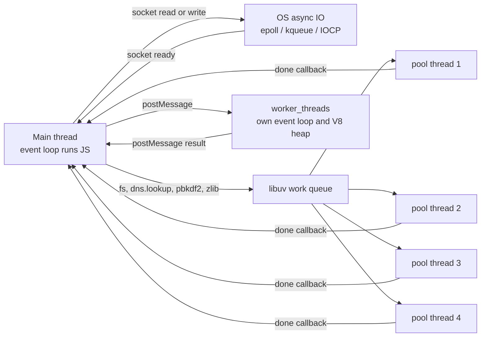

# Worker Threads and the libuv Thread Pool

## 1. One-line summary

Node runs your JavaScript on **one thread** (the event loop), but it is not single-threaded underneath: network IO is handed to the OS's async machinery, while file IO, `dns.lookup`, some `crypto` and `zlib` calls run on a hidden **libuv thread pool of 4 threads** by default (`UV_THREADPOOL_SIZE`); for your own CPU-heavy JavaScript you create **`worker_threads`**, and for downstreams like Postgres you use a **pool** such as node-postgres's `Pool` (max 10 by default) plus concurrency limiters.

💡 **libuv** is the C library inside Node that provides the event loop, timers, async file/network IO and that thread pool. **Event loop** = the loop that picks the next ready callback and runs it on the main thread (see [event loop and concurrency](event-loop-and-concurrency.md)).

---

## 2. The problem it solves

**The pain:** a Node login service hashes passwords with `crypto.pbkdf2` (deliberately slow: ~300 ms of CPU per hash). Under load, logins slow down in steps of ~300 ms, while health checks that read a file also get slow, and CPU usage sits at exactly 4 cores even on a 16-core machine. Nobody configured "4" anywhere.

The reason: all those calls share the **same 4-thread libuv pool**. The 5th concurrent hash waits for a free thread, and so does any `fs.readFile` queued behind it.

The opposite pain: someone computes a big report with a JS loop on the main thread. For 2 s **every** request (including the health check) is stuck, and k8s restarts the pod for failing its liveness probe.

**The fix:** know which work goes where:

| Work | Runs on | Concurrency limit |
|---|---|---|
| Your JS, JSON.parse, regex | main thread | 1 at a time |
| TCP/HTTP sockets, `fetch`, DB drivers' sockets | OS async IO (epoll on Linux, kqueue on macOS, IOCP on Windows) | thousands of sockets |
| `fs.*` async, `dns.lookup`, `crypto.pbkdf2/scrypt/randomBytes` (async), `zlib` async | libuv thread pool | `UV_THREADPOOL_SIZE` (default 4) |
| Your own CPU-heavy JS | `worker_threads` you create | as many workers as you start |

💡 **epoll / kqueue / IOCP** are the OS features that let one thread watch thousands of sockets and be told which are ready, without a thread per socket. Files on Linux don't have a good equivalent in classic APIs, which is why libuv uses threads for them.

---

## 3. How it works



### 3.1 The libuv thread pool

- Default size **4**; set with the environment variable `UV_THREADPOOL_SIZE` **before** the pool starts (in practice: at process start, e.g. `UV_THREADPOOL_SIZE=8 node app.js`). libuv's docs give the absolute maximum as **1024** (raised from 128 in libuv 1.30).
- One shared FIFO queue: a slow `fs` call on a network filesystem and a password hash compete for the same 4 threads.
- `dns.lookup` (used by `http.get('http://host')` by default) calls the OS resolver `getaddrinfo`, which blocks, so it uses the pool. `dns.resolve*` uses a separate network-based resolver (c-ares) and does **not**.

**Runnable demo** (Node 22, `node pbkdf2-demo.js`):

```js
// node pbkdf2-demo.js          (default libuv pool: 4 threads)
// UV_THREADPOOL_SIZE=5 node pbkdf2-demo.js
const crypto = require('node:crypto');

const start = Date.now();
for (let i = 1; i <= 5; i++) {
  // CPU-heavy password hashing; runs on a libuv threadpool thread, not the main thread
  crypto.pbkdf2('secret', 'salt', 500_000, 64, 'sha512', () => {
    console.log(`hash ${i} done after ${Date.now() - start} ms`);
  });
}
// The main thread is free meanwhile: this timer fires on time
setTimeout(() => console.log(`timer fired after ${Date.now() - start} ms`), 10);
```

Real output on a 4-core machine, default pool:

```
timer fired after 12 ms
hash 1 done after 325 ms
hash 2 done after 327 ms
hash 4 done after 357 ms
hash 3 done after 378 ms
hash 5 done after 643 ms
```

Four hashes finish together (~330–380 ms); the **5th waits** for a free thread and finishes at roughly twice that. With `UV_THREADPOOL_SIZE=5`:

```
timer fired after 11 ms
hash 2 done after 364 ms
hash 1 done after 365 ms
hash 5 done after 374 ms
hash 4 done after 441 ms
hash 3 done after 504 ms
```

All five run at once, but each is a bit slower: 5 CPU-bound threads now share 4 cores. Lesson: a bigger pool helps **blocking IO** (slow disks, `getaddrinfo`), but for CPU work there's no gain past the core count ([resource pools and sizing](../../concepts/resource-pools-and-sizing.md)). Note also the timer at ~11 ms: the main thread stayed free.

### 3.2 `worker_threads` for your own CPU work

A **worker** is a separate thread with its own V8 instance (V8 = the JavaScript engine), its own heap and event loop. It shares nothing by default; you talk via `postMessage` (data is copied using the structured clone algorithm) or deliberately share a `SharedArrayBuffer`.

```js
// node worker-demo.js : CPU work in a worker thread keeps the main event loop responsive
const { Worker, isMainThread, parentPort, workerData } = require('node:worker_threads');

if (isMainThread) {
  const start = Date.now();
  const tick = setInterval(() => console.log(`main loop alive at ${Date.now() - start} ms`), 100);
  const worker = new Worker(__filename, { workerData: 40 });
  worker.on('message', (result) => {
    console.log(`fib(40) = ${result} after ${Date.now() - start} ms`);
    clearInterval(tick);
  });
} else {
  const fib = (n) => (n < 2 ? n : fib(n - 1) + fib(n - 2)); // deliberately slow, pure CPU
  parentPort.postMessage(fib(workerData));
}
```

Real output (middle lines trimmed):

```
main loop alive at 101 ms
main loop alive at 201 ms
...
main loop alive at 1404 ms
fib(40) = 102334155 after 1424 ms
```

The main loop ticked every ~100 ms the whole time. Run `fib(40)` on the main thread instead and there would be no ticks for ~1.4 s. Starting a worker costs milliseconds and several MB, so in production you keep a **pool of workers** (one per core) and queue jobs to them, the same queue + workers shape as a Java `ThreadPoolExecutor` ([executors and threads](../java/executors-and-threads.md)). Libraries like Piscina do this for you.

### 3.3 node-postgres `Pool`

`pg.Pool` is Node's HikariCP equivalent ([HikariCP and JDBC pools](../java/hikaricp-and-jdbc-pools.md)). Its sockets use OS async IO, not the libuv pool. Defaults (node-postgres docs):

| Option | Default | Note |
|---|---|---|
| `max` | **10** | max clients (connections) |
| `idleTimeoutMillis` | **10,000** | close clients idle for 10 s; 0 disables |
| `connectionTimeoutMillis` | **0 = wait forever** | set it (e.g. 2,000), or a saturated pool hangs requests indefinitely |

```js
const { rows } = await pool.query('SELECT 1');            // borrow + release automatically
const client = await pool.connect();                       // manual borrow for a transaction
try { /* BEGIN ... COMMIT */ } finally { client.release(); } // forgetting this = leak
```

Fleet math applies as in Java: 4 Node processes per pod × 30 pods × `max` 10 = 1,200 connections.

### 3.4 Concurrency limiters

Async code makes it too easy to start 10,000 requests at once (`Promise.all(ids.map(fetchUser))`), overwhelming a downstream API or the pg pool queue. A **limiter** keeps at most N in flight (a semaphore, in Java terms). Runnable (`node limit.js`):

```js
// A tiny concurrency limiter: at most `max` tasks in flight, the rest wait in a FIFO queue
function createLimiter(max) {
  let active = 0;
  const waiting = [];
  const next = () => {
    if (active >= max || waiting.length === 0) return;
    active++;
    const { task, resolve, reject } = waiting.shift();
    task().then(resolve, reject).finally(() => { active--; next(); });
  };
  return (task) => new Promise((resolve, reject) => { waiting.push({ task, resolve, reject }); next(); });
}

const limit = createLimiter(2);
const sleep = (ms) => new Promise((r) => setTimeout(r, ms));
const start = Date.now();
for (let i = 1; i <= 5; i++) {
  limit(async () => { await sleep(100); return i; })
    .then((n) => console.log(`call ${n} done after ${Date.now() - start} ms`));
}
```

Real output: two at a time, in waves of ~100 ms.

```
call 1 done after 101 ms
call 2 done after 113 ms
call 3 done after 213 ms
call 4 done after 214 ms
call 5 done after 314 ms
```

In production, `p-limit` or a pool's own `max` does this; add a bound on the waiting queue too ([back-pressure](../../concepts/back-pressure.md)).

---

## 4. When to use it

- Raise `UV_THREADPOOL_SIZE` (e.g. 8–16) when lots of **blocking IO** goes through the pool: heavy `fs` use, many `dns.lookup`s, network filesystems.
- `worker_threads` (pooled) for CPU-heavy JS: image processing, big parsing, report generation.
- `pg.Pool` with a `connectionTimeoutMillis` for every Postgres-backed service; limiters for fan-out to downstream APIs.

## 5. When NOT to use it (and why it's a mistake)

| Situation | Why it's a mistake |
|---|---|
| `worker_threads` for IO (HTTP calls, DB queries) | IO is already async on the main thread; workers add memory and copying for nothing. |
| A new `Worker` per request | Startup cost per request; use a fixed worker pool. |
| `UV_THREADPOOL_SIZE=128` "for performance" with CPU-bound crypto | More threads than cores = context switching, no extra throughput (see the demo). |
| `crypto.pbkdf2Sync` / `fs.readFileSync` in request handlers | Runs on the main thread and blocks every request. |

---

## 6. Commonly confused with

| | **libuv thread pool** | **worker_threads** | **cluster / multiple processes** | **OS async IO** |
|---|---|---|---|---|
| Created by | Node, automatically | you | you (or PM2, or more pods) | the kernel |
| Runs | built-in C++ tasks (fs, dns.lookup, crypto, zlib) | your JS | full copies of your app | socket readiness |
| Shares memory? | n/a | only `SharedArrayBuffer` | no | n/a |
| Size | `UV_THREADPOOL_SIZE`, default 4 | your choice | usually one per core | not a pool |

---

## 7. Common mistakes / misuse

1. **Assuming "Node is single-threaded"** and missing the 4-thread pool bottleneck.
2. **Setting `UV_THREADPOOL_SIZE` too late** (after the pool has started).
3. **`connectionTimeoutMillis` left at 0** in `pg.Pool`: requests hang forever when the pool is exhausted.
4. **Forgetting `client.release()`** after `pool.connect()`: a leak.
5. **Unbounded `Promise.all`** fan-out.
6. **Sync APIs** (`*Sync`) in server code.

---

## 8. Interview cheat-sheet

> "Node runs JavaScript on one thread, network sockets go through the OS's epoll-style async IO, and filesystem calls, dns.lookup, pbkdf2, scrypt and zlib go to libuv's thread pool, which is only 4 threads by default, so a fifth concurrent password hash waits; you can raise it with UV_THREADPOOL_SIZE up to 1024, which helps blocking IO but not CPU work beyond the core count. For my own CPU-heavy code I'd use a fixed pool of worker_threads, one per core, so the event loop stays responsive. For Postgres, pg.Pool defaults to 10 clients and, importantly, no connection timeout, so I'd set one, and I'd use a concurrency limiter for fan-out to downstream APIs."

---

## 9. Used in

- [Thread Pool / Connection Pool](../../interviews/thread-pool/README.md): the Node side of the problem: how the same queue-plus-workers model appears in libuv's pool, worker thread pools, `pg.Pool` and promise concurrency limiters.
- Related: [event loop and concurrency](event-loop-and-concurrency.md), [async/await and timers](async-await-and-timers.md), [resource pools and sizing](../../concepts/resource-pools-and-sizing.md), [HikariCP and JDBC pools](../java/hikaricp-and-jdbc-pools.md), [virtual threads](../../concepts/virtual-threads.md), [back-pressure](../../concepts/back-pressure.md).
