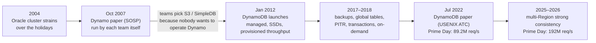
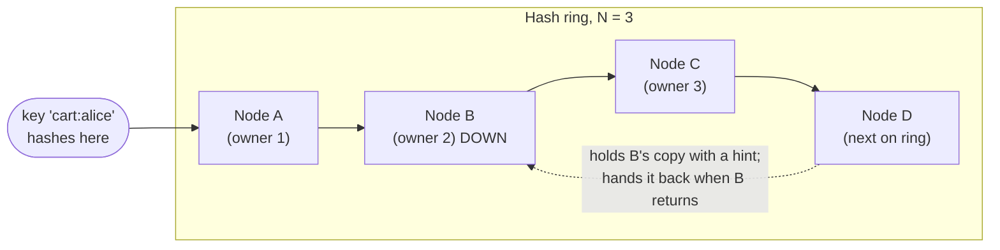
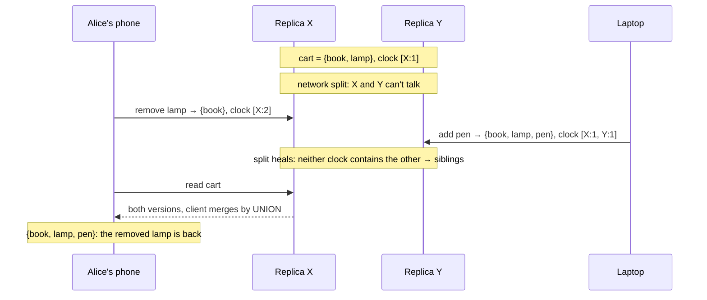
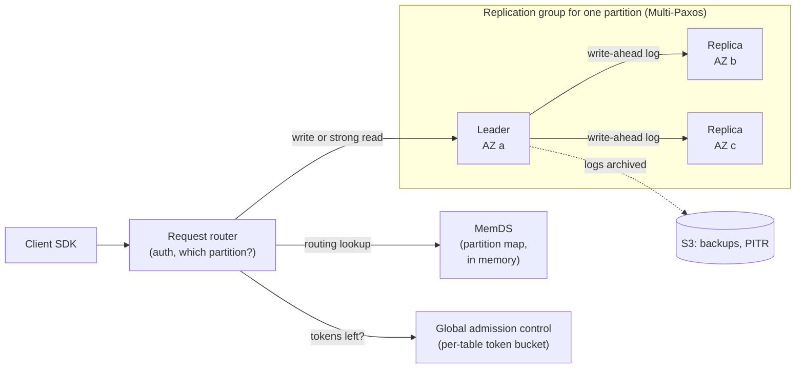

# Case Study: Amazon, from the Dynamo Paper to DynamoDB

> **One line:** after its database struggled through the 2004 holiday season, Amazon built **Dynamo** (paper published 2007): a key-value store that never refuses a shopping-cart write, using consistent hashing, sloppy quorums, vector clocks, Merkle trees and gossip. It worked, but almost nobody inside Amazon wanted to **run** it. So in 2012 Amazon launched **DynamoDB**, a managed service that kept Dynamo's partitioning and replication but **swapped most of its clever availability tricks for a leader per partition, Paxos, and predictable latency**. By 2026 it peaked at **192 million requests per second** on Prime Day.

This is a **case study**: how a real system evolved, from Amazon's papers, AWS blogs, AWS documentation and outage reports. No code. It's the real-world sequel to the [Distributed KV Store interview](../HLD/interviews/distributed-kv-store/README.md): L4–L5 is roughly "design Dynamo", L6 is roughly "explain why DynamoDB isn't Dynamo".

---

## 0. How much to trust each fact

| Mark | Meaning |
|---|---|
| ✅ | From Amazon/AWS's own papers, blogs, docs or outage summaries, or posts by AWS engineers (seen through search results; see note) |
| 🟡 | From secondary coverage (course notes, blog summaries, press), or a primary source we could only partly see |
| ❓ | Widely repeated but not verified, or sources conflict |

> 💡 **Research note:** collected in October 2026. The papers and AWS pages couldn't be opened directly from the research environment, so facts come from search results that quote them. Mechanisms from the 2007 paper are the ones taught in every distributed-systems course; where we only saw them in course notes, they're marked 🟡. Read the two papers yourself; both are free.

Primary sources:
- DeCandia et al., [Dynamo: Amazon's Highly Available Key-value Store](https://www.allthingsdistributed.com/files/amazon-dynamo-sosp2007.pdf), SOSP (Oct 2007)
- Werner Vogels, [Amazon DynamoDB](https://www.allthingsdistributed.com/2012/01/amazon-dynamodb.html) (Jan 2012) and [A Decade of Dynamo](https://www.allthingsdistributed.com/2017/10/a-decade-of-dynamo.html) (Oct 2017)
- Elhemali et al., [Amazon DynamoDB: A Scalable, Predictably Performant, and Fully Managed NoSQL Database Service](https://www.usenix.org/conference/atc22/presentation/vig), USENIX ATC (Jul 2022), plus Amazon Science's [Lessons learned from 10 years of DynamoDB](https://www.amazon.science/blog/lessons-learned-from-10-years-of-dynamodb) (2022) and Marc Brooker's [notes on the paper](https://brooker.co.za/blog/2022/07/12/dynamodb.html) (Jul 2022)
- AWS Prime Day posts (2020–2026) and outage summaries ([2015](https://aws.amazon.com/message/5467D2), [2025](https://aws.amazon.com/message/101925/))

---

## 1. Timeline

---

## 2. Why Amazon built Dynamo (2004–2007)

- ✅ Vogels (2017): "It all started in 2004 when Amazon was running Oracle's enterprise edition with clustering and replication." The team was "pushing the limits" of a leading commercial database and couldn't keep up with the availability, scalability and performance the business needed ([A Decade of Dynamo, 2017](https://www.allthingsdistributed.com/2017/10/a-decade-of-dynamo.html)).
- 🟡 The trouble peaked during the **2004 holiday shopping season**, with outages blamed largely on overloaded SQL databases (Wikipedia and Network World retellings). ❓ A retelling of a re:Invent talk says a database bug on **12 December 2004** took Amazon.com down for about **12 hours**; we couldn't find this in an Amazon source.
- 🟡 Vogels (2017, as quoted by a secondary source): about **70%** of database operations were simple key-value lookups (one primary key, one row), and about **20%** returned several rows but still touched only one table. A relational database's joins and transactions were mostly unused power that cost availability.
- ✅ They "prioritized ... high-scale, mission-critical services like Amazon's shopping cart, and questioned assumptions traditionally held by relational databases such as the requirement for strong consistency" (Vogels, 2017).

💡 **Strong consistency:** every read sees the latest successful write, as if there were one copy of the data. Giving it up means a read might briefly see an older value.

> 📝 **Lesson:** they didn't start from "let's build a NoSQL database". They started from **measured access patterns** (mostly single-key) and a business rule (never refuse "add to cart"). Same order as the [requirements section of the KV interview](../HLD/interviews/distributed-kv-store/00-understand-the-product.md#1-the-origin-story-a-shopping-cart-that-must-never-fail).

---

## 3. The Dynamo paper (SOSP 2007)

✅ Published at SOSP 2007 (the ACM Symposium on Operating Systems Principles, a top systems conference), October 14–17, 2007, by Giuseppe DeCandia and eight co-authors including Werner Vogels.

✅ The target was written as a **latency SLA at the 99.9th percentile**: the paper's example is a service promising "a response within 300ms for 99.9% of its requests for a peak client load of 500 requests per second".

💡 **SLA (service level agreement):** a promise one service makes to its callers, like your team's SLOs. **99.9th percentile (p99.9):** the latency that 999 of every 1,000 requests beat. 🟡 The paper explains choosing p99.9 over the average: customers with long histories (often the most valuable) tend to have the slowest requests.

### The building blocks, mapped to this repo

| Problem | Dynamo's technique (2007) | Plain words | Repo page |
|---|---|---|---|
| Spread keys over machines | **Consistent hashing** with **virtual nodes** 🟡 | Keys and servers are placed on a ring by hash; each key belongs to the next server clockwise. Each physical server takes many small positions ("virtual nodes") so load evens out and a new server takes a little from everyone | [Consistent hashing](../HLD/concepts/consistent-hashing.md) |
| Keep copies | **Preference list** of N nodes 🟡 | The first N distinct servers clockwise from the key store its copies | [Sharding & replication](../HLD/concepts/sharding-and-replication.md) |
| Read/write when nodes are down | **Sloppy quorum + hinted handoff** 🟡 | Write to the first N *healthy* nodes; a stand-in keeps a "hint" (a note saying who the data really belongs to) and hands it back when the owner returns | [Hinted handoff & sloppy quorum](../HLD/concepts/hinted-handoff-and-sloppy-quorum.md) |
| Tune speed vs freshness | **N, R, W** per service; common setting (3, 2, 2) 🟡 | N copies; a read waits for R replies, a write for W acks. R + W > N means read and write sets overlap (when no failures) | [KV L5 §3.1](../HLD/interviews/distributed-kv-store/L5-senior.md#31-tunable-consistency-precisely) |
| Concurrent writes to one key | **Vector clocks**, merge done by the **client** 🟡 | Each version carries a list of (node, counter) pairs; if neither list "contains" the other, the versions are siblings and the application merges them | [Vector clocks](../HLD/concepts/vector-clocks-and-conflict-resolution.md) |
| Replicas drift apart | **Merkle-tree anti-entropy** 🟡 | Each node keeps a tree of hashes per key range; two nodes compare roots and walk down only into branches that differ | [Merkle trees](../HLD/concepts/merkle-trees-and-anti-entropy.md) |
| Who's in the cluster | **Gossip** membership + seed nodes 🟡 | Every second or so, each node swaps its view of the membership with a random peer; news spreads like a rumour. Seeds are well-known nodes everyone contacts first | [Gossip & failure detection](../HLD/concepts/gossip-and-failure-detection.md) |

💡 **Quorum:** the minimum number of replicas that must answer before an operation counts as successful. **Sloppy** means "any N healthy nodes", not "the N nodes that own the key", which keeps writes available but means a read quorum might not overlap the write quorum.

You can run this exact mechanism in [See it work: hash ring + quorums + hinted handoff](../see-it-work/hash-ring-quorum/README.md).

### The shopping cart and the item that came back 🟡

Dynamo chose **"always writeable"**: conflicts are resolved at **read** time, not write time, so a write is never rejected.

- 🟡 The cart merges siblings by **union** (keep every item in either version), so an "add to cart" is never lost, but a **deleted item can reappear** (course notes on the paper; the paper says the same, but we couldn't see its exact wording).
- 🟡 How often did this happen? Course notes quoting the paper's 24-hour measurement of the shopping-cart service: **99.94%** of requests saw exactly one version; cases with 2–4 versions were tiny fractions and mostly caused by **robots** sending many concurrent requests. ❓ The quoted fractions don't add up to 100%, so check the paper.

💡 **Vector clock:** a version stamp with one counter per node that wrote the value. [X:2] and [X:1, Y:1] each have something the other lacks, so neither came "after" the other; they're concurrent.

> 📝 **Lesson:** this is a **business** decision dressed as a technical one. A resurrected lamp costs one annoyed click; a failed "add to cart" costs a sale. In your interview, say which anomaly your product can tolerate before choosing a conflict strategy ([KV L5 §3.3](../HLD/interviews/distributed-kv-store/L5-senior.md#33-conflicts-lww-vs-vector-clocks)).

🟡 Dynamo's ideas spread: one of its authors, Avinash Lakshman, went on to co-create **Cassandra** at Facebook, and Riak and Project Voldemort copied the design. Compare [Cassandra](../HLD/technologies/cassandra.md), which kept the ring and gossip but replaced vector clocks with **last-writer-wins** timestamps.

---

## 4. The twist: Amazon engineers didn't want to run it (2007–2012)

From Vogels' launch post ([Amazon DynamoDB, Jan 2012](https://www.allthingsdistributed.com/2012/01/amazon-dynamodb.html)) ✅:

- Dynamo met teams' "reliability, performance, and scalability" needs, but "it did nothing to reduce the operational complexity of running large database systems". Each team ran **its own Dynamo installation** and had to "become experts on the various components running in multiple data centers".
- Meanwhile **Amazon S3** (object storage) and **Amazon SimpleDB** (a simple managed database) were run *for* you. Amazon engineers "preferred to use these services instead of managing their own databases like Dynamo, even though Dynamo's functionality was better aligned with their applications' needs."
- ✅ SimpleDB had its own pains, per AWS's 10th-birthday retrospective (2022): a table ("domain") couldn't easily grow beyond **10 GB**, latency was **unpredictable** (it depended on database and index size), it was eventually consistent only, and Vogels called its "Machine Hours" pricing "not very transparent".
- ✅ The goal for DynamoDB: Dynamo's scalability, performance and consistency "delivered as an easy-as-pie service".

> 📝 **Lesson for an infra engineer:** you already know this one. A library that every team must deploy, tune, upgrade and page on gets avoided, even if it's technically better. A shared platform that a central team operates wins. DynamoDB is "platform team instead of library" at Amazon scale; see the [build vs buy table in KV L6](../HLD/interviews/distributed-kv-store/L6-staff.md#6-build-vs-buy).

---

## 5. DynamoDB: what it kept and what it changed

### Launch (January 18, 2012) ✅
- Launched as a managed NoSQL service; data stored on **SSDs** (solid-state drives: flash storage with no moving parts, ~100× faster random reads than spinning disks) and replicated across **Availability Zones** (AZs: separate data centres in one region, with independent power and networking). 🟡 "Three AZs" appears in later descriptions, not the launch coverage we saw.
- ✅ Pricing by **provisioned throughput**: you declare how many reads and writes per second the table needs, and AWS sizes the backend to keep latency in the **single-digit milliseconds** (AWS launch post, 2012).

### Side by side

| | Dynamo (2007 paper) | DynamoDB (2012 →, as described in 2022) |
|---|---|---|
| Who runs it | Each Amazon team, on its own hosts | AWS, as a **multi-tenant** service (many customers' tables share machines) ✅ |
| Partitioning | Consistent-hash ring, virtual nodes | Table split into **partitions** by key; split further when they grow too big or too hot ✅ |
| Replication | N replicas from a preference list, any can take writes | 3 replicas in different AZs forming a **replication group with one leader** 🟡/✅ |
| Agreement | Sloppy quorum, no leader | **Multi-Paxos** leader election; only the leader accepts writes ✅ |
| Reads | R replicas, maybe several versions | Eventually consistent from any replica (half price) or **strongly consistent** from the leader ✅ |
| Conflicts | Vector clocks, client merges siblings | No siblings within a region; global tables use **last-writer-wins** ✅ |
| Repair | Hinted handoff, Merkle anti-entropy | Leader replaces a failed replica; **log replicas** bridge the gap 🟡 |
| Membership | Gossip | Central **metadata** service and request routers ✅ |
| Capacity | Whatever hardware the team bought | Provisioned → adaptive capacity → GAC; on-demand mode ✅ |
| Main promise | Always writeable | **Predictable** single-digit-ms latency at any scale ✅ |

### How a request flows (from the 2022 paper)

- ✅ **Multi-Paxos, one leader per partition** (Brooker, 2022): replicas elect a leader; only the leader serves writes and strongly consistent reads; any replica serves eventually consistent reads. The leader keeps its role by renewing a **lease** (a time-limited right to act as leader); a new leader must wait for the old lease to expire before serving, so two leaders never accept writes at once.
- 💡 **Paxos / Multi-Paxos:** a consensus algorithm (Leslie Lamport, 1998) that lets a group of machines agree on one sequence of values even if some crash. Multi-Paxos elects a stable leader so each write needs just one round trip to a majority. Same job as Raft: see [Consensus & Raft](../HLD/concepts/consensus-and-raft.md) and [leases](../HLD/concepts/distributed-locks-and-leases.md).
- 🟡 **Write path:** the leader writes the change to its **write-ahead log** (an append-only file of changes, written before the data itself so a crash can be replayed) and sends it to the peers; it acknowledges once a **majority (2 of 3)** has it. Storage nodes keep data in a **B-tree** (a sorted on-disk tree, the same structure as a Postgres index; see [B-tree](../under-the-hood/b-tree.md)).
- 🟡 **Log replicas:** if a replica fails, the leader adds a lightweight member that stores only recent log entries, so writes keep their majority while a full replacement is rebuilt (which takes minutes).
- ✅ Backups and **point-in-time recovery (PITR)**: restore a table to any second in the last **35 days**, into a new table, without slowing the live table (AWS docs). 🟡 The paper builds this on write-ahead logs archived to S3.

> 📝 **Why drop Dynamo's tricks?** A single leader per partition means **no siblings** for clients to merge and an option for strongly consistent reads. The cost is a short unavailability for that partition while a new leader is elected, which three AZs and fast elections make rare. Amazon traded "always writeable, but you merge conflicts" for "almost always writeable, and simple". This is the CP-vs-AP choice from [CAP & consistency](../HLD/concepts/cap-and-consistency.md), and the "multi-Raft ranges" design in [KV L6 §2](../HLD/interviews/distributed-kv-store/L6-staff.md#2-the-cp-alternative-multi-raft-ranges).

---

## 6. The hard part: predictable latency for many tenants

The 2022 paper's title says "predictably performant" for a reason: most of its lessons are about **capacity**, not consistency.

### 6.1 Provisioned throughput and "throughput dilution" ✅/🟡
- ✅ Capacity is sold as read and write units per second (**RCU/WCU**; roughly, one strongly consistent read of up to 4 KB, one write of up to 1 KB). Originally the table's provisioned throughput was **divided evenly among its partitions**, with no sharing (AWS blog).
- Example: 3,000 WCU over 3 partitions = 1,000 WCU each. If the table grows to 6 partitions, each gets 500. If one key is hot, its partition is **throttled** (requests rejected with an error) even though the table as a whole is far under its limit.
- 🟡 Partitions split but historically were not merged, so raising capacity for a spike and lowering it again could leave many small, diluted partitions (practitioner write-ups).

💡 **Token bucket:** a rate limiter. A bucket refills at a fixed rate; each request takes a token; an empty bucket means reject. Same idea as rate limiting in the [API Gateway interview](../HLD/interviews/api-gateway/README.md).

### 6.2 Fixes, in order 🟡/✅
1. 🟡 **Bursting:** a partition could use unused capacity saved from the last few minutes.
2. 🟡 **Adaptive capacity** (AWS blog post, 2018; "instant" from May 2019 per secondary sources): shift unused table capacity to hot partitions.
3. ✅ **Split for heat:** a partition with sustained high traffic is split in two, doubling the throughput available to its keys (AWS "Scaling DynamoDB" blog series). A single very hot **key** can't be split, so it's still capped (🟡 about 3,000 reads/s or 1,000 writes/s per partition).
4. 🟡 **Global admission control (GAC):** replaces per-partition admission with a **per-table** token bucket held by a small fleet; each request router keeps a local bucket and refills it from GAC every few seconds. Per-partition buckets remain as a ceiling so one tenant can't swamp a shared storage node. GAC's state is in memory only; losing a GAC server is harmless.
5. ✅ **On-demand mode** (Nov 28, 2018): no capacity planning, pay per request ([AWS What's New, 2018](https://aws.amazon.com/about-aws/whats-new/2018/11/announcing-amazon-dynamodb-on-demand)).

> 📝 **Lesson:** "multi-tenant" (one machine serving many customers) means **admission control** (deciding at the front door which requests get in) is the core feature. You've seen this with k8s resource quotas and limits: without them, one noisy pod hurts its neighbours. See [resilience patterns](../HLD/concepts/resilience-patterns.md) for load shedding.

### 6.3 MemDS: a cache that can't fail you ✅
- ✅ Request routers used to cache the **partition map** (which storage nodes hold which key range) with about a **99.75%** hit rate. Sounds great, but if caches go cold (say, a fleet restart), the metadata service suddenly gets **100%** instead of 0.25% of lookups: a **400×** jump that can cause a cascading failure (Amazon Science, 2022; Brooker, 2022).
- ✅ The fix, **MemDS**: an in-memory, replicated store of all routing metadata. Routers send a lookup to MemDS on **every** request, even cache hits (asynchronously), so MemDS always sees the same load. Hit or miss, nothing changes for it. AWS calls this pattern **constant work**.
- ✅ Related outage: on **September 20, 2015**, a brief network disruption made many storage servers re-request their partition assignments ("membership") at once; the metadata service answered too slowly, servers removed themselves from service, and US-East DynamoDB had elevated errors for about five hours ([AWS summary, 2015](https://aws.amazon.com/message/5467D2)). 🟡 That this outage directly led to MemDS is our reading, not stated in what we saw.

💡 **Cascading failure:** one overloaded component slows or fails, its callers retry, the extra load knocks over the next component, and so on.

> 📝 **Lesson:** a cache that hides 99.75% of load is also a **cliff**. On-call version: "what happens to the database when every pod restarts at once?" Same issue as the cache stampede in [caching strategies](../HLD/concepts/caching-strategies.md).

---

## 7. Features added since launch

| When | Feature | Notes |
|---|---|---|
| Nov 29, 2017 ✅ | On-demand **backup and restore** | Full backups without affecting performance ([AWS What's New](https://aws.amazon.com/about-aws/whats-new/2017/11/aws-launches-amazon-dynamodb-backup-and-restore)) |
| Nov 2017 🟡 | **Global tables** | A table replicated across regions; every region accepts writes. Conflicts: **last-writer-wins**, "best effort" ✅ (AWS docs) |
| early 2018 🟡 | **Point-in-time recovery** | Any second in the last 35 days ✅ |
| Nov 27, 2018 ✅ | **Transactions** | All-or-nothing (ACID: atomic, consistent, isolated, durable) changes across several items and tables ([AWS What's New](https://aws.amazon.com/about-aws/whats-new/2018/11/announcing-amazon-dynamodb-support-for-transactions)) |
| Nov 28, 2018 ✅ | **On-demand capacity** | Pay per request |
| Jun 30, 2025 ✅ | Global tables with **multi-Region strong consistency** | Recovery point objective (RPO, how much recent data you can lose) of zero; previewed Dec 2024 🟡 ([AWS What's New](https://aws.amazon.com/about-aws/whats-new/2025/06/amazon-dynamo-db-global-tables-multi-region-strong-consistency-generally-available/)) |

✅ AWS's advice for last-writer-wins global tables: avoid conflicts rather than resolve them: send each user to a "home" region, or allow writes in only one region, and prefer idempotent updates (`Bookmark = 25`, not `Bookmark = Bookmark + 1`) (AWS docs). Compare the Dynamo cart: Amazon moved conflict handling from "the client merges" to "design so conflicts don't happen".

---

## 8. Scale: Prime Day ✅

From AWS's yearly Prime Day posts; "Amazon systems" means Alexa, the Amazon.com sites and fulfilment centres calling DynamoDB.

| Prime Day | DynamoDB peak | Source |
|---|---|---|
| 2020 | 80.1 M requests/s | [AWS, 2020](https://aws.amazon.com/blogs/aws/amazon-prime-day-2020-powered-by-aws/) |
| 2021 | 89.2 M requests/s; "trillions" of calls over 66 hours | [AWS, 2021](https://aws.amazon.com/blogs/aws/prime-day-2021-two-chart-topping-days/), DynamoDB paper (2022) |
| 2022 | 105.2 M requests/s | [AWS, 2022](https://aws.amazon.com/blogs/aws/amazon-prime-day-2022-aws-for-the-win) |
| 2023 | 126 M requests/s | [AWS, 2023](https://aws.amazon.com/blogs/aws/prime-day-2023-powered-by-aws-all-the-numbers) |
| 2024 | 146 M requests/s | [AWS, 2024](https://aws.amazon.com/blogs/aws/how-aws-powered-prime-day-2024-for-record-breaking-sales) |
| 2025 | 151 M requests/s | [AWS, 2025](https://aws.amazon.com/blogs/aws/aws-services-scale-to-new-heights-for-prime-day-2025-key-metrics-and-milestones) |
| 2026 (Jun 23–26) | 192 M requests/s; over 59 trillion requests | [AWS, 2026](https://aws.amazon.com/blogs/aws/all-the-numbers-amazon-prime-day-2026-powered-by-aws/) |

Every year's post pairs the number with "single-digit millisecond responses". Put in perspective: if every request were a write, at the ~1,000 writes/s per-partition ceiling that's 192,000,000 ÷ 1,000 = **192,000 partitions** busy at once, and that's with traffic spread perfectly.

❓ **Not a Prime Day fact:** "100 million+ requests per second for the shopping cart" circulates in newsletters without a source.

### Managed doesn't mean it never breaks ✅
On **October 19–20, 2025**, a latent race condition in DynamoDB's own DNS automation left the regional endpoint `dynamodb.us-east-1.amazonaws.com` with an **empty DNS record**, and the automation didn't repair it. Anything resolving that name failed; EC2 launches, Lambda and other AWS services that depend on DynamoDB were hit too ([AWS summary, 2025](https://aws.amazon.com/message/101925/); [InfoQ, 2025](https://www.infoq.com/news/2025/11/aws-dynamodb-outage-postmortem)). The storage layer was fine; the **control plane** (the automation that configures the service) broke the front door.

💡 **DNS:** the internet's phone book that turns a name into IP addresses; an empty answer means clients can't find the service at all. See [DNS](../HLD/technologies/dns.md).

---

## 9. What changed, and why it matters to you

| Dynamo (2007) optimised for | DynamoDB (2012+) optimised for |
|---|---|
| Maximum write availability | Predictable latency |
| Tunable N/R/W per team | A few simple choices (eventual vs strong read, provisioned vs on-demand) |
| Clever peer-to-peer (no leader, gossip) | Boring central pieces (leaders, metadata service, admission control) run by one team |
| Clients merge conflicts | Clients never see siblings |
| One team, one cluster | Millions of tables, shared machines |

Lessons for an infra engineer:
1. **Operability beats features.** Amazon engineers chose a less suitable but managed store over a better one they'd have to run (Vogels, 2012). Your internal platforms win the same way.
2. **Predictability is a feature.** A p99.9 that never moves is worth more than a lower average with occasional cliffs. Design so load on each component is constant (MemDS) and bounded (admission control).
3. **Leaders are fine when elections are fast.** Paxos/Raft per partition is the default in modern stores (Spanner, CockroachDB, TiKV, Uber's Docstore in the [Uber case study](uber-from-monolith-to-h3-and-microservices.md)); leaderless quorums are the exception.
4. **Push conflicts out of the data path.** Avoid them by design (home regions, single writer), and keep merges for the few cases that truly need them ([vector clocks](../HLD/concepts/vector-clocks-and-conflict-resolution.md)).
5. **Hot keys are forever.** No amount of splitting fixes one key that everyone wants; cache it or redesign the key. Discord hit the same wall with Cassandra ([Discord case study](discord-message-storage.md)).
6. **The control plane is part of availability.** DNS, metadata and configuration automation caused both big outages above, not the replicated storage.

---

## 10. What to take into interviews

1. **"Design Dynamo" (L4–L5):** ring + virtual nodes, preference lists, N/R/W, sloppy quorum, hinted handoff, vector clocks, Merkle repair, gossip. Cite the shopping-cart anomaly to show you know the cost.
2. **"Would you build it that way today?" (L6):** probably not. Per-partition consensus with a leader (DynamoDB's choice) gives simpler semantics; keep leaderless for write-heavy, conflict-tolerant data.
3. **Say "multi-tenant" and "admission control"** when the store is a shared service; that's where the real design work is.
4. **Watch for cache cliffs:** a high hit rate is a risk if the backend can't survive a cold cache.
5. **Know the numbers:** single-digit ms, 3 AZs, 2-of-3 writes, PITR 35 days, ~1,000 writes/s per partition, Prime Day peaks in the 100–200 M requests/s range.

---

## 11. Not verified (help wanted)

- The exact wording of the 2007 paper's shopping-cart, (3,2,2) and 99.94% passages (seen only through course notes; the quoted multi-version fractions don't add up).
- The 70% / 20% access-pattern split from "A Decade of Dynamo" (one secondary quote).
- The 12 December 2004 twelve-hour outage.
- Avinash Lakshman's role as the Dynamo-to-Cassandra link (well known, not checked here).
- Paper internals seen only via summaries: log replicas, B-tree storage nodes, logs archived to S3, GAC refresh interval, bursting window.
- Dates of the adaptive capacity post (2018) and "instant" adaptive capacity (May 2019); exact date of global tables (Nov 2017) and PITR (2018).
- Whether "three AZs" was stated at launch in 2012.
- The paper's full list of six system properties (we saw "fully managed", "multi-tenant", predictable performance and high availability).
- A direct link between the 2015 metadata outage and MemDS.

## Related

- Interviews: [Distributed KV Store](../HLD/interviews/distributed-kv-store/README.md) ([L4](../HLD/interviews/distributed-kv-store/L4-mid.md) · [L5](../HLD/interviews/distributed-kv-store/L5-senior.md) · [L6](../HLD/interviews/distributed-kv-store/L6-staff.md)) · [API Gateway](../HLD/interviews/api-gateway/README.md)
- Concepts: [Consistent hashing](../HLD/concepts/consistent-hashing.md) · [Hinted handoff & sloppy quorum](../HLD/concepts/hinted-handoff-and-sloppy-quorum.md) · [Vector clocks](../HLD/concepts/vector-clocks-and-conflict-resolution.md) · [Merkle trees](../HLD/concepts/merkle-trees-and-anti-entropy.md) · [Gossip](../HLD/concepts/gossip-and-failure-detection.md) · [Consensus & Raft](../HLD/concepts/consensus-and-raft.md) · [CAP & consistency](../HLD/concepts/cap-and-consistency.md) · [Sharding & replication](../HLD/concepts/sharding-and-replication.md) · [Caching strategies](../HLD/concepts/caching-strategies.md)
- Technologies: [Cassandra (and DynamoDB)](../HLD/technologies/cassandra.md) · [DNS](../HLD/technologies/dns.md)
- See it work: [Hash ring + quorums + hinted handoff](../see-it-work/hash-ring-quorum/README.md) · [Raft leader election](../see-it-work/raft-leader-election/README.md)
- Under the Hood: [B-tree](../under-the-hood/b-tree.md)
- Other case studies: [Discord](discord-message-storage.md) · [Uber](uber-from-monolith-to-h3-and-microservices.md) · [Netflix](netflix-open-connect-and-chaos-engineering.md)

⬅️ [ROADMAP](../ROADMAP.md) · 🏠 [Home](../README.md)
