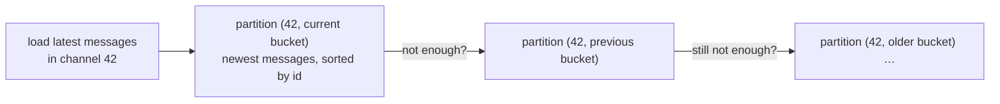
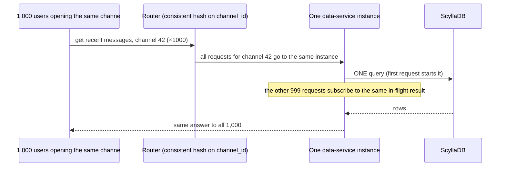
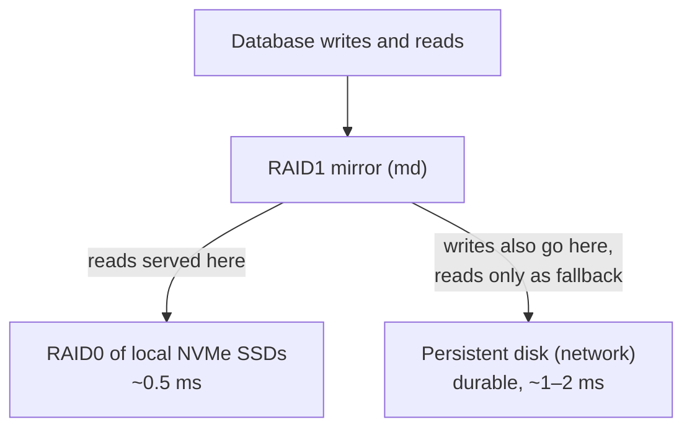

# Case Study: How Discord Stores Trillions of Messages

> **One line:** Discord went from one MongoDB replica set (2015) to a 12-node Cassandra cluster (2017) to 177 Cassandra nodes that paged on-call constantly (2022), and then to **72 ScyllaDB nodes** behind a layer of Rust "data services" that **coalesce duplicate requests**. Almost every concept from our [distributed KV store](../HLD/interviews/distributed-kv-store/README.md) and [chat system](../HLD/interviews/chat-system/README.md) interviews shows up, in production, with real failure stories.

This is a **case study**: how a real system evolved, from Discord's public engineering blog. No code. It pairs best with the chat interview (L4–L5) and the distributed KV store (L5–L6).

---

## 0. How much to trust each fact

| Mark | Meaning |
|---|---|
| ✅ | From Discord's own blog or press release (seen through search results; see note) |
| 🟡 | From secondary coverage (InfoQ, The New Stack, conference slides, summaries) |
| ❓ | Widely repeated but not verified |

> 💡 **Research note:** collected in October 2026. Discord's pages could not be opened directly from the research environment; facts come from search results that quote them. Bylines and exact dates were mostly not visible; years are reliable. The primary posts are linked so you can read them in full.

Primary sources:
- [How Discord Stores Billions of Messages](https://discord.com/blog/how-discord-stores-billions-of-messages) (2017)
- [How Discord Stores Trillions of Messages](https://discord.com/blog/how-discord-stores-trillions-of-messages) (2023)
- [How Discord Supercharges Network Disks for Extreme Low Latency](https://discord.com/blog/how-discord-supercharges-network-disks-for-extreme-low-latency) (Aug 2022)
- [How Discord Scaled Elixir to 5,000,000 Concurrent Users](https://discord.com/blog/how-discord-scaled-elixir-to-5-000-000-concurrent-users) (Jul 2017)
- [How Discord Indexes Billions of Messages](https://discord.com/blog/how-discord-indexes-billions-of-messages) (2017) and [… Trillions of Messages](https://discord.com/blog/how-discord-indexes-trillions-of-messages) (Apr 2025)

---

## 1. Timeline


- ✅ Discord started on a **single MongoDB replica set**. Around **100 million stored messages**, the data and indexes no longer fit in RAM and latency became unpredictable.
- ✅ At the time of the 2017 post, Discord was handling **well past 120 million messages a day**.
- ✅ They chose Cassandra because it was "the only database that fulfilled all of our requirements. We can just add nodes to scale it and it can tolerate a loss of nodes without any impact on the application."

> 📝 **Lesson:** the first database was fine for the first year. Starting simple and migrating when you understand your access patterns is normal, not a mistake.

---

## 2. The data model: partition by channel, bucket by time

✅/🟡 What Discord learned about its reads and writes (2017 post):
- Reads and writes were roughly **50/50**, and reads were **very random** (jumping to a mention from weeks ago, scrolling history).
- Channels are **wildly uneven**: a voice-focused server might send a message every few days; a huge public server sends thousands per minute.
- Every query happens **within one channel**.

So the primary key became (shown here as plain text):

```text
PRIMARY KEY ((channel_id, bucket), message_id)
  partition key  = (channel_id, bucket)   → which node(s) store it
  bucket         = a 10-day time window   → keeps any one partition bounded
  clustering key = message_id             → sorted inside the partition
```

- **`message_id` is a Snowflake ID** ✅: a 64-bit ID with the timestamp in its high bits, so sorting by ID = sorting by time, and two messages in the same millisecond still get different IDs (a plain `created_at` timestamp could collide). See [ID generation](../HLD/concepts/id-generation.md).
- **The bucket** 🟡: sized from the busiest channel so a partition never grows without bound. In Cassandra, very large partitions hurt (more memory and garbage-collection pressure while reading them).
- **Replication** ✅: each partition is stored on 3 nodes (replication factor 3).



> 📝 **Lesson:** this is exactly the chat interview's message store ([Chat L5](../HLD/interviews/chat-system/L5-senior.md)) and the "bucket large partitions by time" advice from [Distributed KV Store L6](../HLD/interviews/distributed-kv-store/L6-staff.md#4-operating-it-is-most-of-the-work), in a real company.

---

## 3. Problems they hit in 2017 (and fixed)

### 3.1 The message with no author ✅
During the dark launch (writing to both MongoDB and Cassandra), their error tracker found message rows with a **null `author_id`**, a required column.

- Cause: one user **edited** a message while another **deleted** it. In Cassandra, **every write is an upsert** (insert-or-update, no check whether the row exists). The delete removed the row; the edit then wrote only its own columns (key + new text), re-creating a partial row.
- Options: write the whole message on every edit (risks resurrecting deleted messages), or detect and clean up. They chose: if `author_id` is null when reading, **delete the row**.

> 📝 **Lesson:** "last write wins" databases don't stop concurrent edit + delete from producing half-rows. Your application must handle it. See [vector clocks & conflict resolution](../HLD/concepts/vector-clocks-and-conflict-resolution.md).

### 3.2 Tombstones from writing nulls ✅
In Cassandra, a delete is a write of a **tombstone** (a "deleted" marker), and **writing `null` to a column also creates a tombstone**.
- Their message schema had **16 columns**, but an average message set only about **4**. Writing all 16 created ~12 useless tombstones per message. Fix: only write non-null columns.
- Tombstones are kept for a grace period (default **10 days**) so repairs can spread deletes to all replicas. Because Discord ran repairs **nightly**, they lowered it to **2 days**.

### 3.3 The 20-second channel ✅
One channel took **20 seconds** to load: someone had deleted millions of messages, leaving one. Reading the channel meant scanning millions of tombstones to find the single live message.

> 📝 **Lesson:** deletes cost reads in LSM-based stores until compaction removes them. This is the "queues stored in Cassandra" anti-pattern from [Distributed KV Store L5 §3.6](../HLD/interviews/distributed-kv-store/L5-senior.md#36-storage-engine-lsm-tree) and [LSM trees](../HLD/concepts/lsm-trees-and-storage-engines.md).

---

## 4. 177 nodes and constant pages (2022)

✅ By early 2022 the cluster had **177 nodes** and trillions of messages. Latency was unpredictable, on-call was paged often, and maintenance (like repairs) had become too expensive to run. Three problems fed each other:

| Problem | What happened | Concept |
|---|---|---|
| **Hot partitions** ✅ | A huge server's busiest channel sends orders of magnitude more traffic than a small group's; heavy reads to one partition piled up concurrent queries on the nodes serving it. With QUORUM reads and writes, every query touching those nodes slowed down 🟡 | [Sharding](../HLD/concepts/sharding-and-replication.md), hot keys |
| **Compaction backlog** ✅ | Compaction fell behind; their fix was a "gossip dance": take a node out of rotation so it can compact without traffic, bring it back to receive hints, repeat | [LSM compaction](../HLD/concepts/lsm-trees-and-storage-engines.md), [hinted handoff](../HLD/concepts/hinted-handoff-and-sloppy-quorum.md) |
| **JVM garbage collection** ✅ | GC pauses caused big latency spikes; some were long enough that an operator had to reboot and "babysit" the node | [References & GC](../LLD/libraries/java/references-and-gc.md) |

💡 **GC pause:** in Java (and other garbage-collected runtimes), the runtime periodically stops or slows the program to free unused memory. A database node that freezes for seconds looks "down" to its peers and stalls every query routed to it.

---

## 5. The fix: ScyllaDB + data services + request coalescing

### 5.1 ScyllaDB ✅
A database **compatible with Cassandra's protocol and data model**, written in C++, so it has **no garbage collector**. Each CPU core owns its own slice of data ("shard per core"), which isolates workloads. Discord's summary: ScyllaDB "is most definitely not void of issues, it is void of a garbage collector".

### 5.2 Data services: a thin layer that protects the database ✅
Between Discord's API and the database, they added **data services written in Rust**: roughly one gRPC endpoint per database query, **no business logic**. Two features matter:



- **Request coalescing:** if many users ask for the same row at the same moment, the first request starts a database query and later identical requests **wait for that same result** instead of sending their own. A big server announcement that makes 100,000 people open one channel becomes a handful of database reads. Same as "single-flight" in [caching strategies](../HLD/concepts/caching-strategies.md) and the LRU interview's stampede protection ([LRU Cache interview](../LLD/interviews/lru-cache/README.md)).
- **Consistent-hash routing by channel:** all requests for one channel land on the **same** data-service instance, so coalescing actually sees the duplicates ([consistent hashing](../HLD/concepts/consistent-hashing.md)).

> 📝 **Lesson:** the hot-partition problem was partly solved **in front of** the database, not inside it. Absorbing duplicate reads upstream is often cheaper than making the database faster.

### 5.3 Migrating trillions of messages in days ✅/🟡
- 🟡 The standard Spark-based migrator was estimated at about **3 months**.
- ✅ They instead built a migrator in Rust (reusing the data-service library): it read Cassandra **token ranges** (slices of the hash ring), checkpointed progress locally in SQLite so it could resume, and streamed into ScyllaDB. Estimated time: **nine days**. 🟡 Conference slides cite a peak of about **3.2 million messages per second**.
- 🟡 It stalled at "99.9999%" because the last token ranges contained huge tombstone ranges; compacting that range fixed it.
- ✅ **Validation:** a small percentage of reads were sent to both databases and compared. **Cutover in May 2022.**

### 5.4 Results ✅

| | Cassandra (before) | ScyllaDB (after) |
|---|---|---|
| Nodes | 177 | **72** |
| Historical message fetch, p99 | 40–125 ms | **15 ms** |
| Message insert, p99 | 5–70 ms | **5 ms** |

✅ During a hugely watched football match, the post describes messages flooding in worldwide while the database wasn't "breaking a sweat". ❓ It's widely reported as the 2022 World Cup final; not confirmed in what we could see.

💡 **p99:** the latency that 99% of requests beat. Cutting p99 from "up to 125 ms" to a steady 15 ms is what removes the occasional slow load users notice.

---

## 6. The disk trick: local SSD speed with network-disk durability ✅

From the August 2022 post:
- On Google Cloud, **network-attached persistent disks** are durable but take about **1–2 ms** per operation; **local NVMe SSDs** take about **0.5 ms** but are lost if the machine fails.
- Linux caching layers they tried (dm-cache, lvm-cache, bcache) failed a whole read when the cache had a bad sector.
- What worked: **Linux software RAID (md)**: RAID0 across local SSDs for speed, and **RAID1 (mirror) between that and the persistent disk**, with the persistent disk marked **write-mostly** (read from it only if nothing else can serve). Reads come from fast local flash; every write also lands on the durable disk.



✅ **The cost later:** on startup, an instance spends about **40 minutes** syncing the RAID (copying from the persistent disk to the local SSDs), which contributed to slow recovery during an **authentication outage on 6 November 2023** ([Discord](https://discord.com/blog/authentication-outage)).

> 📝 **Lesson:** a clever durability trick changes your **recovery time**. Every design decision shows up again during an outage; ask "how long does a replacement node take to be useful?"

---

## 7. The rest of the system, briefly

- **Real-time gateway (Elixir)** ✅ (Jul 2017): each user's WebSocket connects to a *session* process; sessions subscribe to *guild* (server) processes, which fan out every event to connected sessions. Large guilds with 30,000 connected sessions fell behind (each send ~70 µs). Fixes included **Manifold** (send once per remote node, fan out locally) and a semaphore to stop millions of sessions stampeding lookups. The post reported nearly **5 million** concurrent users; a 2019 post reported **11 million**, using a Rust-written sorted set inside Elixir for member lists. Compare [Chat L5 §3.4](../HLD/interviews/chat-system/L5-senior.md#34-groups-fan-out-on-write-with-a-limit).
- **Search** ✅: messages are indexed in [Elasticsearch](../HLD/technologies/elasticsearch.md), sharded **per guild or DM**, indexed lazily (most users never search). The **2025 redesign** moved the indexing queue from Redis (which dropped messages when overloaded) to a durable pub/sub queue, split clusters into "cells" with a dedicated cell for the very largest servers, and reached about **40 Elasticsearch clusters**.
- **Scale** ✅: **200 million+ monthly active users** (Discord press release, 2025). There's no recent official messages-per-day figure; ❓ numbers like "4 billion a day" circulate without a primary source.

---

## 8. What to take into interviews

1. **Partition key = your query's scope** (channel), plus a **time bucket** to bound partition size; **sortable IDs** (Snowflake) as the clustering key.
2. **Every write is an upsert** in Cassandra-style stores: concurrent edit + delete can create half-rows. Plan for it.
3. **Deletes and nulls are writes (tombstones)** and slow reads until compacted; tune grace periods to your repair schedule.
4. **Hot partitions are a traffic problem**: coalesce duplicate reads upstream, routing by key with consistent hashing so duplicates meet.
5. **Runtime matters**: GC pauses in a database node become cluster-wide tail latency.
6. **Migrations need validation**: dual reads, compare, then cut over; build a resumable, checkpointed copier.
7. **Recovery time is part of the design**: fast disks with slow rebuilds can lengthen outages.

---

## 9. Not verified (help wanted)

- Bylines and exact publication dates of the 2017 and 2023 storage posts.
- How ScyllaDB's reverse-query performance issue (mentioned by Discord) was resolved.
- The migration's 3.2M messages/s peak and the "99.9999%" stall (secondary sources).
- Per-node storage figures (e.g. 9 TB vs 4 TB) quoted by secondary sources.
- The football match being the 2022 World Cup final.
- Any MAU figure above 200 million, and current messages per day.

## Related

- Interviews: [Chat System](../HLD/interviews/chat-system/README.md) · [Distributed KV Store](../HLD/interviews/distributed-kv-store/README.md)
- Concepts: [Sharding & replication](../HLD/concepts/sharding-and-replication.md) · [Consistent hashing](../HLD/concepts/consistent-hashing.md) · [LSM trees](../HLD/concepts/lsm-trees-and-storage-engines.md) · [Hinted handoff](../HLD/concepts/hinted-handoff-and-sloppy-quorum.md) · [Caching strategies](../HLD/concepts/caching-strategies.md) · [ID generation](../HLD/concepts/id-generation.md) · [Message ordering](../HLD/concepts/message-ordering-and-sequencing.md)
- Technologies: [Cassandra](../HLD/technologies/cassandra.md) · [Elasticsearch](../HLD/technologies/elasticsearch.md)
- See it work: [Hash ring + quorums + hinted handoff](../see-it-work/hash-ring-quorum/README.md)
- Other case studies: [WhatsApp vs Telegram](whatsapp-vs-telegram.md) · [Video platforms](video-upload-transcode-and-storage.md)

⬅️ [ROADMAP](../ROADMAP.md) · 🏠 [Home](../README.md)
