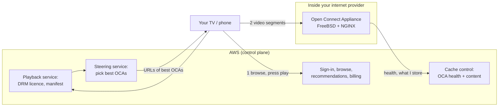
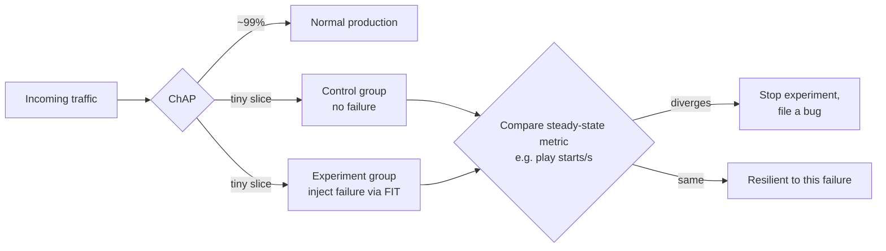

# Case Study: Netflix, Open Connect and Chaos Engineering

> **One line:** after a database corruption stopped DVD shipments for three days in 2008, Netflix spent seven years moving everything "before you press play" to AWS, built its own CDN (**Open Connect**) with free cache appliances inside internet providers for everything after you press play, and invented **chaos engineering**: deliberately breaking production (instances, zones, whole regions) so that real failures become boring.

This is a **case study**: from Netflix's tech blog, conference talks, papers and SEC filings. No code. Pairs with the [Video Streaming interview](../HLD/interviews/video-streaming/README.md) (especially L6) and [resilience patterns](../HLD/concepts/resilience-patterns.md). The upload/transcode side of Netflix is in the [video platforms case study](video-upload-transcode-and-storage.md); this page doesn't repeat it.

---

## 0. How much to trust each fact

| Mark | Meaning |
|---|---|
| ✅ | From Netflix's own posts, talks/slides or SEC filings (seen through search results) |
| 🟡 | From secondary coverage (press, InfoQ, republished talks) |
| ❓ | Widely repeated but not verified, or sources conflict |

> 💡 **Research note:** collected in October 2026 through search results; pages couldn't be opened directly from the research environment. Dates and numbers are as the sources state; conflicting ones are flagged.

---

## 1. Two halves: AWS for "before play", Open Connect for "after play"

✅ "Essentially everything before you hit 'play' happens in AWS" (Netflix, 2016). The bytes of the video itself come from Open Connect.

---

## 2. Moving to the cloud (2008–2016)

- ✅ **August 2008:** "a major database corruption" left Netflix unable to ship DVDs to members for **three days**. Netflix decided to move away from "vertically scaled single points of failure, like relational databases in our datacenter" toward horizontally scalable distributed systems in the cloud ([Netflix, 2016](https://about.netflix.com/en/news/completing-the-netflix-cloud-migration)).
- ✅ Chose AWS for "the greatest scale and the broadest set of services and features".
- ✅ Finished in **early January 2016**, after **seven years**, when the last data-centre hardware for streaming was shut down.
- 🟡 Their December 2010 post "5 Lessons We've Learned Using AWS" already said "the best way to avoid failure is to fail constantly", and introduced Chaos Monkey (§4).

> 📝 **Lesson:** the move wasn't "lift and shift". It replaced single big databases with many small, replicated, stateless services, which is why chaos engineering was possible at all: you can only kill instances freely if nothing depends on one instance.

---

## 3. Open Connect: a CDN inside your ISP

### Launch and terms
- ✅ Announced **June 4, 2012**; about 5% of Netflix data was already served by it then; commercial CDNs kept "for a few years" ([Netflix](https://about.netflix.com/news/announcing-the-netflix-open-connect-network)). By 2016, Open Connect delivered **100% of video**, close to **90%** through direct connections with ISPs (details in the [video case study](video-upload-transcode-and-storage.md#5-getting-the-bytes-to-viewers-caches-inside-isps)).
- ✅ Appliances are **free** to qualifying ISPs; the **ISP provides power, space and connectivity**. A rough qualifying bar is about **5 Gbps of peak Netflix traffic**. Embedded appliances serve only the client IP ranges the ISP advertises to them (over BGP, the internet's route-announcement protocol) ([Open Connect overview](https://openconnect.netflix.com/Open-Connect-Overview.pdf)).

Why ISPs agree: Netflix traffic served from inside their own network doesn't cross their expensive links to the rest of the internet.

### The appliance (OCA)
- ✅ **Software:** FreeBSD (a Unix operating system) + NGINX (a web server) + `sendfile` (the kernel copies file data straight to the network socket, never through the application) + **kTLS** (encryption done in the kernel, or even on the network card).
- ❓ **Hardware** has changed many times and Netflix's own pages show different generations: e.g. storage-heavy 2U boxes with hundreds of TB of disks around ~100 Gbps, and flash boxes with fewer TB but higher throughput. Cite ranges with dates, not one number.

### How far one server was pushed (engineering results, not product specs) ✅
Talks by Netflix engineer Drew Gallatin:

| Year | Milestone | Main trick |
|---|---|---|
| ~2017 | **~90+ Gbps** from one appliance (TLS-heavy traffic first around 58 Gbps) | Network stack and TLS work in FreeBSD |
| 2019 | 85 → **165 Gb/s** on AMD EPYC | NUMA-aware network stack (keep data on the memory next to the CPU using it) |
| 2021 | **400 Gb/s** | **NIC kTLS offload**: the network card encrypts; software TLS alone hit ~240 Gb/s, limited by memory bandwidth |
| 2022–23 | **~800 Gb/s** ❓ (sources say "720 in production" and "first 800 Gb/s server") | Two-socket AMD, NIC TLS offload, async sendfile |

> 📝 **Lesson:** at this level the bottleneck is **memory bandwidth**, not CPU or disk: every byte served is read from storage into memory and out to the network card. Serving 400 Gb/s needs roughly 200 GB/s of memory bandwidth. Offloading encryption to the NIC halves the trips through memory. Same "avoid copying bytes" idea as Kafka's zero-copy ([Kafka](../HLD/technologies/kafka.md)).

### Steering: which appliance serves you ✅
- Appliances report health, routability and which content they hold to a **cache control** service in AWS.
- When you press play, a **steering** service picks the best appliances by content availability, network proximity, health and capacity, builds URLs, and the playback service hands them to your device.
- Netflix's ISP decks describe preferring **embedded** appliances over private peering over public exchange points; once an ISP has embedded appliances, peering links are mostly backup, fill and long-tail content.

Compare with DNS-based CDNs: Netflix decides per playback in its own control plane rather than relying on DNS answers ([DNS](../HLD/technologies/dns.md), [CDN](../HLD/technologies/cdn.md)).

---

## 4. Chaos engineering: breaking things on purpose

### The Simian Army (2010–2012)
- 🟡 **Chaos Monkey** randomly terminates production instances, so every service must survive losing any instance. Mentioned in December 2010; open-sourced **July 30, 2012**, by which time it had terminated **65,000+** instances.
- ✅ The **Simian Army** post (July 2011) described more "monkeys" ([Netflix TechBlog](https://techblog.netflix.com/2011/07/netflix-simian-army.html)):
  - **Latency Monkey:** adds artificial delays to calls (very large delays simulate a service being down).
  - **Conformity Monkey:** shuts down instances that break best practices (e.g. not in an auto-scaling group).
  - **Doctor, Janitor, Security Monkeys:** health checks, unused-resource cleanup, security misconfigurations.
  - 🟡 **Chaos Gorilla:** simulates losing an entire availability zone.
- 🟡 **Chaos Kong:** simulates losing an entire **AWS region** and evacuates traffic to the others. When DynamoDB in us-east-1 failed for several hours on **September 20, 2015**, regular Kong exercises meant Netflix could fail over.

### From monkeys to controlled experiments
- 🟡 **FIT (Failure Injection Testing, 2014):** failure instructions are attached at the edge gateway (Zuul) and travel with a request, so a test can fail one account, one device type, or a tiny percentage of traffic: a controlled **blast radius** (how much can be affected), which random monkeys lacked.
- ✅ **ChAP (Chaos Automation Platform, 2016–2017):** splits a tiny slice of traffic into a **control** group and an **experiment** group, injects failures only into the experiment group, compares business metrics (e.g. playback starts per second), and **stops automatically** if they diverge ([paper, arXiv 2017](https://arxiv.org/abs/1702.05849)).
- 🟡 **Principles of Chaos Engineering** (published 2015): define a measurable **steady state**, hypothesise it holds under a real-world event, inject the event **in production**, automate it continuously, minimise blast radius.

> 📝 **Lesson:** chaos engineering is the scientific method applied to resilience: hypothesis, control group, experiment, small blast radius, automatic abort. "Killing random servers" was just the first, crude version. Infra analogy: like a canary deploy, but the change being tested is a failure.

### Outages that shaped it
- 🟡 **Christmas Eve 2012:** an AWS Elastic Load Balancing failure in us-east (an AWS maintenance process deleted load-balancer state) took Netflix down for many US, Canada and Latin America users for hours. It pushed Netflix toward **active-active multi-region**.
- 🟡 **Active-active** across us-east and us-west was completed in **2013**; later eu-west joined. Evacuating a whole region was cut from **45 minutes to 7 minutes** without extra cost: detect, scale up the receiving regions, proxy traffic to them, then switch DNS. Reserved capacity covers **one** region failing at a time.
- ❓ How Netflix fared in the April 2011 AWS us-east EBS outage is often cited as a success story; not verified here.

---

## 5. The resilience libraries everyone copied

| Library | What it did | Status |
|---|---|---|
| **Hystrix** (open-sourced Nov 2012) | Circuit breakers, bulkheads (separate thread pools per dependency), fallbacks; Netflix reported tens of billions of isolated calls per day | 🟡 In maintenance since ~2018; Netflix recommends resilience4j and **adaptive concurrency limits** instead |
| **concurrency-limits** (~2018) | Treats "how many requests may be in flight" like TCP's congestion window: grows while latency is fine, shrinks when it rises | ✅ Netflix TechBlog "Performance Under Load" |
| **Eureka** | Service registry: instances register, clients discover healthy instances | ✅ ([service discovery](../HLD/concepts/service-discovery.md)) |
| **Zuul** (2013), **Zuul 2** (Netty-based) | Edge gateway for all device traffic; Zuul 2 moved from blocking threads to non-blocking I/O | ✅/🟡 ([API gateway](../HLD/interviews/api-gateway/README.md), [epoll](../under-the-hood/epoll.md)) |
| **Ribbon** | Client-side load balancing | ✅ In maintenance |
| **Spinnaker** (2015) + **Kayenta** (2018) | Multi-cloud continuous delivery; automated canary analysis comparing canary vs baseline metrics statistically | ✅/🟡 |

> 📝 **Lesson:** the move from Hystrix (fixed thresholds you tune by hand) to adaptive concurrency limits (the system finds its own limit from latency) mirrors the move from static rate limits to [back-pressure](../LLD/concepts/back-pressure.md) and [resilience patterns](../HLD/concepts/resilience-patterns.md) driven by measurements.

---

## 6. Data at Netflix scale (briefly)

- 🟡 **EVCache** (memcached-based cache): numbers grow by year, e.g. QCon London 2016 slides cite ~30M requests/s and ~2 trillion requests/day; cross-region replication sends change metadata via a queue and a writer in the other region applies it.
- 🟡 **Cassandra:** a 2011 benchmark scaled linearly from 48 to 288 nodes, reaching over 1.1M writes/s with 3× replication ([Cassandra](../HLD/technologies/cassandra.md)).

---

## 7. Scale ✅

- Netflix's Q4 2024 shareholder letter (January 2025, SEC filing): about **302 million paid memberships** in 190+ countries; it was the last quarter Netflix reported subscriber counts. 🟡 Press reports of the Q4 2025 letter say it passed **325 million**.
- 🟡 Sandvine estimates put Netflix at about **15%** of global downstream internet traffic in 2018 and 2022.

---

## 8. What to take into interviews

1. **Split control plane from data plane:** the cloud for logic, a purpose-built network for bytes ([API Gateway L6](../HLD/interviews/api-gateway/README.md) has the same split).
2. **Put the bytes inside the ISP** when you're a top traffic source: both sides save money.
3. **At hundreds of Gb/s per server, memory bandwidth is the limit:** avoid copies, offload encryption.
4. **Design for instance, zone and region loss, then prove it** with controlled experiments in production.
5. **Blast radius and automatic abort** turn chaos from reckless into routine.
6. **Region evacuation needs reserved capacity and practice:** 45 minutes → 7 minutes came from repetition.

---

## 9. Not verified (help wanted)

- Netflix's experience in the April 2011 AWS EBS outage.
- Exact dates of several posts (the 100 Gbps appliance post, "Performance Under Load", active-active posts), Eureka's and Zuul 2's open-source dates.
- Appliance hardware specs (sources show different generations).
- The 800 Gb/s timeline (720 Gb/s in production vs "first 800 Gb/s server").
- Off-peak fill window hours (they vary per ISP).
- Q4 2025 membership figure (press reports only).

## Related

- Interviews: [Video Streaming](../HLD/interviews/video-streaming/README.md) · [API Gateway](../HLD/interviews/api-gateway/README.md)
- Concepts: [Resilience patterns](../HLD/concepts/resilience-patterns.md) · [Service discovery](../HLD/concepts/service-discovery.md) · [Adaptive bitrate streaming](../HLD/concepts/adaptive-bitrate-streaming.md) · [Observability](../HLD/concepts/observability.md)
- Technologies: [CDN](../HLD/technologies/cdn.md) · [DNS](../HLD/technologies/dns.md) · [Cassandra](../HLD/technologies/cassandra.md)
- Under the Hood: [epoll](../under-the-hood/epoll.md) · [How the video player picks a quality](../under-the-hood/adaptive-bitrate-player.md)
- Other case studies: [Video platforms](video-upload-transcode-and-storage.md) · [Uber](uber-from-monolith-to-h3-and-microservices.md) · [Discord](discord-message-storage.md)

⬅️ [ROADMAP](../ROADMAP.md) · 🏠 [Home](../README.md)
