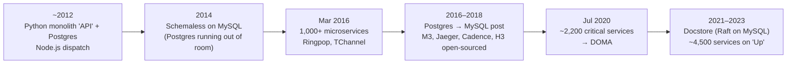
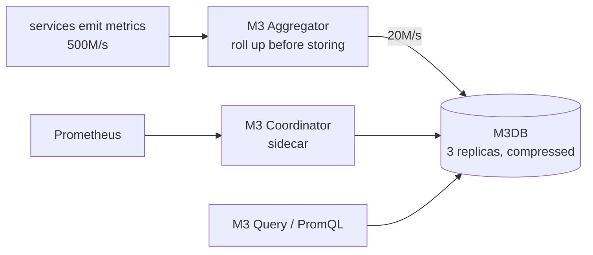

# Case Study: Uber, from a Python Monolith to H3, Thousands of Microservices, and M3

> **One line:** Uber started as two programs (a Python monolith on PostgreSQL and a Node.js dispatch service), split into **1,000+ microservices by 2016**, then had to tame the sprawl (~2,200 critical services by 2020) with **domain-oriented architecture**; along the way it built tools the whole industry now uses: **H3** (hexagonal geospatial index), **Ringpop** (consistent hashing + gossip), **Schemaless/Docstore** (MySQL-based stores), **Cadence** (workflows), **Jaeger** (tracing) and **M3** (metrics). Almost every one maps to an interview in this repo.

This is a **case study**: how a real company's architecture evolved, from Uber's engineering blog, open-source docs and SEC filings. No code. Read the [Ride-Sharing interview](../HLD/interviews/ride-sharing/README.md) first; this page shows what Uber itself did.

---

## 0. How much to trust each fact

| Mark | Meaning |
|---|---|
| ✅ | From Uber's own blog/docs, open-source READMEs, or SEC filings |
| 🟡 | From a secondary source (talk recaps, press, High Scalability) |
| ❓ | Widely repeated but not verified |

> 💡 **Research note:** collected in October 2026. Uber's blog couldn't be opened directly from the research environment, so blog facts come from search results quoting the posts; GitHub READMEs (H3, M3, Cadence, Ringpop) were read directly. Dates and numbers are as the sources state them.

---

## 1. Timeline

---

## 2. From monolith to microservices, and back toward structure

- 🟡 Uber started with two services: **dispatch** in Node.js (MongoDB, later Redis) and **"API"**, a Python monolith on PostgreSQL ([High Scalability](https://highscalability.com/brief-history-of-scaling-uber/)). ✅ Uber's own 2016 post confirms the early backend was "a monolithic backend application written in Python that used Postgres".
- 🟡 Monolith pains: features conflicting, slow engineering, risky deploys. The split began around 2013; the effort to break up "API" was called **Project Darwin** (QCon 2016 abstract: "migrations are not easy, and take a long, long time").
- ✅ **1,000+ production services by early March 2016** (Matt Ranney, GOTO Chicago 2016, *What I Wish I Had Known Before Scaling Uber to 1000 Services*).
- ✅ By **July 2020**: "around **2,200 critical microservices**" and the trade-offs had become painful ([Introducing Domain-Oriented Microservice Architecture](https://www.uber.com/blog/microservice-architecture/)).
- ✅ By **September 2023**: about **4,500 stateless microservices** deployed 100,000+ times a week by ~4,000 engineers, on a multi-cloud platform called **Up** ([Uber blog](https://www.uber.com/blog/up-portable-microservices-ready-for-the-cloud/)).

### DOMA: grouping services so humans can reason about them ✅
- **Domains:** collections of related microservices become the unit of design, not single services.
- **Layers:** a domain's layer decides what it may depend on (upper layers depend on lower ones, not the reverse).
- **Gateways:** one entry point per domain; callers don't reach into its internal services.
- **Extensions:** defined extension points, so other teams add logic (e.g. custom validation) without changing the domain's code.
- Reported result: platform support costs "often dropped an order of magnitude".
- ❓ The exact names of the layers (often quoted as infrastructure, business, product, presentation, edge) weren't verified.

> 📝 **Lesson:** microservices solve team scaling, then create a new problem: thousands of services nobody can hold in their head. The fix wasn't going back to a monolith, it was **structure on top**: domains, layers, gateways. That's the "modular boundaries" answer for any L6 "monolith vs microservices" question.

---

## 3. Dispatch: consistent hashing, gossip and hexagons

### Ringpop and TChannel (2015–2016) ✅
- Open-sourced in **August 2015** as Uber's first open-source projects, both built in the first half of 2015; Ringpop was used for real-time dispatch ([Uber blog](https://www.uber.com/blog/uber-open-source-site/)).
- **Ringpop** (Node.js): membership and failure detection with a **SWIM-style gossip** protocol, a **consistent hash ring** so work moves automatically when the cluster resizes, and **request forwarding** to the node that owns a key ([GitHub README](https://github.com/uber/ringpop-node), now no longer actively developed).
- **TChannel:** Uber's RPC protocol multiplexing many requests over one TCP connection, built because plain HTTP was too slow for gossip and forwarding (🟡). The repository was archived in 2022.
- 🟡 **DISCO**, the dispatch optimisation system, matched all supply and demand, planned ahead, and used **S2 cell IDs** (Google's square-cell geospatial index) to shard supply (QCon London 2015, recapped).

> 📝 **Lesson:** this is exactly [consistent hashing](../HLD/concepts/consistent-hashing.md) + [gossip & failure detection](../HLD/concepts/gossip-and-failure-detection.md) from the distributed KV store, applied to an application tier: "send all updates for this area to the one server that owns it". See it run in [hash ring + quorums](../see-it-work/hash-ring-quorum/README.md).

### H3: why hexagons ✅
**H3** was announced in **June 2018** ([H3 blog post](https://www.uber.com/blog/h3/)) for "efficiently optimizing ride pricing and dispatch" and for analysing spatial data. From the [H3 docs](https://github.com/uber/h3):
- **Why hexagons:** a square has 2 kinds of neighbour (side and corner, at different distances), a triangle 3; **a hexagon's 6 neighbours are all the same distance away**. Rings of neighbours approximate circles, which is what "nearby" means for drivers.
- **A hierarchy of 16 resolutions** (0–15). Each finer resolution has ~7 child cells per parent (cell area ÷ 7, edge length ÷ √7). Moving between parent and child is a few bit operations on a **64-bit cell ID**.
- **Built on an icosahedron** (a 20-sided solid) projected onto the Earth; resolution 0 has 122 base cells, and every resolution has exactly **12 pentagons**, placed in the oceans.

| Resolution | Average hexagon area | Average edge length |
|---|---|---|
| 7 | ~5.2 km² | ~1.4 km |
| 8 | ~0.74 km² | ~530 m |
| 9 | ~0.1 km² | ~200 m |
| 15 | < 1 m² | ~0.5 m |

- ❓ Surge pricing is widely described as computed per hexagon; only secondary sources state this, and no Uber source states which resolution is used.

> 📝 **Lesson:** "find drivers near a rider" = look up the rider's cell and its neighbour rings, then rank candidates. That's [geospatial indexing](../HLD/concepts/geospatial-indexing.md) and [Ride-Sharing L5](../HLD/interviews/ride-sharing/L5-senior.md).

---

## 4. Storage: leaving Postgres, building on MySQL

### Why Uber switched from Postgres to MySQL (July 2016) ✅
The post by Evan Klitzke ([Uber blog](https://www.uber.com/blog/postgres-to-mysql-migration/)) listed:
- **Write amplification:** Postgres indexes point to the physical location of a row version, so updating a row that moves requires updating **every index**, even ones on unchanged columns. InnoDB's secondary indexes point to the **primary key** instead (one level of indirection), so only affected indexes change.
- **Replication** sent that amplified physical change stream across data centres.
- A **Postgres 9.2 bug** that corrupted data and replicated the corruption; painful **major-version upgrades**.
- 🟡 The post was debated: Postgres experts argued several issues were configuration or version specific. Both sides are worth reading as a lesson in **matching storage internals to your write pattern** ([PostgreSQL](../HLD/technologies/postgresql.md), [LSM vs B-trees](../HLD/concepts/lsm-trees-and-storage-engines.md)).

### Schemaless (2014–2016) → Docstore (2021) ✅
- **Schemaless** began because in early 2014 Uber was running out of Postgres capacity for trip data. It's an **append-only, sharded key-value store on MySQL** for JSON, "very similar to Google's Bigtable": immutable cells addressed by (row key, column name, version), with triggers (publish on change) and global indexes ([Uber blog, Jan 2016](https://www.uber.com/blog/schemaless-part-one-mysql-datastore/)).
- **Docstore** (Feb 2021): Schemaless evolved into a distributed SQL database with **strict serializability per partition**, MySQL as the storage engine and **Raft** replicating transactions: a CP design ([Uber blog](https://www.uber.com/blog/schemaless-sql-database/)). Compare [Distributed KV Store L6](../HLD/interviews/distributed-kv-store/L6-staff.md#2-the-cp-alternative-multi-raft-ranges).

### Cassandra at scale ✅
A managed Cassandra service since 2016: by 2023, **tens of millions of queries per second**, petabytes of data, tens of thousands of nodes in hundreds of clusters ([Uber blog, Jul 2023](https://www.uber.com/blog/how-uber-optimized-cassandra-operations-at-scale/)). See [Cassandra](../HLD/technologies/cassandra.md) and the [Discord case study](discord-message-storage.md) for the same database's operational pain at another company.

---

## 5. Data and streaming

- ✅ **Kafka:** "one of the largest deployments of Apache Kafka in the world, processing **trillions of messages** and multiple petabytes of data per day" (Uber blog, Dec 2020 and Apr 2022), used for app events, stream processing input, database changelogs and data-lake ingestion. **uReplicator** (2016) replicates Kafka across data centres ([Kafka](../HLD/technologies/kafka.md)).
- ✅ **Apache Hudi:** created at Uber (2016), open-sourced 2017, an Apache top-level project since June 2020: incremental processing on the data lake (update/delete records in big tables instead of rewriting whole partitions).
- ✅ **Presto:** about 20 clusters, 10,000+ nodes, ~500,000 queries per day (Uber blog, Nov 2024).
- ✅ **Michelangelo** (2017): ML platform for training, deploying and monitoring models; **DeepETA** predicts a correction on top of the routing engine's ETA (❓ blog date not verified; paper on arXiv, 2022).

---

## 6. Reliability tooling the industry adopted

| Tool | What it is | Facts |
|---|---|---|
| **Cadence** | Durable workflow engine: long-running business processes that survive crashes (retries, timers, state) | ✅ Open-sourced 2017; used by 1,000+ services at Uber; CNCF Sandbox in 2025. Its creators founded **Temporal** (2019, ❓ exact fork date debated). Compare [sagas](../HLD/concepts/sagas-and-distributed-transactions.md) and the [Task Scheduler](../LLD/interviews/task-scheduler/README.md) |
| **Jaeger** | Distributed tracing | ✅ Created at Uber in 2015, open-sourced 2016–2017, CNCF graduated Oct 2019 ([observability](../HLD/concepts/observability.md)) |
| **M3** | Metrics platform | See §7 |

---

## 7. M3: Uber's metrics platform ✅

From [M3: Uber's Open Source, Large-scale Metrics Platform for Prometheus](https://www.uber.com/blog/m3/) (Aug 2018) and the [M3 repository](https://github.com/m3db/m3):

- **History:** Graphite until late 2014; the first M3 (2015) used open-source parts (statsite for aggregation, Cassandra for storage, Elasticsearch for indexing). Uber outgrew each: e.g. Cassandra's compaction spent CPU, memory and disk rewriting data. So they built **M3DB** (a distributed time-series database with its own reverse index), **M3 Aggregator**, **M3 Query** and **M3 Coordinator** (a Prometheus sidecar for long-term, multi-tenant storage).
- **Compression:** M3TSZ, an extension of Facebook's Gorilla compression ([time-series compression](../HLD/concepts/time-series-compression-and-downsampling.md)).
- **Writes:** quorum writes to **3 replicas** per region.
- **Scale in August 2018:** **6.6 billion time series**, **500 million metrics/s aggregated**, **20 million metrics/s persisted** after aggregation. (Read rates in the billions of data points per second were *query* volume, reported separately; don't confuse them with ingestion.)

> 📝 **Lesson:** 500M/s in, 20M/s stored: **aggregating before storage** cut stored volume by 500 ÷ 20 = **25×**. That's the main idea of [Metrics & Monitoring L6 §6](../HLD/interviews/metrics-monitoring/L6-staff.md#6-what-the-biggest-companies-built).

---

## 8. Scale today ✅

From Uber's Q4 2024 earnings release (SEC filing, Feb 2025): **3.07 billion trips** in the quarter, about **33 million trips per day**, and **171 million monthly active platform consumers** (people who took a ride or received a delivery). Summing the four 2024 quarters (2.6 + 2.8 + 2.9 + 3.07 billion) gives roughly **11.4 billion trips in 2024** (our arithmetic, not a reported figure).

Per second: 33,000,000 ÷ 86,400 ≈ **380 trips started per second on average**, far more at peak, and each trip generates a stream of location updates every few seconds.

---

## 9. What to take into interviews

1. **Monolith → microservices is a team-scaling decision**, and it creates a new scaling problem (too many services) solved by **domains, layers and gateways**.
2. **Application-level sharding** with consistent hashing + gossip (Ringpop) is how stateful real-time services scale.
3. **Hexagonal cells** (H3) make "nearby" uniform; hierarchy makes zooming cheap.
4. **Storage choices follow write patterns**: Postgres vs InnoDB index design; append-only Schemaless; Raft-replicated Docstore when correctness mattered more.
5. **Durable workflows** (Cadence) replace hand-rolled retry/timer/state code for long business processes.
6. **Aggregate metrics before storing them** (M3): 25× less to store.

---

## 10. Not verified (help wanted)

- A "~4,000 microservices in 2019" figure often quoted (no primary source found).
- DOMA layer names; H3 open-source month in 2018; the resolution Uber uses for surge; S2 cell level in early dispatch.
- TChannel's replacement (often said to be YARPC/gRPC).
- DeepETA's blog date and architecture details; AthenaX's open-source year.
- Temporal's exact fork date (2019 commonly cited; founders say they left Uber in 2018).

## Related

- Interviews: [Ride-Sharing](../HLD/interviews/ride-sharing/README.md) · [Metrics & Monitoring](../HLD/interviews/metrics-monitoring/README.md) · [Distributed KV Store](../HLD/interviews/distributed-kv-store/README.md) · [API Gateway](../HLD/interviews/api-gateway/README.md) (gateways per domain)
- Concepts: [Geospatial indexing](../HLD/concepts/geospatial-indexing.md) · [Consistent hashing](../HLD/concepts/consistent-hashing.md) · [Gossip & failure detection](../HLD/concepts/gossip-and-failure-detection.md) · [Sagas](../HLD/concepts/sagas-and-distributed-transactions.md) · [Observability](../HLD/concepts/observability.md)
- Technologies: [PostgreSQL](../HLD/technologies/postgresql.md) · [Cassandra](../HLD/technologies/cassandra.md) · [Kafka](../HLD/technologies/kafka.md) · [Prometheus & TSDBs](../HLD/technologies/prometheus-and-time-series-databases.md)
- Other case studies: [Discord](discord-message-storage.md) · [WhatsApp vs Telegram](whatsapp-vs-telegram.md) · [Video platforms](video-upload-transcode-and-storage.md)

⬅️ [ROADMAP](../ROADMAP.md) · 🏠 [Home](../README.md)
