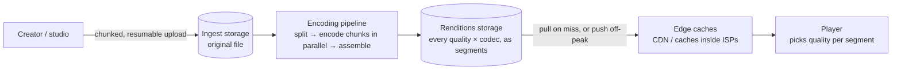
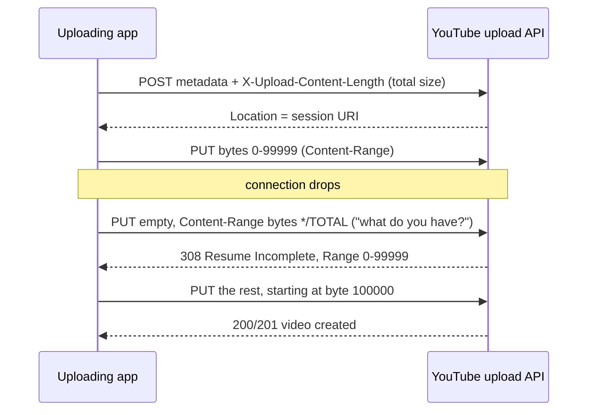
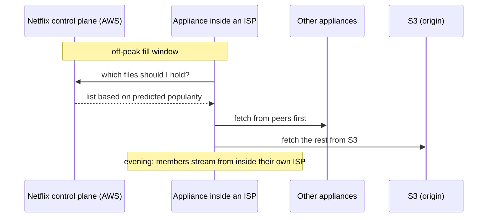

# Case Study: How Video Platforms Upload, Transcode, Store and Stream Every Quality

> **One line:** when you upload a video, the platform keeps your original, turns it into a **ladder** of versions (240p … 4K, often in several codecs), cuts each version into **small segment files**, stores them in giant object stores, and copies the popular ones into **cache servers next to (or inside) your internet provider**, so your player can switch quality every few seconds. YouTube, Netflix and Meta each do this differently, and their differences are the lessons.

This is a **case study**, not an interview: how real systems work, from public engineering posts, docs and papers. No code. Read the [Video Streaming interview](../HLD/interviews/video-streaming/README.md) product page first if terms like *rendition* or *manifest* are new.

---

## 0. How much to trust each fact

| Mark | Meaning |
|---|---|
| ✅ | From the company's own docs, blog, standard or paper (source and year given) |
| 🟡 | From a secondary source (press, vendor write-up, summaries). Probably right, not confirmed by the company |
| ❓ | Widely repeated but not verified, or the numbers don't fully reconcile |

> 💡 **Research note:** collected in October 2026 through search results pointing at the sources linked. The pages themselves could not be opened from the research environment, so exact wording wasn't re-read. Numbers and limits change; check the linked page if one matters to you.

---

## 1. The whole journey in one picture

Each arrow is a section below: **upload** (§2), **encode** (§3), **store** (§4), **deliver** (§5), **play** (§6).

---

## 2. Getting a big file in: chunked and resumable uploads

### YouTube: a resumable session ✅
From the [YouTube Data API resumable upload guide](https://developers.google.com/youtube/v3/guides/using_resumable_upload_protocol) (current docs):

- The **session URI** is the handle for the whole upload. If the session has expired, the server answers `404` and the upload starts over.
- Google Cloud Storage uses the same idea; a resumable upload must finish within **one week** of starting ✅ ([GCS docs](https://docs.cloud.google.com/storage/docs/resumable-uploads)). 🟡 A guide points out that whoever has the session URI can continue the upload, so treat it like a password.

### S3 multipart: many parts, stitched at the end ✅
From the [S3 limits page](https://docs.aws.amazon.com/AmazonS3/latest/userguide/qfacts.html) (current):
- Parts of **5 MiB to 5 GiB** (the last part may be smaller), at most **10,000 parts**.
- Maximum object size was raised from **5 TB to 50 TB** in December 2025 ✅ ([AWS announcement, 2 Dec 2025](https://aws.amazon.com/about-aws/whats-new/2025/12/amazon-s3-maximum-object-size-50-tb/)). ❓ The limits table reportedly says 48.8 TiB, which doesn't exactly match "50 TB" in either unit; check the current docs.
- Part size caps file size: 5 MiB × 10,000 parts ≈ 48.8 GiB, so bigger files need bigger parts (arithmetic).
- **Pre-signed URLs** let a phone upload straight to S3 without your credentials; they can be valid up to **7 days** when created with the SDK/CLI ✅ ([S3 docs](https://docs.aws.amazon.com/AmazonS3/latest/userguide/ShareObjectPreSignedURL.html)).

### tus: an open protocol for the same thing ✅
[tus](https://tus.io/protocols/resumable-upload) (core spec 1.0.0, 2016): `POST` with `Upload-Length` creates an upload, `HEAD` returns `Upload-Offset` (how much arrived), `PATCH` sends bytes from that offset. An IETF working draft for standard resumable uploads followed in 2022 (❓ whether it's an RFC yet wasn't checked).

### Video platforms as a service ✅
- **Cloudflare Stream** "direct creator uploads": your backend asks for a one-time upload URL so your API token never reaches the phone; uploads **over 200 MB must use tus** ([docs](https://developers.cloudflare.com/stream/uploading-videos/direct-creator-uploads/)).
- **Mux** direct uploads: your backend creates an authenticated, resumable URL; the client PUTs chunks with `Content-Range` ([docs](https://www.mux.com/docs/guides/upload-files-directly)).

### Netflix: studios deliver masters, not phone videos ✅
Partners deliver **IMF** packages (Interoperable Master Format, a studio standard for high-quality master files) through **Netflix Backlot**, with validation steps (including Netflix's open-source validator Photon) before and after upload ([Backlot help](https://backlothelp.netflix.com/hc/en-us/articles/115000614752-Backlot-Delivery-Instructions-for-IMF)). Different problem: few uploads, enormous files, strict quality checks.

> 📝 **Lesson:** every serious platform does the same three things: **upload in parts**, **ask "how much did you get?" after a failure**, and **send bytes straight to storage** with a temporary URL. See [resumable & chunked uploads](../HLD/concepts/resumable-and-chunked-uploads.md). (Telegram does the same with 512 KB parts: [WhatsApp vs Telegram](whatsapp-vs-telegram.md).)

---

## 3. Turning one file into many qualities

### The ladder, and why a fixed one wastes bits
💡 A **bitrate ladder** is the list of (resolution, bitrate) versions a video is encoded into.

- 🟡 Netflix's old **fixed ladder** went from 320×240 at **235 kbps** to 1080p at **5,800 kbps** for every title ([The Register, Dec 2015](https://www.theregister.com/2015/12/16/netflix_per_title_encode_optimization/), reporting Netflix's post).
- 🟡 **Per-title encoding** (Netflix, December 2015): give each title its own ladder. Simple animation reached 1080p at about **1,750 kbps**, while hard-to-compress action still looked blocky at 5,800 kbps.
- 🟡 **Dynamic Optimizer / shot-based encoding** (Netflix, March 2018): choose resolution and compression **per shot** to maximise visual quality within a bitrate budget ([paper on arXiv](https://arxiv.org/pdf/1808.03898)). Quality is measured with **VMAF** (Netflix's perceptual quality score, open-sourced 2016, trained on human ratings).
- 🟡 Applied to 4K in 2020, Netflix reported about **50% lower bitrate at the same quality** ([Netflix TechBlog, 2020](https://netflixtechblog.com/optimized-shot-based-encodes-for-4k-now-streaming-47b516b10bbb)).

### Split, encode in parallel, reassemble
- ✅ A Netflix engineer at QCon: content is broken into chunks of "about 30 seconds to a couple of minutes", encoded independently, and reassembled; one 30-minute episode can produce about **250,000 work items** ([InfoQ talk](https://www.infoq.com/presentations/video-encoding-netflix)).
- 🟡 Netflix's current media platform **Cosmos** (described publicly around March 2021) replaced the older "Reloaded": an API layer (Optimus), a workflow engine that runs steps as a DAG with parallel fan-out (Plato), and serverless encoding functions packaged as containers (Stratum) ([Netflix TechBlog](https://netflixtechblog.com/the-netflix-cosmos-platform-35c14d9351ad)).

That's exactly the chunked DAG in [Video Streaming L5 §3.1](../HLD/interviews/video-streaming/L5-senior.md#31-parallel-chunked-transcoding).

### Which codec for which video? Spend compute where it saves bandwidth
- 🟡 **Netflix AV1:** first on Android in February 2020 for selected titles (~20% better compression than VP9 claimed); by **December 2025** Netflix reported AV1 serving about **30% of viewing**, with about **one-third less bandwidth** than AVC/HEVC and fewer buffering interruptions; H.264 is still the most used ([Netflix TechBlog, 2025](https://netflixtechblog.com/av1-now-powering-30-of-netflix-streaming-02f592242d80)).
- ✅/🟡 **Meta's rule:** advanced encodings go to videos where they pay off: priority ≈ (compression gain × predicted watch time) ÷ compute cost, with an ML model predicting watch time ([Meta engineering, Apr 2021](https://engineering.fb.com/2021/04/05/video-engineering/how-facebook-encodes-your-videos/)); AV1 is used for Reels with high projected watch time ([Feb 2023](https://engineering.fb.com/2023/02/21/video-engineering/av1-codec-facebook-instagram-reels/)).
- ✅ **YouTube** asks uploaders for H.264 in MP4 with a "closed GOP" (each group of frames decodes on its own) and says **VP9** is needed to watch new 4K uploads in 4K ([YouTube upload settings](https://support.google.com/youtube/answer/1722171)). 🟡 YouTube was testing AV1 by 2018.

### Custom chips for encoding
- ✅/🟡 **YouTube Argos VCU** (2021): a video-encoding chip; Google claimed "up to 20–33x improvements in compute efficiency" compared with its previous optimised software system; each card has 2 chips × 10 encoder cores, each core encoding **2160p in real time at up to 60 fps** ([YouTube blog](https://blog.youtube/inside-youtube/new-era-video-infrastructure/); paper at ASPLOS 2021). One upload becomes "more than a dozen" versions.
- ✅/🟡 **Meta MSVP** (May 2023): Meta's in-house video ASIC, about **10 W**, roughly 9× the throughput of software H.264 encoding (libx264) in Meta's comparison ([Meta AI blog](https://ai.meta.com/blog/meta-scalable-video-processor-MSVP/)).

> 📝 **Lesson:** at this scale, *encoding compute is cheap compared with delivery*. Companies spend more compute (better codecs, per-shot tuning, custom chips) to send fewer bytes, but only on videos that will be watched a lot. The arithmetic is in [Video Streaming L5 §3.5](../HLD/interviews/video-streaming/L5-senior.md#35-codecs-pay-once-to-encode-save-on-every-view).

---

## 4. Where every quality is stored

### The origin: big object stores
- ✅ **YouTube** stores on **Colossus**, Google's distributed file system (successor to GFS); Google says YouTube video objects are "typically several MB" and must be readable within seconds ([Google Cloud blog, 2021](https://cloud.google.com/blog/products/storage-data-transfer/a-peek-behind-colossus-googles-file-system)). Several MB = segment-sized files, not whole movies.
- 🟡 **Netflix** keeps encodes in **AWS S3**: its cache servers fill from peers first and from S3 as the last resort ([Netflix TechBlog "Netflix and Fill", 2016](https://netflixtechblog.com/netflix-and-fill-c43a32b490c0), via summaries). ❓ "S3 is the master copy" is inferred from that fill order.

### Pre-packaged segments vs packaging on the fly
- Storing every rendition already cut into HLS *and* DASH segments costs storage; **just-in-time packaging** keeps one set of encoded files and produces the requested format when a request arrives, costing CPU at the origin instead. ✅ AWS Elemental MediaPackage added just-in-time packaging for on-demand video in **May 2019**. It only pays off when the CDN hit ratio is high.
- ✅ **CMAF** (ISO/IEC 23000-19, first edition 2018) defines segments in fragmented MP4 without defining the playlist, which is why **one set of segment files can be listed by both an HLS playlist and a DASH manifest** ([ISO](https://www.iso.org/standard/85623.html)).
- 🟡 With **common encryption** in `cbcs` mode, one encrypted CMAF copy can be played by Widevine, FairPlay and PlayReady on modern devices; older devices may need a second copy.

### Hot and warm tiers: Facebook's two papers
Not video-specific, but the clearest public description of tiering by popularity:
- ✅ **Haystack** (OSDI 2010): photo storage that packs many photos into large files so one photo = about one disk read; it held **260 billion images (over 20 PB)**, with ~1 billion new photos per week ([paper](https://www.usenix.org/conference/osdi10/finding-needle-haystack-facebooks-photo-storage)).
- ✅ **f4** (OSDI 2014): "warm" storage for content whose request rate has fallen with age; **erasure coding** (storing parity blocks instead of full copies) cut the effective replication factor from **3.6× to 2.8× or 2.1×**; about **65 PB** at the time ([paper](https://www.usenix.org/conference/osdi14/technical-sessions/presentation/muralidhar)).

💡 **Erasure coding** in plain words: instead of 3 full copies, split data into k pieces plus a few parity pieces, so any k of them rebuild the data. Same safety, less storage, more CPU on reads after a failure.

> 📝 **Lesson:** "where do they keep the different qualities?" → **all of them in an object store as segment files** (the origin), **the popular ones copied to edge caches**, and **old/unpopular data moved to cheaper storage** with less replication. See [Video Streaming L5 §3.3](../HLD/interviews/video-streaming/L5-senior.md#33-storage-tiering-dont-pay-hot-prices-for-cold-videos).

---

## 5. Getting the bytes to viewers: caches inside ISPs

### Netflix Open Connect ✅
- Netflix's own CDN serves **100% of Netflix video traffic**; about **90%** of it over direct connections with internet providers. Appliances (Open Connect Appliances, OCAs) are **free** for qualifying ISPs ([Netflix](https://about.netflix.com/news/how-netflix-works-with-isps-around-the-globe-to-deliver-a-great-viewing-experience)).
- Scale: "18,000 servers in 6,000 locations… across 175 countries", launched 2012 ([Netflix, "celebrating a decade"](https://about.netflix.com/news/open-connect-celebrating-a-decade-of-smooth-and-efficient-streaming); ❓ post likely 2022).
- **Proactive fill:** Netflix predicts what members will watch and pushes those files to appliances during **off-peak fill windows**; large appliances can hold the whole catalogue, smaller ones only popular encodes ([Open Connect overview PDF](https://openconnect.netflix.com/Open-Connect-Overview.pdf)). 🟡 A 2012 NANOG talk described fill windows of roughly 2–6 AM local time.

### Google Global Cache 🟡
Google-owned cache servers placed **inside ISP networks** (the ISP provides space, power and ports), serving popular static content, notably **YouTube** ([Google AfPIF slides, 2017](https://www.afpif.org/wp-content/uploads/2017/10/06_Google-Global-Cache-Enabler-2017.pdf)).

### Why push works for Netflix and pull suits YouTube
Netflix has a **catalogue**: it knows tonight's popular titles in each country and can pre-position them. YouTube receives an unpredictable flood of uploads: popularity is discovered after upload, so caches mostly fill **on demand**. Same idea (bytes close to viewers), different prediction problem.

---

## 6. Playing it: segments, manifests, adaptive bitrate

- ✅ **HLS** is described in **RFC 8216 (August 2017)**, an informational RFC by Apple authors; each segment's duration must not exceed the playlist's target duration, and live clients reload the playlist about once per target duration ([RFC 8216](https://datatracker.ietf.org/doc/html/rfc8216)). 🟡 Apple's authoring guidance recommends a **6-second** target duration.
- ✅ **MPEG-DASH** is ISO/IEC 23009-1, first published **April 2012**, with an XML manifest (MPD).
- ✅ **Buffer-based adaptation:** a Stanford + Netflix study (SIGCOMM 2014) picked quality mainly from **how full the buffer is** rather than estimated bandwidth, and cut rebuffering by **10–20%** in tests on millions of Netflix users ([paper](https://web.stanford.edu/class/cs244/papers/sigcomm2014-video.pdf)). See [adaptive bitrate streaming](../HLD/concepts/adaptive-bitrate-streaming.md).

---

## 7. Side by side

| Topic | YouTube | Netflix | Meta (Facebook/Instagram) |
|---|---|---|---|
| What arrives | User uploads, any device, huge volume ✅ | Studio masters (IMF) through Backlot ✅ | User uploads, photos and video ✅ |
| Upload method | Resumable session protocol ✅ | Partner delivery with validation ✅ | (not covered here) |
| Encoding | Custom Argos chips; "more than a dozen" versions per upload ✅ | Per-title → per-shot tuned ladders, chunked DAG on Cosmos 🟡 | Benefit-cost model picks who gets advanced encodes; MSVP chip ✅ |
| Codecs | H.264, VP9 (needed for 4K), AV1 ✅/🟡 | H.264 still #1; AV1 ~30% of viewing (2025) 🟡 | AV1 for high-watch-time Reels ✅ |
| Storage (origin) | Colossus ✅ | S3 (fill source) 🟡 | Haystack (hot) + f4 (warm) for blobs ✅ |
| Edge | Google Global Cache inside ISPs 🟡 | Open Connect inside ISPs, 100% of traffic ✅ | (not covered here) |
| Fill style | Mostly on demand (popularity unknown in advance) | Proactive, off-peak ✅ | — |

---

## 8. Scale, with arithmetic

- 🟡 YouTube said **500+ hours of video are uploaded every minute** (May 2019, via [Tubefilter](https://www.tubefilter.com/2019/05/07/number-hours-video-uploaded-to-youtube-per-minute/)); earlier figures were 60 (2012), 100 (2013) and 300 (2014) hours per minute.
  - Per day: 500 × 60 × 24 = **720,000 hours of new video**.
  - Illustrative storage, assuming a 10.6 Mbps H.264 ladder like [Video Streaming L4](../HLD/interviews/video-streaming/L4-mid.md#2-back-of-the-envelope-estimates): 10.6 Mbps × 3,600 s ÷ 8 ≈ 4.8 GB per hour of video → 720,000 × 4.8 GB ≈ **3.4 PB of renditions per day**, before originals and extra codecs. (YouTube's real ladder and sizes aren't public; this only shows the order of magnitude.)
- 🟡 Netflix's share of global downstream internet traffic, per Sandvine reports: about **15%** (2018), **12.6%** (2019).

---

## 9. What to take into interviews

1. **Upload in parts, resume by asking for the offset, and go straight to storage** with a temporary URL.
2. **Encode in parallel chunks as a DAG**, idempotent per chunk; time-to-publish doesn't depend on video length.
3. **Spend encoding effort by expected views**: better codecs and tuned ladders where they save the most bytes.
4. **Store renditions as segment files in an object store**; tier by popularity; erasure-code cold data.
5. **Put bytes close to viewers.** A catalogue can be pushed off-peak; user uploads are pulled and cached by popularity.
6. **The player decides quality**; buffer level is as important as measured bandwidth.

---

## 10. Try it yourself

- **YouTube → right-click → Stats for nerds:** see the codec (`avc1` = H.264, `vp09` = VP9, `av01` = AV1), current resolution, and buffer health. Different videos often use different codecs: that's the "spend where it pays" rule in action.
- **DevTools → Network** while a video plays: segment requests every few seconds; look at the hostnames (CDN or ISP-cache domains rather than the main site).
- **Netflix's Open Connect site** ([openconnect.netflix.com](https://openconnect.netflix.com)) publishes deployment guides for ISPs describing fill windows and appliance types.

> The environment this was written in had no outbound web access, so these were not re-checked here.

---

## 11. Not verified (help wanted)

- Exact publication dates/authors of Netflix's per-title (2015) and Cosmos (~2021) posts; the Open Connect "decade" post date.
- Netflix storing all encodes in S3 (inferred from the fill order).
- YouTube's full rendition list (144p–4320p) and current upload volume after 2019.
- Apple's 6-second segment recommendation (seen only via secondary sources).
- S3's new maximum object size: "50 TB" vs "48.8 TiB" wording.
- Indian live-cricket concurrency records quoted in the interview's L6 (company announcements).

## Related

- Interview: [Video Streaming](../HLD/interviews/video-streaming/README.md) (all levels)
- Concepts: [Resumable & chunked uploads](../HLD/concepts/resumable-and-chunked-uploads.md) · [Video transcoding pipeline](../HLD/concepts/video-transcoding-pipeline.md) · [Adaptive bitrate streaming](../HLD/concepts/adaptive-bitrate-streaming.md) · [Content fingerprinting & dedup](../HLD/concepts/content-fingerprinting-and-dedup.md)
- Technologies: [Object storage](../HLD/technologies/object-storage.md) · [CDN](../HLD/technologies/cdn.md)
- Other case studies: [WhatsApp vs Telegram](whatsapp-vs-telegram.md) (media uploads in chat apps)

⬅️ [ROADMAP](../ROADMAP.md) · 🏠 [Home](../README.md)
