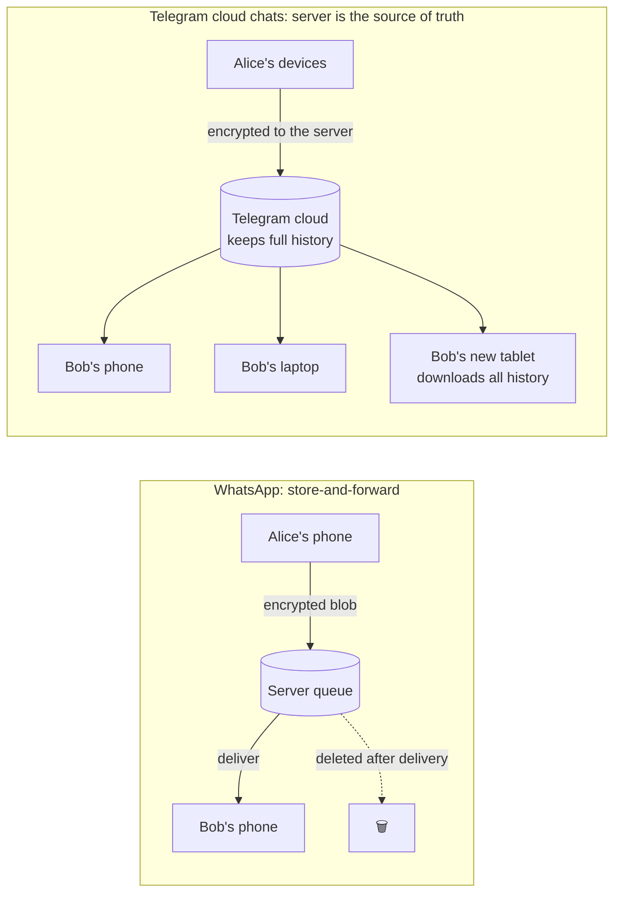
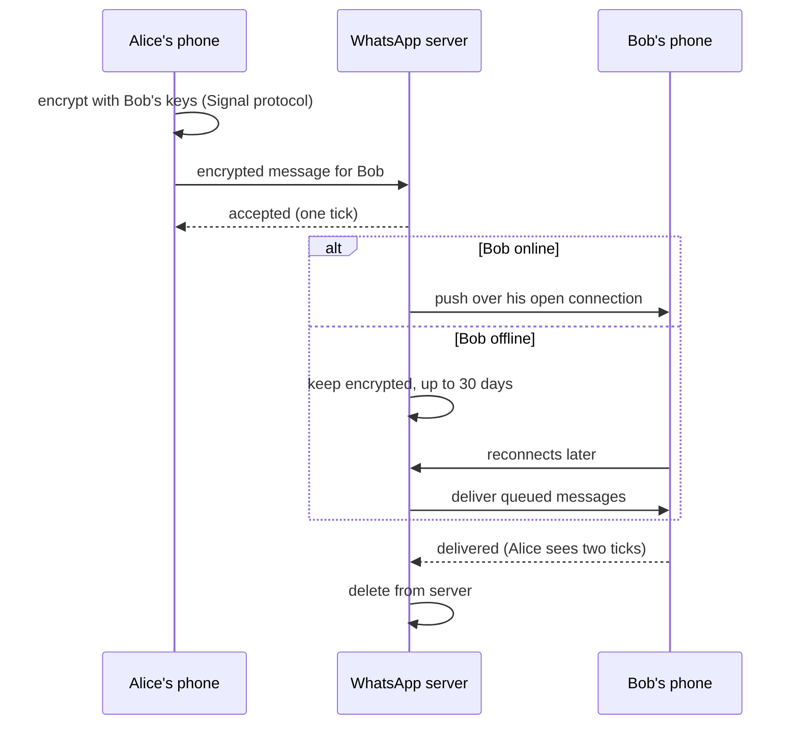
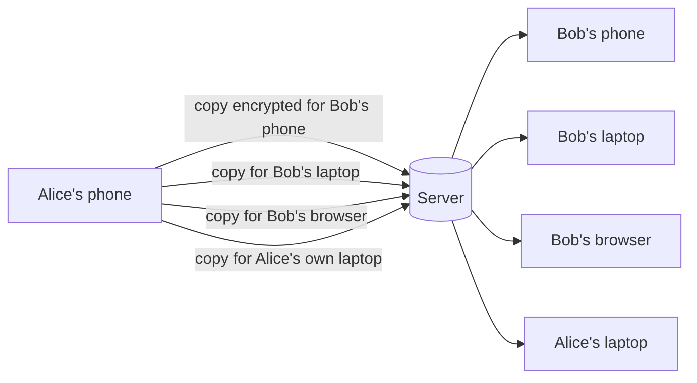
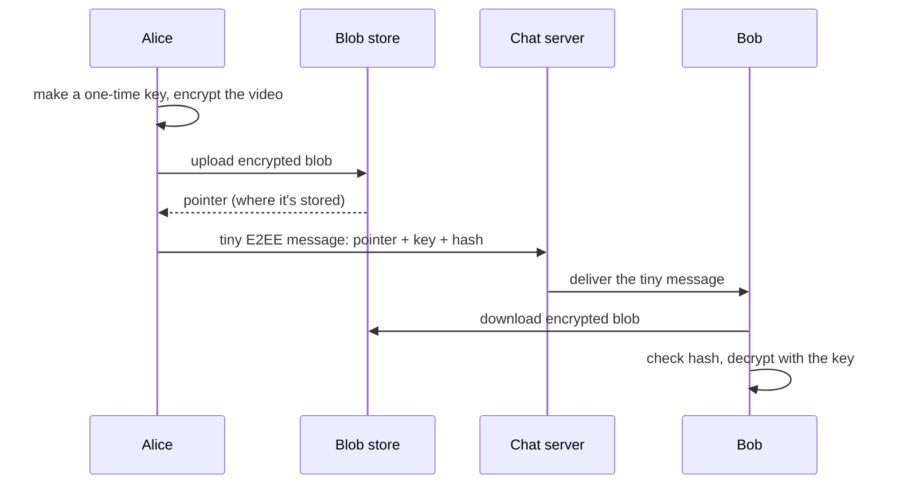
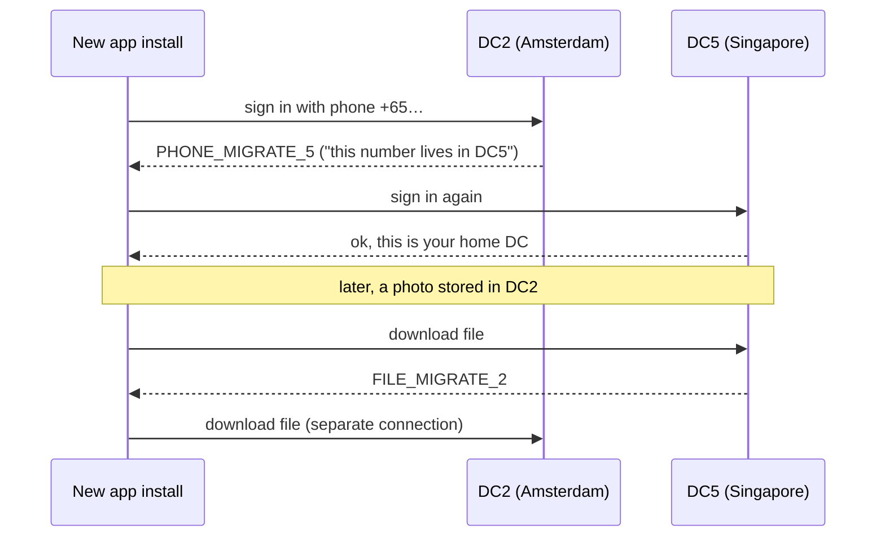
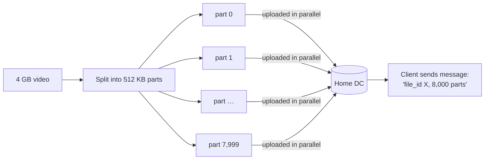
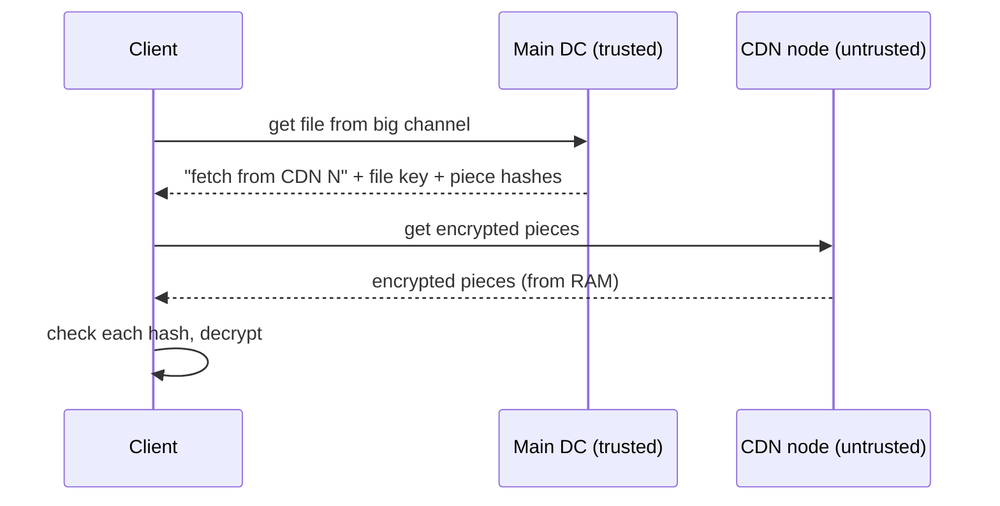
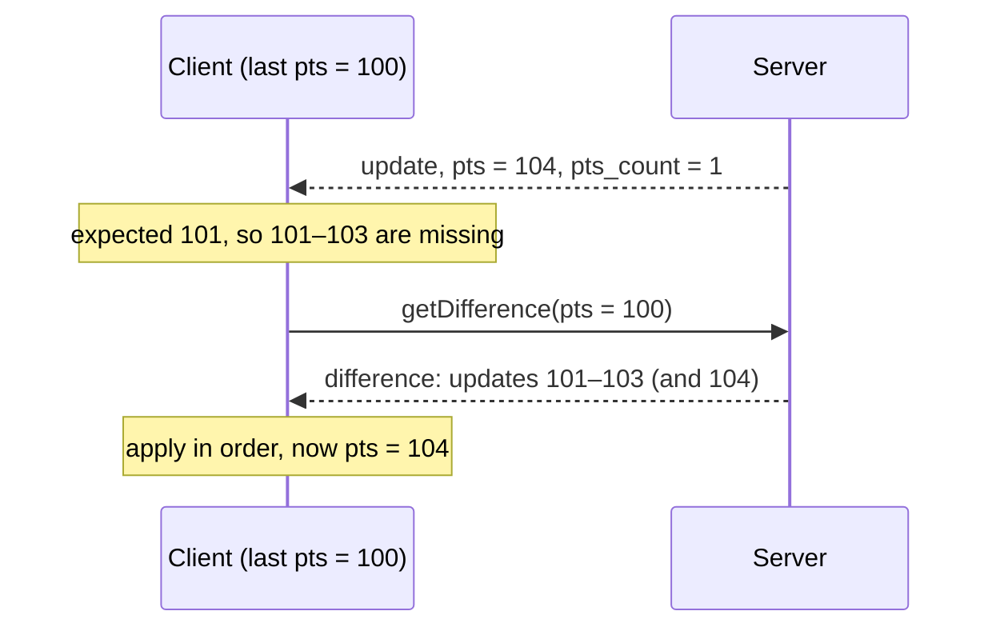

# Case Study: WhatsApp vs Telegram

> **One line:** two messaging apps that look almost the same on your phone but made **opposite choices about where your messages live**: WhatsApp keeps them on your devices and deletes them from its servers once delivered, while Telegram keeps them in its own cloud. Almost every other difference follows from that one decision.

This is a **case study**, not an interview. It explains how two real systems work, using their public docs, engineering talks and blog posts. No code. Read the [Chat System interview](../HLD/interviews/chat-system/README.md) first if you haven't; this page shows which of its ideas real companies actually used, and where they went a different way.

---

## 0. How much to trust each fact

Companies don't publish everything, and blog posts get out of date. Each claim is marked:

| Mark | Meaning |
|---|---|
| ✅ | From the company's own docs, policy, whitepaper, blog or engineering talk (source and year given) |
| 🟡 | From a secondary source (a library's docs, a news article, a third-party write-up). Probably right, not confirmed by the company |
| ❓ | Widely repeated but not verified, or possibly out of date |

> 💡 **Research note:** facts were collected in October 2026 from search results pointing to the sources listed. The pages themselves couldn't be opened from the research environment, so the exact wording wasn't re-read. Product limits (group sizes, file sizes) change often; check the linked source if a number matters to you.

---

## 1. The one decision: where do messages live?



- **WhatsApp ✅:** messages are stored on your device. Once delivered, they are deleted from WhatsApp's servers. Undelivered messages are kept (encrypted) for up to 30 days, then deleted. ([WhatsApp privacy policy](https://www.whatsapp.com/legal/privacy-policy), current and [2019 revision](https://www.whatsapp.com/legal/privacy-policy/revisions/20191219))
  - 💡 **Store-and-forward:** the server is a post office. It holds a letter only until the recipient picks it up, not a library that keeps a copy.
- **Telegram ✅:** normal ("cloud") chats are stored on Telegram's servers. They're encrypted between your device and the server, so the server can read them. Only **Secret Chats** are end-to-end encrypted. ([Telegram tech FAQ](https://core.telegram.org/techfaq))
  - 💡 **End-to-end encrypted (E2EE):** only the two devices in the chat have the keys; the server just passes along bytes it can't read. See [end-to-end encryption](../HLD/concepts/end-to-end-encryption.md).

| Consequence | WhatsApp (messages on devices, E2EE) | Telegram cloud chats (messages on server) |
|---|---|---|
| New device | History must be copied **from your phone** | Log in, history **downloads from the cloud** |
| Server storage | Small: a queue of undelivered messages | Huge: every message ever sent, forever |
| Server-side search | Impossible (server can't read) | Possible |
| Lose your phone, no backup | History is gone | Nothing lost |
| Huge public channels | Hard with E2EE; WhatsApp Channels are **not** E2EE (§2.6) | Natural: one copy on the server, everyone reads it |
| Who can read your messages if the servers are breached | Nobody (content), but metadata leaks | The attacker, if they also get the keys |

> 📝 **Interview lesson:** in the chat interview, "do we store messages on the server?" isn't a detail. It's the first fork, and it decides multi-device, search, backup and storage cost. Say it out loud early ([Chat L6 §2](../HLD/interviews/chat-system/L6-staff.md#2-what-e2ee-changes)).

---

## 2. WhatsApp

### 2.1 The server stack: Erlang, very few engineers

- 💡 **Erlang:** a programming language built by Ericsson in the 1980s for telephone switches. It runs millions of tiny lightweight processes (much lighter than Java threads) inside one virtual machine called **BEAM**, and is designed so one crashed process doesn't take down the others. It fits "one process per connected phone" very well.
- 💡 **FreeBSD:** a Unix operating system, like Linux, known for a strong networking stack.

| Year | What happened | Source |
|---|---|---|
| 2012 | Erlang on FreeBSD with patches to both BEAM and the FreeBSD kernel. Goal: 1M connections per server; peaks of about 2M+ reported | ✅ Rick Reed, Erlang Factory 2012 ([slides](https://www.erlang-factory.com/upload/presentations/558/efsf2012-whatsapp-scaling.pdf)) |
| 2013 | Used **Mnesia** (Erlang's built-in distributed database) for parts such as the media store; at their scale it was described as a big source of problems | ✅ Reed 2013 ([slides](https://www.erlang-factory.com/upload/presentations/752/reed-efsf2013-whatsapp.pdf)); 🟡 [HighScalability, 2014](https://highscalability.com/how-whatsapp-grew-to-nearly-500-million-users-11000-cores-an/) |
| 2014 | More than 8,000 CPU cores; more than 70M Erlang messages per second | ✅ Reed, Erlang Factory 2014 ([talk page](https://www.erlang-factory.com/sfbay2014/rick-reed)) |
| 2014 | Facebook buys WhatsApp for $16B ($19B with stock units): about 450M active users, about 32 engineers | 🟡 [InformationWeek, 2014](https://www.informationweek.com/social/facebook-s-whatsapp-buy-10-staggering-stats) (some sources say 35 engineers) |
| 2015 | "2 to 3 million concurrent TCP connections" on one FreeBSD server | ✅ [FreeBSD Foundation testimonial](https://freebsdfoundation.org/testimonial/whatsapp/) |
| ~2017–2019 | Moved from IBM SoftLayer into Facebook data centers: FreeBSD → Linux, bare metal → containers, local storage → Facebook's hosted databases. Still Erlang | ✅ Code BEAM 2019 talks ([1](https://codesync.global/media/how-whatsapp-oved-1-billion-users-across-data-centers), [2](https://codesync.global/media/how-to-serve-1-7-billion-active-users-at-the-same-time/)) |
| 2025 | More than 3B monthly users | 🟡 Zuckerberg on the Q1 2025 earnings call, via [TechEconomy](https://techeconomy.ng/whatsapp-hits-3-billion-monthly-users) |

❓ **Protocol origins:** WhatsApp is widely said to have started on **ejabberd** (an open-source Erlang chat server speaking **XMPP**, a standard chat protocol) and to have replaced XMPP's verbose XML with a compact binary encoding ("FunXMPP"). Only secondary write-ups say this; no official source was found.

**Arithmetic worth remembering:** 450M users ÷ 32 engineers ≈ **14M users per engineer**. And 2M connections on one server means 1B online users need only about 500 connection servers *for the connections* (1,000,000,000 ÷ 2,000,000 = 500); real fleets are bigger for headroom and redundancy.

> 📝 **What this teaches:** a stateful connection server is mostly about **how many idle connections one box can hold** (memory per connection, kernel limits on open sockets). That's why WhatsApp tuned the OS kernel, not just their code. Compare [Chat L6 §3 "Capacity and limits"](../HLD/interviews/chat-system/L6-staff.md#capacity-and-limits) and [WebSockets](../HLD/technologies/websockets-and-sse.md).
>
> 💡 For you as an infra engineer: it's the same reason you raise `ulimit -n` (max open file descriptors, and every socket is one) and tune `net.core.somaxconn` on a busy proxy.

### 2.2 Sending a message



- ✅ Delete-after-delivery and the 30-day limit for undelivered messages: privacy policy (above).
- ❓ The exact tick mechanics (which server event triggers which tick) aren't in an official source we could check. The diagram shows the commonly described behaviour.
- ✅ **Forwarded media** is an exception: it's kept "temporarily in encrypted form" on the servers, so forwarding a viral video doesn't need re-uploading. No time limit is given. (privacy policy)

### 2.3 End-to-end encryption: the Signal protocol

- ✅ All chats use the **Signal Protocol** since April 2016. ([2016 whitepaper](https://s3.documentcloud.org/documents/2786495/WhatsApp-Security-Whitepaper-April-4-2016.pdf))
  - 💡 **Signal Protocol:** an open encryption protocol (from the Signal messenger) where each device has long-term identity keys and every message gets a fresh key ("ratcheting"), so stealing one key doesn't unlock past messages.
- ✅ Groups use **Sender Keys**: each member encrypts a message **once** with their own group key, instead of once per member. Current whitepaper is version 7, 27 Sep 2023. ([whitepaper](https://www.whatsapp.com/security/WhatsApp-Security-Whitepaper.pdf))
- ✅ **What the server still sees (metadata):** who talks to whom, when, IP addresses, device info, group membership. E2EE protects content only. (privacy policy; [academic analysis, 2017](https://arxiv.org/abs/1701.06817))

> 📝 **Interview lesson:** "E2EE" doesn't make the server blind. Routing, spam detection and abuse handling still run on metadata ([Chat L6 §6](../HLD/interviews/chat-system/L6-staff.md#6-abuse-and-spam-without-reading-messages)).

### 2.4 Multi-device (since 2021): fan-out moves to the sender's phone

Before 2021, WhatsApp Web was a mirror of your phone: if the phone died, the web session stopped. In 2021 ✅ each device became independent ([Meta engineering, Jul 2021](https://engineering.fb.com/2021/07/14/security/whatsapp-multi-device/)):

- A phone plus up to **4 companion devices** (laptop, browser…), each with **its own identity keys**, working even when the phone is off.
- ❓ Later updates reportedly allow a second phone as a companion; not verified here.

The hard part: with E2EE the server can't copy one message to several devices, because it can't read it. So **the sender encrypts a separate copy for each device**:



- 💡 **Client-side fan-out:** the sending device does the "one message → many copies" work, instead of the server. Same idea as [fan-out](../HLD/concepts/fan-out.md) in the news feed, but pushed to the edge because the server isn't allowed to see the content.
- **Linking a device ✅:** the phone signs the new device's identity key and the new device signs the phone's, so contacts can verify the device really belongs to you. (whitepaper v7)
- **History on a new device ✅:** the phone encrypts a bundle of recent chats, uploads it, and sends the bundle's key in a separate E2EE message. The new device downloads, decrypts, and the bundle is deleted. (Meta engineering, 2021)
- 🟡 Small "app state" (contact names, archived/starred chats) is stored on the server, E2EE with keys only your devices hold. (Android Authority summary, 2021)

Compare Telegram: a new device just downloads history from the cloud. This is the price WhatsApp pays for not keeping messages.

### 2.5 Sending a big video

✅ The method ([2016 whitepaper](https://s3.documentcloud.org/documents/2786495/WhatsApp-Security-Whitepaper-April-4-2016.pdf); still described in [v7](https://www.whatsapp.com/security/WhatsApp-Security-Whitepaper.pdf)):



- 💡 **Blob:** "binary large object", any file treated as opaque bytes. A blob store is like S3 ([object storage](../HLD/technologies/object-storage.md)).
- 💡 The video is encrypted with **AES-256** (a standard, fast symmetric cipher, meaning the same key encrypts and decrypts) plus an **HMAC-SHA256** (a tamper check: if one byte changes, it fails). The keys travel inside the normal E2EE chat message, so the blob store holds only gibberish.
- ❓ These cipher details come from the 2016 whitepaper; the current one may have changed the exact mode.
- 🟡 Documents up to **2 GB** since May 2022 (was 100 MB). ([ghacks, 2022](https://www.ghacks.net/?p=178035))

> 📝 **The pattern:** **separate the big bytes from the small message.** Large data goes to a blob store; the chat system carries only a pointer. The chat interview does exactly this ([Chat L5 §3.7](../HLD/interviews/chat-system/L5-senior.md#37-media)). WhatsApp adds one twist: the blob store can't read the file either.

### 2.6 Groups and Channels

| Feature | Limit / behaviour | Source |
|---|---|---|
| Group size | 256 → 512 (May 2022) → 1,024 (Nov 2022) | 🟡 [Social Media Today](https://www.socialmediatoday.com/news/whatsapps-doubling-the-size-of-group-chats-in-the-app/623363/), [Android Authority](https://androidauthority.com/whatsapp-communities-new-features-3153950), 2022 |
| Communities | Groups of groups; ~5,000 members often quoted | ❓ |
| Channels (2023) | One-to-many broadcast. **Not E2EE**; history kept on servers up to 30 days; followers' phone numbers hidden | ✅ [WhatsApp blog, 2023](https://blog.whatsapp.com/introducing-whatsapp-channels-a-private-way-to-follow-what-matters) |

> 📝 **Why groups are capped at ~1,000 but Channels aren't:** E2EE groups need every member's device keys and per-device encryption (§2.4). That cost grows with group size. For broadcast to millions, WhatsApp **dropped E2EE** and stored posts on the server, which is what Telegram does for everything. Same constraint, same answer: compare [Chat L6 §5](../HLD/interviews/chat-system/L6-staff.md#5-huge-groups-and-channels).

### 2.7 Backups: the one place messages leave your devices

✅ ([Meta engineering, Sep 2021](https://engineering.fb.com/2021/09/10/security/whatsapp-e2ee-backups/))

- Backups go to **Google Drive or iCloud**, not WhatsApp's servers.
- Optional **E2EE backups** (2021): the backup is encrypted with a random key. Either you keep a 64-digit key yourself, or you choose a password and the key is stored in a **Backup Key Vault** built on **HSMs**.
  - 💡 **HSM (hardware security module):** a tamper-resistant device that stores keys and does crypto inside itself; keys never leave it in readable form. Like a bank vault with a guard who only answers yes/no.
- The vault limits wrong-password attempts and then locks the key permanently, so a stolen backup can't be brute-forced.
- 🟡 The vault is replicated across data centers using majority-based (consensus) replication ([Meta engineering, 2026](https://engineering.fb.com/2026/05/01/security/meta-strengthening-end-to-end-encrypted-backups/)). That's [consensus](../HLD/concepts/consensus-and-raft.md) used for exactly what it's best at: a small amount of critical data that must never disagree.

---

## 3. Telegram

### 3.1 Two kinds of chat

| | Cloud chats (default) | Secret chats (opt-in) |
|---|---|---|
| Encryption | Device ↔ server (**MTProto 2.0**, Telegram's own protocol) | End-to-end, on top of that |
| Stored | On Telegram's servers | Only on the two devices |
| Multi-device | Yes, all your devices | 🟡 No: tied to the one device that started it |
| Source | ✅ [tech FAQ](https://core.telegram.org/techfaq) | ✅ tech FAQ; 🟡 for the single-device detail |

💡 **MTProto:** Telegram's custom protocol for encrypting traffic between apps and its servers. Comparable in role to TLS (the "S" in HTTPS, see [TLS](../HLD/concepts/tls-and-mtls.md)), but designed by Telegram.

### 3.2 Multi-region: every user has a "home" data center

Telegram runs several **data centers (DCs)** in different regions. 🟡 Commonly listed: DC1 and DC3 in Miami, DC2 and DC4 in Amsterdam, DC5 in Singapore ([Pyrogram FAQ](https://docs.pyrogram.org/faq/what-are-the-ip-addresses-of-telegram-data-centers), a third-party library).

Each account lives in **one home DC**, chosen by Telegram at registration (users can't choose). ✅ The client can connect anywhere first; if it's the wrong DC, the server answers with an error that's really a redirect ([Telegram API: data centers](https://core.telegram.org/api/datacenter)):



- `PHONE_MIGRATE_X`, `USER_MIGRATE_X`, `FILE_MIGRATE_X` ✅: the same idea for sign-in, account and file location.
- 🟡 Telegram may move your home DC after long use from another region ([Telethon docs](https://docs.telethon.dev/en/v2/concepts/datacenters.html)); not confirmed by Telegram.

> 📝 **The pattern: user-homing.** Shard users by region, and route every request to the shard that owns the user. It's [sharding](../HLD/concepts/sharding-and-replication.md) where the shard key is the user and the shard is a whole region. A Singapore user talks to a Singapore DC (fast); a chat between Singapore and Amsterdam users has to cross DCs.
>
> 💡 **Infra analogy:** it's like a 307 redirect from a load balancer, or Redis Cluster's `MOVED` reply: "not here, go there". The **client** learns the map and goes direct next time, so there's no proxy in the middle.

Compare WhatsApp: it relies on Meta's global network and data centers, and because messages don't stay on the server, there's much less per-user data to place in a region. (The exact current WhatsApp routing isn't public; ❓.)

### 3.3 Uploading a 4 GB file: chunks

✅ ([Telegram API: files](https://core.telegram.org/api/files), [upload.saveBigFilePart](https://core.telegram.org/method/upload.saveBigFilePart))

- Size limit: 1.5 GB (2014) → **2 GB** for everyone (Jul 2020, [blog](https://telegram.org/blog/profile-videos-people-nearby-and-more)) → **4 GB** for Premium uploads (Jun 2022, [blog](https://telegram.org/blog/700-million-and-premium)). Anyone can download 4 GB files.
- The client cuts the file into **parts** and uploads each one with `upload.saveFilePart` (files ≤ 10 MB) or `upload.saveBigFilePart` (bigger), giving a random `file_id` it chose, the part number and the total number of parts.
- Part size must be a multiple of 1 KB that divides 512 KB evenly; **512 KB is the maximum** and recommended.

**Where the limits come from** (🟡 part counts from a library's defaults; the arithmetic checks out):

```text
free:    4,000 parts × 512 KB = 2,048,000 KB ≈ 2 GB
premium: 8,000 parts × 512 KB = 4,096,000 KB ≈ 4 GB
```



Why chunks?
- **Resume:** a failed upload on a train restarts at the failed part, not at byte 0. (❓ inferred from the API design; the docs don't spell out a resume guarantee.)
- **Parallelism:** several parts in flight at once use the bandwidth better.
- **Bounded memory:** the server handles 512 KB at a time, never a 4 GB request body.

> 📝 **The pattern** is the same as S3 multipart upload ([object storage](../HLD/technologies/object-storage.md)) and roadmap #13 (Dropbox). Remember it for any "upload large files" question.

### 3.4 Telegram's CDN: caches it doesn't trust

✅ Since 2017 (app 4.2), popular files from big public channels (more than 100,000 members) can be served from separate **CDN** data centers ([Telegram CDN docs](https://core.telegram.org/cdn), [blog: encrypted CDNs](https://telegram.org/blog/encrypted-cdns)):

- 💡 **CDN (content delivery network):** caches close to users so popular files aren't fetched from the origin every time. See [CDN](../HLD/technologies/cdn.md).
- Telegram treats CDN nodes as **untrusted**. Each file is encrypted with its own key that only Telegram's main servers and the client know; the client gets the key and **hashes of each piece** from the main DC, and discards any piece that doesn't match.
- CDN nodes keep files **in RAM only** and drop the least-recently-used ones ([LRU](../LLD/interviews/lru-cache/README.md), the same algorithm as the LLD interview). No private data goes to the CDN.



> 📝 **The pattern:** you can use infrastructure you don't trust if you **encrypt before you hand it over** and **verify with hashes you got from somewhere you do trust**. Same idea as WhatsApp's blob store (§2.5), and as checking a download's SHA-256 against the publisher's site.

### 3.5 Huge groups and channels

| Type | Limit | Source |
|---|---|---|
| Basic group | up to 200 members, then upgraded to a supergroup | ✅ [API: channels](https://core.telegram.org/api/channel) |
| Supergroup | up to 200,000 members (was 10,000 in 2017, then 30,000) | ✅ API docs; [blog, 2017](https://telegram.org/blog/admin-revolution) |
| Gigagroup (broadcast group, only admins post) | no member limit | ✅ API docs |
| Channel | unlimited subscribers | 🟡 |

**How a channel with millions of subscribers delivers a post:** not by pushing a copy to each subscriber. ✅ Each channel has its own counter (**`pts`**, a sequence number per channel). When you open the channel, your app asks "what changed since pts = N?" with `updates.getChannelDifference`; the server also tells the client how long to wait before asking again ([docs](https://core.telegram.org/method/updates.getChannelDifference)). If the client is too far behind, it gets `channelDifferenceTooLong` and reloads recent history instead.

> 📝 **The pattern: fan-out on read** for huge audiences. One post is stored once; millions of readers pull it when they look. Same as the celebrity case in the [news feed](../HLD/interviews/news-feed/README.md) and in [fan-out](../HLD/concepts/fan-out.md).

### 3.6 Keeping every device in sync: sequence numbers and gap detection

✅ ([Telegram API: updates](https://core.telegram.org/api/updates), [updates.getDifference](https://core.telegram.org/method/updates.getDifference))

Every change pushed to the client carries counters:
- **`pts`**: position in your message box (each new message, edit or delete increases it), with `pts_count` = how many steps this update covers.
- **`qts`**: a separate counter for secret-chat and bot events.
- **`seq`**: position in the overall update stream.

The client keeps the last numbers it applied. If an update arrives with a **gap** (expected pts 101, got 104), the client knows it missed something and asks:



The answer can be `differenceEmpty` (nothing missing), `difference`, `differenceSlice` (a page; ask again for more), or `differenceTooLong` (too far behind: reload state instead of replaying).

> 📝 **This is exactly** the per-conversation sequence number + "sync since N" design from the chat interview ([Chat L5 §3.1](../HLD/interviews/chat-system/L5-senior.md#31-ordering-per-conversation-sequence-numbers) and [§3.3](../HLD/interviews/chat-system/L5-senior.md#33-sync-per-user-inbox), [message ordering](../HLD/concepts/message-ordering-and-sequencing.md)). And the "too long → reload" escape hatch is the answer to the follow-up "what if a phone was offline for a month?". It's planned as runnable side track S3.

---

## 4. Side by side

| Topic | WhatsApp | Telegram |
|---|---|---|
| Where messages live | Devices; server deletes after delivery (≤ 30 days if undelivered) ✅ | Server (cloud chats) ✅ |
| Encryption by default | E2EE, Signal protocol ✅ | Client ↔ server (MTProto); E2EE only in Secret Chats ✅ |
| Server stack (public info) | Erlang; FreeBSD → Linux on Meta infra ✅ | Not publicly documented in the same detail |
| New device | Phone sends an encrypted history bundle ✅ | Downloads from the cloud ✅ |
| Fan-out to devices | Sender encrypts per device ✅ | Server pushes stored messages to each device |
| Big files | Encrypted blob + pointer; 2 GB docs 🟡 | 512 KB chunks; 2 GB / 4 GB (Premium) ✅ |
| Regions | Meta's global infrastructure | Home DC per user, `*_MIGRATE_X` redirects ✅ |
| CDN | Not documented ❓ | Encrypted, untrusted CDN for big channels ✅ |
| Biggest groups | 1,024 (E2EE) 🟡 | 200,000 supergroups; unlimited gigagroups/channels ✅ |
| Broadcast | Channels (not E2EE) ✅ | Channels, pulled by `pts` ✅ |
| Backups | Google Drive / iCloud, optional E2EE with HSM vault ✅ | Not needed for cloud chats |
| Scale | 3B+ monthly users (2025) 🟡 | 1B+ monthly users (Durov, Mar 2025) 🟡 ([PhoneArena](https://www.phonearena.com/news/telegram-ceo-says-app-has-over-billion-users_id168793)) |

---

## 5. What to take into interviews

1. **Decide where the data lives first.** Server-stored vs device-stored changes multi-device, search, backups and storage cost. Neither is "right": Telegram chose convenience, WhatsApp chose privacy.
2. **Big bytes go around the chat system, not through it.** Blob/object store + a pointer in the message, uploaded in chunks.
3. **You can use untrusted storage and caches** if you encrypt first and verify with hashes from a trusted source.
4. **Sequence numbers + "give me everything since N" + a "too far behind, reload" fallback** is the standard sync design. Telegram's public API is a real, documented example.
5. **Huge audiences flip to pull.** Even WhatsApp gave up E2EE for Channels to make broadcast practical.
6. **Multi-region by homing users** (shard by user, redirect the client) is simple and works when most traffic is within a region.
7. **Connections per server is a real design number.** WhatsApp's 2M+ per box came from tuning the OS kernel and runtime, not just application code.

---

## 6. Try it yourself

- **WhatsApp security code:** open a chat → contact name → *Encryption*. The 60-digit number / QR code is a fingerprint of both your identity keys. If it matches on both phones, nobody is in the middle. That's §2.3 in your hand.
- **WhatsApp linked devices:** *Settings → Linked devices*. Link a laptop, turn the phone's internet off, and keep chatting from the laptop: §2.4.
- **Telegram on a new device:** log in on [web.telegram.org](https://web.telegram.org) and watch years of history appear instantly. Then start a Secret Chat on your phone and notice it's missing on the web: §3.1.
- **Read Telegram's real API:** [core.telegram.org/api/files](https://core.telegram.org/api/files) (chunked uploads), [core.telegram.org/api/updates](https://core.telegram.org/api/updates) (pts/seq sync), [core.telegram.org/api/datacenter](https://core.telegram.org/api/datacenter) (DC redirects). These are short, readable, and real production designs.
- **Read WhatsApp's whitepaper:** [WhatsApp Security Whitepaper](https://www.whatsapp.com/security/WhatsApp-Security-Whitepaper.pdf). Skim the "Transmitting Media" and "Multi-Device" sections.

---

## 7. Mini glossary

| Term | Plain meaning |
|---|---|
| Store-and-forward | Server holds a message only until it's delivered, then deletes it |
| E2EE | Only the chatting devices have the keys; the server can't read content |
| Metadata | Data *about* messages (who, when, from where), not the content |
| Signal Protocol | Open E2EE protocol with per-device identity keys and a fresh key per message |
| Sender Keys | Group trick: encrypt once with your group key instead of once per member |
| Companion device | A linked laptop/browser that works without the phone online |
| Blob store | Storage for big opaque files (like S3); the chat carries a pointer |
| HSM | Tamper-resistant hardware that stores keys and never reveals them |
| MTProto | Telegram's own encryption protocol between app and server |
| Home DC | The data center that owns a Telegram user's account |
| `*_MIGRATE_X` | Telegram's "go to DC X instead" reply |
| Chunked upload | Splitting a file into parts uploaded separately (resumable, parallel) |
| `pts` / `seq` / `qts` | Telegram's sequence numbers for detecting missed updates |
| Fan-out on read | Store once, readers pull; used for huge channels |

---

## 8. Not verified (help wanted)

- WhatsApp's client↔server transport encryption (often said to use the Noise protocol framework).
- WhatsApp's exact current Community size limit and receipt (tick) mechanics.
- Whether WhatsApp uses a CDN for media beyond the "blob store" in the whitepaper.
- WhatsApp's original ejabberd/XMPP base and "FunXMPP" encoding.
- Telegram's server-side technology stack (not documented publicly in the way WhatsApp's talks are).

## Related

- Interview: [Chat System](../HLD/interviews/chat-system/README.md) (L5 and L6 especially)
- Concepts: [End-to-end encryption](../HLD/concepts/end-to-end-encryption.md) · [Message ordering & sequencing](../HLD/concepts/message-ordering-and-sequencing.md) · [Fan-out](../HLD/concepts/fan-out.md) · [Sharding & replication](../HLD/concepts/sharding-and-replication.md) · [Presence & heartbeats](../HLD/concepts/presence-and-heartbeats.md)
- Technologies: [WebSockets](../HLD/technologies/websockets-and-sse.md) · [Object storage](../HLD/technologies/object-storage.md) · [CDN](../HLD/technologies/cdn.md)
- Learning path: [Distributed systems learning path](../DISTRIBUTED-SYSTEMS-PATH.md)

⬅️ [ROADMAP](../ROADMAP.md) · 🏠 [Home](../README.md)
