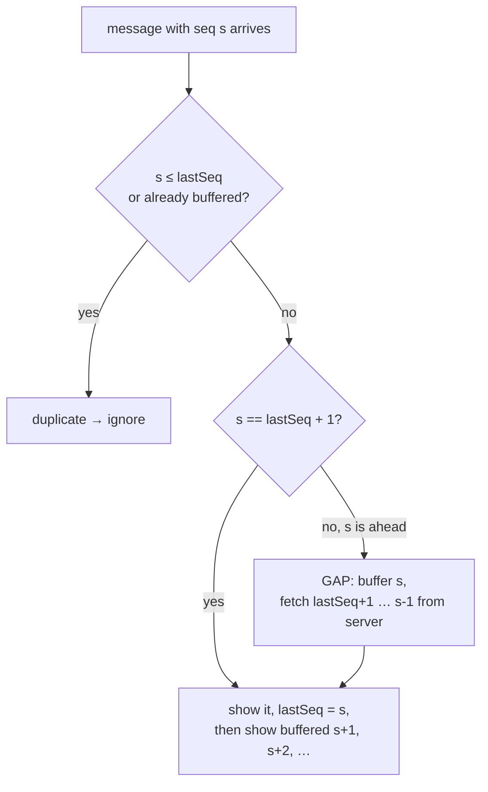

# See It Work: Chat Sequencer, Gap Detection and Offline Sync

> **What this is:** a ~180-line Java program with a chat server and two devices of the same user (phone and laptop), connected by a fake network that can **lose, delay, duplicate and reorder** messages. You watch a per-conversation sequencer number every message, devices notice gaps and fetch what they missed, ignore duplicates, a retried send stored only once, and an offline laptop catching up page by page. Then 200 messages through a chaotic network, ending with every copy identical.
>
> **Read first:** [Chat System L5 §3.1–3.3](../../HLD/interviews/chat-system/L5-senior.md#31-ordering-per-conversation-sequence-numbers) and [message ordering & sequencing](../../HLD/concepts/message-ordering-and-sequencing.md). Telegram's real `pts` / `getDifference` protocol works this way: see the [WhatsApp vs Telegram case study](../../case-studies/whatsapp-vs-telegram.md#36-keeping-every-device-in-sync-sequence-numbers-and-gap-detection).

```sh
cd see-it-work/chat-sequencer-sync
java ChatSync.java
```

---

## 1. What's simulated

| Real chat system | In this program |
|---|---|
| One sequencer per conversation (the conversation's owner) | `Server.send` gives each new message `seq = last + 1` |
| Message store (Cassandra, partition = conversation, sorted by seq) | `Server.log`, a list where position = seq |
| Push over WebSockets / mobile push | `Network.deliver`, which can lose, delay or duplicate |
| "Give me everything after seq N" API | `Server.since(afterSeq, limit)`, paginated |
| Client message ID for idempotent sends | `clientMsgId` ("alice-99"); a retry returns the stored seq |
| Device state | `lastSeq` (highest seq shown in order) + a buffer of messages that arrived early |

Deterministic: scripted faults for steps 1–6, a seeded random generator for step 7.

---

## 2. The rules



1. The **server** is the only place numbers are assigned, so every device agrees on the order.
2. A **device** only ever shows messages in seq order, with no holes.
3. A seq it already has is a **duplicate** (the network or a fetch delivered it twice).
4. A seq too far ahead means something was lost or is late: a **gap**. Ask the server for exactly the missing range.
5. After being offline, ask for **everything after lastSeq**, in pages.
6. Senders attach a **client message ID**, so retrying after a lost acknowledgement doesn't create a second message ([idempotency](../../HLD/concepts/idempotency-and-delivery-semantics.md)).

---

## 3. Walking through the output

Real output of `java ChatSync.java`.

### Steps 1–3: a lost message becomes a gap

```text
=== 3. A message is lost, so the next one reveals a gap ===
  network: seq 3 to bob-phone LOST
  bob-phone: got seq 4 but expected 3 -> GAP, buffer it and ask the server for 3..3
  bob-phone: shows #3 alice: "dinner at 8" (fetched)
  bob-phone: shows #4 alice: "at the usual place" (from buffer)
```

The phone doesn't know seq 3 was lost until seq 4 arrives. Then it knows **exactly** what's missing (3..3), fetches it, and shows 3 then 4. Without sequence numbers it would have shown "at the usual place" and never noticed.

### Step 4: reordering and duplicates

```text
  network: seq 5 to bob-phone DELAYED
  bob-phone: got seq 6 but expected 5 -> GAP, buffer it and ask the server for 5..5
  bob-phone: shows #5 alice: "bring the cake" (fetched)
  bob-phone: shows #6 alice: "and candles" (from buffer)
  bob-phone: got seq 5 again -> duplicate, ignored
  ...
  network: seq 7 to bob-phone DELIVERED TWICE
  bob-phone: got seq 7 again -> duplicate, ignored
```

A *late* message looks the same as a lost one at first. The device fetched seq 5, so when the delayed original finally arrives, it's simply a duplicate. **At-least-once delivery + dedup by seq = each message shown exactly once.**

### Step 5: the retried send

```text
  bob-phone: shows #8 alice: "running 10 min late" (pushed)
  server: alice-99 is a retry, already stored as seq 8 (not stored again)
  alice: first attempt -> seq 8, retry -> seq 8 (same message, stored once)
```

Alice's app didn't get the acknowledgement, so it sent again. Same `clientMsgId` → the server returns the existing seq instead of storing a second copy.

### Step 6: the offline laptop catches up

```text
  bob-laptop: reconnects with lastSeq=2, syncs in pages of 3
  bob-laptop: page of 3 (seq 3..5)
  ...
  bob-laptop: page of 3 (seq 6..8)
```

The laptop only needs one number (`lastSeq = 2`) to say exactly what it's missing. **Pagination** matters in real life: a device offline for a week might be thousands of messages behind; it fetches page by page instead of one giant response. (Telegram replies "too long, reload" when a client is extremely far behind.)

### Step 7: chaos

```text
=== 7. Chaos: 200 messages, 10% lost, 10% duplicated, all shuffled ===
  before final sync: phone lastSeq=207, laptop lastSeq=207, server has 207
  during chaos the devices detected 12 gaps and ignored 381 duplicates

=== Result ===
  server: 207 messages; phone: 207; laptop: 207; identical and in order: true
```

With 10% loss, 10% duplication and completely shuffled delivery, both devices end with all 207 messages in order. Why so many "duplicates"? Every gap fetch pulls in messages whose pushes were merely *late*; when those pushes finally arrive, they're duplicates. That's expected and harmless.

There is one case gap detection alone can't catch: if the **last** message is lost, no later message reveals the gap. That's why real clients also ask "anything after my lastSeq?" on reconnect, when the app comes to the foreground, and on a timer. The final `syncAfterReconnect` calls in step 7 play that role.

---

## 4. Things to try

1. **Lose the last message:** in step 3, also add `net.dropNext.add(4L)`. Now the phone shows *nothing* in step 3: no later message has arrived to reveal the gap. It only finds out in step 4, when seq 6 arrives and it fetches 3..5. If Alice had stopped writing after seq 4, only the reconnect / foreground / periodic sync would have caught it.
2. **Remove the client message ID check** in `Server.send` (always store). Step 5 now stores the message twice, and both devices show "running 10 min late" twice.
3. **Show messages as they arrive** (remove the gap check, just append): step 3 shows "at the usual place" before "dinner at 8", and the laptop and phone end up in different orders.
4. **Make chaos worse:** change `nextInt(10)` to `nextInt(3)` for 33% loss. How many gaps? Does it still converge?
5. **Two senders:** add Bob sending from his phone in between Alice's messages. The order is whatever the server assigned, and both devices still agree.

## 5. What to say in an interview

> "The conversation's owner assigns a monotonically increasing sequence number to every message. Devices keep their last contiguous seq; anything below it is a duplicate, anything above it reveals a gap, which they fill by asking the server for that range. Offline devices sync with 'everything after seq N', paginated. Delivery is at-least-once, and dedup by seq on the device plus client message IDs on the server makes each message appear exactly once. Because the last message can be lost silently, clients also sync on reconnect, on foreground and periodically."

## Related

- Interview: [Chat System](../../HLD/interviews/chat-system/README.md) (L5 §3.1–3.3)
- Concepts: [Message ordering & sequencing](../../HLD/concepts/message-ordering-and-sequencing.md) · [Idempotency & delivery semantics](../../HLD/concepts/idempotency-and-delivery-semantics.md) · [Pagination](../../HLD/concepts/pagination.md)
- Case study: [WhatsApp vs Telegram](../../case-studies/whatsapp-vs-telegram.md) (Telegram's `pts`, `getDifference`)
- Other see-it-work: [Hash ring + quorums](../hash-ring-quorum/README.md) · [Raft leader election](../raft-leader-election/README.md)

⬅️ [ROADMAP](../../ROADMAP.md) · 🏠 [Home](../../README.md)
