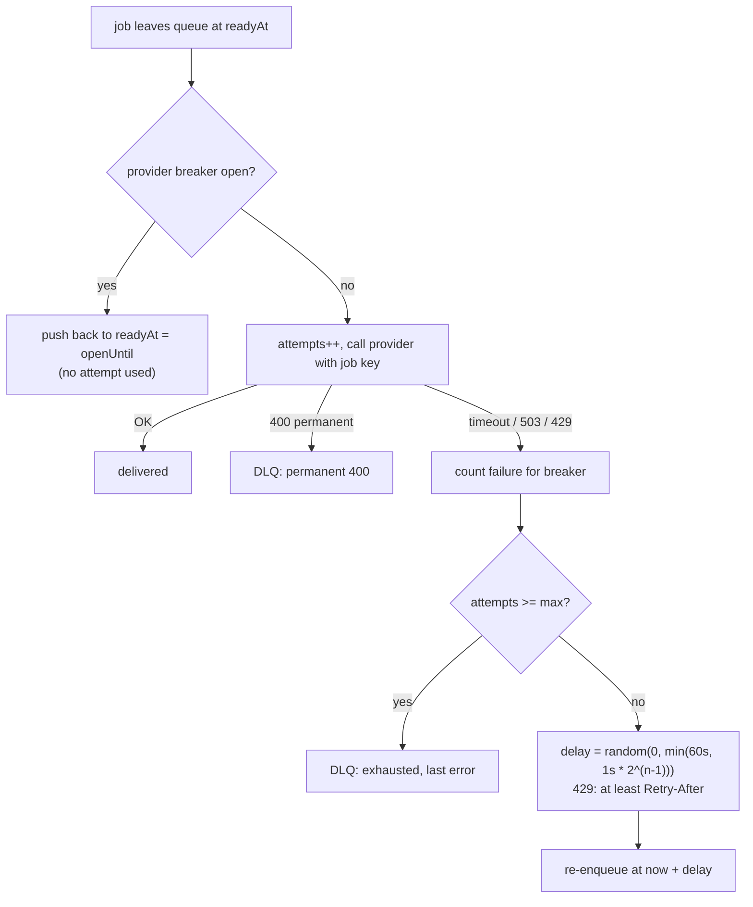

# See It Work: A Fan-out Worker with Retries, Backoff and a DLQ

> **What this is:** a ~160-line Java program that delivers notifications the way a notification system's workers do. One "notify" event becomes three jobs (**push, email, SMS**), the jobs go into a queue, and a pool of workers sends them through flaky fake providers. You'll see:
> - transient failures (timeouts, 503, `429` with `Retry-After`) retried with **exponential backoff and full jitter**
> - a permanent failure (`400 invalid token`) that is **not** retried
> - a provider that **sent the message but timed out**, and a retry that does not send it twice
> - a **circuit breaker** that stops hammering a provider that is down
> - a **dead-letter queue** (DLQ) with a reason for every job that gave up
>
> It ends with 10,002 jobs under chaos and an invariant check: every job is delivered exactly once or sits in the DLQ.
>
> **Read first:** [Notification System](../../HLD/interviews/notification-system/README.md) ([L4](../../HLD/interviews/notification-system/L4-mid.md), [L5](../../HLD/interviews/notification-system/L5-senior.md)) and [retries, backoff & DLQ](../../HLD/concepts/retries-backoff-and-dlq.md).

```sh
cd see-it-work/fanout-worker-dlq
java FanoutWorker.java                       # the default run shown below
java -Djitter=false FanoutWorker.java        # flags: jitter, idem, breaker (true/false), maxAttempts=N
```

---

## 1. What's simulated

| Real system | In this program |
|---|---|
| "Notify user" event fanned out by a [Kafka](../../HLD/technologies/kafka.md) consumer or an SQS-style queue | 3 `Job`s per user (`u1:push`, `u1:email`, `u1:sms`), put in one priority queue ordered by "ready at" time |
| A fleet of worker pods | `WORKERS` slots (40 by default). A job starts when a worker is free *and* the job is ready |
| FCM/APNs, an email API, an SMS gateway ([providers](../../HLD/technologies/push-email-sms-providers.md)) | `call()`: random timeouts (3%), 503 (4%), 429 with Retry-After 2-5 s (3%), 400 (1%) |
| Provider-side idempotency key (the provider remembers keys it has already sent) | `seenKeys`: a repeat of a key answers OK and sends nothing |
| Wall clock and `Thread.sleep` | A simulated clock in ms. Nothing sleeps, so 100 simulated seconds run instantly and the output is the same every run (seeded `Random`) |
| An outage of the email provider | `outageFrom`..`outageTo`: every email call returns 503 |

💡 **Transient vs permanent:** a transient error (timeout, 503, 429) may succeed if you try again later. A permanent error (400 invalid token) never will, so retrying only wastes capacity.

💡 **DLQ (dead-letter queue):** a side queue where jobs go after they give up, kept with the reason so a human or a replay tool can look at them. Like a failed-jobs table you check on call.

💡 **Circuit breaker:** a switch per downstream. After several failures in a row it "opens" and calls are skipped instead of sent, so the dead service gets a rest and your workers don't waste time on it. After a cool-down it lets calls through again (half-open): one success closes it, one failure re-opens it.

💡 **Full jitter:** instead of waiting exactly `base * 2^n`, wait a random time between 0 and that value. Without it, everything that failed together retries together (a "thundering herd").

---

## 2. The rules



Five rules:
1. **Retry only transient errors.** A 400 goes straight to the DLQ.
2. **Backoff grows exponentially, capped at 60 s, with full jitter.** On a 429, wait at least the `Retry-After` the provider asked for.
3. **The job key is the same on every attempt** (`u1:sms`). The provider dedupes by it, so "sent but the reply timed out" followed by a retry sends once.
4. **Breaker per provider.** 5 consecutive transient failures open it for 10 s. While open, jobs are deferred **without using an attempt**: an outage should not burn a job's retry budget.
5. **Max attempts, then DLQ with a reason.** Never retry forever.

---

## 3. Walking through the output

### Scripted: 2 users, 6 jobs, each with a planned fate

```text
  t=  0.00s w00 u1:push   attempt 1 OK
  t=  0.00s w01 u1:email  attempt 1 503 -> retry in 284 ms
  t=  0.00s w02 u1:sms    attempt 1 timeout (applied!) -> retry in 525 ms
  t=  0.00s w03 u2:push   400 permanent -> DLQ, no retry
  t=  0.00s w04 u2:email  attempt 1 429 -> retry in 5000 ms
  t=  0.00s w05 u2:sms    attempt 1 503 -> retry in 182 ms
  ...
  t=  0.89s w09 u2:sms    sms breaker OPENS until t=10.921s
  t=  2.53s w10 u1:sms    breaker OPEN -> deferred (no attempt used)
  t=  5.02s w10 u2:email  attempt 2 OK
  t= 11.66s w11 u2:sms    attempt 5 503 -> DLQ
  t= 23.00s w12 u1:sms    attempt 2 OK
   delivered=4 dlq={exhausted 5 attempts (last: 503)=1, permanent 400 (invalid token)=1} sends per job=[1, 1, 1, 0, 1, 0] duplicates prevented=1
```

- **`u1:sms`: "applied!"** The SMS went out, then the reply was lost. The retry (same key) is answered OK by the provider without sending again. `sends per job` shows `1` for it, and `duplicates prevented=1`.
- **`u2:push`: 400** goes to the DLQ on the first attempt. No backoff, no retry.
- **`u2:email`: 429 with Retry-After 5 s.** The retry comes at 5.02 s, not after the 1 s backoff. The provider's request wins when it is longer.
- **`u2:sms`** keeps getting 503. After 4 failures plus the timeout from `u1:sms` the **breaker opens**. `u1:sms` is then *deferred* instead of called, and its attempt counter doesn't move. `u2:sms` finally exhausts 5 attempts and lands in the DLQ with "last: 503". (`u1:sms` finishes at 23 s because the breaker re-opened after `u2:sms` failed its half-open try.)

### Chaos: 10,002 jobs, email provider down from 30 s to 50 s

```text
2) Chaos: 10002 jobs, 40 workers, 3% timeouts, 4% 503, 3% 429, 1% 400, email provider DOWN 30s-50s
   delivered=9880 retries=1039 dead-lettered=122
     DLQ permanent 400 (invalid token)            122
   duplicates prevented by provider dedupe=157, duplicate messages actually sent=0
   breaker opened 2 times, 1057 jobs deferred without using an attempt
   delivery delay p50=80 ms  p99=19192 ms
   peak retries scheduled into one 100 ms window=6
   in DLQ although the provider did send it (reply lost)=0
   INVARIANT every job delivered exactly once or in DLQ: HOLDS (delivered 9880 + dlq 122 = 10002 of 10002, duplicates 0)
```

How to read it:
- **The only DLQ entries are the 122 dead tokens.** That is correct: they could never succeed. Everything the 20 s email outage broke was held back by the breaker and delivered later.
- **p50 = 80 ms, p99 = 19 s.** Most jobs are delivered on the first try. The p99 is the email jobs that waited out the outage. Retries buy delivery with delay.
- **157 duplicates prevented.** Each was a "sent but timed out" followed by a retry. Without idempotency each is a double notification (Try 2).
- **Invariant holds:** 9,880 + 122 = 10,002, and no job was sent twice.

---

## 4. Things to try

Each was run. The numbers below are the real results.

| Change | Result | Lesson |
|---|---|---|
| **No jitter, retry storm.** `java -Djitter=false -Dworkers=3000 -Dbreaker=false -Darrival=1 -DoutageFrom=0 -DoutageTo=6000 FanoutWorker.java` (10,002 jobs all arrive at the same instant and email is down for 6 s; compare with `-Djitter=true`) | Peak retries scheduled into one 100 ms window: **1,945 without jitter vs 537 with jitter**. | Without jitter, everything that failed together retries together, which is how a recovering provider gets knocked over again. |
| **Same run, a surprise:** the DLQ counts | Without jitter: **160** dead-lettered. With jitter: **1,298** (1,057 of them "last: 503"). | Jitter picks some very short delays, so a short outage burns attempts faster. Jitter fixes the herd but not the outage. That is the breaker's job (Try 4). |
| **Break idempotency:** `-Didem=false` | **157 duplicate messages sent** (the same 157 that were prevented). Invariant: **VIOLATED** (`duplicates 157`). | "Sent but the reply was lost" is real. A retry without a key is a duplicate SMS. |
| **No retries:** `-DmaxAttempts=1` | Dead-lettered goes from 122 to **1,056** (265 of 429, 389 of 503, 287 timeouts, 115 of 400). **148 of those DLQ jobs were actually sent** (reply lost). | Retries turn ~1,000 transient blips into deliveries. Also: a DLQ entry does not prove "not delivered". Replaying one needs the idempotency key too. |
| **Breaker off during the outage:** `-Dbreaker=false` | Delivered **9,434** instead of 9,880. Dead-lettered **568** instead of 122 (446 "exhausted 5 attempts, last: 503"). Retries **3,547** vs 1,039. | Without a breaker the outage burns every email job's attempts. With it, jobs wait and nothing is lost. |

More to try:
- Set `-DoutageFrom=30000 -DoutageTo=200000` with the breaker on: how long do the jobs wait, and what is the p99?
- Change `COOLDOWN` to 1 s. The breaker re-opens more often, with more probe calls to the dead provider. What is the trade-off?
- Remove the `Retry-After` line and count how many 429s are repeated sooner than the provider asked.

---

## 5. What to say in an interview

"The notify event fans out to one job per channel, so a slow SMS gateway can't block push. Workers retry only transient errors, with exponential backoff and full jitter, and honour Retry-After. Every attempt carries the same job key and the provider (or our send log) dedupes by it, because a timeout doesn't tell you whether the message went out. A circuit breaker per provider stops us burning retry budgets during an outage; jobs wait instead. After N attempts, or on a permanent error, the job goes to a DLQ with the reason, and we alert on its depth. The invariant I'd monitor: every job is delivered once or in the DLQ. A DLQ replay must reuse the same key."

## Related

- [Notification System](../../HLD/interviews/notification-system/README.md) · [L4](../../HLD/interviews/notification-system/L4-mid.md) · [L5](../../HLD/interviews/notification-system/L5-senior.md)
- [Retries, backoff & DLQ](../../HLD/concepts/retries-backoff-and-dlq.md) · [Idempotency & delivery semantics](../../HLD/concepts/idempotency-and-delivery-semantics.md) · [Resilience patterns](../../HLD/concepts/resilience-patterns.md)
- [Push, email & SMS providers](../../HLD/technologies/push-email-sms-providers.md)
- [Saga compensations](../saga-compensations/README.md): the same "retry with a key" idea for multi-step flows
