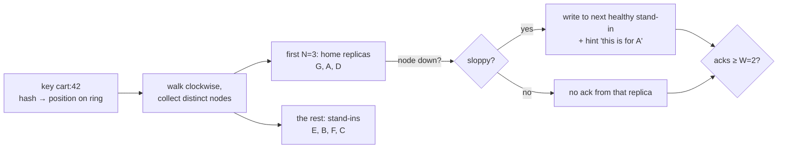

# See It Work: Hash Ring + Quorums + Hinted Handoff

> **What this is:** a ~190-line Java program that runs a tiny Dynamo-style cluster (7 nodes) inside one process. You watch keys spread over a hash ring, writes and reads succeed with quorums, nodes go down, a **sloppy quorum** keeps writes working, a **stale read** happen anyway, and **hinted handoff** fix it.
>
> **Read first:** [Distributed KV Store L4](../../HLD/interviews/distributed-kv-store/L4-mid.md) and [L5 §3.2](../../HLD/interviews/distributed-kv-store/L5-senior.md#32-sloppy-quorum-and-hinted-handoff). This page is the "now watch it happen" companion.

```sh
cd see-it-work/hash-ring-quorum
java HashRing.java           # sloppy quorum (Dynamo / Cassandra-style availability)
java HashRing.java strict    # strict quorum: same story, different ending
```

💡 `java HashRing.java` runs a single source file without a separate `javac` step (Java 11+). Needs Java 16+ for `record` and `toList()`; the repo standard is Java 21.

---

## 1. What's simulated (and what isn't)

| Real cluster | In this program |
|---|---|
| Machines on a network | `Node` objects in a map |
| A machine crashing | `node.up = false` |
| Network latency | a number per node, used only to decide who answers a read first |
| Timestamps / vector clocks to pick the newest value | one global counter: every write gets `v1`, `v2`, `v3`… (a simplification: real clocks disagree, see [vector clocks](../../HLD/concepts/vector-clocks-and-conflict-resolution.md)) |
| Background handoff every few seconds | you call `handoff()` |

No threads, no randomness: every run prints exactly the same thing, so you can change one line and see exactly what that changed.

---

## 2. The mechanism in one picture



- **Hash ring with virtual nodes** ([consistent hashing](../../HLD/concepts/consistent-hashing.md)): each node is placed on the ring many times (`vnodes`). A key belongs to the first nodes clockwise from its hash.
- **N, W, R** ([CAP & consistency](../../HLD/concepts/cap-and-consistency.md)): every key is stored on N = 3 home replicas; a write succeeds after W = 2 acknowledgements; a read uses the first R = 2 answers and returns the newest version.
- **Sloppy quorum + hints** ([hinted handoff & sloppy quorum](../../HLD/concepts/hinted-handoff-and-sloppy-quorum.md)): if a home replica is down, the next healthy node past the home replicas stores the write *on its behalf*, with a note saying who it's for.
- **Read repair**: when a read sees a stale copy among its answers, it writes the newest value back to that replica.

---

## 3. Walking through the output

Everything below is real output of `java HashRing.java`.

### Step 1: why virtual nodes exist

```text
  1 vnodes/node: busiest 30120, quietest  1372 (ideal 10,000)  | add G: 17670 keys moved = 29.5% (ideal 1/7 = 14.3%)
  8 vnodes/node: busiest 13661, quietest  7502 (ideal 10,000)  | add G:  5790 keys moved =  9.7% (ideal 1/7 = 14.3%)
128 vnodes/node: busiest 10768, quietest  9146 (ideal 10,000)  | add G:  7563 keys moved = 12.6% (ideal 1/7 = 14.3%)
```

60,000 keys over 6 nodes should be 60,000 ÷ 6 = 10,000 each.
- **1 position per node:** one node gets 30,120 keys (3× its share) and another 1,372. With few random points on a circle, the gaps between them are very uneven. Adding G moved 29.5% of keys, twice the fair 1/7, because G's single point happened to land in a big gap.
- **128 positions per node:** the busiest node is within ~8% of ideal (10,768 vs 10,000), and adding G moves 12.6%, close to the ideal 1/7 ≈ 14.3%. That's the whole reason for vnodes: many small arcs average out.
- Compare with `hash(key) % nodeCount`: going from 6 to 7 nodes moves a key unless `h % 6 == h % 7`, which holds for only 6 of every 42 hash values, so about **6/7 ≈ 86%** of keys move.

### Step 2: everything healthy

```text
PUT cart:42=[shoes] v1  home=[G, A, D]  wrote: G:ok A:ok D:ok  acks=3/2  -> OK
GET cart:42  first 2 answers: G=[shoes](v1) A=[shoes](v1)  -> [shoes]
```

The write goes to all 3 home replicas; the client gets "OK" as soon as 2 confirm.

### Step 3: one replica down, then read repair

```text
-- down: D
PUT cart:42=[shoes, socks] v2  home=[G, A, D]  wrote: G:ok A:ok D:DOWN E:ok(hint for D)  acks=3/2  -> OK
-- up: D
GET cart:42  first 2 answers: A=[shoes, socks](v2) D=[shoes](v1)  -> [shoes, socks]
    read repair: D now has v2
```

G and A alone already make W = 2. E also accepted a hinted copy for D. When D returns and answers a read with the old `v1`, the read still returns `v2` because A answered too (R + W = 4 > N = 3, so the two answers must include an up-to-date home replica). The read then **repairs D**.

### Step 4: two replicas down, sloppy quorum keeps writing

```text
-- down: A, D
PUT cart:42=[shoes, socks, hat] v3  home=[G, A, D]  wrote: G:ok A:DOWN E:ok(hint for A) D:DOWN B:ok(hint for D)  acks=3/2  -> OK
```

Only G is a healthy home replica. With a strict quorum this write would fail (W = 2, only 1 home replica). Sloppy quorum borrows E and B, which keep hints. The user's "add hat to cart" succeeded: this is exactly the availability Amazon wanted for shopping carts.

### Step 5: the price — a stale read

```text
-- up: A, D
GET cart:42  first 2 answers: A=[shoes, socks](v2) D=[shoes, socks](v2)  -> [shoes, socks]
    STALE: R + W > N promised overlap, but 2 of the 3 acks were on stand-ins, not home replicas.
```

A and D came back before their hints were delivered. The read asks home replicas, A and D answer first, and **neither has the hat**. The write was acknowledged, yet a quorum read missed it. R + W > N only guarantees overlap when both quorums are counted on the **same N home replicas**; sloppy quorum broke that assumption. (If G had answered, the read would have found `v3`: staleness here depends on who answers first.)

### Step 6: hinted handoff heals it

```text
HANDOFF B -> D: cart:42 v3
HANDOFF E -> D: cart:42 v2  (owner already has a newer version: hint discarded)
HANDOFF E -> A: cart:42 v3
GET cart:42  first 2 answers: A=[shoes, socks, hat](v3) D=[shoes, socks, hat](v3)  -> [shoes, socks, hat]
```

Stand-ins hand their hints to the owners. An old hint (`v2` for D, from step 3) arrives after a newer value and is ignored: delivery order doesn't matter as long as versions are compared. Now every home replica has the hat.

### The strict ending (`java HashRing.java strict`)

```text
PUT cart:42=[shoes, socks, hat] v3  home=[G, A, D]  wrote: G:ok A:DOWN D:DOWN  acks=1/2  -> FAILED (not enough replicas)
...
GET cart:42  first 2 answers: A=[shoes, socks](v2) D=[shoes, socks](v2)  -> [shoes, socks]
    Not stale: the hat write FAILED in strict mode, so [shoes, socks] really is the latest acknowledged value.
```

Strict mode **refuses the write** instead. Reads never miss an acknowledged write, but the user saw an error. That's the trade-off in one line: **sloppy = always writable, sometimes stale; strict = never stale (for acknowledged writes), sometimes unavailable.**

---

## 4. Things to try

Each takes one edit and a re-run.

1. **Fewer vnodes.** Change `new HashRing(128)` in `main` to `new HashRing(1)`. Which node now owns `cart:42`? How uneven is the cluster for the rest of the story?
2. **Change the quorum.** Set `W = 1` and re-run strict mode: the hat write succeeds with only G. Now set `R = 1` too: reads get faster and staleness gets worse (R + W = 2 ≤ N). Try `W = 3` in strict mode: step 3 fails with just one node down (in sloppy mode the hint on E makes it 3 acks, so it still succeeds).
3. **Make G answer first.** In step 5, set `c.node("G").latencyMs = 0` before the read (G is a home replica that has `v3`). The read now returns the hat and repairs A or D. Staleness is about *which* replicas you happen to hear from.
4. **Lose a stand-in.** Call `c.down("B")` before `c.handoff()` in step 6. D never gets its `v3` hint (B is holding it), yet the final read still returns the hat and **read repair** fixes D, because A answered too. Now imagine nobody reads `cart:42` for a month: what fixes D then? (Anti-entropy with [Merkle trees](../../HLD/concepts/merkle-trees-and-anti-entropy.md).)
5. **Kill three home replicas.** `c.down("G", "A", "D")`. Sloppy mode still accepts the write (on stand-ins only). Strict mode fails. What does a read return in each mode?
6. **Add a "hint window".** Real systems keep hints only for a while (Cassandra's default is 3 hours). Add a write-time to `Hint` and drop old hints in `handoff()`. What has to fix the replica then?

## 5. What to say in an interview

> "Keys go on a hash ring with many virtual nodes per server so load is even and adding a node moves about 1/N of the keys. Each key has N = 3 home replicas; with W = 2 and R = 2, reads overlap writes. To stay writable when two home replicas are down, a sloppy quorum writes to the next healthy nodes with hints, which are handed back when the owners return. The cost is that R + W > N no longer guarantees fresh reads until handoff, read repair or anti-entropy catches up."

## Related

- Interview: [Distributed KV Store](../../HLD/interviews/distributed-kv-store/README.md)
- Concepts: [Consistent hashing](../../HLD/concepts/consistent-hashing.md) · [Hinted handoff & sloppy quorum](../../HLD/concepts/hinted-handoff-and-sloppy-quorum.md) · [CAP & consistency](../../HLD/concepts/cap-and-consistency.md) · [Merkle trees & anti-entropy](../../HLD/concepts/merkle-trees-and-anti-entropy.md) · [Vector clocks](../../HLD/concepts/vector-clocks-and-conflict-resolution.md)
- Learning path: [Distributed systems learning path](../../DISTRIBUTED-SYSTEMS-PATH.md) (stages 1, 2 and 5)

⬅️ [ROADMAP](../../ROADMAP.md) · 🏠 [Home](../../README.md)
