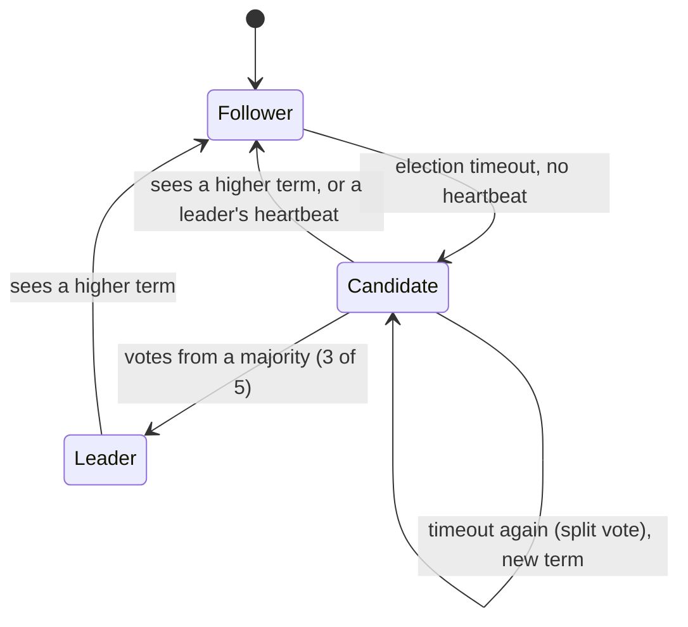

# See It Work: Raft Leader Election

> **What this is:** a ~210-line Java program that simulates five Raft nodes electing a leader, in simulated time, with a fake network. You watch a cold-start election, a frozen leader being replaced, the old leader waking up and stepping down, a **network partition with two "leaders"** (only one of which can actually do anything), and the heal. A second mode shows why election timeouts must be **random**.
>
> **Read first:** [Consensus & Raft](../../HLD/concepts/consensus-and-raft.md) (sections 1–3) and [Distributed KV Store L6 §2](../../HLD/interviews/distributed-kv-store/L6-staff.md#2-the-cp-alternative-multi-raft-ranges).

```sh
cd see-it-work/raft-leader-election
java RaftElection.java          # the full story
java RaftElection.java fixed    # all nodes use the same timeout: split votes forever
```

💡 `java File.java` runs a single source file without a separate `javac` step. Uses `record`, sealed interfaces and pattern-matching `switch`, so Java 21.

---

## 1. What's simulated (and what isn't)

| Real Raft cluster | In this program |
|---|---|
| 5 servers | 5 `Node` objects |
| Real time, real network | **Simulated** time: an event queue ordered by timestamp; every message takes 5 ms |
| Election timeout 150–300 ms, random | Same, from a seeded random generator, so every run prints the same thing |
| Heartbeats (empty AppendEntries) every 50 ms | `Heartbeat` messages every 50 ms |
| A crash or a long GC pause | `pause()` / `resume()`: the node stops processing but **keeps its state** |
| A network partition | `partition[]`: nodes only receive messages from nodes in the same group |
| The replicated log, commits, "log up to date" vote check | **Not simulated**: this is election only. A leader prints when it *couldn't* commit (fewer than a majority answering) |

💡 **Simulated time** (discrete-event simulation): instead of sleeping, the program jumps straight to the next scheduled event. Same idea FoundationDB uses to test its database deterministically ([Distributed KV Store L6 §5](../../HLD/interviews/distributed-kv-store/L6-staff.md#5-how-do-you-know-its-correct)).

---

## 2. The rules the code implements



1. **Terms** are numbered elections. Every message carries the sender's term. **Anyone who sees a higher term immediately becomes a follower of that term** (`stepDownIfNewer`). This one rule fixes stale leaders.
2. A follower that hears nothing for its **election timeout** becomes a **candidate**: term + 1, votes for itself, asks everyone else.
3. Each node votes **at most once per term**, first come first served.
4. A candidate with votes from a **majority** (3 of 5) becomes **leader** and sends heartbeats every 50 ms, which reset everyone's timeout.
5. A leader needs answers from a majority to commit anything. Since two different majorities of 5 always share at least one node, **two leaders can never both commit in the same term**.

---

## 3. Walking through the output

Everything below is real output of `java RaftElection.java`.

### Step 1: cold start

```text
[  158 ms] n4: no heartbeat -> CANDIDATE for term 1, asks everyone for votes
[  163 ms]   n0 votes for n4 in term 1
[  163 ms]   n1 votes for n4 in term 1
[  163 ms]   n2 votes for n4 in term 1
[  163 ms]   n3 votes for n4 in term 1
[  168 ms] n4: LEADER for term 1 (votes from [n0, n1, n4])
```

n4 happened to draw the shortest random timeout (158 ms). Its vote requests arrive 5 ms later, everyone grants, and when the votes come back (another 5 ms) it has a majority. The vote of n3 arrived after n4 already won; it doesn't matter. **One round trip elects a leader**, because the randomness gave n4 a head start of tens of milliseconds over the others.

### Step 2: the leader freezes

```text
[  600 ms] -- n4 PAUSED (think: a 2-second GC pause or a frozen VM); it still believes it is LEADER
[  804 ms] n0: no heartbeat -> CANDIDATE for term 2, asks everyone for votes
[  809 ms]   n1 votes for n0 in term 2
...
[  814 ms] n0: LEADER for term 2 (votes from [n0, n1, n2])
```

Heartbeats stop. The follower with the earliest timeout (n0) starts **term 2** and wins. Failover took about 200 ms after the last heartbeat: that's the election timeout. Shorter timeouts = faster failover but more false elections on a slow network.

### Step 3: the frozen leader wakes up

```text
[ 1200 ms] -- n4 RESUMED, still believing it is LEADER of term 1
[ 1210 ms] n4: sees term 2 from n0 -> steps down to FOLLOWER
```

n4 doesn't know it was replaced; it starts sending term-1 heartbeats. The first message it gets back carries **term 2**, so it steps down 10 ms later. Any write it tried to commit in those 10 ms could not reach a majority in term 1 (the others are already in term 2 and reject term-1 messages). This is the same problem as a lock holder that paused past its lease; Raft solves it with terms, the way [fencing tokens](../../HLD/concepts/distributed-locks-and-leases.md) do for locks.

### Step 4: partition, two "leaders"

```text
=== 4. Network partition: {n0, n1} cut off from the other three ===
[ 1564 ms] n0: still thinks it is LEADER (term 2) but only 2/5 nodes answer -> could NOT commit any write
[ 1637 ms] n3: no heartbeat -> CANDIDATE for term 3, asks everyone for votes
[ 1642 ms]   n2 votes for n3 in term 3
[ 1642 ms]   n4 votes for n3 in term 3
[ 1647 ms] n3: LEADER for term 3 (votes from [n2, n3, n4])
   status:  n0=L/t2  n1=F/t2  n2=F/t3  n3=L/t3  n4=F/t3
```

Now there really are **two nodes calling themselves leader**: n0 (term 2) and n3 (term 3). But:
- n0's side has only 2 of 5 nodes: it can't get a majority, so **nothing it accepts can be committed**. Clients writing to it would time out.
- n3's side has 3 of 5: a working cluster.

This is how Raft handles a partition: the **minority side becomes unavailable for writes**, the majority side keeps going. That's the "C" choice in [CAP](../../HLD/concepts/cap-and-consistency.md), compared with the leaderless store in [S1](../hash-ring-quorum/README.md), which kept accepting writes on both sides.

### Step 5: heal

```text
[ 2302 ms] n0: heartbeat from n3 (term 3) -> FOLLOWER
   status:  n0=F/t3  n1=F/t3  n2=F/t3  n3=L/t3  n4=F/t3
```

The first term-3 heartbeat that reaches n0 ends its leadership. One leader again.

### The `fixed` mode: why timeouts are random

```text
[  150 ms] n0: no heartbeat -> CANDIDATE for term 1, asks everyone for votes
[  150 ms] n1: no heartbeat -> CANDIDATE for term 1, asks everyone for votes
...
[  900 ms] n4: no heartbeat -> CANDIDATE for term 6, asks everyone for votes
   status:  n0=C/t6  n1=C/t6  n2=C/t6  n3=C/t6  n4=C/t6
```

With identical timeouts, all five become candidates at the same instant, each votes for itself, nobody gets 3 votes, they all time out together again… forever. This is a **livelock**: everyone is busy, nobody makes progress. Random timeouts (150–300 ms) make it very likely that one node starts first and wins before the others even wake up. Same idea as **jitter** in retries ([retries & backoff](../../HLD/concepts/retries-backoff-and-dlq.md)).

---

## 4. Things to try

1. **Change the seed** (`new Random(7)`): a different node wins each time, but the story stays the same.
2. **Narrow the timeout range**: set `TIMEOUT_MAX = 160`. Do split votes appear in the normal run? How many terms does the cold start take?
3. **Slow network**: set `NET_DELAY_MS = 100`. A vote round trip (200 ms) is now longer than the shortest timeout; watch elections collide. Rule of thumb from the Raft paper: broadcast time ≪ election timeout ≪ time between failures.
4. **Partition the other way**: in step 4, change the partition line to `(n.id == 3 || n.id == 4) ? 1 : 2`, so the leader n0 keeps a majority (n0, n1, n2). The majority side never notices anything. The cut-off pair keeps starting elections it can't win, pushing the term up to 6. When the partition heals, that **higher term forces the healthy leader n0 to step down**, and the cluster re-elects for no good reason. This is the "disruptive server" problem; real implementations add **PreVote** (a candidate first asks "would you vote for me?" without bumping its term, and only proceeds if a majority says yes). Try implementing it.
5. **Three-way split** {2}, {2}, {1}: no group has a majority. Watch every group's candidates keep incrementing terms with no leader. Then heal: what term does the cluster end on?
6. **Add "check quorum"**: make a leader step down by itself when it hasn't heard from a majority for one election timeout (many real implementations do this, e.g. etcd's CheckQuorum option). In step 4, n0 should then become a follower instead of pretending.

## 5. What to say in an interview

> "Raft elects a leader per term. A follower that misses heartbeats for a randomized timeout becomes a candidate, increments the term and asks for votes; each node votes once per term, so at most one candidate per term gets a majority. Anyone who sees a higher term steps down, which removes stale leaders after a pause. During a partition only the side with a majority can elect a leader and commit; a leader stranded in the minority can't commit anything. Randomized timeouts avoid repeated split votes, and the timeout length trades failover speed against false elections."

## Related

- Concept: [Consensus & Raft](../../HLD/concepts/consensus-and-raft.md) · [Distributed locks & leases](../../HLD/concepts/distributed-locks-and-leases.md) · [CAP & consistency](../../HLD/concepts/cap-and-consistency.md)
- Interview: [Distributed KV Store](../../HLD/interviews/distributed-kv-store/README.md) (L6: multi-Raft ranges)
- Technology: [ZooKeeper / etcd](../../HLD/technologies/zookeeper-etcd.md)
- Previous see-it-work: [Hash ring + quorums + hinted handoff](../hash-ring-quorum/README.md) (the leaderless alternative)
- Learning path: [Distributed systems learning path](../../DISTRIBUTED-SYSTEMS-PATH.md) (stage 4)

⬅️ [ROADMAP](../../ROADMAP.md) · 🏠 [Home](../../README.md)
