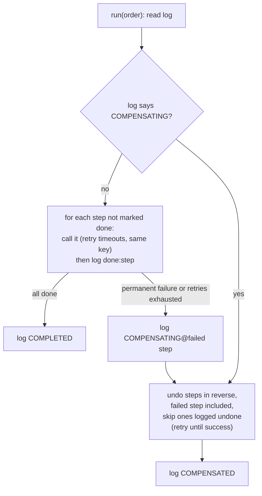

# See It Work: A Saga with Compensations, Retries and Crash Recovery

> **What this is:** a ~170-line Java program that places an order in three steps: **reserve stock → charge the card → create a shipment**. Each step is its own service, so there's no database transaction across them. You'll see the parts that make this safe anyway:
> - timeouts that hide a charge that actually happened
> - a permanent rejection that triggers **compensations in reverse order**
> - the orchestrator **crashing** between "card charged" and "write it down"
> - a refund that itself times out
>
> It ends with 200 orders under random chaos. The program checks that no order is left half-done and that no card is charged twice.
>
> **Read first:** [Payment System L5 §3.1](../../HLD/interviews/payment-system/L5-senior.md) (outbox and saga) and [sagas & distributed transactions](../../HLD/concepts/sagas-and-distributed-transactions.md).

```sh
cd see-it-work/saga-compensations
java -Dstdout.encoding=UTF-8 Saga.java     # the flag only makes ₹ and → print correctly
```

---

## 1. What's simulated

| Real system | In this program |
|---|---|
| Inventory, payment and shipping services | Three `Service` objects with a *do* and an *undo* (`reserve`/`release`, `charge`/`refund`, `ship`/`cancel`) |
| Idempotency key per step (e.g. `pay-881-1`) | The order ID. Each service remembers what it did for that key and returns the stored result for a repeat |
| Saga orchestrator (a workflow engine, or the order service's own state machine) | `run(order)`: does steps in order, compensates on failure |
| `saga_steps` table in a database | `LOG`: a map that **survives** orchestrator crashes |
| k8s restarting a crashed pod | `runUntilDone`: on a crash, a fresh `run` starts with no memory except `LOG` |
| Network timeouts | `Transient` errors, either **before** the work (nothing happened) or **after** it (the work happened, the reply was lost) |
| Business rejections ("pincode not serviceable") | `Permanent` errors: retrying won't help |

💡 **Saga:** a long business action split into local steps, each with a *compensating* step that undoes its business effect (refund for a charge, release for a hold). Used when the steps live in different services, so one database transaction can't cover them all.

💡 **Compensation ≠ rollback:** a rollback makes it as if nothing happened. A compensation is a *new* action: the customer sees a charge and then a refund on their statement.

---

## 2. The rules



Four rules make it safe:
1. **Every call carries the same key on every retry**, so a repeat gives back the stored result and has no second effect.
2. **Log after the call, not before.** A crash between the call and the log means the step runs again on restart. Rule 1 makes that harmless. (Logging *before* the call would let a crash skip a step that never happened.)
3. **Compensate in reverse, including the step that failed.** It may have applied before it timed out. Undo on something never applied is a recorded no-op. Recording it also means a late, delayed "do" for that key gets refused.
4. **Compensations retry until they succeed.** There's no "give up" path. A real system pages a human after N attempts.

---

## 3. Walking through the output

### Scenario 2: the charge happened, but the reply was lost (twice)

```text
      payment: charged ₹2,499 for o2
      ! charge:o2 timed out (applied!), retry 1 after 100 ms (same key)
      charge o2: same key seen before, returning stored result (no second effect)
      ! charge:o2 timed out (applied!), retry 2 after 200 ms (same key)
      charge o2: same key seen before, returning stored result (no second effect)
    log[o2] += done:charge
```

The orchestrator never knew whether the first charge worked. It retried with the **same key** each time, and the payment service answered from memory. One charge in total. This is [L4 §5.2](../../HLD/interviews/payment-system/L4-mid.md)'s "pass our payment ID as the PSP's idempotency key".

### Scenario 3: shipping says no, so undo in reverse

```text
    log[o3] += COMPENSATING@2 (ship:o3 rejected)
      cancel o3: nothing was applied, recorded as undone
    log[o3] += undone:cancel
      payment: refunded ₹2,499 for o3
    log[o3] += undone:refund
      inventory: released the hold for o3
    log[o3] += undone:release
    log[o3] += COMPENSATED
```

The failed step's undo runs first and is a no-op, then the refund, then the release. **Why is the charge second and not first?** Releasing a stock hold is free and instant. A refund costs fees and takes days to reach the customer. Putting cheap-to-undo steps first means most failures never reach the expensive step. (Try 4 below shows what changes if you swap them.)

### Scenario 4: the orchestrator crashes at the worst moment

```text
      payment: charged ₹2,499 for o4
    💥 orchestrator died after charge:o4, before writing the log. Restarting orchestrator…
    resuming o4 from log [done:reserve]
      charge o4: same key seen before, returning stored result (no second effect)
    log[o4] += done:charge
      shipping: created shipment for o4
```

The card was charged, but the log only says `done:reserve`. The new orchestrator starts again from the log and calls `charge` once more. The payment service recognises the key, so the order continues without a second charge. This is the crash that 2PC (two-phase commit, where a coordinator makes every participant agree before anyone commits) tries to prevent with locks. A saga accepts it and makes it harmless.

### Scenario 5: the compensation itself fails

```text
      ! refund:o5 timed out (not applied), retry 1 after 100 ms (same key)
      ! refund:o5 timed out (not applied), retry 2 after 200 ms (same key)
      payment: refunded ₹2,499 for o5
```

Compensations get the same retry and key treatment as forward steps.

### Scenario 6: chaos

```text
scripted totals: charges=5 refunds=2 (o3 and o5 refunded), duplicate calls absorbed=3

6) Chaos run: 200 orders, 20% timeouts, 5% crashes after any step, 5% permanent rejections per step
   completed=169 compensated=31 crashes survived=17 retries=128 duplicate calls absorbed=81
   cards charged=177, refunded=8 → net charged=169 for 169 completed orders
   steps left in the wrong state (half-done orders): 0
```

How to read it:
- **81 repeated calls** reached a service and changed nothing. Each one would have been a double charge, a double hold or a double shipment without idempotency.
- **Net charges = completed orders.** Most of the 31 compensated orders failed at `reserve`, before any charge. Only 8 needed a refund.
- **Zero half-done orders.** Every order ended with all three steps applied or all three undone.

The run is deterministic (seeded), so you'll get the same numbers.

---

## 4. Things to try

Each was run. The numbers below are the real results.

| Change | Result | Lesson |
|---|---|---|
| **Break idempotency:** in `doIt`, change `if (state == null)` to `if (state == null \|\| state)` | Scripted charges go from 5 to **8**. Chaos: **net charged=188 for 169 completed orders**, so 19 customers were overcharged | Retries without keys are double charges |
| **Skip the failed step when compensating:** start the undo loop at `failedAt - 1` | Chaos: **1 half-done order**. A step that applied and then timed out on every retry is never undone | Undo the step that failed too; undo must be a safe no-op |
| **Crash a lot:** `pCrash = 0.30` | **211 crashes survived**, 291 duplicate calls absorbed. Still net charged = completed (169), 0 half-done | Recovery is "read the log, redo with the same key", however many times |
| **Charge before reserving:** `List.of(PAYMENT, INVENTORY, SHIPPING)` | Same outcomes, but **refunds go from 8 to 22** | Step order is a cost decision: put the cheap-to-undo steps first |

More to try:
- Make a refund fail forever: change scenario 5 to `faults.timeoutBefore.put("refund:o5", 1000)`. After 49 retries (backoff capped at 60,000 ms) the program stops with `Saga$Transient: refund:o5 timed out`, and o5 is stuck in `COMPENSATING`: the customer was charged and nothing will refund them. In a real system this is where the saga goes to a human queue with an alert, and the log tells the on-call engineer exactly where it stopped.
- Log *before* the call (move `record(order, "done:" + ...)` above `withRetry`), then rerun. Think through scenario 4 first: what's in the log when the crash hits?

---

## 5. What to say in an interview

"Payment, inventory and shipping are separate services and the PSP isn't ours, so I can't use one transaction. I'd use an orchestrated saga with a persisted step log. Every step and compensation is idempotent by a key derived from the order. Steps are logged after they succeed, so a crash just re-runs a step, and the key makes that harmless. On a permanent failure we compensate in reverse, including the failed step, and compensations retry until they succeed or page a human. I'd order the steps cheapest-to-undo first: hold stock before charging."

## Related

- [Payment System L5 §3.1](../../HLD/interviews/payment-system/L5-senior.md): outbox, idempotent consumers, the payment ↔ order saga
- [Sagas & distributed transactions](../../HLD/concepts/sagas-and-distributed-transactions.md) · [Idempotency & delivery semantics](../../HLD/concepts/idempotency-and-delivery-semantics.md) · [Retries, backoff & DLQ](../../HLD/concepts/retries-backoff-and-dlq.md)
- [Holds, reservations & TTL](../../LLD/concepts/holds-reservations-and-ttl.md): the "reserve stock" step
- [ATM / Digital Wallet LLD](../../LLD/interviews/digital-wallet/README.md): idempotent transfers inside one process
