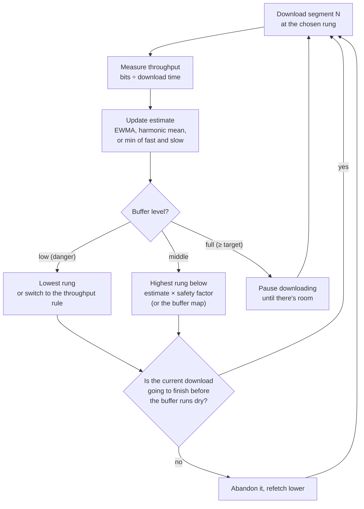
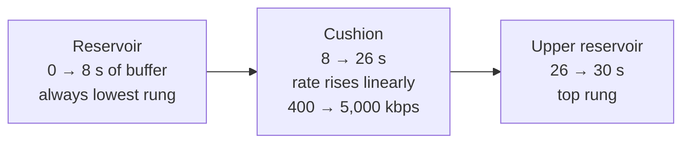
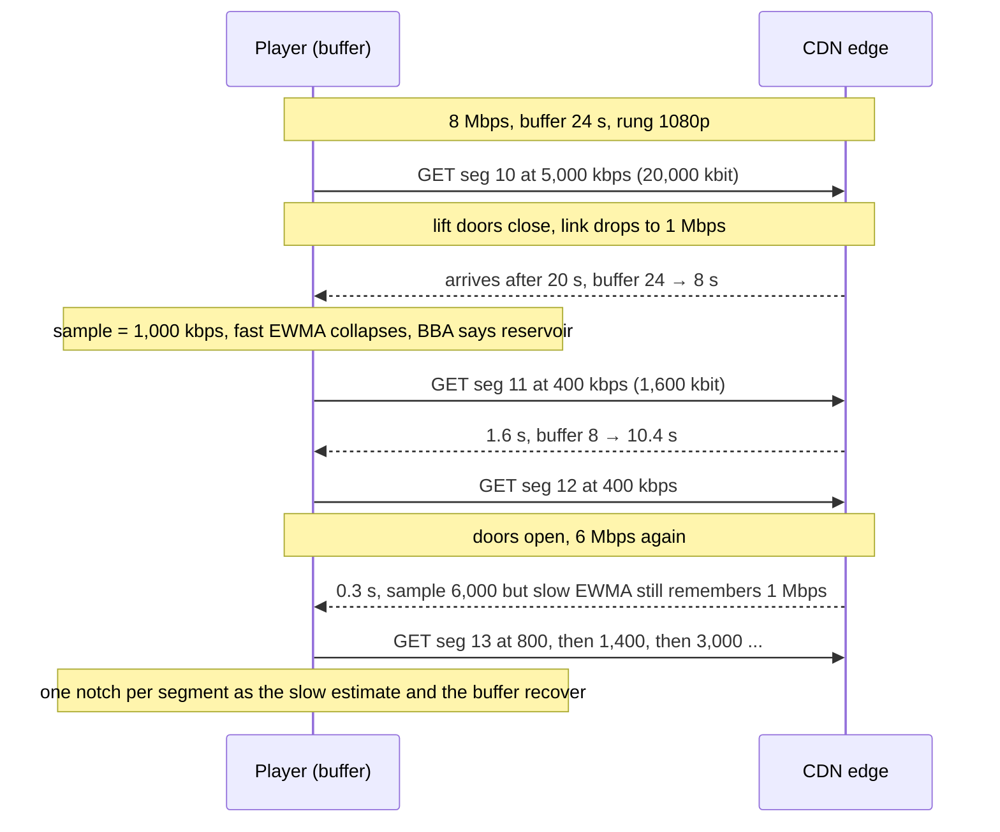

# Under the Hood: Why Does Your Video Suddenly Drop to 360p, and How Does It Climb Back? (the ABR player)

## 1. The hook

You're watching a match on your phone, crisp 1080p. You step into a lift. Two seconds later the picture turns blurry: 360p. The video **keeps playing**. You step out, and over the next 20–30 seconds the picture sharpens one notch at a time: 480p, 720p, 1080p.

Nobody on the server side decided that. A few hundred lines of code **inside the player** did, and they run the same decision every few seconds: *"which quality should I fetch next?"* The [ABR concept page](../HLD/concepts/adaptive-bitrate-streaming.md) explains the files (segments, ladders, manifests). This page explains the **decision**: what the player measures, which formulas it uses, and why it drops fast but climbs slowly.

💡 **Segment:** a 2–10 s chunk of video stored as its own file. **Rendition / rung:** one complete encode of the video at one quality (e.g. 720p at 3,000 kbps). The list of rungs is the **bitrate ladder**. **kbps / Mbps:** thousands / millions of bits per second, the unit for both video bitrate and network speed.

💡 **Buffer:** video downloaded but not yet shown, measured in **seconds of playback**. **Rebuffering (stall):** the buffer hit zero, so the spinner appears.

---

## 2. Life before it

### Progressive download: one quality, take it or leave it
Early web video (YouTube's Flash player from 2005, for example) fetched **one MP4 or FLV file** (FLV: Flash's video file format) with a plain HTTP GET and played it while it downloaded. The arithmetic is unforgiving:

```text
video encoded at 1,500 kbps, network delivers 1,000 kbps
each second of playback needs 1,500 kbit, the network brings 1,000 kbit
→ every 1 s of video takes 1.5 s to arrive → the player stalls about 1 s in every 3 s of wall time
```

The only fix was a manual "360p / 720p" menu, which most viewers never touch.

### First-generation ABR: "how fast was the last download?"
Move Networks (around 2007), Microsoft Smooth Streaming (around 2008–2009) and Apple's **HLS** (2009, later RFC 8216 in 2017) cut video into segments at several bitrates, and **MPEG-DASH** (ISO/IEC 23009-1, 2012) standardised the same idea. The early players' rule was simple: measure the last segment's download speed and pick the highest rung below it.

Researchers soon showed it was fragile:
- **2011, Akhshabi, Begen, Dovrolis** (*An experimental evaluation of rate-adaptation algorithms in adaptive streaming over HTTP*, MMSys): commercial players of the time oscillated, reacted slowly, or were too conservative.
- **2012, Huang, Handigol, Heller, McKeown, Johari** (*Confused, Timid, and Unstable: Picking a Video Streaming Rate is Hard*, IMC): when another download shared the link, players **underestimated** their fair share, picked a lower rung, got smaller segments that measured even slower, and spiralled down to the lowest quality.
- **2012, Jiang, Sekar, Zhang** (*FESTIVE*, CoNEXT): several players behind one bottleneck end up unfair and unstable.

💡 **Throughput:** how many bits per second actually arrived for one download (bytes ÷ seconds, × 8). It's what the player can *measure*, which is not the same as the link's true capacity.

---

## 3. The clever idea

**Don't trust a single speed measurement. Smooth it, keep a safety margin, and above all watch the buffer: the buffer is a shock absorber that tells you how much risk you can afford right now.**

Two schools grew from that:
- **Throughput-based:** predict the next download speed from recent ones, pick the highest rung that fits with margin.
- **Buffer-based:** ignore the prediction most of the time, and choose quality from how many seconds are in the buffer. Full buffer → afford high quality. Nearly empty → lowest rung, no matter what the speed test says.

Real players are **hybrids** of the two.

---

## 4. Step by step

### 4.1 The loop, once per segment



### 4.2 Throughput-based: estimate, then pick with margin
A segment of 4 s at the 3,000 kbps rung is `3,000 × 4 = 12,000 kbit = 1.5 MB`. If it arrives in 1.5 s, the sample is `12,000 / 1.5 = 8,000 kbps`.

One sample is noise (a CDN cache hit, a Wi-Fi blip), so players smooth the samples:

- **EWMA (exponentially weighted moving average):** `estimate = α × sample + (1 − α) × estimate`. A recent sample counts most and old ones fade away, like a load average in `top`. α = 0.3 means the newest sample is 30% of the estimate.
- **Harmonic mean of the last N samples:** `N / Σ(1/sample)`. One huge sample barely moves it, one slow sample pulls it down: a conservative average (MPC uses it, see 4.4).
- **Two EWMAs, take the lower:** a fast one (reacts to drops within a segment or two) and a slow one (ignores brief spikes). The minimum means *"drop quickly, rise slowly"* falls out automatically. **hls.js** does exactly this: in its `src/config.ts` (read in 2026) the defaults are `abrEwmaFastVoD: 3` and `abrEwmaSlowVoD: 9` (half-lives in seconds), a starting guess `abrEwmaDefaultEstimate: 5e5` (500 kbps), and the estimator returns `Math.min(fast, slow)`. The design is borrowed from Google's Shaka Player.

Then pick the highest rung below `estimate × safety factor`:

```text
estimate 6,000 kbps × 0.8 = 4,800 → ladder 400 / 800 / 1,400 / 3,000 / 5,000 → pick 3,000 (720p)
```

Real values: hls.js uses `abrBandWidthFactor: 0.95` for staying or going down and a stricter `abrBandWidthUpFactor: 0.7` for switching **up**. dash.js's throughput rule uses a 0.9 safety factor over a sliding window of recent segments (dash.js docs). The asymmetric factors are deliberate: going up needs proof, going down needs only a hint.

### 4.3 Buffer-based: BBA (Netflix + Stanford, 2014)
Huang, Johari, McKeown, Trunnell and Watson (*A Buffer-Based Approach to Rate Adaptation*, SIGCOMM 2014) tested on millions of Netflix sessions in 2013. Their baseline **BBA-0** maps buffer level straight to a rate:



With the numbers from the demo (the paper used a buffer of minutes, not 30 s):

```text
f(buffer) = 400 + (buffer − 8) / 18 × (5,000 − 400)
buffer 12 s → f = 400 + 4/18 × 4,600 = 1,422 kbps → 1,400 kbps rung (480p)
buffer 20 s → f = 400 + 12/18 × 4,600 = 3,467 kbps → 3,000 kbps rung (720p)
```

Plus **hysteresis** (a dead band, like a thermostat that doesn't flick on and off around 21 °C): stay on the current rung until `f` crosses the *next* rung up or down. Result reported in the paper: **10–20% fewer rebuffers** than Netflix's then-default algorithm at a similar average rate. The paper's own catch: buffer-only fails at **startup** (the buffer is empty, so it would sit at the lowest rung), so its later variants used throughput estimates while the buffer is filling.

**BOLA** (Spiteri, Urgaonkar, Sitaraman, INFOCOM 2016) turns the same intuition into maths: it treats each choice as maximising "quality utility minus a penalty for draining the buffer" using **Lyapunov optimisation** (a control-theory technique that keeps a queue, here the buffer, stable without predicting the future). It needs **no bandwidth prediction** at all. BOLA ships in the **dash.js** reference player, whose default `abrDynamic` strategy uses the throughput rule at startup and switches to BOLA once the buffer is healthy, switching back if it drains (dash.js docs). The paper won the INFOCOM Test of Time award in 2026.

### 4.4 Hybrid and learned
- **MPC** (Yin, Jindal, Sekar, Sinopoli, *A Control-Theoretic Approach for Dynamic Adaptive Video Streaming over HTTP*, SIGCOMM 2015): **model predictive control** (plan several steps ahead with a model, execute only the first step, re-plan next time, like a satnav re-routing at every junction). Predict throughput with a harmonic mean, simulate the next ~5 segments for each sequence of rungs, pick the sequence with the best score, and download only its first segment. The score (QoE, quality of experience) is the formula most later papers use:

```text
QoE = Σ quality(segment) − λ × Σ |quality change between segments| − μ × total rebuffer seconds − startup penalty
```

- **Pensieve** (Mao, Netravali, Alizadeh, SIGCOMM 2017): a neural network trained with **reinforcement learning** (learning by trial and reward in a simulator, like a game-playing AI) chooses the rung. The paper reports **12–25% higher average QoE** than the best previous scheme on its traces.

### 4.5 A tunnel, segment by segment



The 20 s download for 4 s of video is the dangerous moment: `20 − 4 = 16 s` of buffer burned on one segment. If the buffer had been 12 s, the viewer would have seen a 4 s spinner. That's why players **abandon** a download that is clearly too slow and refetch the same segment at a lower rung (hls.js does this in its ABR controller).

### 4.6 Why the asymmetry: drop fast, climb slowly, start low
- **A stall hurts far more than blur.** Krishnan and Sitaraman (Akamai data, 23 million views, IMC 2012) found viewers start abandoning when startup takes more than 2 s, each extra second adding about **5.8%** abandonment, and a rebuffer equal to 1% of the video's length cut viewing time by about **5%**. Going one rung too low costs a little sharpness. Going one rung too high can cost a spinner.
- **Overestimates are more dangerous than underestimates.** If you guess high, the download takes longer than the video it holds and the buffer drains. If you guess low, you lose a bit of quality and the buffer grows: a self-correcting error.
- **Switching itself costs.** Every change is a visible jump in sharpness. QoE models penalise frequent switches (the λ term in the QoE formula in 4.4), so a steady 720p can beat flicker between 480p and 1080p. Hence hysteresis and "one notch up at a time".
- **Start low:** the first segment at 400 kbps is 200 KB and arrives in a fraction of a second, so the first frame appears fast. hls.js also starts from its 500 kbps default estimate (or from the last session's).
- **Seek:** jumping to minute 40 throws away the buffer, so the player is back to startup mode. A pure buffer-based player would drop to the lowest rung. Hybrids keep the throughput estimate across the seek.
- **Buffer targets:** VOD players keep tens of seconds (hls.js `maxBufferLength: 30`, Netflix much more). For **live**, the buffer *is* the delay behind real time, so live players keep only a few seconds, leaving almost no shock absorber.

---

## 5. Where you've already used it

| You used | What you saw |
|---|---|
| YouTube → right-click → **Stats for nerds** | *Connection Speed* (the throughput estimate), *Buffer Health* (seconds buffered), *Current / Optimal Res*; throttle the network and watch the res follow the buffer |
| Netflix, Hotstar (JioHotstar), Prime Video | the "blurry first few seconds, then sharp" startup is the start-low rule |
| Instagram / TikTok feeds | short clips start at low quality and many apps prefetch the next clip; data-saver settings cap the top rung |
| DevTools → Network → throttling ("Slow 4G" / "3G", names vary by Chrome version) on any HLS/DASH site | filter by `m3u8`, `mpd`, `m4s`, `ts`: segment URLs switch to a lower rendition folder within a few segments |
| The hls.js demo page and the dash.js reference player (from the hls.js and DASH-IF sites) | live charts of the bandwidth estimate, buffer level and chosen level |

---

## 6. Limits and trade-offs

- **Players fight each other.** Ten TVs behind one home router each measure "their" throughput. Because a full buffer makes a player pause downloading (ON-OFF traffic), each sees a misleading share, and they oscillate or get unfair splits (FESTIVE, 2012). The player only sees its own downloads, not the bottleneck.
- **The measurement lies.** TCP **slow start** (a new or idle connection begins slowly and ramps up) makes small segments look slower than the link. A **CDN** cache hit is fast and a miss (fetched from the origin) is slow, so samples reflect the cache as much as the network. HTTP/2 and QUIC multiplexing (many requests on one connection) blur per-segment timing.
- **Live and low latency.** With a 2–6 s buffer there's no cushion, and with chunked transfer (a segment is sent while still being encoded) the download arrives at the *encoding* speed, so throughput measurement can't tell a fast link from a slow one. Low-latency ABR is still an active research area.
- **Mobile radios.** Capacity can swing 10× in seconds (handover between cells, lifts, trains), faster than one 4–6 s segment. Shorter segments react faster but cost more requests and worse compression.
- **The ladder bounds everything.** If capacity falls below the lowest rung (300 kbps vs a 400 kbps rung), every algorithm stalls.
- **Not only the network decides.** Data saver modes, mobile data caps, screen size (no 1080p on a 360-pixel-wide player) and device decode limits cap the rung before ABR even runs.

---

## 7. Try it

**Run the simulator** in [`code/AbrSimulator.java`](code/AbrSimulator.java) (~190 lines, no dependencies). It plays a 3-minute video (45 × 4 s segments), ladder 400 / 800 / 1,400 / 3,000 / 5,000 kbps, 30 s max buffer, 80 ms request round trip, through a per-second capacity trace with four strategies: (a) last throughput, (b) one EWMA × 0.8, (c) hls.js-style min(fast, slow EWMA) × 0.8, (d) BBA-0 style buffer map with hysteresis. Then it repeats on 200 seeded random traces, without and with abandoning too-slow downloads.

```sh
cd under-the-hood/code
java AbrSimulator.java
```

Real output (Java 21, Linux):

```text
ladder: 1=240p@400  2=360p@800  3=480p@1400  4=720p@3000  5=1080p@5000 kbps
network: 0-20 s 8 Mbps | 20-60 s 1 Mbps | 60-100 s bursty (4 s at 9 Mbps, 6 s at 0.3) | then 6 Mbps
one digit per 4 s segment, ^ = playback stalled while that segment downloaded

(a) naive: last throughput       avg 3,613 kbps | switches 13 | stalls  0.0 s | startup 0.28 s
  quality 155555555322222222245535355353555555555555555
(b) EWMA x 0.8                   avg 3,396 kbps | switches 11 | stalls 16.2 s | startup 0.28 s
  quality 145555555544344545444454444444444444444444444
  stall            ^^^
(c) min(fast, slow EWMA) x 0.8   avg 2,640 kbps | switches 10 | stalls  0.0 s | startup 0.28 s
  quality 144455555543222211113344444444434444444444444
(d) buffer-based (BBA-0 style)   avg 3,253 kbps | switches  9 | stalls  0.0 s | startup 0.28 s
  quality 111234444555511222334444444444555555555555555

200 random traces (capacity jumps every 5-30 s between 0.3 and 10 Mbps):
(a) naive: last throughput       avg 2,509 kbps | switches  9.0 | stalls  5.5 s | sessions with a stall  51%
(b) EWMA x 0.8                   avg 2,436 kbps | switches  7.7 | stalls 11.8 s | sessions with a stall  67%
(c) min(fast, slow EWMA) x 0.8   avg 1,895 kbps | switches  9.7 | stalls  4.6 s | sessions with a stall  44%
(d) buffer-based (BBA-0 style)   avg 2,542 kbps | switches 11.3 | stalls  6.0 s | sessions with a stall  65%

200 random traces (capacity jumps every 5-30 s between 0.3 and 10 Mbps), WITH abandoning too-slow downloads:
(a) naive: last throughput       avg 2,402 kbps | switches  9.0 | stalls  1.7 s | sessions with a stall  37%
(b) EWMA x 0.8                   avg 2,237 kbps | switches 11.8 | stalls  3.1 s | sessions with a stall  51%
(c) min(fast, slow EWMA) x 0.8   avg 1,829 kbps | switches 10.4 | stalls  1.7 s | sessions with a stall  35%
(d) buffer-based (BBA-0 style)   avg 2,459 kbps | switches 11.5 | stalls  1.9 s | sessions with a stall  46%
```

(Empty stall lines removed.) What to notice, honestly:
- **(b) is the cautionary tale.** Smoothing made it *slow to notice the drop*: after the tunnel starts, its estimate still says "fast", so it keeps fetching 1080p/720p segments that take up to 20 s each at 1 Mbps, and stalls 16 s. Smoothing alone protects against spikes, not against drops. That's exactly why hls.js takes the **minimum** of a fast and a slow average: (c) never stalls here.
- **(c) pays for safety in quality**: lowest average bitrate, and it never reaches 1080p on the 6 Mbps link because `6,000 × 0.8 = 4,800 < 5,000`. The safety factor can cost a whole rung.
- **(a) got lucky on the scripted trace** (zero stalls, highest bitrate) but flips 5→3→5→3 in the bursty phase: the oscillation the 2011–2012 papers describe. On random traces it stalls in half the sessions.
- **(d) climbs slowly at startup** (`1112344445`: the buffer must fill first), drops straight to the lowest rung in the tunnel, and holds steady through the bursts. On random traces, though, it stalls in 65% of sessions: with only a 30 s buffer it can be sitting on a 1080p download when capacity collapses to 0.3 Mbps, and that one segment takes ~67 s. BBA's real deployment had minutes of buffer and later variants used throughput at startup.
- **Abandoning slow downloads cut stall time roughly 3× for every strategy** (5.5 → 1.7 s, 11.8 → 3.1 s, 4.6 → 1.7 s, 6.0 → 1.9 s): often the biggest single win is not the formula but the escape hatch.
- **No strategy wins everything.** 174 of the 200 random traces hit a 0.3 Mbps stretch (below the lowest rung) during the first 3 minutes, so some stalls are unavoidable. This is why production players are hybrids and are tuned on real session data.

Things to try: set `MAX_BUFFER_SEC = 10` (live-like) and watch stalls rise; change the 0.8 safety factor to 0.95; make the lowest rung 200 kbps.

---

## 8. Where it shows up in this repo

- [Video Streaming interview](../HLD/interviews/video-streaming/README.md): the player and QoE metrics; [L4](../HLD/interviews/video-streaming/L4-mid.md) (segments and ladder), [L5](../HLD/interviews/video-streaming/L5-senior.md) (QoE from player events), [L6](../HLD/interviews/video-streaming/L6-staff.md) (rebuffering ratio as the north-star metric, per-ISP debugging).
- [Adaptive bitrate streaming](../HLD/concepts/adaptive-bitrate-streaming.md): the files, manifests, CMAF and latency that this page's player consumes.
- [Case study: video upload, transcode and storage](../case-studies/video-upload-transcode-and-storage.md): how YouTube, Netflix and Meta build the ladder and edge caches the player fetches from.
- [CDN](../HLD/technologies/cdn.md): cache hits vs misses are part of the throughput the player measures.
- [Observability](../HLD/concepts/observability.md): startup time, rebuffering ratio and average bitrate as QoE metrics.
- Same "measure, smooth, keep a margin, back off fast" instinct on the server side: [resilience patterns](../HLD/concepts/resilience-patterns.md) (timeouts, circuit breakers) and [load balancers](../HLD/technologies/load-balancer.md) (routing away from slow backends).

## 9. Sources

- R. Pantos, W. May, *HTTP Live Streaming*, RFC 8216 (2017); HLS itself shipped by Apple in 2009.
- ISO/IEC 23009-1, *Dynamic adaptive streaming over HTTP (DASH)* (first edition 2012).
- S. Akhshabi, A. Begen, C. Dovrolis, *An experimental evaluation of rate-adaptation algorithms in adaptive streaming over HTTP* (MMSys 2011).
- T.-Y. Huang, N. Handigol, B. Heller, N. McKeown, R. Johari, *Confused, Timid, and Unstable: Picking a Video Streaming Rate is Hard* (IMC 2012).
- J. Jiang, V. Sekar, H. Zhang, *Improving Fairness, Efficiency, and Stability in HTTP-based Adaptive Video Streaming with FESTIVE* (CoNEXT 2012).
- S. S. Krishnan, R. Sitaraman, *Video Stream Quality Impacts Viewer Behavior: Inferring Causality Using Quasi-Experimental Designs* (IMC 2012): 2 s startup threshold, 5.8% per extra second, 1% rebuffer → 5% less viewing.
- T.-Y. Huang, R. Johari, N. McKeown, M. Trunnell, M. Watson, *A Buffer-Based Approach to Rate Adaptation: Evidence from a Large Video Streaming Service* (SIGCOMM 2014): BBA, 10–20% fewer rebuffers. (The demo's 8 s / 26 s / 30 s thresholds are scaled down for a browser-sized buffer, not the paper's values.)
- X. Yin, A. Jindal, V. Sekar, B. Sinopoli, *A Control-Theoretic Approach for Dynamic Adaptive Video Streaming over HTTP* (SIGCOMM 2015): MPC and the QoE formula.
- K. Spiteri, R. Urgaonkar, R. Sitaraman, *BOLA: Near-Optimal Bitrate Adaptation for Online Videos* (INFOCOM 2016); K. Spiteri, R. Sitaraman, D. Sparacio, *From Theory to Practice: Improving Bitrate Adaptation in the DASH Reference Player* (MMSys 2018).
- H. Mao, R. Netravali, M. Alizadeh, *Neural Adaptive Video Streaming with Pensieve* (SIGCOMM 2017): 12–25% QoE improvement.
- hls.js source, `src/config.ts` and `src/utils/ewma-bandwidth-estimator.ts` (read October 2026): EWMA half-lives 3/9 s, 500 kbps default estimate, 0.95 / 0.7 bandwidth factors, `maxBufferLength: 30`, `Math.min(fast, slow)`.
- dash.js documentation, *ABR Logic* / *Adaptive Bitrate Streaming* (DASH-IF, read 2026): `abrDynamic` default, throughput rule safety factor 0.9, BOLA.
- The simulator output was produced by running the code in this folder.

⬅️ [Under the Hood index](README.md) · 🏠 [Home](../README.md)
