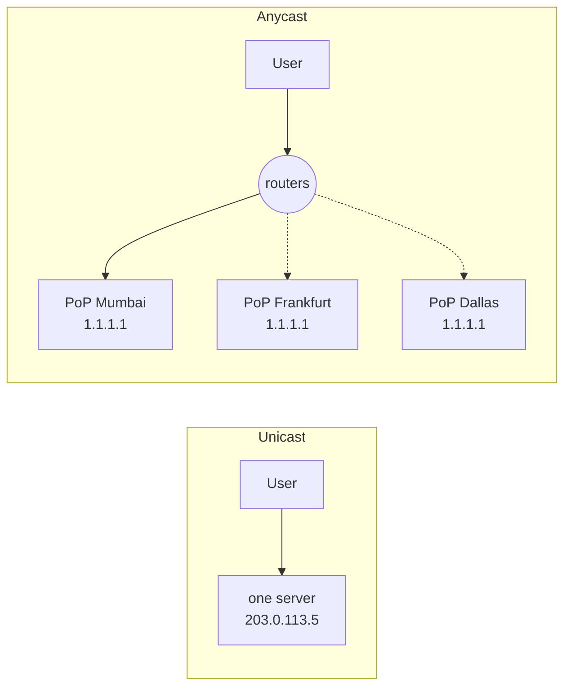
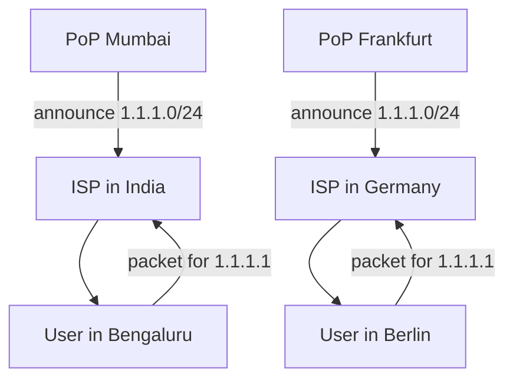

# Under the Hood: How Does One IP Address Live in Hundreds of Cities? (Anycast)

## 1. The hook

`8.8.8.8` (Google) and `1.1.1.1` (Cloudflare) are single addresses. Yet a lookup from Bengaluru answers in ~5 ms, and the same address from Frankfurt also answers in ~5 ms. Light needs ~100 ms to cross the planet, so the two answers cannot come from the same machine. How can one IP address be in many places at once, and what stops your packet from going to the wrong one?

💡 **IP address:** the number that says where a packet should go on the internet (like `1.1.1.1`).
💡 **PoP (point of presence):** a small data-centre-in-a-rack that a company puts inside a city's network exchange. A CDN or DNS provider has tens to hundreds of them.
💡 **ms (millisecond), µs (microsecond):** 1/1,000 and 1/1,000,000 of a second.

---

## 2. Life before it

- Classic internet addressing is **unicast**: one address, one machine (or one load balancer). If your DNS server sits in Virginia, everybody on Earth pays the trip to Virginia.
- The first fix was **many names, many addresses**: give users a list and let them pick, or use DNS to answer "the nearest server's address" (**GeoDNS**, 1990s-2000s). This needs the DNS answer to guess where you are, and cached answers go stale (see [dns.md](../HLD/technologies/dns.md)).
- Attacks made it urgent. In the **October 2002** attack on the DNS root servers, 9 of 13 were hit by a flood of junk traffic (🟡 figure from memory). A single address in a single building cannot absorb that.
- **RFC 1546 (1993)** proposed **anycast**: let many machines share one address and let the network pick. **RFC 3258 (2002)** described using it for DNS, and root server operators began deploying it from about **2002** onward (🟡 exact first deployment year).

---

## 3. The clever idea

Do not pick the server at all. **Every PoP announces the same address to its neighbours** ("I can reach 1.1.1.0/24"), and the internet's routers, which already forward each packet toward the closest announcer, do the picking for free.

---

## 4. Step by step

### 4.1 Unicast vs anycast



The user always sends to the same address. The path decides the destination.

### 4.2 BGP in plain words

💡 **AS (autonomous system):** one organisation's network on the internet: an ISP, a cloud, a university. Each has a number (Cloudflare is AS13335, Google is AS15169).
💡 **Prefix:** a block of addresses, written like `1.1.1.0/24` (the `/24` means "the first 24 bits are fixed", so 256 addresses).
💡 **BGP (Border Gateway Protocol):** the protocol networks use to tell their neighbours **which prefixes they can reach**. Think of it as a gossip protocol between companies.

How it works:

1. Cloudflare's network says to its neighbour ISPs: "I can reach `1.1.1.0/24`. Path: [AS13335]."
2. The ISP passes it on, adding itself: "Path: [AS-ISP, AS13335]". Each hop adds its number, so the list grows.
3. A router that hears the same prefix from several neighbours **prefers the shortest AS path** (fewest networks to cross), after the operator's own policies, such as "prefer my paying customers over free peers".
4. It installs that one neighbour as the next hop for the prefix.

💡 **Analogy:** a k8s Service with many pods. The ClusterIP is one address; kube-proxy or the CNI decides which pod gets the packet. Here the "kube-proxy" is the whole internet's routing tables, and the decision is made hop by hop.

### 4.3 Many PoPs announce the same prefix



The Bengaluru user's ISP hears the announcement from Mumbai with a short path, so packets go to Mumbai. The Berlin user's ISP hears Frankfurt. Nobody coordinates; each router acts on its own view.

⚠️ **"Nearest" means fewest networks, not fewest kilometres.** If your ISP only peers with a network in Singapore, a user in Mumbai can land in Singapore. Operators tune this by choosing where to announce, by **prepending** their own AS number several times to make a path look longer, and by choosing which PoP sees which neighbour.

### 4.4 Why it suits DNS and short connections

- **UDP / DNS:** a DNS query is one packet out and one packet back, with no memory between queries. If the next query lands on a different PoP, nothing breaks. This is the ideal fit.
- **Short TCP:** 💡 **TCP** is the connection-oriented transport (a handshake, then a numbered stream), so all packets of one connection must reach the same machine. If the route stays stable for the 100 ms-2 s a web request takes, that is fine, and it usually does stay stable.
- **Long TCP or large downloads:** if BGP changes mid-connection, packets now arrive at a PoP that has never heard of the connection and answers with a reset. Providers handle this by pinning flows inside a PoP (see [maglev-hashing.md](maglev-hashing.md)), by making connections short, or by using QUIC connection IDs (🟡 mitigation details vary per provider).

### 4.5 Route changes and failures

If a PoP dies or is withdrawn for maintenance, it stops announcing. Within seconds to a few minutes (🟡 BGP convergence is typically seconds to minutes) neighbours forget it and traffic flows to the next-closest PoP. That is **failover with no client change**, like a load balancer health check, but done by routing.

### 4.6 DDoS absorption

💡 **DDoS (distributed denial of service):** thousands of hacked machines send junk to one target to overwhelm it.

The attackers' machines are spread over the world, and each one's junk is routed to its **own nearest PoP**. The attack is split across hundreds of sites. If the attack is 2 Tbps and there are 200 PoPs, an even split is 2,000 Gbps / 200 = 10 Gbps per site, small enough for one site to drop. The attack only concentrates if the attackers themselves are concentrated. Operators can also withdraw the announcement from an overwhelmed PoP to push its load to the others (🟡 a deliberate tactic, but risky because it moves the load onto neighbours).

---

## 5. Where you have used it without knowing

- Every time your laptop used `8.8.8.8` or `1.1.1.1` as DNS.
- **CDNs:** Cloudflare, and Fastly use anycast to steer users to a nearby PoP. Others such as Akamai mostly use DNS-based mapping (🟡 and mix both). See [cdn.md](../HLD/technologies/cdn.md).
- **DNS root servers:** the root has **13 names** (a.root-servers.net to m.root-servers.net) but **well over 1,000 server instances** worldwide (🟡 the count grows; check root-servers.org). One name is one anycast address announced from many sites.
- **Load balancer front doors:** cloud global load balancers advertise one virtual IP from many edges, then forward inside. Compare [load-balancer.md](../HLD/technologies/load-balancer.md).

---

## 6. Limits and trade-offs

| Limit | Why |
|---|---|
| Routing "nearest" is not always lowest latency | BGP sees AS hops, not milliseconds. Policies and peering can send you across a continent. |
| No control over who goes where | You influence it by tuning announcements. You cannot say "send this user to Mumbai". |
| Long connections may break on route change | The new PoP does not hold the TCP state. |
| Debugging is harder | "Which PoP did this user hit?" requires the server to tell you (see below). |
| Every PoP must be able to serve everything | No sticky "this server has your data". Fine for DNS, needs replication for stateful services. |
| BGP is built on trust | A wrong announcement (a **BGP hijack**) can pull traffic to the wrong network. Defences such as RPKI exist but are not universal. |

---

## 7. Try it

Honest note: this sandbox has **no `dig` or `traceroute` installed, and the egress proxy blocks 1.1.1.1** (`curl https://1.1.1.1/...` got an HTTP 403 on CONNECT). So there is no real output to quote here. Run these on your laptop.

```sh
# Ask the resolver which PoP answered (a CHAOS-class TXT query)
dig +short CHAOS TXT id.server @1.1.1.1          # e.g. "BLR"  (airport-style PoP code)
dig +short @1.1.1.1 whoami.cloudflare TXT CH     # your public IP as the PoP sees it
curl -s https://1.1.1.1/cdn-cgi/trace | grep colo   # colo=BOM, FRA, ... the PoP serving you

# See the path and its length
traceroute 1.1.1.1        # or: mtr -rwc 10 1.1.1.1
```

What to expect: 4-10 hops and ~2-20 ms from most cities. Run the same `dig` from a phone hotspot, a VPN exit in another country, or a cloud VM in another region and watch the PoP code change while the IP stays the same. Compare a ping to `1.1.1.1` with a ping to an ordinary single-site server: the anycast one is hard to explain with the speed of light unless the server is nearby.

---

## 8. Where it shows up

- [cdn.md](../HLD/technologies/cdn.md): how edges are chosen (anycast vs DNS mapping).
- [dns.md](../HLD/technologies/dns.md): root servers, public resolvers, GeoDNS as the alternative.
- [load-balancer.md](../HLD/technologies/load-balancer.md): global vs regional balancing.
- [maglev-hashing.md](maglev-hashing.md): after anycast delivers a packet to a PoP, how one machine in the PoP is picked consistently.
- [tls-1-3-handshake.md](tls-1-3-handshake.md): short RTT to a nearby PoP makes the handshake cheap.

---

## 9. Sources

- C. Partridge, T. Mendez, W. Milliken, *RFC 1546: Host Anycasting Service*, 1993.
- J. Abley, K. Lindqvist, *RFC 4786: Operation of Anycast Services*, 2006.
- Y. Rekhter, T. Li, S. Hares, *RFC 4271: BGP-4*, 2006.
- *RFC 3258: Distributing Authoritative Name Servers via Shared Unicast Addresses*, 2002.
- Root Server Operators, root-servers.org (instance counts change; 🟡 not re-checked today).
- Cloudflare blog posts on anycast, DDoS mitigation and 1.1.1.1 launch (2018) 🟡 exact titles not re-checked.
- Google Public DNS documentation (8.8.8.8) 🟡 not re-checked.
- Attack on DNS root servers, October 2002 🟡 number of servers affected from memory.
