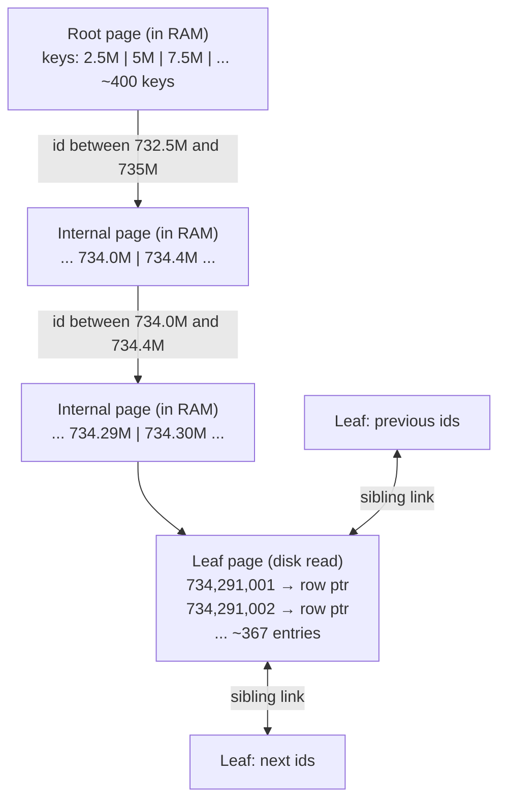
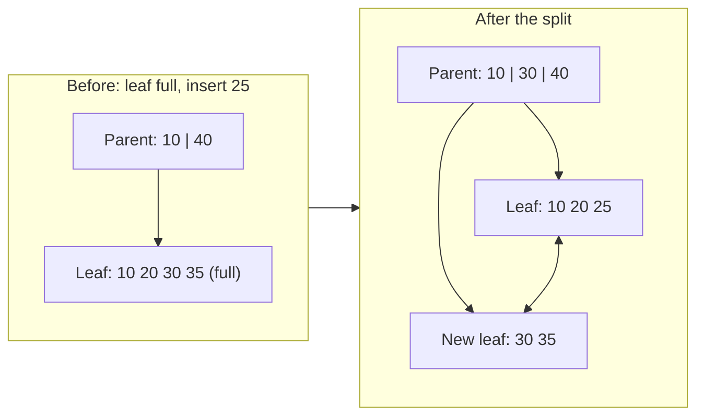

# Under the Hood: How Does a Database Find One Row Among a Billion in ~3 Disk Reads? (B-tree)

## 1. The hook

You run `SELECT * FROM orders WHERE id = 734_291_002` on a table with a **billion rows** and it comes back in under a millisecond. The table is hundreds of gigabytes, far bigger than RAM. The database didn't read it all. It didn't even read 1%. It read about **three or four 8 KB blocks**, and most of those were already in memory.

The structure behind every `PRIMARY KEY` and almost every `CREATE INDEX` you've written is the **B-tree**, invented in 1970 and still the default index in Postgres, MySQL, SQLite, and many file systems more than 50 years later.

💡 **Index:** a separate, sorted structure the database keeps next to a table so it can jump to matching rows instead of scanning all of them, like the index at the back of a book. **Disk read:** fetching a block of data from a hard disk or SSD into RAM, thousands of times slower than reading RAM ([latency table](../HLD/concepts/back-of-the-envelope.md)).

---

## 2. Life before it

### The hardware rule: disks hand you pages, not bytes
A disk or SSD never reads "one 8-byte key". It reads a whole fixed-size block called a **page** (Postgres uses **8 KB** pages, MySQL's InnoDB **16 KB**). Reading 8 bytes or 8 KB costs the same; what costs is the **number of separate, random reads**.

```text
RAM read                  ~100 ns
SSD random 4-8 KB read    ~100 µs   (1,000× slower than RAM)
HDD seek + read           ~10 ms    (100× slower than SSD)
```

💡 **ns / µs / ms:** nano-, micro-, milliseconds (1 ms = 1,000 µs = 1,000,000 ns). **HDD seek:** a spinning disk physically moving its read head to a new spot, the slow part of a random read. **SSD:** flash storage with no moving parts: much faster random reads, but still reads whole pages.

### Attempt 1: a sorted file plus binary search
Keep the rows sorted by id and binary search: look at the middle, discard half, repeat ([Big-O](../LLD/concepts/big-o-complexity.md)). That's O(log n) comparisons, which sounds great, but each probe lands on a **different, random page**:

```text
log2(1,000,000,000) ≈ 30 probes → ~30 random page reads
HDD: 30 × 10 ms  = 300 ms per lookup
SSD: 30 × 100 µs = 3 ms per lookup (and inserting a row into the middle of a sorted file means rewriting everything after it)
```

### Attempt 2: a binary search tree
A **binary search tree (BST)** is what Java's `TreeMap` is (a balanced one, the red-black tree; see [TreeSet/TreeMap](../LLD/libraries/java/treeset-and-priorityqueue.md)): each node holds **one key** and **two pointers** (left = smaller, right = bigger). Inserts are cheap now, but a lookup still walks ~30 levels for a billion keys, and each node lives wherever it was allocated. On disk, following a pointer means **one random page read per level**, and you used 16 bytes of an 8 KB page each time. 99.8% of every read is wasted.

💡 **Pointer:** a stored address saying "the next node lives here" (in memory, an address; on disk, a page number). **Pointer chasing:** following them one by one, where each hop can't start until the previous one finishes.

---

## 3. The clever idea

**Make every tree node exactly one disk page, and pack it with hundreds of keys and child pointers.** Instead of choosing between 2 children per node, you choose between ~400, so the tree is only 3–4 levels deep even for a billion keys, and the top levels are small enough to sit in RAM permanently.

Rudolf **Bayer** and Edward **McCreight**, working at Boeing's research labs, described it in *Organization and Maintenance of Large Ordered Indices* (technical report and workshop paper 1970, journal *Acta Informatica* 1972). Nobody is sure what the "B" stands for (Boeing, balanced, broad, Bayer); the authors never said.

---

## 4. Step by step

### How wide is a node? (fan-out)
**Fan-out** = how many children one node points to. For a `bigint` key in Postgres:

```text
one leaf entry  = 8 B key + 8 B entry header (includes the 6 B pointer to the row) = 16 B
                + 4 B slot in the page's item array                               = 20 B
8,192 B page / 20 B ≈ 409 entries max; kept 90% full on bulk/sequential load ≈ 367 entries
```

Measured on a 10M-row Postgres 16 table in this environment (see §7): **367 entries per leaf page, 16 bytes each**. So use ~400 as the round number.

### How tall for a billion keys?

```text
height = ceil(log_400(1,000,000,000)) = ceil(3.46) = 4 levels

built bottom-up:  1e9 keys / 400 per leaf = 2,500,000 leaf pages
                  2,500,000 / 400         =     6,250 pages
                  6,250 / 400             =        16 pages
                  16 → 1 root page
all non-leaf pages: 1 + 16 + 6,250 = 6,267 pages × 8 KB ≈ 48 MB
```

48 MB fits easily in the database's page cache, so after warm-up a lookup reads **root, level 2, level 3 from RAM, then 1 disk read for the leaf** (plus one for the table row in Postgres, below). Compare with 30 random reads for binary search.

💡 **Buffer pool / page cache:** the RAM area where a database keeps recently used pages (`shared_buffers` in Postgres, the InnoDB buffer pool in MySQL). A "hit" is a page found there, a "read" goes to disk (or the OS file cache).



Inside each page the database binary-searches the ~400 sorted keys. That's ~9 comparisons on data already in RAM, a few hundred nanoseconds, which is nothing next to one disk read.

### B+ tree: the version databases actually use
The original B-tree stores rows (or row pointers) in every node. Almost every database uses the **B+ tree** variant:
- **Internal pages hold only keys and child pointers**, so they fit more entries (higher fan-out, shorter tree).
- **All data lives in the leaves**, and **leaves are linked to their neighbors**. A range query (`WHERE id BETWEEN 100 AND 200`, `ORDER BY created_at LIMIT 20`) finds the first leaf once, then walks sideways reading leaves in order. That's why B-trees are great for [pagination](../HLD/concepts/pagination.md) and sorted reads, while a hash index is not.

### Inserts: page splits
A new key goes into the leaf where it belongs. If that leaf is full, it **splits**: allocate a new page, move half the entries there, and insert a separator key into the parent. If the parent is full, it splits too. A split that reaches the root creates a new root, so **the tree grows at the top**, which keeps every leaf at the same depth. That's the "balanced" part, without any rotations.



**Fill factor** = how full pages are left. Postgres B-tree leaves default to 90%: when the rightmost leaf splits (sequential keys), it keeps the old page 90% full and starts a fresh one. Any other split is 50/50, leaving two half-empty pages that fill up over time.

### Why random UUIDv4 keys hurt and sequential keys don't
- **Sequential keys** (auto-increment `bigserial`, or time-ordered [UUIDv7 / Snowflake IDs](../HLD/concepts/id-generation.md)): every insert goes to the **rightmost leaf**. That one page is always hot in RAM, splits are cheap and leave 90%-full pages.
- **Random keys** (UUIDv4, hashes): every insert lands on a **random leaf** anywhere in the index. If the index is bigger than RAM, almost every insert needs a disk read first (a cache miss), splits happen all over the index, and pages settle around **~70% full**, so the index is bigger and caches worse.

💡 **UUIDv4:** a 128-bit ID made of random bits. **UUIDv7:** a newer standard (RFC 9562, 2024) whose first 48 bits are a millisecond timestamp, so new IDs sort after old ones. **Cache miss:** the page you need isn't in RAM, so you pay a disk read.

Measured here (Postgres 16, 2M inserted rows each, same `bigint` type, only the order differs):

| Key order | Index size | Leaf pages | Avg leaf fullness |
|---|---|---|---|
| sequential `1, 2, 3...` | 43 MB | 5,465 | 90.1% |
| random `bigint` | 58 MB | 7,367 | 66.9% |

(A `uuid` key filled by `gen_random_uuid()` gave 76 MB at 71.2%, bigger also because a UUID is 16 bytes vs 8.)

### Clustered (InnoDB) vs heap + index (Postgres)
- **Postgres: heap + index.** The table itself is a **heap**: rows sit in whatever page had free space, in no particular order. Each index leaf stores `(key, TID)`, where the **TID** (tuple id, visible as the hidden `ctid` column) is "page 4,812, slot 7" in the heap. A lookup = walk the index + **1 extra heap page read**.
- **MySQL InnoDB: clustered index.** The table **is** a B+ tree on the primary key: the leaves hold the full rows. A primary-key lookup ends at the row, no extra hop. But **secondary indexes** store the primary key value, so `WHERE email = ?` walks the email tree, then walks the primary-key tree again. And a random UUIDv4 primary key scatters the **whole table's rows**, not just an index, which is why InnoDB users feel it most.

💡 **Clustered index:** the table's rows are physically stored in index order. **Secondary index:** any additional index; it points back to the row instead of containing it.

---

## 5. Where you've already used it

| You used | B-tree underneath |
|---|---|
| Every `PRIMARY KEY`, `UNIQUE`, plain `CREATE INDEX` in [PostgreSQL](../HLD/technologies/postgresql.md) | `btree` is the default index type (Lehman & Yao's concurrent variant, with sibling links) |
| MySQL / MariaDB InnoDB | the whole table is a B+ tree on the primary key, 16 KB pages |
| SQLite (Android and iOS apps, browsers, your IDE's local caches) | each table and each index is a B-tree in one file |
| **etcd**, so every Kubernetes object you `kubectl apply` | stored in bbolt, a B+ tree key-value file ([etcd](../HLD/technologies/zookeeper-etcd.md)) |
| MongoDB (WiredTiger engine) | B-tree tables and indexes by default |
| File systems: NTFS, Btrfs ("B-tree FS"), APFS, XFS; ext4 directories (HTree) | B-trees for directory lookups and file extents (which disk blocks a file uses) |
| Java's `TreeMap` | the in-RAM cousin: a binary red-black tree, fine when a "pointer hop" costs 100 ns, not 100 µs |

---

## 6. Limits and trade-offs

- **Random writes are expensive (write amplification).** Updating a 100-byte row means rewriting its whole 8 KB page: up to 80× more bytes written than changed, plus the WAL record (the write-ahead log, a sequential journal of changes written first so a crash can be replayed). Write-heavy systems (Cassandra, RocksDB, time-series stores) use **LSM trees** instead: buffer writes in memory and write sorted files sequentially. See [LSM trees vs B-trees](../HLD/concepts/lsm-trees-and-storage-engines.md) and [Cassandra](../HLD/technologies/cassandra.md).
- **Every index slows every write.** Five indexes on a table = five trees to update per `INSERT`. Index what you query.
- **Random keys bloat the index** (§4): ~30% bigger, more cache misses. Prefer sequential or time-ordered IDs for primary keys.
- **Only prefix-ordered lookups.** A B-tree on `(country, city)` helps `WHERE country = 'IN'` but not `WHERE city = 'Pune'` alone, and it can't do "contains this word" (that's an [inverted index](../HLD/concepts/inverted-index.md)) or "near this point" (that's [geospatial indexing](../HLD/concepts/geospatial-indexing.md)).
- **Concurrency is subtle.** Many threads splitting pages at once needs page-level latches (short locks on one page); Postgres follows Lehman & Yao (1981) so readers don't block on splits. Row-level semantics are a separate layer ([transactions and isolation](../LLD/concepts/transactions-and-isolation.md)).
- **Deletes leave holes.** Pages emptied by deletes are recycled by `VACUUM` (Postgres) but the tree rarely shrinks; `REINDEX` rebuilds it compact.

---

## 7. Try it

**Run the demo** in [`code/BTreeHeight.java`](code/BTreeHeight.java): the same 1,000,000 random keys in a plain BST and in B-trees of growing fan-out. "Nodes visited" is what would be **page reads** if each node were a disk page.

```sh
cd under-the-hood/code
java BTreeHeight.java
```

Real output (Java 21, Linux):

```text
1,000,000 random keys, 100,000 lookups of existing keys

structure                   height       nodes   avg visited       max
binary search tree               -   1,000,000          26.3        50
B-tree, fan-out 4               16     569,713         15.43        16
B-tree, fan-out 16               6      97,766          5.90         6
B-tree, fan-out 64               4      23,010          3.98         4
B-tree, fan-out 400              3       3,813          3.00         3

sorted array + binary search: log2(1,000,000) = 19.9 probes, each a random jump

Scaling to 1,000,000,000 keys:
  binary search / balanced BST: log2(1e9)   = 29.9 levels -> ~30 random disk reads
  B-tree, fan-out 400:          log400(1e9) = 3.46 -> 4 levels
  pages per level (root -> leaves): 1 -> 16 -> 6,250 -> 2,500,000 leaf pages
  all non-leaf pages = 6,267 x 8 KB = 48 MB -> cached in RAM, so ~1 disk read (the leaf) per lookup
```

The unbalanced BST averages 26 hops and its worst path is 50; the fan-out-400 B-tree needs 3 for every key (avg 3.00, max 3), with 3,813 nodes instead of a million.

**Look inside a real Postgres index** (verified here on PostgreSQL 16 with a 10M-row table):

```sql
CREATE TABLE users (id bigint PRIMARY KEY, name text);
INSERT INTO users SELECT g, 'user_' || g FROM generate_series(1, 10000000) g;
VACUUM ANALYZE users;

CREATE EXTENSION pageinspect;            -- functions to read raw index pages
SELECT root, level FROM bt_metap('users_pkey');
--  root | level
--   412 |     2        ← root is 2 levels above the leaves: a 3-level tree for 10M keys

CREATE EXTENSION pgstattuple;
SELECT leaf_pages, internal_pages, avg_leaf_density FROM pgstatindex('users_pkey');
--  leaf_pages | internal_pages | avg_leaf_density
--       27323 |             97 |            90.09

EXPLAIN (ANALYZE, BUFFERS) SELECT * FROM users WHERE id = 7654321;
--  Index Scan using users_pkey on users  (cost=0.43..8.45 rows=1 width=20) (actual time=0.011..0.012 rows=1 loops=1)
--    Index Cond: (id = 7654321)
--    Buffers: shared hit=4
--  Execution Time: 0.021 ms
```

`shared hit=4` = **3 index pages (root, internal, leaf) + 1 heap page**, all found in RAM. On the very first run it said `shared hit=4 read=3`: three of the pages came from outside Postgres's cache. The 214 MB index for 10M rows needs only 97 non-leaf pages (under 1 MB).

---

## 8. Where it shows up in this repo

- [PostgreSQL](../HLD/technologies/postgresql.md): B-tree indexes, the default for every design that says "index on `user_id`".
- [LSM trees and storage engines](../HLD/concepts/lsm-trees-and-storage-engines.md): the write-optimized alternative and when to pick it.
- [Distributed KV store](../HLD/interviews/distributed-kv-store/README.md): B-tree single-leader baseline vs LSM + leaderless.
- [URL shortener](../HLD/interviews/url-shortener/README.md): `short_code` lookup is one B-tree descent.
- [ID generation](../HLD/concepts/id-generation.md): why time-ordered IDs (Snowflake, UUIDv7) are kinder to B-tree indexes than UUIDv4.
- [Pagination](../HLD/concepts/pagination.md): keyset pagination is a B-tree range scan along linked leaves.

## 9. Sources

- R. Bayer, E. McCreight, *Organization and Maintenance of Large Ordered Indices* (Boeing report / SIGFIDET workshop 1970; *Acta Informatica* 1972), the original B-tree.
- Douglas Comer, *The Ubiquitous B-Tree* (ACM Computing Surveys, 1979), the B+ tree variant and why it won.
- P. Lehman, S. B. Yao, *Efficient Locking for Concurrent Operations on B-Trees* (ACM TODS, 1981), the design Postgres's `nbtree` follows.
- A. C. Yao, *On Random 2-3 Trees* (Acta Informatica, 1978), the ~69% (ln 2) average fullness under random inserts.
- PostgreSQL 16 docs: B-tree indexes, `fillfactor` (default 90 for B-tree), `pageinspect`, `pgstattuple`. MySQL 8 docs: InnoDB clustered and secondary indexes, 16 KB default page size.
- RFC 9562 (2024): UUID versions 4 and 7.
- The demo output and the Postgres numbers were produced by running them in this environment (Java 21, PostgreSQL 16.15).

⬅️ [Under the Hood index](README.md) · 🏠 [Home](../README.md)
