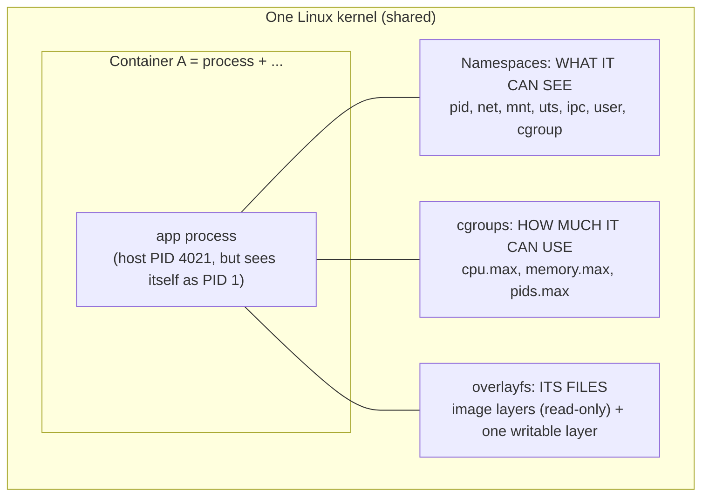

# Under the Hood: What Is a Container, Really? (namespaces, cgroups, layered filesystems)

## 1. The hook

`docker run` starts in about **half a second**. A virtual machine takes tens of seconds. Containers seem to have their own process list, their own network card, their own filesystem, and a hard memory limit, yet there is no "container" object in the Linux kernel. **So what is it that actually runs?**

Short answer: **an ordinary Linux process that has been lied to** (about what it can see) **and put on a leash** (about what it can use). This page shows both tricks, then runs them on this machine.

💡 **Kernel:** the core of the operating system, the one program that talks to hardware and decides what every process may do. **Process:** a running program with its own memory and an ID (PID).

---

## 2. Life before it

- **Bare processes:** all programs on a machine see the same files, the same process list, the same network ports. Two apps wanting port 8080, or two versions of one library, collide. One runaway process can eat all the RAM and take the others down.
- **Virtual machines (VMs):** solve isolation by emulating a whole computer, with its own kernel (VMware, 1999-2001; Xen 2003; KVM 2007). Strong isolation, but each VM carries a full OS: GBs of disk and RAM and a slow boot.

The lighter ideas arrived step by step:

| Year | Invention | What it added |
|---|---|---|
| 1979 | `chroot` (Unix V7) | A process sees a chosen folder as its `/` (only files isolated) |
| 2000 | FreeBSD **jails** | Files + processes + network identity isolated per jail |
| 2001-2004 | Linux-VServer, Solaris Zones (2004), OpenVZ (2005) | Same idea, other kernels |
| 2002 onward | Linux **namespaces** (mount first, 2002; pid, net, ipc, uts, user added up to 2013) | The "lie" about what is visible |
| 2007-2008 | Google's **cgroups** merged in Linux 2.6.24 | The "leash" on resources |
| 2008 | **LXC** | First tool combining namespaces + cgroups |
| 2013 | **Docker** | Added the image format, layers, registry and a friendly CLI: the packaging made it popular, not new kernel features |

---

## 3. The clever idea

**Don't emulate a computer; ask the kernel to give one process a private view of the system (namespaces) and a ration of CPU/memory (cgroups), and give it a ready-made filesystem stacked from read-only layers (overlayfs).** A container is these three kernel features applied to a normal process.

---

## 4. Step by step



### 4.1 Namespaces: a private view
💡 **Namespace:** a kernel feature that gives a process its own copy of one global resource list. Same machine, different "window". Each process belongs to one namespace of each kind, visible as links in `/proc/<pid>/ns/`.

| Namespace | Isolates | Effect inside the container |
|---|---|---|
| `pid` | Process IDs | Your app is PID 1; `ps` shows only its own tree |
| `net` | Network devices, IPs, ports, routes | Own `eth0` and own port 8080 (see [load balancer](../HLD/technologies/load-balancer.md): each container is a separate backend IP) |
| `mnt` | Mount points | Own root filesystem |
| `uts` | Hostname | `hostname` returns the container ID |
| `ipc` | Shared memory, message queues | Cannot touch other containers' segments |
| `user` | User/group IDs | "root" inside can be an unprivileged user outside (rootless containers) |
| `cgroup` | The cgroup tree view | Sees only its own limits |

Created with the `clone()` / `unshare()` **syscalls** (a syscall is how a program asks the kernel to do something). A Java developer's analogy: namespaces are like separate **classloaders or JNDI contexts**: the same name (`PID 1`, `eth0`) resolves to different things depending on who asks.

### 4.2 cgroups: the leash
💡 **cgroup (control group):** a kernel group of processes plus a set of limits and counters, exposed as files under `/sys/fs/cgroup`. Writing a number into a file sets a limit. Kubernetes `resources.limits` ends up as exactly such file writes.

**Memory:** `memory.max = 512M` means that if the group's memory would exceed 512 MiB and the kernel cannot reclaim enough (e.g. dropping cached files), the **OOM killer** (out-of-memory killer) picks a process in the group and kills it with SIGKILL. The container shows `OOMKilled`, exit code **137** (128 + signal 9). Your JVM never gets to throw `OutOfMemoryError`: it just vanishes.

**CPU is different: it is throttled, not killed.** The scheduler (CFS, Completely Fair Scheduler) uses a **quota per period**. The default period is **100 ms**.
```text
limit 500m (half a core)   → quota = 0.5 × 100 ms = 50 ms of CPU per 100 ms period
limit 2 cores              → quota = 200 ms per 100 ms (e.g. 2 threads running all period)
```
Worked example: a service with a 500m limit has **8 busy threads** handling a burst. They run in parallel on 8 cores and burn the 50 ms quota in `50 ÷ 8 = 6.25 ms` of wall time. For the remaining `100 - 6.25 = 93.75 ms` of the period, **all threads are frozen**. A request that needed 10 ms of CPU can take ~100+ ms. That is why p99 latency spikes while the CPU graph shows only "30% usage". It is also why many teams set CPU *requests* but not CPU *limits*. Kubernetes' *requests* become `cpu.weight` (shares: relative priority under contention) and are what the [scheduler](kubernetes-scheduler.md) counts.

### 4.3 Layered filesystem: images
An image is a stack of **read-only layers** (tar files), one per Dockerfile step. At start, **overlayfs** merges them into one view and adds a thin **writable layer** on top.
```text
upper (container writes)   /app/log.txt      ← copy-on-write: edits to lower files are copied up first
lower 3 (COPY app.jar)     /app/app.jar
lower 2 (apt install jre)  /usr/lib/jvm/...
lower 1 (base: debian)     /bin, /etc, ...
merged view = what the process sees as "/"
```
Ten containers from one 200 MB image share the lower layers: **200 MB + 10 small writable layers**, not 2 GB, and "start" copies nothing. Layers are identified by a content hash, so pulling a new image version only downloads changed layers (same idea as content addressing in [git](git-object-store.md)).

### 4.4 Putting it together
`docker run` (really `runc`, the low-level runtime, called via containerd) does: create namespaces -> make cgroup and write limits -> mount overlay as root -> `pivot_root` (switch `/`) -> `exec` your program. About **10-20 syscalls**, no hardware emulation, hence ~0.5 s.

---

## 5. Where you have used it without knowing

- Every Kubernetes pod; CI jobs (GitHub Actions, Jenkins agents); AWS Lambda/Fargate (Firecracker microVMs add a VM layer); Heroku dynos; Cloud Run.
- The JVM reads cgroup limits to size its heap (since JDK 10 and 8u191; flag `-XX:MaxRAMPercentage`), see [JVM garbage collectors](jvm-garbage-collectors.md).
- Chrome's sandbox uses namespaces; `systemd` services use cgroups.

---

## 6. Limits and trade-offs

- **Shared kernel = weaker isolation than a VM.** A kernel bug can let a process escape; containers run as root by default are risky. Mitigations: user namespaces, seccomp (syscall filters), gVisor, Kata Containers, Firecracker.
- **Kernel version is shared:** you cannot run a different kernel or Windows binary in a Linux container.
- **`/proc` and tools lie about limits:** older software reading `/proc/meminfo` or `nproc` sees the *host's* RAM/CPUs, not the cgroup limit (an old classic JVM bug).
- **CPU throttling surprises** (see 4.2) and **memory limits include page cache** (file cache counted to the cgroup).
- **Noisy neighbours** on shared disk and network are not fully isolated by default.
- Related sizing thinking: [resource pools and sizing](../LLD/concepts/resource-pools-and-sizing.md).

---

## 7. Try it: real output from this machine

This sandbox is itself a container-like VM (kernel `6.18.44`, running as root), so the namespace tools work. Results below were produced here.

**A new PID namespace: `ps` sees only itself as PID 1.**
```text
$ unshare --pid --fork --mount-proc ps aux
USER         PID %CPU %MEM    VSZ   RSS TTY      STAT START   TIME COMMAND
root           1  0.0  0.0   7912  3952 ?        R    07:40   0:00 ps aux

$ ls /proc | grep -c '^[0-9]'            # processes visible normally
78
$ unshare --pid --fork --mount-proc sh -c 'echo my pid=$$; ls /proc | grep -c "^[0-9]"'
my pid=1
3
```
(`--fork` makes the child the first process; `--mount-proc` remounts `/proc` so tools see the new namespace.)

**A new UTS namespace: change the hostname without affecting the host.**
```text
$ unshare --uts --fork sh -c 'hostname demo-box; hostname'
demo-box
$ hostname
vm
```

**A new network namespace: an empty network (only loopback, no `eth0`).**
```text
$ unshare --net --fork cat /proc/net/dev        # (columns trimmed)
    lo:  0 0 ...
$ cat /proc/net/dev                             # host: lo, ifb0, ifb1, eth0, ...
```

**A new user namespace: become "root" without being root.**
```text
$ unshare --user --map-root-user id
uid=0(root) gid=0(root) groups=0(root)
```

**The namespaces of PID 1 and of cgroups on this host** (this sandbox uses the older **cgroup v1** layout, so there is no `cpu.max` file; modern distros and Kubernetes nodes use v2):
```text
$ ls /proc/1/ns
cgroup  ipc  mnt  net  pid  pid_for_children  time  time_for_children  user  uts
$ cat /proc/self/cgroup
4:memory:/process_api/01a11f8e-.../claude-code-bash
1:cpu:/
...
$ cat /sys/fs/cgroup/cpu/cpu.cfs_quota_us     # v1 name for the quota; -1 means "no limit"
-1
```
On a cgroup v2 machine (most current distributions), try: `cat /sys/fs/cgroup/cpu.max` (prints e.g. `50000 100000` for a 500m limit, or `max 100000` for unlimited: quota then period in microseconds), `cat /sys/fs/cgroup/memory.max`, and `cat /sys/fs/cgroup/cpu.stat` (look at `nr_throttled` and `throttled_usec`: the proof of section 4.2). With Docker: `docker run --rm --cpus 0.5 --memory 256m alpine cat /sys/fs/cgroup/cpu.max /sys/fs/cgroup/memory.max` should print `50000 100000` and `268435456` (🟡 not run here: Docker is not installed).

---

## 8. Where it shows up

- [Kubernetes scheduler](kubernetes-scheduler.md): requests/limits, what the node does after binding.
- [JVM garbage collectors](jvm-garbage-collectors.md): heap sizing inside a memory-limited container.
- [Load balancer](../HLD/technologies/load-balancer.md): each container/pod has its own network namespace and IP.
- [Resource pools and sizing](../LLD/concepts/resource-pools-and-sizing.md).

---

## 9. Sources

- `namespaces(7)`, `cgroups(7)`, `unshare(1)`, `chroot(2)` Linux man-pages (man7.org).
- Linux kernel docs: *Control Group v2* and *CFS Bandwidth Control* (kernel.org).
- Kamp & Watson, *Jails: Confining the omnipotent root*, 2000.
- Merkel, *Docker: Lightweight Linux Containers for Consistent Development and Deployment*, Linux Journal, 2014.
- Rosen, *Namespaces and cgroups, the basis of Linux containers*, 2016 (🟡 talk/slides; exact year of each namespace type is from memory of kernel history: mount 2002, uts/ipc 2006, pid/net 2008, user 2013).
- 🟡 chroot year 1979 and cgroups merge in 2.6.24 (2008) are well-known but not re-checked here.
