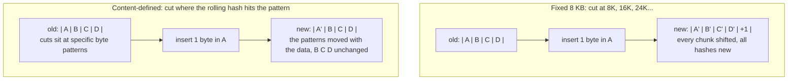
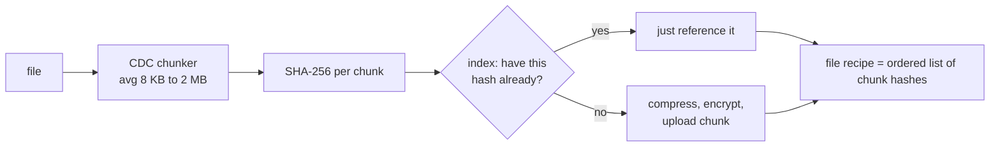

# Under the Hood: How Do Backup Tools Dedupe Files When One Inserted Byte Shifts Everything? (content-defined chunking)

## 1. The hook

You back up a 4 GB VM disk image every night with `restic` or `borg`. The second night's backup finishes in seconds and adds only a few MB to the repository, even though the tool has no idea what you changed. You add a line at the **top** of a large log file and the next backup is still tiny.

The trick everyone reaches for first, "cut the file into 8 KB blocks, hash each, store blocks we haven't seen", works for in-place edits. But insert **one byte at the front** and every block boundary moves by one, every block's hash changes, and the "dedup" re-uploads the whole file (measured in §7: **0% shared**).

The fix is to stop cutting at fixed positions and **let the content decide where the cuts go**. That's **content-defined chunking (CDC)**.

💡 **Chunk:** a piece of a file, stored and addressed on its own. **Dedup (deduplication):** storing each distinct chunk once and pointing to it from every file that contains it, instead of storing copies. **Hash:** a short fingerprint of data; same data → same hash (SHA-256 here: 32 bytes).

---

## 2. Life before it

### Whole-file dedup
Hash the entire file; skip the upload if the server already has that hash. Great for identical files (the same PDF attached by 1,000 users, see [content fingerprinting](../HLD/concepts/content-fingerprinting-and-dedup.md)), useless once one byte differs.

### Fixed-size chunking
Cut every 8 KB, hash each block, upload only unknown blocks. Simple, fast, and it handles **overwrites** perfectly: change one byte in the middle, one block changes. But for an **insertion or deletion**, every boundary after the edit shifts:

```text
old:  [AAAA][BBBB][CCCC][DDDD]
new:  [xAAA][ABBB][BCCC][CDDD][D]      (1 byte "x" inserted at the front)
every block now holds different bytes → every hash is new → nothing dedupes
```

rsync solved a version of this in 1996 by **searching every offset** with a [rolling checksum](rsync-rolling-hash.md). But rsync compares one file to its own old version over a live connection. A backup store wants something else: chunks that are **the same regardless of which file or which version they came from**, so it can dedupe across files, machines and days without talking to the old copy.

### The ingredients
- **1981, Michael O. Rabin**, *Fingerprinting by Random Polynomials* (Harvard TR-15-81): a hash over a sliding window that can be updated in O(1) per byte, the **Rabin fingerprint**.
- **2001, Athicha Muthitacharoen, Benjie Chen, David Mazières**, *A Low-bandwidth Network File System* (LBFS, SOSP 2001): used Rabin fingerprints over a 48-byte window to pick chunk boundaries, average 8 KB, min 2 KB, max 64 KB, and dedupe file transfers against any chunk the server already had. This is the paper that made CDC famous.
- **2016, Wen Xia et al.**, *FastCDC* (USENIX ATC 2016): the same idea with the much cheaper **Gear** hash and tricks to tighten chunk sizes; several times faster than Rabin-based CDC.

💡 **O(1) per byte:** sliding the window forward one byte costs a fixed handful of operations, not a re-hash of the whole window.

---

## 3. The clever idea

**Slide a rolling hash over the file and cut a chunk wherever the hash of the last ~64 bytes matches a pattern, e.g. "the top 13 bits are zero".** A cut point depends only on the few bytes right before it, so an insertion only changes the cut points near the edit. Further along, the same bytes produce the same hashes and the **same cut points**, so the chunks "resynchronise" and dedupe again.

With random-looking hashes, "13 specific bits are zero" happens with probability 1/2^13 at each position, so cuts land on average every **2^13 = 8,192 bytes**. The average chunk size is a dial: N bits → 2^N bytes.

---

## 4. Step by step

### Fixed vs content-defined boundaries after an insertion



### The chunker loop (Gear hash, the FastCDC style)

```text
GEAR[0..255] = 256 random 64-bit numbers, fixed forever (part of the format)

start = 0, h = 0
for each byte x at position i:
    h = (h << 1) + GEAR[x]          // shift left one bit, add this byte's random number
    size = i - start + 1
    if size < MIN: continue          // never cut below 2 KB
    if (h & MASK) == 0 or size == MAX:   // MASK = 13 chosen bits → 1 in 8,192 chance
        emit chunk [start, i], start = i + 1, h = 0
```

Why there's no "remove the oldest byte" step: each `<< 1` pushes older contributions one bit to the left, and after 64 shifts a byte has fallen off the top of the 64-bit number. So the **top bits of `h` depend only on roughly the last 64 bytes**: a sliding window for free. That's why FastCDC checks high bits, and why Gear is cheaper than Rabin (one shift, one add, one table lookup per byte; Rabin needs polynomial arithmetic, done with extra table lookups and XORs).

💡 **Bit shift (`<<`):** moving all bits of a number one place left, the same as multiplying by 2 and dropping what overflows. **Mask:** a number used with `&` to keep only certain bits, the way a subnet mask keeps the network part of an IP address.

### Why MIN and MAX
- **MIN (2 KB):** without it, unlucky data produces tiny chunks, and each chunk costs a hash and an index entry. Skipping the first MIN bytes also saves hashing time (FastCDC doesn't even compute the hash there).
- **MAX (64 KB):** data that never hits the pattern (a file of zeros: same bytes → same hash forever) would become one giant chunk. MAX forces a cut. Such forced cuts are position-based again, so they don't resynchronise, but they're rare on real data.
- With MIN, the average becomes about **MIN + 2^N**: the demo measures 9,962 bytes with MIN = 2,048 and N = 13 (2,048 + 8,192 = 10,240 expected). FastCDC's "normalized chunking" uses a stricter mask before the target size and a looser one after it to squeeze sizes closer to the average.

### What a backup client does with the chunks



💡 **Recipe / manifest:** the small list "this file = chunk h1, then h7, then h3..." stored alongside the chunks. Restoring means fetching each chunk in order. The chunks themselves usually live in [object storage](../HLD/technologies/object-storage.md), often packed many-per-object.

### Arithmetic: metadata cost

```text
1 GB file, average chunk 8 KB:   1,073,741,824 ÷ 8,192 = 131,072 chunks
index entry ≈ 32 B SHA-256 + 8 B location + 8 B size/refcount ≈ 48 B
131,072 × 48 B = 6,291,456 B ≈ 6 MB of index per GB stored (~0.6%)

1 TB backup at 8 KB:  ≈ 134 million chunks → ≈ 6.4 GB of index (too big for RAM on a laptop)
1 TB backup at 1 MB:  ≈ 1 million chunks   → ≈ 50 MB of index
```

That's why LBFS (network file system, small edits) picked 8 KB, while backup tools like restic (~1 MB) and borg (~2 MB) pick much larger averages: less dedup precision, far less metadata. Large dedup appliances also put a [Bloom filter](../HLD/concepts/bloom-filters.md) in front of the on-disk index to answer "definitely new chunk" without a disk read (Data Domain, FAST 2008).

---

## 5. Where you've already used it

| You used | Chunking |
|---|---|
| **restic** | Rabin fingerprints, chunks 512 KiB to 8 MiB, ~1 MiB average; random polynomial per repository |
| **BorgBackup** | buzhash (another rolling hash), default min 512 KiB, max 8 MiB, target ~2 MiB; secret per-repo seed |
| **Duplicacy** | variable-size chunks, default average 4 MiB (🟡 from its docs, not verified here) |
| **casync** (Lennart Poettering, 2017) | buzhash CDC for OS images and container trees, so updates download only new chunks |
| **IPFS** (kubo) | fixed 256 KiB by default; `ipfs add --chunker=rabin` or `--chunker=buzhash` switches to CDC |
| **Dropbox** | reported to use **fixed 4 MB blocks** hashed with SHA-256 for block-level dedup (🟡 Dropbox tech blog, 2014; not CDC) |
| **Git** | **no chunking at all**: each file version is one whole-file blob, and packfiles store deltas between similar blobs ([Git object store](git-object-store.md)) |
| **Docker / OCI images** | whole-layer dedup by SHA-256 digest, no sub-layer chunks |

💡 **buzhash:** a rolling hash built from rotating bits and XOR-ing in per-byte random numbers; same job as Rabin and Gear. **Seed / random polynomial per repository:** each repository uses its own secret hash parameters, so chunk sizes don't reveal which known file you stored.

---

## 6. Limits and trade-offs

- **Metadata grows with the number of chunks.** Smaller chunks dedupe better and cost more index, more hashes, more requests. Pick the average from the edit pattern: small edits in big files → smaller chunks; whole-file churn → bigger ones.
- **Overwrites dedupe slightly worse than fixed blocks.** A 1-byte overwrite costs one chunk either way, but CDC chunks average larger than the fixed size because of MIN (the demo: 14,935 vs 8,192 bytes re-uploaded). CDC wins on insertions/deletions, which are far more common in real files.
- **Compressed and encrypted inputs defeat it**, exactly as with [rsync](rsync-rolling-hash.md): a small change rewrites everything after it. Tools chunk **first**, then compress and encrypt each chunk, so dedup still works on the plaintext. A `.zip` or `.mp4` that changes inside still won't dedupe well.
- **CPU cost.** Every byte goes through the rolling hash plus a SHA-256 per chunk. Gear/FastCDC hashing runs at GB/s, so SHA-256 and disk reads usually dominate.
- **Variable-size chunks are awkward to store.** Millions of 8 KB objects in S3 is a request-cost and metadata problem, so tools pack chunks into larger pack files ([object storage](../HLD/technologies/object-storage.md)) and need garbage collection when chunks lose their last reference.
- **Cross-user dedup leaks information.** If the server dedupes across users, "this upload finished instantly" tells you someone already stored that exact content (Harnik, Pinkas, Shulman-Peleg, 2010). Consumer services limit dedup to one user or hide it; [end-to-end encryption](../HLD/concepts/end-to-end-encryption.md) makes cross-user dedup impossible by design.

---

## 7. Try it

**Run the demo** in [`code/ChunkingDemo.java`](code/ChunkingDemo.java): 4 MB of random data, chunked with fixed 8 KB blocks and with a Gear-hash CDC (min 2 KB, max 64 KB, 13-bit mask), then two edits. "Shared" = new chunks whose SHA-256 the store already has; "re-upload" = bytes of chunks it doesn't.

```sh
cd under-the-hood/code
java ChunkingDemo.java
```

Real output (Java 21, Linux):

```text
file 4,194,304 bytes. CDC: 421 chunks, average 9,962 bytes, smallest 190, largest 55,840

edit 1: change 1 byte at offset 2,000,000 (no shift)
  fixed  chunks old  512, new  512 | shared  511 ( 99.8%) | re-upload      8,192 bytes (  0.2% of file)
  CDC    chunks old  421, new  421 | shared  420 ( 99.8%) | re-upload     14,935 bytes (  0.4% of file)

edit 2: insert 1 byte at offset 100 (everything after it shifts)
  fixed  chunks old  512, new  513 | shared    0 (  0.0%) | re-upload  4,194,305 bytes (100.0% of file)
  CDC    chunks old  421, new  421 | shared  420 ( 99.8%) | re-upload      3,644 bytes (  0.1% of file)
```

What to notice:
- **Edit 2 is the whole story:** fixed chunking shares **0** chunks and re-uploads the entire file; CDC re-uploads **one** 3.6 KB chunk and shares the other 420.
- **Edit 1:** both re-upload one chunk; CDC's is bigger (14.9 KB vs 8 KB) because its chunks vary in size.
- Average 9,962 bytes ≈ MIN + 2^13 = 10,240. The "smallest 190" is the file's last chunk (the data just ended); the MIN rule never cuts below 2 KB otherwise.
- Things to try: change `MASK` to 11 bits (`0x7FFL << 53`) for ~4 KB chunks and watch chunk count and re-upload size change; insert 1,000 bytes instead of 1.

**Real tools** (not installed here, not run): `restic init`, `restic backup bigfile`, edit the file's start, back up again and read the `Added to the repository:` line; `borg create --stats` shows "Deduplicated size" the same way.

---

## 8. Where it shows up in this repo

- [File storage & sync](../HLD/interviews/file-storage-sync/README.md): block-level dedup and "upload only changed chunks" are the core deep dives.
- [Chunking and block-level dedup](../HLD/concepts/chunking-and-block-level-dedup.md): fixed vs content-defined chunking as a design decision, with the index and garbage-collection side.
- [File sync and conflict resolution](../HLD/concepts/file-sync-and-conflict-resolution.md): what the client does once it knows which chunks changed.
- [rsync and rolling checksums](rsync-rolling-hash.md): the sibling trick for one file against its own old version.
- [Content fingerprinting and dedup](../HLD/concepts/content-fingerprinting-and-dedup.md): whole-content hashing and near-duplicate detection.
- [Resumable and chunked uploads](../HLD/concepts/resumable-and-chunked-uploads.md): chunking for *transfer reliability* (resume after failure), a different goal from chunking for dedup. WhatsApp-style media uploads use it ([case study](../case-studies/whatsapp-vs-telegram.md)).
- [Bloom filters](../HLD/concepts/bloom-filters.md): "have we seen this chunk?" in front of a big index. [HyperLogLog](hyperloglog.md): another hash-the-content trick, for counting.

## 9. Sources

- Michael O. Rabin, *Fingerprinting by Random Polynomials*, Technical Report TR-15-81, Harvard University (1981).
- A. Muthitacharoen, B. Chen, D. Mazières, *A Low-bandwidth Network File System*, SOSP 2001: Rabin over 48-byte windows, 13-bit boundary condition, 2 KB min, 64 KB max, ~8 KB average.
- W. Xia, H. Jiang, D. Feng, L. Tian, M. Fu, Y. Zhou, *FastCDC: a Fast and Efficient Content-Defined Chunking Approach for Data Deduplication*, USENIX ATC 2016 (Gear hash, normalized chunking, skipping the minimum).
- B. Zhu, K. Li, H. Patterson, *Avoiding the Disk Bottleneck in the Data Domain Deduplication File System*, FAST 2008 (Bloom-filter "summary vector").
- D. Harnik, B. Pinkas, A. Shulman-Peleg, *Side Channels in Cloud Services: Deduplication in Cloud Storage*, IEEE Security & Privacy (2010).
- restic design doc (chunker), BorgBackup docs (`--chunker-params`), Lennart Poettering, *casync: a tool for distributing file system images* (blog, 2017), IPFS/kubo `ipfs add --chunker` docs. Dropbox 4 MB blocks: Dropbox tech blog, *Streaming File Synchronization* (2014), 🟡 not re-verified for this page.
- The demo output was produced by running it in this environment (Java 21).

⬅️ [Under the Hood index](README.md) · 🏠 [Home](../README.md)
